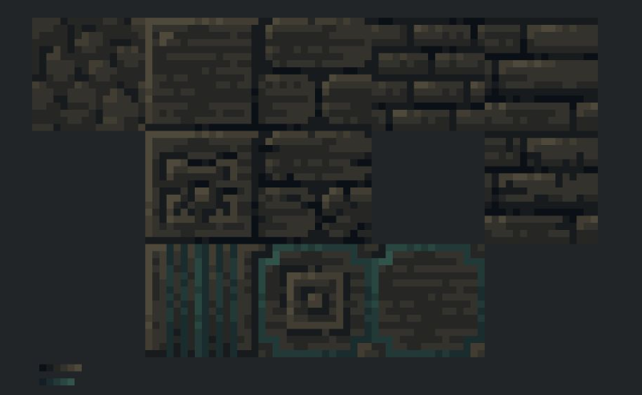
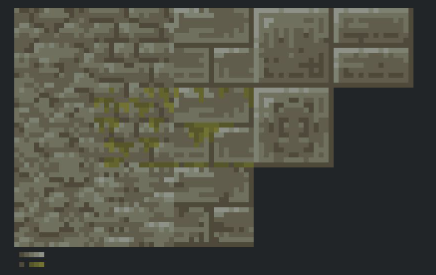
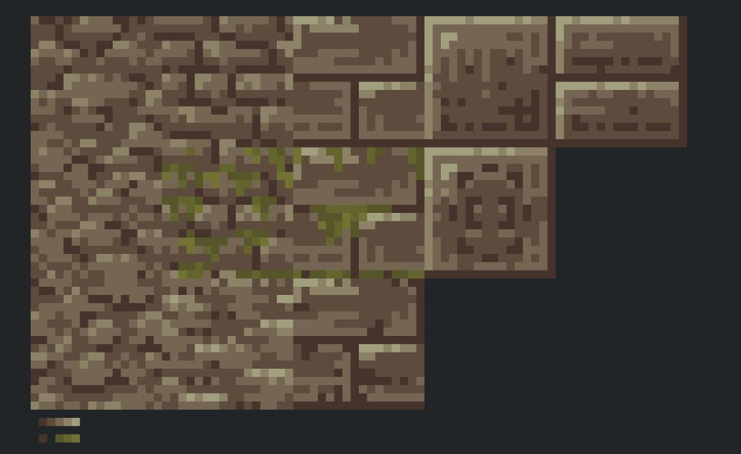
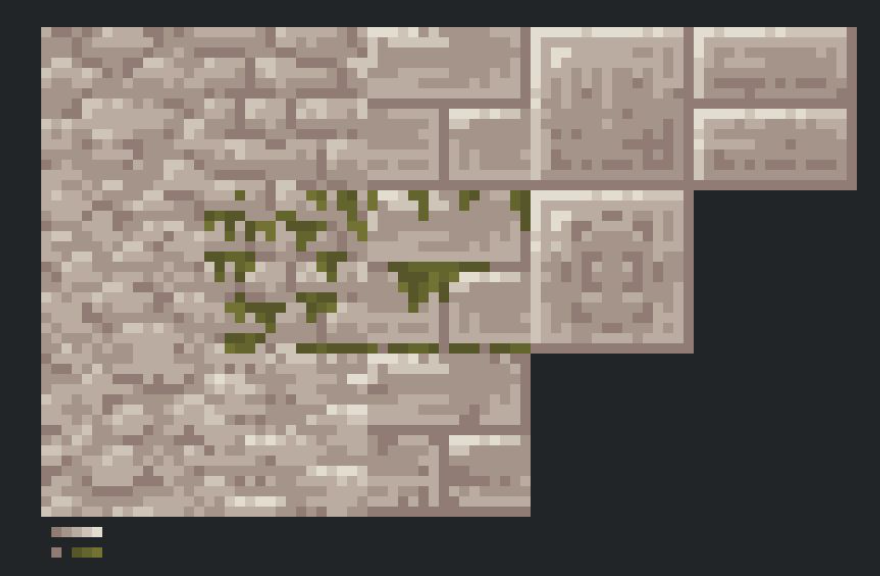
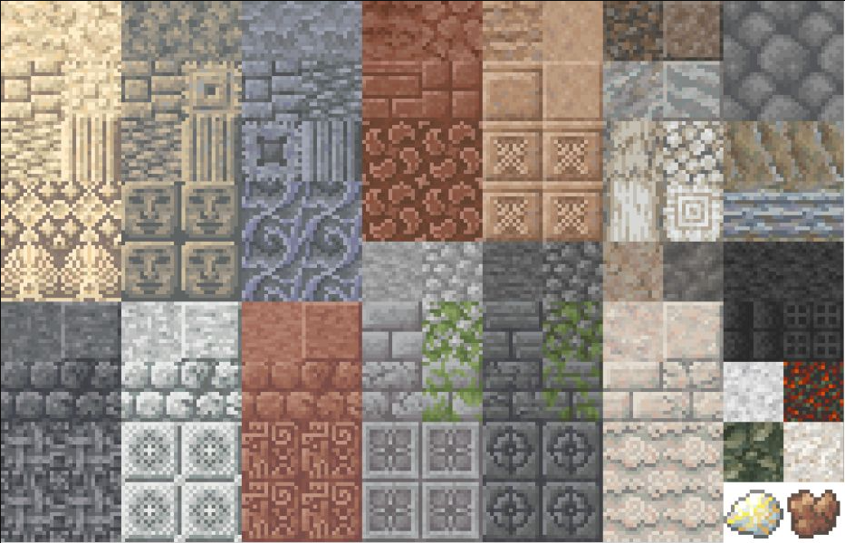
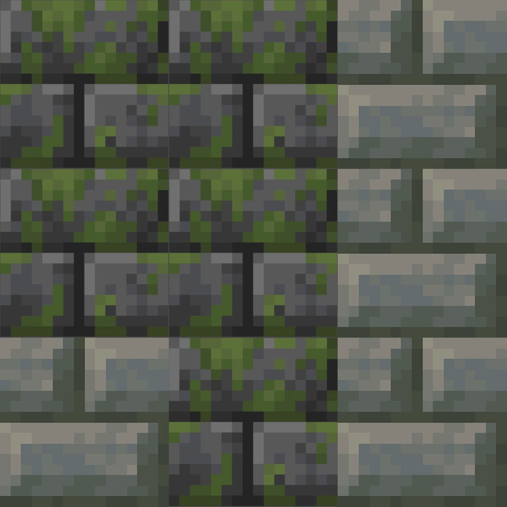

# Shared owner asset library

The project owner supplied this collection on 6 October 2026 and explicitly authorized Jugcraft contributors and AI coding agents to **use suitable assets directly, recolor or adapt them, or use them as visual/audio reference**. Check this library before making new assets.

It is shared across the whole project: **blocks, ores, metals, machinery, guns and mounted weapons, planes and airships, sounds, animations, weapons, armor, trees, biomes, farming, food and accessories**. The folder name `Blocks` is the original collection name, not a restriction on who may use it.

## Find assets

- [Browse every category and file](catalog/README.md).
- [Download or search the complete CSV inventory](catalog/files.csv): filenames, types, image dimensions, animation sidecars and SHA-256 checksums.
- [Browse the original collection](originals/Blocks).
- [See counts and verification notes](catalog/summary.json).

Use the category pages for browsing and the CSV for searching across the collection. Texture metadata stays beside its image; sound and animation subfolders keep their supplied structure. Similar or duplicate files stay in place so references and animation pairs are preserved.

## Allowed project use

The owner's instruction is: "use these as either direct reference / straight up take to recolor or to directly use if they fit what they are working on."

Choose the approach that fits the feature. Direct reuse and recoloring of this owner-supplied collection are authorized; contributors do not need to ask again for each asset. Keep the relevant branch's material palette and art direction coherent. Record the source path and any changes in the feature's asset provenance.

The source of this import is the project owner's upload, described by the owner as textures they created. Filenames are preserved labels, not independently verified authorship or license evidence for other sources. Follow [the repository's license policy](../../LICENSE_POLICY.md) and retain any asset-specific attribution or license notices when integrating assets. This instruction covers this supplied collection; it does not grant permission for unrelated third-party material.

## Import into a feature

1. Choose a suitable file from the catalog. Keep `originals/` intact as the shared source collection.
2. Copy the required asset into the feature's runtime resources under `src/main/resources/assets/jugcraft/`, with a stable lowercase resource name.
3. Copy and adapt any adjacent `.png.mcmeta` together with its PNG. Check the frame layout and timing. Animation JSON needs matching model bones and a renderer that supports its format; audio needs an appropriate `sounds.json` entry. Publishing the library does not register those resources in the game.
4. For a sheet or packed atlas, inspect the layout and use the intended tile or UV mapping. Catalog dimensions distinguish individual textures from sheets; do not stretch a whole sheet onto one block face.
5. Describe direct reuse, recoloring, cropping or other modifications in `docs/features/`. Include the library path or CSV checksum, and keep reused files from being overwritten by a generator on the next run.
6. Run the feature's relevant asset checks and inspect the imported result in-game when available.

## Included preview sheets

The six sheets below were also attached by the owner. They are preserved unchanged as high-resolution reference previews; their pixels, aspect ratios and filenames in the source collection are not modified.

| Preview | Sheet |
|---|---|
| Dark stone with teal accents |  |
| Grey stone and moss variants |  |
| Brown stone and moss variants |  |
| Pale stone and moss variants |  |
| Stone and decorative block overview |  |
| Mossy stone tiles |  |

## Import verification

16,449 source files (25,339,959 bytes) were copied and matched against SHA-256 checksums. The six attached previews were also copied byte-for-byte. Images were opened and verified; JSON/animation metadata was parsed; Ogg container signatures and texture-sidecar pairings were checked. See [summary.json](catalog/summary.json) for any supplied-file issues. This is an asset library, not an in-game integration test.
