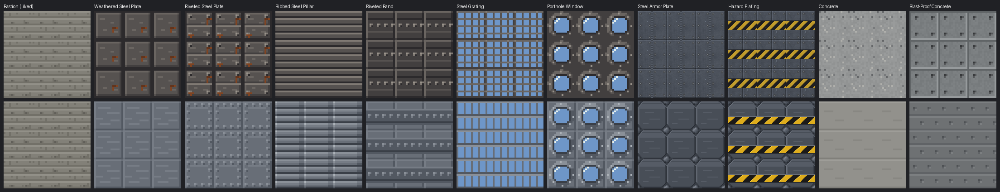
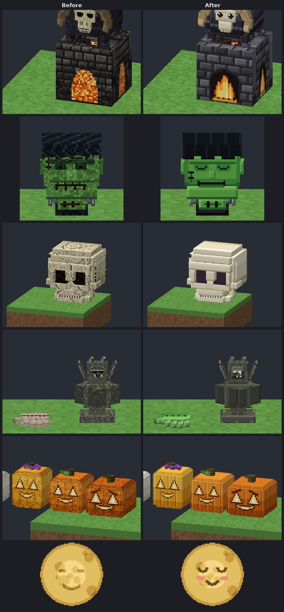
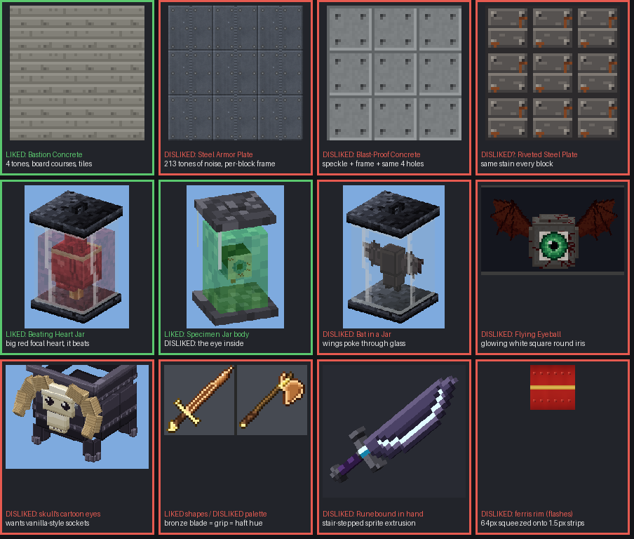

# Art direction

Jugcraft's look changes with its tiers, the way real technology did: the early game is brass-and-steam, the later tiers move towards dieselpunk, and electrical power gear and the high-tech tiers to come are graphite and glowing light. Every texture and model is original, drawn by the generators in `tools/`.

## Rules for everything
- Detailed models built from boxes (see `tools/steampunk_models.py`): round prisms, gears, gauges, rivets, pipes. No flat cubes where a real machine would have shape.
- **Things that are big in real life are big in the world.** A turbine, a foundry or a charging station takes several blocks; a hand tool stays in the hand.
- **Closed geometry.** Every face you can see exists, and a hollow is lined inside. Block models and the plain quads `client/QuadModel` draws (`RenderTypes.entitySolid`) cull back faces, so a face left out is a window straight through the model (the owner's "no backsides" on the guns, landship, walker, zeppelin and observation balloon, 5 October 2026). Big entity models go through `zeppelin.tiled_quads`, which removes only the face area another box really covers, exactly, cut at the 16-pixel grid and at every cover's edge.
  - Build a hollow (a pot, a jar, a socket, a drawer, the end of a pipe) from walls round it with an inner lining (`flora_art.box_ring`), or cap it, never from a solid box with its top left out: the box's sides then show through from inside.
  - Textures on an opaque piece are opaque to their corners (a round dish painted on a square face fills the corners with metal).
  - Sculpted decor is closed by its writer (`model_writer.finish_closed` through `flora_art.closing_writer`, used by the Witching Season sets): a face a box leaves out where nothing covers it is drawn, looking like the box's other faces. A face left out on purpose is named in the element's `"_keep_open"` (never written to the model) and the model is allow-listed in `art_check` O1 with its reason.
  - Write every element from its low corner to its high one (`from` ≤ `to` on every axis): a backwards box draws inside out, and the writers refuse it.
- **No shared face planes, in any export** (that flickers, z-fighting). Two differently drawn faces never lie on one plane, or closer than 0.09 pixels, facing the same way. The generators enforce it with a 0.1 pixel push (`model_writer.COPLANAR_NUDGE`; 0.02 aliased again beyond about 30 blocks):
  - `model_writer.separate_coplanar` runs on every block and item model written (and the classic pack), pushing the smaller face (the band, dial or trim) out, or the face in front of a nearly flush pair, until it stands 0.1 pixels proud. It covers rotated elements too: elements turned the same way are compared in their own space, and faces along their rotation axis (gear and handwheel caps) as turned polygons. A push keeps the element a closed box (a one-sided decal plane moves whole) and keeps the UVs it had.
  - Quad exports separate their boxes the same way before turning them into quads (`model_writer.separate_boxes` in `kinetic_rotors.quads`, `separate_coplanar` in `decor6_data.quads`), never by moving single quads of a closed box (that opens cracks). `tiled_quads` needs no push: where two faces share a plane, only the smaller is drawn.
  - Models drawn together are separated together: a multi-block machine is cut by `model_writer.split_model` (separated before the cut and across its parts after it, the pieces of one cut element moving together so no step opens at a seam); a thing drawn whole and shared out among its blocks (tall flowers, the Farm Stand, the Harvest Effigy) is separated whole first.
  - Parts drawn separately never share a plane and never leave a slit between them: a spinning rotor is set `kinetic_models.ROTOR_GAP` inside, or that much narrower than, the still part it meets (an axle starts inside its hub plate), never held off it, which shows the world through the gap.
- **Two-sided planes:** in 26.3 `entityCutout` and `entityTranslucent` do not cull, so a plane seen from both sides (a wing, a cloak, a leaf cut out) is either one quad (`decor17_data.single_sheets` keeps one face of a sheet), or two sides each lifted 0.05 pixels along its own normal (`DecorDraw.twoSided`, `TWO_SIDED_LIFT` in the quad exporters). Never draw an exact reversed twin on one plane: both sides then draw at the same depth and fight. A smaller plane through the same middle (a flame's core) is lifted further, so it stays in front. A picture that must read the same way round from behind (a flame) uses `DecorDraw.twoSidedReadable`, which flips the back's u.
- **UVs stay inside the sprite (0..16).** A face whose UV leaves it shows strips of the neighbouring textures in the block atlas. The writers give such faces a UV inside it at the same texel density (`model_writer.fit_uvs`: shifted by whole 16-pixel tiles, then slid the least distance inside when the span straddles a tile edge; only a span longer than 16 reads the whole sprite, a little stretched).
- Textures are deterministic (seeded) and opaque on blocks. They are 16×16, or 32×32, 64×64 or (for a sculpted prop's packed texture) 128×128 where the art needs the detail (see [High resolution](#high-resolution)). **Machine and gun textures are fully opaque**: `entitySolid` ignores alpha, so a see-through texel draws as its colour. `entityCutout` textures have no half-transparent texels (cutout draws them solid).
- **Previews show what the game draws:** render the exported quads with back faces culled, not the source boxes with every face, or holes never show in review. Check the preview's winding on one plain box first: a block model drawn inside out still looks closed from outside, and hides every hole.
- `tools/art_check.py` (run by `check_mod_data.py`) checks all of this on every model and quad part, and on the models drawn together (a multi-block's parts, two-block halves, decor parts and each spinning rotor with its block). Its allow-lists name the few accepted exceptions, each with its reason.

## Texturing: keep it clean
On 4 October 2026 the owner rejected the noisy, rust-covered dieselpunk textures ("you are doing way too much in terms of noise"). They pointed to vanilla copper blocks, a weathered pipe, Immersive Engineering Reimmersed's machines and a car drawn in vanilla's palette as the standard. Those references guided the style only; nothing of them is copied. The helpers in `tools/clean_metal.py` draw this way, and new textures should follow it:
- **Flat fills from a short palette.** Use four or five shades per material. Never pick a random shade for every pixel.
- **Shape comes from light.** Give a panel a one-pixel bevel: lit along the top and left, shaded along the bottom and right. A panel inside a face, or a part of a model, also gets a dark seam round the outside; a building block that tiles does not (it splits the seam across its edge, see [Tiling building blocks](#tiling-building-blocks)). Shade recessed insets the other way round. Draw bolts as two-by-two heads lit at the top left.
- **Wear is placed, not sprinkled.** Use a chip at a corner, a stain weeping from a bolt or a seam, or a few short streaks one shade off the fill. Rust is an accent, never a whole surface.
- **Pattern beats noise.** Show grain, ribs, tread and ripples as regular shapes: plank lines, ribs every four rows, raised lozenges, long ripple lines.
- **Each material looks like its vanilla counterpart.** On 5 October 2026 the owner added that flat is not the goal either: stone should look like stone, cobblestone or stone bricks, and every material should take after the vanilla textures so it does not stand out. The painters in `tools/block_style.py` work that way. `bs.fill` gives one ground tone with small clumps of the tones either side, in place of a random shade at every pixel. Stone, cobblestone and bricks are lit along their top and left, wood is drawn as planks, and straw and hair as streaks.
- **Machine faces are clean plates with one clear feature.** A machine front is a frame lit along its top and left round a recessed plate of one tone, with one feature in it: a recessed window, vent or port. A running glow rises in smooth bands, brightest at the bottom. `panel()` and `window()` in `tools/generate_textures.py` draw this way.
- **Tubes and barrels** read best with a flat, even tube texture: the 16-pixel tiling cuts across a stepped cylinder at arbitrary places, so bevels, seams and bolts belong on flat panels.

### Tiling building blocks
On 5 October 2026 the owner called the steel plate blocks and blast-proof concrete horrific ("like you didn't even try") and said bastion concrete looks good. Bastion's board-marked courses run straight across every block, so a wall reads as one surface. The rejected blocks were framed tiles: a near-black outline on all four edges (a doubled dark seam wherever two met), warm brown steel, per-pixel speckle, and a rust stain and pip-like bolts stamped on every block. A full-block texture that is built into walls, floors and stairs follows these rules (`tools/clean_metal.sheet`, the Dieselworks steel set in `tools/dieselworks.py`, plain and blast-proof concrete in `tools/construction.py`, Steel Armor Plate and Hazard Plating in `tools/tower_art.py`):
1. **Never outline all four edges.** Light the top row and left column, and put the shade or seam on the bottom row and right column. Next to a neighbour that makes one seam and one lit edge per boundary.
2. **Draw the block edge like an interior line.** Give patterns a period that divides the block (four or eight pixels at 16), so courses, ribs, lifts and rivet rows carry on across the edge. A metal sheet may read as one sheet a block, like vanilla's iron block, but then its joint (the seam and the next block's lit edge) stays no stronger than one of bastion's course lines, about 30 to 35 brightness steps, so a wall does not turn into a grid of framed tiles: light the sheet's edge one shade over the fill, not two. Only a block meant to read as separate heavy plates, such as Steel Armor Plate, draws a deeper joint, and it ties the joint into a pattern that crosses it (the armour's chamfered corners meet round one bolt boss).
3. **Keep the lattice even, not stamped.** Joints, tie holes and rivets sit on an even lattice or are staggered course by course; never stamp one bright accent (a glint, a stain) on the same spot of every block. Rivets and bolts are raised: lit at the top left, with their shadow pixel only one shade under the fill. A near-black pixel beside a glint reads as a hole or a dice pip.
4. **A short palette whose steps mean something.** Three to six flat shades a material and no random shade per pixel. Fills, sheens and brushed streaks sit about 14 to 25 brightness steps from their neighbours; only edges, seams, joints, rib gaps, bolt or rivet shadows and hazard paint step further (about 30 to 60, up to about 80 for a deep rib gap, a heavy plate's joint or black-and-yellow paint), and they are the only large steps in the texture.
5. **No rust on building blocks.** Weathering is one shade off the fill: brushed streaks, a scuff at an edge.
6. **Keep details off the slab cut** (rows 7|8 at 16 px, 15|16 at 32 px), so slabs and stair steps never show half a bolt, hole or band. A see-through block closes both halves: the Steel Grating draws a rail on row 7 and another on row 8, exactly like the pair at the block edge, so a slab never ends in open prongs.
7. **One palette per material across a building set.** A texture shared with machines keeps its name and look; the building block gets its own (`dw_*` beside the giants' `dr_*`).
8. **Make the material read.** Steel is cool blue-grey with lit edges and a sheen band or brushed streaks; concrete is boards or cast lifts with low-contrast tie holes on a lattice, and stays a neutral or warm grey, never steel-blue.
9. **Match the neighbours' brightness**, so a set does not jump from dark to light between blocks.

*Before (top) and after (bottom), tiled outside the game; bastion concrete (left) is the reference the owner liked.*

## Creatures and faces: cute and clean
On 5 October 2026 the owner found the Ember Bed's fire speckly and the Horned Skull Cauldron's nostrils ugly, and asked for every creature prop to be simplified: cute, or at least smooth, but still good-looking, after their reference pictures (the Frankenstein head above all). The painters in `tools/cute_art.py` draw this way, and every skull, bone, monster, bug, ghost and other creature prop should follow it:
- **Two or three tones a material, no noise.** Fill flat, light the top and left edge, shade the bottom and right one. A rounded form gets a lighter band over its top and a darker one under it, nothing else.
- **Simple faces.** Living creatures get big round eyes with a white glint, or closed eyes drawn as one clean curve. No nose holes or nostrils. Teeth are a neat row of squares with a dark gap; a mouth is one clean line or curve. Rosy cheeks where it suits.
- **Skulls have square sockets** (5 October 2026, the owner: Minecraft-like), each a quarter of the face wide: hard-edged dark plum, darkest under the brow and a step lighter along the far rim, over a one-texel lip of shaded bone, with no glint and no rounding (`cute_art.square_socket`, `block_skull_face`). A glow in a skull's eyes is a flat square laid exactly over the socket, just in front of it, never a round blob.
- **Fire in smooth bands.** Rounded tongues of flame banded deep orange, orange, yellow and a pale core, standing on a glow of coals; never a scatter of random sparks.
- **Pattern, not scatter.** Fur, scales, feathers, straw, quills and stone carvings are regular shapes (offset rows, even stripes, scallops), and moss or lichen sits in neat tufts at fixed places.
- **Bright, friendly colours.** The monster is a bright green, bone a warm cream, sockets a soft dark plum rather than black.
- **Metal fittings are clean too.** Lids, bases, knobs and wrought iron are a flat fill with a one-pixel bevel (`decor17_data.wrought_clean`, `lid_top_clean`), not speckle; a twisted bar is even diagonal ridges.

*Before (left) and after (right), drawn from the block models and textures outside the game.*

## What the owner likes (5 and 6 October 2026)
On 5 October 2026 the owner played a server built from `main` and the open pull requests (Witching Season #183, Arms VII #184, Fortifications #185, Armoured Walker #193). They said what works and what doesn't, and asked for the way they like things drawn to be written down from their examples. On 6 October they added one more lesson, about the Giant's Beating Heart. Where this section disagrees with an older rule in this file, this section wins; for item icons, the owner's own style sheet ([PR #201](https://github.com/jimbozoomer-byte/jugcraft/pull/201)) wins over both.

*As they were on 5 October 2026, drawn outside the game: liked in green, disliked in red.*

### In their words
- **Liked:**
  - "bastion concrete looks good though";
  - "bronze weapons all look fine" (their shapes);
  - "the beating heart is awesome" (they want a giant 3×3×3 one);
  - the specimen jar: "the rest of the jar is really cool" (they want bigger versions).
- **Disliked:**
  - the weapon icons ("way cooler maybe not even accurate but cooler");
  - the bronze colour scheme;
  - the Runebound arms ("don't even use minecraft esque textures make like a nicer 3d model … really be cool and special");
  - "the steel plate blocks are horrific its like you didn't even try same thing with blast proof concrete";
  - the eye in the specimen jar ("weird");
  - the Flying Eyeball's "bright white behind the green eye";
  - the Horned Skull Cauldron's see-through inside, and its skull's eyes ("goofy should be more minecraft esque");
  - the bat's wings poking through its jar;
  - the sieve ("better detailed and more interesting also just more aesthetic");
  - invisible and see-through parts on the grand mortar, the big guns' barrels, the Landship and the walker;
  - flashing textures (gun barrels, the Shadow Puppet Lamp, the ferris wheel);
  - balloons that are "glitching upward" as they rise, and a balloon whose texture "has tons of transparency".
- **Asked for movement:** a flail ball that really flails, a sawmill blade that spins.
- **6 October, the first Giant's Beating Heart** (a vat of its own design, with brass posts, a gauge and a heart of its own): "way way worse", "so so ugly". They wanted "the heart in the jar but just a bigger version in the exact same style of jar and stuff".
- **Still standing:**
  - clean textures (the 4 October dieselpunk and steampunk passes);
  - the Armoured Walker after their own Blender render ("a version for our minecraft server that looks just like it", in the clean style).

### Two kinds of "Minecraft-esque"
The owner used the word both ways, and both are rules:
- **Blocks, props and creature faces** belong beside vanilla: chunky, on the pixel grid, few tones. Skull sockets should be "more minecraft esque".
- **Named and magic arms** (Runebound first) should not be: "don't even use minecraft esque textures". They get sculpted models and smoothly painted textures (see Weapons).

### The references, measured
A **model pixel** is 1/16 of a block; a **texel** is one pixel of a texture. A **fleck** is an opaque texel brighter or darker than all four neighbours, but by less than 24 from each: the mark of per-pixel noise. A **small step** is a pair of neighbouring opaque texels that differ, but by less than 12 in brightness.

**Liked**
- **Bastion Concrete** (`fw_bastion`, `tools/fortifications.py` `bastion()`).
  - 16×16 in four tones of one warm grey (brightness 144, 128, 112, and 94 for the tie holes).
  - Four 4-px courses, each lit along its top row and shaded along its bottom, with short 1-px joints and 2-px tie holes. The courses repeat every 4 px, so the block's edge is just another course and a wall reads as one pour.
  - 0% flecks, 0% small steps.
  - Its cap (`fw_bastion_top`) is a flat fill whose edge joint is split across two blocks: shaded on one side of the edge, lit on the other. Tops read as slabs without a dark grid.
- **Beating Heart Jar** (`tools/decor17_data.py` `jar()`, `beating_heart_jar()`, `heart()`; drawn by `OddityJarRenderer`).
  - One big, bright subject: a heart 4.8 px wide in 7.4 px of glass, in a six-tone red ramp with one soft highlight, two vessel lines and a cream cap.
  - Faint glass (a pale rim and one streak) and near-black iron; a brass dial is the only accent.
  - It beats.
- **Specimen Jar, the jar** (`tools/decor8_textures.py` `jar_iron`, `jar_glass`, `jar_fluid`).
  - One texel per model pixel; two or three widely spaced tones per material (iron at brightness 56, 70 and 106).
  - Glass is mostly empty, with a rim and one streak. The fluid is a translucent green.
  - The iron and fluid are vanilla-style mottling (a random pick of a few far-apart tones), which is not fine noise.
- **Bronze arms' shapes** (`tools/arms_art.py`).

**Disliked**
- **Steel Armor Plate** (`tools/tower_art.py` `armor_plate()`).
  - 64×64 fractal noise, brushed grain and grime: 213 shades, 82% small steps, 20% flecks.
  - Bolts smaller than a model pixel.
  - Dark and flat (brightness 58 to 93).
- **Blast-Proof Concrete** (`tools/construction.py` `blastproof_concrete()`).
  - A random ±4 grey per pixel (16% flecks).
  - A recessed frame on every block (dark top and left, light bottom and right), so a wall is a grid of sunken tiles.
- **Weathered and Riveted Steel Plate** (`dr_rust_bare`, `dr_rust`).
  - Clean by the 4 October rules (6 to 8 tones, no flecks), but a near-black seam on all four edges doubles into a 2-px groove at every joint.
  - A bevel frames each block, and the same rust stain sits in the same spot on every block.
  - Clean is not enough for a building block. These textures are shared by about 22 machines, so the blocks get their own.
- **The bronze palette** (`tools/arms_pixel.py`). Blade (hue 20–35°), grip (20–27°), haft (32–36°) and fittings (37–52°) share one orange band. The peach top tone (246, 204, 146) reads as copper.
- **Weapon icons.**
  - Each fits the whole weapon on the canvas, so long hafts take the space and heads are small.
  - Shading is mostly two edge tones, and the outline on the lit side is a mid-brown.
  - Correct, but dull.
- **Runebound in the hand.**
  - Boxes of an upright sprite, every box spending its one rotation on the 45° lean: curves are stair-steps and nothing can be bevelled.
  - Flat six-tone ramps on a mostly empty texture.
  - Void steel is a dark greyish lavender; the runes are one-texel lines.
- **Skull eyes** (after the 5 October cute pass).
  - Round plum sockets with a white glint.
  - With a potion, a soft round glow drawn over each. "Goofy."
- **Flying Eyeball.** The iris quad's square is fully opaque and its corners near-white, drawn at full brightness: a glowing white square round the green eye. The sclera is near pure white.
- **Specimen eye.** A 3-px cube: its front squeezes the whole 16×16 eye (random red dashes, a dithered iris) into 3 px, and its other five faces show only the black pupil.
- **Ferris wheel and Shadow Puppet Lamp.**
  - Dense textures on thin quads: 92% of the ferris quads exceed 8 texels per model pixel, and a spoke gets 43 across. They shimmer as you move.
  - Coplanar hub plates, and two-sided panels drawn as two quads on one plane, flicker.
- **Machines, big guns, Landship, walkers and the observation balloon.**
  - Holes where the quad exporter drops a whole 16-px cell because its centre is covered (`zeppelin.tiled_quads`).
  - Faces sharing planes in quad models and rotated elements.
  - Bevelled, bolted panel textures on stepped barrels, so they read as crates.
  - Tile quarters meeting at a muzzle's centre, so it shows a '+'.
- **Balloons** rise in steps instead of gliding.

### Textures
1. **Draw a pattern, not a surface.**
   - Courses, boards, panels, ribs, scallops or tread repeating every 4 to 8 model pixels, so the surface reads from ten blocks away.
   - Nothing smaller than one model pixel (4 texels at 64×64) except a glint. Bolts and rivets are at least 2 px.
2. **Short palettes, real steps.**
   - Three to five tones per material, neighbouring tones about 15 or more apart in brightness, about a dozen colours on a 16-px face.
   - Under 6% flecks.
3. **Vanilla's mottling is fine; noise is not.**
   - A random pick of two or three far-apart tones at one texel per model pixel (the specimen jar's iron) is allowed.
   - Fractal noise, brushed grain, grime or a sprinkle of near-identical shades is never allowed, at any resolution. The noise helpers (`tower_art.pnoise` and `grime`, `construction._speckle`) are not for new textures; what still uses them is due for the clean pass.
   - Smooth gradients (balloon envelopes, the named arms' painted textures) are not noise. Judge them by flecks.
4. **Building blocks tile into one surface.**
   - A joint at the block's edge is drawn once, split across the two blocks: lit on one side of the edge, shade and seam on the other, as the Bastion cap does.
   - Never a dark seam on all four edges (it doubles into a 2-px groove), and never a bevel that frames every block.
   - Lines inside a block repeat at the pattern's period.
   - Regular details (tie holes, rivet rows) may repeat in every block. Wear (rust, stains, chips) must not land in the same place on every block: spread it or use variants.
   - Metal storage blocks may keep vanilla's frame.
5. **Values with contrast.**
   - Light walls (concrete, stone) sit at brightness 100 to 160. Dark materials (gunmetal, iron, lacquer) may be darker.
   - Every material keeps a lit step and a shaded step at least 15 to 20 apart and a highlight clearly above the fill. A dark fill with only tiny steps looks unfinished ("like you didn't even try").
6. **Shift hue along coloured ramps.** Shadows go redder or cooler, highlights yellower and paler (bronze runs about 20° to 44°). Greys may stay neutral.
7. **Parts that touch separate** by about 60° of hue or 40 of brightness, or one of them is grey.
8. **White is off-white.** Large areas no brighter than about 235; pure white only for 1- to 2-px glints.
9. **Cut out glows and decals.** An emissive, full-bright or decal quad has alpha 0 outside its shape. A glow over a painted feature has the feature's shape.
10. **Higher resolution is for crisper shapes, not more detail.**
    - Renderer quads (QuadModel JSON, block-entity and entity renderers) use standalone textures.
    - Keep about 4 texels per model pixel (8 at most), with stretch of 2:1 or less.
    - Never map a whole texture onto a thin strip. Flat fills tolerate more.
11. **The texture fits its part.**
    - Panel textures (bevel, seam, corner bolts) go only on flat faces at least a panel big.
    - Barrels, rods and stepped cylinders get a plain or lengthwise texture.
    - A round end (muzzle, hub) is mapped once, not as four tile quarters.
    - No face reads outside its texture's 0..16.

### Models and rendering
1. **Closed from every side.**
   - Every visible surface exists. Hidden-face removal drops only the part of a face that is really covered.
   - `nocull` (two-sided, drawn translucent) is for genuinely thin sheets (envelopes, cloth, wings, paper), not a patch for holes.
   - Draw the interiors you can see: a cauldron's bowl, a jar's floor, a gun's bore, a hull's underside.
   - Look from all six sides and from inside a vehicle.
2. **Nothing shares a plane.** This covers:
   - block models and rotated elements;
   - every `*_quads.json` and item model;
   - a moving part against its housing;
   - two-sided sheets: one sheet is one `nocull` quad, or two culled quads facing apart, never two quads on one plane.

   `model_writer.separate_coplanar` covers only unrotated block-model elements, and its 0.02 px holds to about 30 blocks (estimate). Keep big or distant parts at least 0.1 px apart, or sink the detail into a recess.
3. **Contents fit their container at every pose**, at least 0.3 px inside the glass with wings spread. If they can't, make the container bigger.
4. **Things that move in life move in the game, smoothly.**
   - Saws spin, flails swing, hearts beat, wheels turn.
   - Renderers interpolate by the partial tick, and entities moved by the server glide on the client.
5. **A bigger version is the same thing, bigger** (6 October 2026). When the owner asks for a bigger version of something they like, scale that very model up, every box and what moves in it, on the same textures, and draw its animation the same way, scaled: the Giant's Beating Heart is the Beating Heart Jar three times over, the Tall Specimen Jar and Specimen Tank the Specimen Jar two and three times over (`decor17_data.grown`). Never redesign it: the first giant heart, a vat of its own design, was "so so ugly".
6. **A machine reads by its mechanism.**
   - A drive, a hopper, a shaking screen, a spinning saw: one focal detail, with calmer fills around it.
   - A large area of one high-contrast pattern (the sieve's bright wire grid) is not detail.

### Faces and creatures
This amends "Simple faces" in "Creatures and faces: cute and clean".
- **Keep:** flat two or three tones, lit and shaded edges, no speckle, smooth fire, no nostrils.
- **Skulls look like vanilla's skeleton skulls:** square sockets, no glint, no round cartoon eyes, no blush, teeth a row of squares, and a glow in a socket has the socket's shape (see "Skulls have square sockets" above).
- **Eyes stay on the pixel grid.**
  - A round iris on an eyeball is fine, cut out, with nothing white around it.
  - The sclera is off-white with a few regular veins: no random dashes, no dithered iris.
  - A cube eye shows sclera on its sides.
- **"Cute" stays where the owner asked for it:** the Monster Head, the plushes and the Harvest Moon. Ask before changing gargoyles or other non-skull faces.

### Weapons
- **Item icons follow the owner's own style sheet.** After this review the owner drew how they want weapon icons ("heres how I draw my style for texturing most weapons"), and [PR #201](https://github.com/jimbozoomer-byte/jugcraft/pull/201) redraws the arms' icons from it at 16×16, with the owner's tan bronze and blue-grey steel and rules for every item icon. Those rules win over the older 32×32 rule under [High resolution](#high-resolution) and over the proposals in this review.
- **"Cool" comes from contrast:** a near-black outline all round, shaded form across wide parts, a bright lit edge, and one accent colour per weapon (a gem, an oxblood wrap, enamel or a glow).
- **Named and magic arms (Runebound first) are sculpted, not Minecraft-esque:** real meshes with smooth shading and glowing runes (see [High resolution](#high-resolution)).
- **Ordinary bronze and steel arms keep their shapes and in-hand models**, and a part that hangs free swings free (the flails).

### Checklist
1. Tile the texture 3×3 at 4× and shrink it to a quarter. Does a pattern read? Is there a doubled seam or a bevel grid at the block edges? Does a wear mark repeat?
2. Three to five tones per material, under 6% flecks, steps of about 15 or more.
3. Lit and shaded steps; no large white above 235; coloured ramps shift hue; touching parts separate.
4. Glows and decals are alpha 0 outside their shape, and a glow matches its painted shape.
5. Renderer quads: about 4 texels per model pixel (8 at most), stretch 2:1 or less.
6. Panel textures only on panels; barrels plain or lengthwise; round ends mapped once; no UV outside 0..16.
7. Look from all six sides and from inside: no hole, no missing back.
8. No shared planes anywhere, including rotated elements, quad models, moving parts and two-sided sheets; at least 0.1 px apart on big things.
9. Contents stay inside their container at every pose.
10. Moving parts move, interpolated.
11. Skull sockets are square and dark, with no glint.
12. Item icons follow the owner's style sheet (PR #201). Check at 1× beside vanilla's.
13. A bigger version of a liked thing is that thing scaled up, nothing redesigned.
14. Hold it up against Bastion Concrete, the Beating Heart Jar and the Specimen Jar.

## Steampunk: stone, bronze and early steel tiers
Brass, copper and riveted iron; glass portholes and valve wheels; firebrick and wood. Textures start with `sp_` (`tools/steampunk_textures.py`). Since batch 53 they follow [Texturing: keep it clean](#texturing-keep-it-clean) too. The classic style pack keeps the older plain look for anyone who prefers it.

**Steampunk Armor** (`steampunk_*`) is the bronze-age engineer's rig: a bronze-crowned cap and teal goggles, a pressure gauge, and a copper boiler on the back (`tools/armor_styles.py`; [record](features/steampunk-and-kaiser-armor.md)).

## Dieselpunk: steel tier and above
As the tech gets higher tier, it becomes more dieselpunk and less steampunk. The powered tools and the charging station (#40) are the first dieselpunk content.
- **Materials:** gunmetal and olive-drab paint worn through to bare metal at the edges; chrome trim; yellow-and-black hazard stripes; black rubber hoses and grips; bakelite handles; louvred grilles; soot-stained exhaust stacks.
- **Details:** green phosphor gauges, caged amber warning lamps, stencilled serials, heavy bolts rather than decorative rivets.
- Textures start with `dp_` (`tools/dieselpunk_textures.py`); models for tools and stations are in `tools/tool_models.py`.
- **Kaiser Armor** (`kaiser_*`) is kaiserpunk within dieselpunk: the parade dress of the Winged Cog, the mod's own empire, in field grey and gilt (`tools/armor_styles.py`). No real nation's insignia.

**Armor looks are sets of their own.** On 5 October 2026 the owner kept the stylized looks first drawn for bronze and steel armor as Steampunk Armor and Kaiser Armor. A metal's dressed-up look is its own set, smithed from the plain piece and back, with the plain piece's numbers.
- `tools/check_mod_data.py` (`check_armor_looks`) pins the Steampunk and Kaiser pixels. A redraw needs the owner's OK and new hashes.
- For now bronze and steel armor still wear these looks too. A following PR gives them their own 3D look, a knight design the owner drew.

The steel-tier machines went dieselpunk in #41: the steel foundry, capacitor bank, steel tank, ore drill and high-pressure extractor (`tools/dieselpunk_models.py`, which replaces their entries in `steampunk_models.MODELS`). Their footprints, ports and running lights are unchanged, and the classic style pack keeps their plain look. The coke oven stays brick: it is the bridge into steel.

- **Surface deposits:** rubble-grey faces packed with big shaded ore lumps (black coal, tan raw iron, orange copper with verdigris specks, dark cassiterite with silver glints), so a patch never reads as an ordinary ore block (`tools/deposits.py`).
- **Deposit drill:** a 3×3 skid with hazard edges, four braced pylons and a hazard-striped top frame, an olive drill turret with augers, the gantry-hung upright motor, exhaust stack, ore chute and a control box with gauge and lamp (`dieselpunk_models.deposit_drill`).
- **Moving parts move** (the owner, 5 October 2026: "the sawmill needs to be animated so the saw spins"). A part that turns in a real machine (a saw blade, a pulley, an eccentric weight) is left out of the block models and drawn by the machine renderer from `machine_rotor_quads.json` (`tools/machine_rotors.py`, `client/MachineRotors`): true polygon prisms, so a disc stays round turning, still while the machine is idle and eased up to speed while it runs. Keep a toothed or spoked part's speed under half its pitch per frame at 20 frames a second (the sawmill's 24-tooth blade: 7° a tick), or on a slow machine or a recording it seems to turn backwards. Give it a mark that is not symmetric (a maker's plate, a painted weight) so the turn reads. The classic pack keeps clear of it.
- **Multi-block details:** every element stays inside the machine's blocks (one kept whole outside them gets a stretched texture); a face drawn with a stretched texture (`name!`: a nut, a port, a dial) stays inside one block, since each piece of it cut at a block seam shows the whole texture again, squeezed; a tilted assembly is cut into pieces of at most 16 pixels, at points that are multiples of every repeat on them (its pieces' UVs start from 0, so an odd cut doubles a wire or restarts a stripe), repeated rings and bars are at least one pixel with one-pixel gaps (finer regular geometry shimmers as the camera moves; draw fine mesh as a texture), and the running lamp sits on the master block, the only one whose lit state changes.

## Electric: power gear and the high-tech tiers

The owner asked on 1 October 2026 for the electrical things to look like a modern tech mod's (reference: Mekanism's machines and universal cables), with cables carrying "the same green glowing light", and for higher tiers to grow more high-tech from there (references: dark sci-fi casings with cyan glass panels and screens, a dark multi-block with violet and cyan conduits and a monitor bank with a keyboard, a glowing glass stasis tank with hoses, and a beige retro computer). They chose to restyle the **cables and power gear** now and keep the other references for the next high-tech tier. Every texture is original; the references guide colour and detail only.

- **Applies to:** the copper, silver and aluminum cables, battery box, capacitor bank, charging station, solar panel, electric pump, electric motor and dynamo (`tools/electric_models.py`, `tool_models.charging_station`, `kinetic_models.electric_motor` / `dynamo`, and the cable models in `generate_material_data.py`). Processing machines keep their steampunk or dieselpunk look.
- **Materials:** mid-grey graphite panels with a raised bevel and a recessed groove, darker trim posts and bezels, panel seams on big surfaces, horizontal vents with a faint green glow, yellow-and-black stripes only where there is high voltage.
- **Light:** mint-green strips (`el_glow`). Model elements drawn only in a glow texture get `"light_emission": 15` (`model_writer.EMISSIVE`), so they stay lit in the dark without lighting the blocks around them. Strips sit at least 0.1 pixel proud of the surface they lie on, so they never flicker against it.
- **Details:** green-on-black screens (`el_screen`, lit while the charging station works), round status lamps, power ports (a three-pin socket in a glowing ring) wherever a cable meets the block, and bars of green light on charge panels.
- **Cables:** 6 pixels thick (was 4), so the core strip reads at a distance. The collars at each end show the tier: copper, silver or aluminum.
- **Electronics tier (batch 7):** the cyan look has started: `el_dark` casings with cyan seams, `el_glass` panels that glow while running, cyan screens (`el_screen_cyan`), violet conduits (`el_conduit`, `el_glow_violet`) and beige `rt_` textures for the retro computer. Models in `tools/hightech_models.py`; see [electronics.md](features/electronics.md).
- **Tanks (batch 10):** the owner's reference: white bodies with bold black-and-white checker bands (`tk_checker`), dark rims and lids (`tk_rim`), sight glasses and flanges; the tinplate tank, steel tank and gas holder share it (`tools/tank_models.py`).
- **Advanced power (batch 10):** the advanced solar panel is a white pedestal with a green-lit ring and deep blue cell wings (`el_white`, `el_solar_large`); the advanced engine is graphite with a light ribbed cylinder bank (`el_ribbed`) and white caps.
- **Next tiers:** cyan (`el_glow_cyan`) is reserved for the high-tech tier after oil, with glass tanks, conduits in violet and cyan, monitor banks and keyboards (`el_keyboard`), following the owner's other reference images. Textures start with `el_` (`tools/electric_textures.py`).

## Outside the tech tiers: the Pixel Hollows and the arcade
Places and decor that are not machines keep their own identity. The Pixel Hollows and the Retro Trader are retro electronics: dark slate with copper traces, square-faceted teal and violet crystals, LED-pixel lamps, and an 1980s arcade cabinet with neon side art, a CRT and a lit marquee. Everything is original (no real consoles, games, brands or characters). Textures are drawn by `tools/pixel_hollows_textures.py` (names `ph_*` and `rt_*`) and the cluster and cabinet models are in `tools/retro_models.py`. The arcade cabinet is real-life sized: two blocks tall.

## High-detail items (64x64)
Items that need more than 16 pixels, starting with the batch 32 construction tools, are drawn at 64x64 with `tools/hd_art.py`, a small shaded-shape renderer:
- **Shapes:** capsules (rods and tubes), bevelled boxes, domes and discs, rims, flat polygons and lumpy blobs. They are painted in order onto a canvas, so later shapes cover earlier ones.
- **Lighting:** every shape gives each pixel a surface normal, lit from the top left with a specular glint.
- **Pixel-art finish:** the brightness snaps to the material's colour ramp, with ordered dithering only across the falloff between two steps, so the result stays crisp pixel art rather than a blurry render.
- **Materials:** a shared palette (steel, gunmetal, chrome, brass, rubber, olive drab, safety yellow, hazard black, glass, foam and more), plus paint helpers for hazard stripes and paint worn through to bare metal at the edges (`hazard`, `worn`).
- **Tool space:** `construction_art.Tool` lays a tool out along its barrel (s) and across it (t), so a diagonal held tool can be drawn with straight-line coordinates.

The 64x64 items are listed in `construction_art.ITEMS`. New high-detail items should use the same renderer and palette, so they match each other.

## High resolution
The owner asked on 3 October 2026 that new art not be held to Minecraft's 16×16, so it can follow the reference images more closely. From then on:
- **Blocks and items** may use 32×32 or 64×64 textures (`tools/check_mod_data.py` allows 16, 32, 48 and 64; 48 is for the long arms' icons). A block model's faces sample their texture by position (0 to 16), so a 64×64 texture draws four times finer with no change to the model. Vanilla blocks beside them stay 16×16, so new things look sharper than the world around them.
- **Sculpted props** (`tools/flora_art.py`'s `Sculpt`, which packs every painted piece of a prop into one texture) may use 128×128 when a prop has too many pieces for 64×64 at the same detail: a cabinet two blocks tall, a chandelier three blocks across. The Witch's Workshop (batch 17, 4 October 2026) was the first to need it; `tools/check_mod_data.py` allows 128×128 for these.
- **Creatures** are painted at several times their model's texture size. The model keeps its layout (its `LayerDefinition` size) and samples the larger image by it, so each model pixel shows a patch of painted detail. The werewolves are painted at four times (512×512, `TEXTURE_SCALE` in `tools/werewolf_model.py`).
- **Fur** is painted by `tools/fur_paint.py`:
  - each face shaded towards the light, with soft patches;
  - fur laid on in tapering locks, lit along one side and shadowed along the other, with fine hairs over them;
  - eyes, noses, pads, teeth and claws painted on top.

  Mob textures are drawn as cut-outs, so cleared pixels cut a shaggy mane's lower edge into points, and turn fangs and claws into real points.
- **Shapes are still boxes.** Smoother outlines come from more, smaller, turned boxes. A dependency such as GeckoLib would need a reviewed platform change.
  - **The exception: the Runebound arms are real meshes** (the owner, 5 October 2026: "don't even use minecraft esque textures make like a nicer 3d model and use that to make it really be cool and special"). Their in-hand models are quads with a normal at every corner, built by `tools/arms_mesh.py` (lofted blades ground to an edge, lathe-turned grips, swept guards and claws, faceted crystals) and read by `client/MeshItemModels.java` through Fabric API's model loading and renderer API, which fabric-api already includes. Curves shade smoothly. Their icons are rendered from the same meshes. Ask the owner before giving other arms the same treatment.
  - **Shape carries the detail, not low-resolution texture.** A texture boundary that is not straight shows stair steps once the arm fills the screen in first person, so: the glow is a raised, rounded bead of light set in the flat (the Moonblade's is about 0.7 pixel wide) or a glowing edge (the Nodachi's temper), never a thin slot sunk between dark walls (that reads as a black line, and flickers in and out of sight as the arm turns); the Nodachi's temper line and the War Hammer's sigil are boundaries in the mesh; the tsuka's diamonds are the mesh's own diamond tiling; cords spiral because their texture rows follow the spiral; glyphs are thin straight strokes on a 16×16 cell. Materials are flat colours or gentle ramps (`runebound_mesh`, 128×128) and the glow is one pulsing strip (`runebound_rune`, 64×64 frames, animated).
  - **Mesh rules** (checked by `tools/check_mod_data.py`, `check_mesh_models`):
    - every part is closed: no edge belongs to one quad only (`arms_mesh.open_edges`);
    - no two surfaces within 10 degrees of parallel lie closer than 0.1 pixel where they overlap, compared triangle by triangle as they are drawn (`arms_mesh.parallel_overlaps`), back to back as well as face to face. Surfaces that cross at 2 degrees or more (a part sunk into another) only meet along a line and are allowed; nearer parallel than that they run side by side, crossing or not;
    - so where a part goes into another (a grip into its ferrule, a haft into a band, a tsuka into its kashira), its end is sunk past the mouth and stepped down inside, and caps facing each other inside stay 0.1 pixel apart; a band or collar stands 0.1 pixel clear of what it rings;
    - thin parts stay more than 0.1 pixel across, right to their tips (claws, blade points, the helix's ends);
    - a faceted tube lying on a surface is turned so a ridge, not a facet, runs along it, and where it ends it dives into the surface, its capped end inside and deep enough that its hidden facets stay 0.1 pixel from the surface's (the staff's helix);
    - every quad turns anticlockwise seen from outside, and textures are solid.
- **Weapons are pixel art, with 3D in the hand** ([arms-restyle.md](features/arms-restyle.md)):
  - icons are 32×32 or 48×48, on the 45-degree pixel diagonal, in flat tones lit from the top left, with a one-pixel outline: no dithering, noise or glints;
  - in the hand each weapon is a box model with thickness, built from the same design (`tools/arms_pixel.py`);
  - the Runebound arms are the exception above: their icons (48×48) are rendered from their meshes, tipped back so guards show their faces, and thicker than true where an arm is thin so it reads ("maybe not even accurate but cooler"; the Nodachi 1.3×, the Staff and War Hammer about 1.15×). Each pixel takes the material and light band that most of its subsamples show and is painted that material's flat icon tone (four bands from the top left and a highlight, from a short ramp per material, lighter than the model's own colours), so they keep their siblings' short palettes (about 20 colours) and brightness; a one-pixel outline turns cyan beside a glowing part;
  - **a part that hangs free swings free** (5 October 2026, the owner: "flails should have an animated ball that actually flails around"): the flail's model in the hand is its handle alone, and its chain and spiked ball are small box models of their own (`tools/arms_heads.py`: closed boxes, no two faces facing one way in one plane, flat tones from swatches in the flail's own texture) that a little chain simulation draws each frame (`client/arms/FlailHeads.java`), hanging, trailing and whipping round, and keeping clear of its holder's posed body. A small 3D part reads by its shape: a few spikes, each turned about one axis only, in two tones (the game shades the faces too), never many stepped tiers or highlights, which speckle. Never bake a free-hanging part into a held model's boxes.
- **Art stays original.** References guide the look; nothing is traced or copied from them.

## Big models drawn as quads: guns, vehicles and balloons
On 5 October 2026 the owner found the big guns' barrels and the Grand Mortar "see through", their textures "conflicting", the Landship and the walkers see-through "at a bunch of angles" with a "flashing" barrel, and the Observation Balloon full of holes and "glitching upward" as it rose ([big-guns-art-fixes.md](features/big-guns-art-fixes.md)). Entities drawn from exported quads (`QuadModel`) follow these rules:
- **Closed from every angle.** Plain quads are drawn with back faces culled, so a model is a closed skin: no slit between parts that sit on each other (a turret ring reaches down to its deck, a bearing ring up to its turntable). Preview the exported quads with culling, not the generator's boxes.
- **Moving parts never share a plane with what they move past**, at any pose: a barrel against its turntable at every elevation, a leg against the pelvis it swings beside, a cannon over the deck its turret turns above. Keep them at least a quarter pixel apart, and leave slots in roofs a barrel rises through.
- **Recoil goes through a cradle.** When a gun fires only its barrel kicks back, through a cradle that stays put (the breech, housing or shield its trunnions carry), a quarter pixel inside the cradle's sides; the cradle never moves into a deck, roof or hull. `tools/gun_poses.py` (run by `tools/check_mod_data.py`) sweeps every gun, the Landship and the Diesel Walker over their whole travel, firing too.
- **A culling box holds the whole model** over its travel (`getBoundingBoxForCulling`): the game stops drawing an entity whose box is out of view, so a raised barrel reaching past the box vanishes as soon as you look up at it. `check_mod_data` compares each renderer's box with the model's reach.
- **Part names are one namespace.** `client/DecorQuads` loads every quad file into one table, so a part name used in two files draws the later file's part for both (from batch 51, #177, until 5 October 2026 the Observation Balloon's basket was drawn in place of the hot-air balloons'). `check_mod_data` refuses a repeated name.
- **Textures that tile by position must not have a frame.** Big faces are mapped in 16-pixel cells by world position, so a framed panel with corner bolts turns a barrel or a housing into a stack of crates. Big and curved surfaces get seamless, low-contrast fills or coursed patterns (like the bastion concrete the owner liked): `tg_tube` for every barrel (no direction, since a tube shows it four ways round), `tg_steel` long rolled plates (one seam a tile and no staggered joints: short offset plates read as brick or paving), `ar_yellow`, `ar_armor` and `ar_olive` painted armour with one weld seam a course. Bevels, frames and bolts are only for one face of 16 pixels or less.
- **Single-image designs are decals.** A port cover, a hazard sign or a muzzle's bore is a `!` face (drawn whole, UV 0 to 1) on its own plate standing proud of the surface (a bore 0.1 pixel proud of its muzzle), never an ordinary face the grid would chop.
- **Round envelopes are turned surfaces**, not stacked boxes: a closed quad mesh with shared corners, a normal at each corner and its own texture wrapped once round it (the hot-air balloons and the Observation Balloon). Opaque surfaces seen from both sides are flagged `cutout` (26.3's `entityCutout` draws both sides in the opaque pass), never `nocull`, which is the translucent pass and is only for really translucent textures such as the searchlight's beam.
- **Things the server moves are eased on the client** (`SmoothFlight`), so they glide rather than stand still and jump each update.
- **Their item icons** (`tools/gun_icons.py`: the guns, shells, balloon, Range Finder, Landship, Diesel Walker and Zeppelin) follow the arms icons' rules at 32×32, keep every shape inside a one-pixel margin so the outline closes all round, and give each gun a silhouette of its own (a tower, a compact block, a long low barrel with a range finder, a round drum, a railed deck), so they tell apart in a hotbar.
