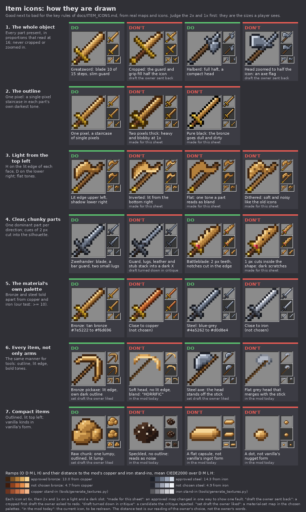

# Item icons: how they are drawn

How Jugcraft's item icons are drawn so they read at a glance and sit beside vanilla's items as if one hand drew them
all. An item icon is the flat sprite that shows in the inventory, the hotbar, on the ground and in item frames. Follow
this page for every new item icon and every redraw.

On 5 October 2026 the owner sent a sheet of their own weapon icons: "heres how I draw my style for texturing most
weapons does this help?". The 38 arm kinds were redrawn at 16×16 in that manner, and the owner asked to "keep the 3d
models in hand". Some of the big arms were cut off in the first drafts. The owner said: "redo Sabre, Zweihander,
Moonblade, Greatsword, Battleblade, Executioner, Halberd, Longsword, Nodachi. I get that those are big but just cutting
them off doesn't really work well". For the metals they chose: "I like the alternate versions for steel and bronze".
For the materials they asked: "the ingots need to be fixed they aren't the shape of vanilla's ingots and the nuggets
aren't either make them match inshape 1:1 like all mods do". When the arms were done, they said: "The new weapon icons
look so great! Can you make rules for how item icons should be drawn".

This page is those rules. The numbers in it are measured from the 38 approved maps
([arms-icons-16.md](features/arms-icons-16.md)) and the material-set drafts the owner liked.
`tools/check_icon_maps.py` checks the mechanical rules in CI; read it beside this page.

Earlier, the owner disliked the old soft, dithered 32 and 48-pixel icons. Of the plain armor they said: "The steel and
bronze look HORRIFIC". That was mostly the worn look, but it also warns against bland, flat designs.

## The look

The icons read as if drawn by the same hand as vanilla's swords and ingots, in the owner's manner.
- **Size:** 16×16, at vanilla's scale. One pixel is big; there is no fine detail.
- **Pose:** long things lie on the 45° diagonal, with the hand end at the bottom left and the point or head at the top
  right. Round or squat things sit centred.
- **Whole:** the whole object, every part present, in proportions that read at 16: its family's norms, or vanilla's for
  a vanilla kind. Shorten and simplify; never crop or zoom in.
- **Outline:** one pixel, a single-pixel staircase along a diagonal edge, in the darkest tone of each part's own
  material. Never pure black.
- **Light:** from the top left. Flat tones, up to four a material plus the outline. No noise, dithering, smooth ramps or
  wear.
- **Parts:** chunky, so the item reads at 1×. One or two cues tell a kind from its siblings.
- **Colour:** one clear hue a material, told apart from vanilla's copper, iron and gold. A bright, tinted highlight and
  a dark outline give a wide range of values.
- **Vanilla kinds** keep vanilla's form, drawn fresh.

In a hotbar beside vanilla's iron sword and gold ingot, ours should look like the same game. That is the aim; nobody has
checked it in the game yet (rule 9 and the process, step 7).

*Good next to bad, from real maps and icons, each at 6× with 2× and 1× on a light and a dark slot. "Draft the owner sent
back" is a cropped first draft the owner asked to redo. "Draft turned down in critique" is a candidate the critique
rejected. "Set draft the owner liked" is a material-set map in the chosen palettes. "In the mod today" is a current
icon, still to be redrawn. "Made for this sheet" is an approved map changed in one way to show one fault. The image was
drawn outside the game by a script kept with the drafts, which are not committed.*

## What counts as an item icon
- **Covered:** every flat item sprite, meaning the layers of an `item/generated`, `item/handheld`, bow or crossbow
  model. This includes each layer of a layered or tinted icon and each frame of an animated one.
- **Not covered:**
  - block items that show their 3D block model in the slot (536 items), as vanilla's blocks do;
  - 3D model textures: the `_model` sheets, shield faces and the hats;
  - the 3D models held in the hand, which stay ([arms-restyle.md](features/arms-restyle.md)).
- **A block's own texture used as its icon** (55 saplings, flowers, mushrooms and wild crops, and the spider web)
  follows that block's rules. The plants follow the natural-texture rules, `docs/NATURAL_TEXTURES.md` (PR #195): no
  outline, as vanilla's saplings and flowers have none.
- **A material set's blocks and ore overlays** follow the material-set rules, `docs/MATERIAL_SETS.md` (on
  `claude/thallite`). The set's tools, armor icons, ingot, nugget and raw chunk are item icons and follow this page.

## Which word wins
1. **The owner's word.** An icon the owner approved is right. If it falls outside a norm on this page, update the norm,
   not the icon. The norms describe the approved icons; they are not targets to force onto them.
2. **This page,** for every item icon. Where `docs/MATERIAL_SETS.md` differs, this page and the owner's later words win.
   MATERIAL_SETS needs the matching edit in the material-sets PR. It replaces these rows:

   | MATERIAL_SETS says | Instead |
   |---|---|
   | Nugget: "a small lozenge about 3 by 5 pixels" | Vanilla's nugget form (rule 9). The owner asked for the nuggets to "match inshape 1:1". |
   | Ingot: "vanilla's slanted bar" | The owner's ingot, recoloured and never redrawn (rule 9). The owner said the drafts "aren't the shape of vanilla's ingots", then sent their own ingot. |
   | Lightness (HSL): outline about 20–25%, dark about 40%, mid about 60%, light about 75%, highlight about 90% | The approved ramps measure: outline 14–15%, dark 31–34%, mid 47–48%, light 61–65%, highlight 78–85%. Use the luma rules of rule 6. |
   | "five tones and an outline" | Up to four tones a material plus its outline: `D M L H` and `O`. MATERIAL_SETS's own table lists five rows with the outline among them, so it is the same ramp. |
   | "one bold colour", "bolder than vanilla's iron and in the range of its gold, copper or emerald" | One clear hue, told apart from vanilla's copper, iron and gold (rule 6). The chosen steel is a low-saturation blue-grey. |

3. **The measured norms** below, which the checker warns on. A warning is a question to look at, not a verdict.

## The rules

Units used below:

| Term | Meaning |
|---|---|
| step | One pixel along the diagonal. Corner to corner is 16 steps. In the checker, `a = x - y`, and one step is 2 in `a`. |
| line | One diagonal row across the item. A blade drawn H, M and D is 3 lines wide. |
| span | The steps from the item's hand end to its tip. |
| share | The blade's or head's steps over the span. |
| cover | The share of the canvas's 256 pixels that are opaque. |
| luma | 0.299 R + 0.587 G + 0.114 B, from 0 (black) to 255 (white). |

### 1. 16×16, at vanilla's scale
- **Every new item icon is 16×16,** one texel the size of vanilla's.
  - No 32, 48 or 64 for an item icon.
  - No `tools/hd_art.py` for an icon: it dithers and paints wear.
- **Why:** the owner draws at 16. They disliked the old soft 32 and 48-pixel icons. Vanilla's items beside ours are 16,
  so a finer icon looks like it comes from another game.
- **When a bigger texture is allowed:**
  - Never for a new item icon. If an item cannot be read at 16, simplify the design to its one cue; don't add pixels.
    Only the owner can grant an exception.
  - Blocks, 3D model textures and sculpted props may still be high resolution
    ([ART_DIRECTION.md](ART_DIRECTION.md#high-resolution)).
- **Legacy icons:** 122 icons are still larger: 58 at 32, 19 at 48 and 45 at 64. They include the Arms VII variants,
  longbows, arbalests, smithing patterns, the exosuit, and the rocketry and construction items. They stay until each is
  redrawn, and a redraw is always 16×16. They are listed in `tools/legacy_item_icons.txt`. The checker fails any other
  item icon larger than 16×16, and warns when a listed icon has been redrawn, so that it leaves the list. Never add a
  name to it.

### 2. Placement on the canvas
| Pose | For | How |
|---|---|---|
| **Diagonal** | swords, polearms, tools, wands, keys, long parts | The hand end is at the bottom left and the tip or head at the top right. A straight haft or grip lies exactly on the main diagonal: the light tone on `x + y = 15`, the dark on `x + y = 16`. A full-length item has its butt outline at (0,14) and (1,15) and its tip outline at (14,0) and (15,1). |
| **Bows and crossbows** | bows, longbows, crossbows, arbalests | Vanilla's pose for a bow or crossbow. Every pull frame keeps the same footprint; only the string, arrow and limbs move. |
| **Centred and compact** | ingots, nuggets, gems, food, coins, discs, round parts | Centred, with transparency on every side. A short item stays near the middle. A coin or medal is face-on, about 10 pixels across (rule 7 has the disc's rows); tilted, it reads as a bean. |
| **Armor** | helmets, chestplates, leggings, boots | Front view, centred, in vanilla's armor silhouettes. The knight armor's icons are being drawn in their own PR. |
| **Upright** | bottles, jars, buckets, bowls | Standing and seen a little from above, as vanilla's potion, bucket and bowl are: a rim, lid or cork shows its lit top. Centred, with the base on row 13, 14 or 15. |
| **Flat** | cards, books, plates, maps | A small item with its own outline and transparency round it, never a square tile that fills the slot. |

- **Fill never touches the canvas edge.** Only the outline may sit on row 0, row 15, column 0 or column 15. A blade that
  would run to the corner narrows instead.
- **How much of the slot:**
  - The approved arms cover 16 to 53% of the canvas, with a median of 33%. The best food icons cover about 30%.
  - Armor and raw chunks reach about two thirds: the liked chestplate draft covers 66%.
  - Only a block face fills the canvas. A rectangular silhouette (a card, a board, a map) that covers 65% or more loses
    its shape. For a vanilla kind, vanilla's form wins (rule 9).
- **Short arms** float near the middle of the same diagonal, a little towards the hand corner. Each touches the canvas
  edge with at most 6 pixels: a hook, a chain end or a beard (the kusarigama has 6).

### 3. The whole object, never cropped
- **Draw the whole item, every part present, in proportions that read at 16:** its family's norms below, or vanilla's
  for a vanilla kind. Shorten and simplify; never crop or zoom in. A big item is drawn smaller, never cut off.
- **The proportions are not the real object's.** A real spear's head is about a seventh of its length; at 16 it would
  be 2 pixels. So the approved spear, halberd and pike heads take about 0.40 of the span, and the haft to head is about
  3:2. Vanilla's tool heads are oversized the same way.
- **Why:** the owner sent back the cropped drafts, whose guards and grips filled half the icon: "just cutting them off
  doesn't really work well". The redrawn ones fit the full diagonal (top row of the image above).
- **When the blade and the grip compete for room, keep the blade.** Tell a two-hander by its breadth and a slightly
  longer grip, not by a long grip.

**Size by family: the arms** (measured from the 38 approved maps; the checker warns outside these):

| Family | Span | Blade or head | Parts |
|---|---|---|---|
| **One-handed swords** (longsword, sabre) | 15 | 10 steps (share 0.67), from `a` −5 to 13; 3 lines wide (curved sabre 2) | Guard 2 `a` thick at `a` −7..−6, 9 lines (sabre 8); grip 4 `a`; pommel 2 `a` |
| **Two-handed swords** (greatsword, zweihander, executioner, battleblade, moonblade, nodachi) | 15 (executioner 14: a flat end cannot reach the corner) | 10 steps (0.67; executioner 0.71); 4 lines (zweihander 3, battleblade 5, slim nodachi 2) | Crossguard 11 lines, compact guard 8 or 9; grip 5 `a`; pommel 1 lit pixel, so pommel and grip are 6 `a`, as on the longsword. The nodachi has a tsuba of 6 lines, a 6-`a` wrap and a cap. |
| **Thrusting swords** (estoc, rapier) | 14 | 8 steps (0.57); 1 line | Guard at `a` −3..−2, 10 or 11 lines; grip 6 `a`; pommel 3 `a` |
| **Polearms** (spear, glaive, bill, halberd, war fork, pike, harpoon, lance, scythe) | 15 (scythe 14) | Spear-type head 6 steps (0.40); thrusting heads 3 to 5 (pike, harpoon, lance tip); war fork 7; scythe 9 | Haft 2 lines (`wBbw`); butt cap `gFfg` or `gFfw` over `.gg.` at `a` −13..−12; socket 3 or 4 `a`; haft to head about 3:2 |
| **Staves** (quarterstaff, twinblade) | 15 | Caps of 4 `a`, or a blade at each end | Bands symmetric about the middle |
| **Axes, hammers, maces** (battle axe, labrys, war hammer, maul, earthbreaker, flanged mace, brazier mace, flail, war pick) | 12 to 15 | 3 to 8 steps (median 5), 12 to 18 lines across | A full-width head tops out at `a` 8 or 9, so its span is 12 or 13; a tapering head reaches 11 to 13. A symmetric head is centred on the haft; a single bit sits on the lit, upper-left side. |
| **Short arms** (dagger, katana, katar, kama, chakram, kusarigama, francisca, javelin) | 9 to 12 | Dagger blade 4 of 9 steps; katana 6 of 12 | Centred at `a` −3..+1 |

- **Guards.** On the arms a guard is a bar 2 `a` thick (the katana's tsuba 3), straight across: an `F` line and an `f`
  line. A crossguard reaches 3 to 5 lines past the blade on each side; a compact guard 2. The owner's own swords also
  draw a guard as a single line of lit fill whose pixels touch at their corners, inside its own outline, with a lit
  pixel at each tip, as vanilla's swords do. That is right too. What fails:
  - guard pixels standing apart with no outline between them, which read as specks;
  - a guard as heavy as the blade, which turns the item into an X.

  (The owner's guard is read from a compressed screenshot of their sheet, at about 3 screen pixels a texel. Ask the
  owner if in doubt.)
- **Grips.** A straight, European grip is 2 lines: `K` on the lit line and `k` on the other, outlined in `w`. A Japanese
  wrap alternates `K` and `k` along the lit line: the katana's runs `K` at (5,10), `k` at (4,11), `K` at (3,12), and the
  nodachi's the same. A grip that runs across a hilt (the katar) or sits inside a ring (the chakram's `wKkkw`, 3 wide)
  follows its part's shape.
- **Curved polearm blades** (a scythe, a war scythe) lie in line with the haft. The back bows towards the lower right,
  as a curved sword's does, and the tip turns forward to the upper left, as a hook does. The share counts steps along
  the diagonal, so a tip that turns off it measures short: a blade over 7 rows can measure 6 steps. Judge such a blade
  by eye.

**Size by family: other items.** No map of these is approved yet. Until one is, follow this guidance, which comes from
the material-set drafts the owner liked, the best-fitting icons the mod has today and vanilla's manner. Every row is
provisional; replace it with measures when a family's maps are approved.

| Family | Form | Good today | To fix |
|---|---|---|---|
| **Tools** (pickaxe, axe, shovel, hoe, sword, paxel) | Vanilla's silhouettes, span 13 to 15 (`# family: tool`). The head is in the main material. The handle is vanilla's 1-line stick, alternating `b` and `B` and outlined in `w`, from (0,14) up to the head. | the material-set drafts (not in the mod yet) | the old bronze and steel tools: soft heads, no lit edge |
| **Ingots and nuggets** | Every ingot is the owner's ingot, recoloured, never redrawn (rule 9). The nugget is vanilla's form, drawn fresh. | the material-sets PR | the 14 ingots on `main` are a flat capsule and the nuggets a dot |
| **Raw ore, dusts** | One lopsided outlined lump or heap, lit top left, with a few placed glints. The raw chunk draft covers 58% of the canvas, H 4%, D 28%. | the material-set raw chunk | speckled, unoutlined dusts and raw ores |
| **Gems and crystals** | Compact and faceted, with flat faces. Each face is its own small ramp, lit on its upper-left edge. A set stone on another item is 2 to 4 px with one light `A` at its top left, or 1 px of a sharply different hue and value (rule 7). | the arms' set stones | |
| **Coins, discs and medals** | Face-on, centred, about 10 px across, in the disc rows of rule 7. A raised rim may run its own ramp: its inner edge dark on the upper left and lit on the lower right. The rim makes it a coin; a plain lit disc reads as a button. | | |
| **Food and produce** | Compact, about a quarter to a third of the canvas, outlined in the food's own dark, lit top left with one or two highlight pixels. A stem or leaf makes a 2-pixel cue. | `tomato`, `turnip`, `cranberries`, `popcorn`, `king_size_candy_bar` | speckled `pan_de_muerto`; unoutlined `marshmallow`, `burnt_sugar` |
| **Seeds** | Each kind its own shape and colour. | `chestnut`, `giant_pumpkin_seeds` | 20 of 25 seeds share one speck layout |
| **Bottles and containers** | Upright, in vanilla's form. See *Bottles and their contents* below. Every pixel is fully opaque or fully clear. | `mason_jar`, the soup bowls; `giants_draught` for its form only | `giants_draught`'s single near-black outline (#1a120c, luma 20), the same round cork, glass and contents; `wisp_in_a_jar`'s semi-transparent glass; the buckets' mid-grey outline |
| **Guns and vehicles** | Centred (`# family: compact`). A gun from the side, its barrel raised to the upper right out of its housing, with a dark bore (`k`); a vehicle whole, from the side or the front. A tier cue: a hazard band (`k` on `F`) or a phosphor lamp. Shells lie on the diagonal (`# family: short`), told apart by size, band and nose. | the war machines' maps in `tools/item_icons/` (7 October 2026; not yet shown to the owner) | |
| **Parts and gadgets** | The object's real silhouette, never a square tile: a gear with teeth, a coil or spool of wire, a plate as a slab with a lit top edge, a card with a margin round it. | `turbocharger`, `speed_upgrade`, `carving_knife`, `first_prize_ribbon` | `basic_circuit` fills the slot; `copper_wire` is a ladder; the drones have no outline |

**Bottles and their contents.**
- **Roles:** the contents are the main material (`O D M L H`), the glass the second (`g f F Y`, `second=glass`) and a
  cork the wood (`w b B`).
- **The contents are shaded like any part,** in flat tones: lit along the top and upper left, `D` on the lower right.
  They are not one flat tone.
- **The glass shows** as its own outline and a lit stripe on the upper left.
- **Contents take the same ramp as the fluid's bucket and block** (crude oil's bottle matches `crude_oil_bucket`).
- **Dark contents** (crude oil, ink) that are darker than the glass outline keep a one-pixel glass wall in `f` between
  them and the outline, on the shaded side and the base. Without it the bottle's body vanishes on a dark slot.
- **One bottle map serves every fluid:** its generator colours the contents in each fluid's ramp, as one arms map serves
  bronze and steel; the map's `# materials:` line names one fluid for the preview. A tinted contents layer (rule 10) is
  only for a colour the game sets at run time.

### 4. The outline
- **One pixel thick: a single-pixel staircase along a diagonal edge.** The outline is the transparent four-neighbours of
  the fill (the pixels beside it, above it or below it), so a diagonal corner stays clear. It is never two pixels thick
  and never forms a 2×2 block.
- **Every outline pixel touches its part's fill** on one of its four sides. Don't add an outline pixel to reach a size;
  the executioner stays at span 14 rather than take a pad pixel.
- **Each part is outlined in its own material's symbol:**
  - `O` round the main material;
  - `g` round the second material (fittings, glass);
  - `w` round wood and a grip wrap;
  - chain is edged by its own dark `c`.
- **Where parts meet inside the silhouette,** their fills touch directly (a guard on a blade, a ring on a haft), or they
  share one line, usually the fitting's `g`. Inner outline lines are rare: 3% of the arms' outline pixels. The four
  approved polearm butt caps (bill, glaive, scythe, war fork) close the fitting with the haft's `w` (`gFfw`); the others
  use `gFfg`. Both are right.
- **The outline is the darkest tone of the part's own hue, never pure black.** Bronze's is #3e2410 (luma 41) and
  steel's #1e2129 (33); the owner's outlines measure about 35 to 42. It is at most 45 luma, or a third of the mid tone's
  luma for a pale material such as bone or ice. It sits clearly below the dark tone: D is at least 30 luma above O.
- **A dark material** (obsidian, coal, ink, crude oil; the owner's black-quartz and shadow swords) takes a near-black
  outline in its own hue. Its L and H tones carry the read. Keep its D at least 30 luma above the outline: lift D rather
  than drop the outline to black.
- **Fill never touches transparency or the canvas edge.** There are two exceptions:
  - a flame (`x X`) is never outlined: its colour is its edge;
  - a thin rope's inner edge, as in the harpoon's coil, is declared in its map (see [Maps](#maps-and-the-checker)).
- **Expect about half of a slim icon to be outline:** 34 to 63% of opaque pixels, with a median of 48%.
- **Why:**
  - vanilla and the owner draw this way;
  - a two-pixel outline swells the shape into a blob;
  - a black outline makes bronze look dull and dirty;
  - a single-pixel staircase keeps diagonal edges crisp.

### 5. Light from the top left
| Tone | Where it goes | Measured |
|---|---|---|
| `H` highlight | On the lit edge of every face. On a slim item (a blade, a haft, a tool's head) that is the silhouette's upper-left edge: one continuous line along the middle of a blade's lit edge, or a short run at a head's top-left corner, plus one per extra lit face. On a compact item with several faces (an ingot, a raw chunk, armor) it is the top face's front edge or the crease between top and front faces, a ridge, or the top-left of each lump. | In the arms, none of the 171 H pixels has metal both above it and to its left. The liked raw chunk has glints inside its shape at (5,3) and (11,7), and the ingot draft lights the crease between its top and front faces. H is 7 to 15% of a blocky head and 19 to 33% of a blade 3 or 4 lines wide. |
| `L` light | Beside H, and on the lit edge where H stops: the tip, and the 1 to 3 pixels before the guard. | 24% of blade metal |
| `M` mid | The body. The most common tone, and the one with the most colour. | 31% |
| `D` dark | The lower-right edge and the lower-right inside. Never on a lit edge. | 2 of 249 D pixels sit on a lit edge, both against a fitting band (the earthbreaker) |

- **The checker warns on an H with main material above it and to its left only on a slim item.** A compact, upright or
  flat map declares its family (`# family: compact`, `upright` or `flat`) and is not warned there. The material-set item
  maps (chestplate, helmet, ingot, raw chunk) warn today because they declare no family yet. Those warnings are
  expected, and the vanilla-form ingot breaks no rule by lighting its crease.
- **Every cross-section runs light to dark from the lit side.** That holds for 94% of the arms' cross-sections. The rest
  are where a second face starts its own ramp: a flange, a second bit, or a coin's raised rim.
- **Thin parts use fewer tones.** A 1-line blade is one lit tone. A 2-line blade is a lit tone and M, with no D (sabre,
  katana, nodachi). A blade 3 lines or wider ends every row in D on the lower right; don't light both edges.
- **Mirrored parts are lit for their own position.** The labrys's lower bit faces the light with its inner edge, so that
  edge is L, not D.
- **The other materials:**
  - wood: `B` above or left of `b`;
  - grip: `K` above or left of `k` (a Japanese wrap alternates them, rule 3);
  - fittings: `Y` at the lit end, `F` on the line towards the tip, and `f` on the hand side. `Y` is rare: 13% of fitting
    pixels, and none at all in 20 of the 37 kinds with fittings;
  - a gem: one `A` at its top-left pixel.
- **Flat tones only.** Use up to four tones a material plus the outline (`D M L H`); fittings, wood and grips use two
  or three. No noise, no dithering, no smooth or noisy ramps. Stepped bands are fine: several of the owner's blades
  brighten in steps towards the tip. No wear, rust, scratches, stains or stencilled serials: at 16 pixels they read as
  dirt.
- **Bland is as bad as busy.** Keep a clear hue, a near-white highlight tinted towards the hue and a dark outline, so
  the values run wide. The owner's highlights reach a luma of about 210 to 240 (their bronze, copper and electrum swords
  about 237 to 241, silver and emerald about 211 to 214). Our tan bronze and blue-grey steel sit at the low end, 216 and
  215. That is fine, but no new palette goes dimmer, except a dark material's.
- **Why:** this is how the owner and vanilla light their items. Inverted light reads as a different shape, and the owner
  disliked the soft dithered icons.

### 6. Materials and palettes
- **One map, many materials.** A map names what each pixel is made of by role, never a colour, so one map serves every
  metal (see [The symbols](#the-symbols)):
  - an arm takes its style's materials (`tools/arms_pixel.py` `STYLES`), the same materials as the 3D model in the hand;
  - any other map declares its materials from the table in `tools/icon_materials.py`, for example
    `# materials: main=copper second=brass wood=wood`. The checker previews it in those materials and checks each one.
- **The approved metals** (the owner's "alternate versions"):

  | Metal | O | D | M | L | H | With |
  |---|---|---|---|---|---|---|
  | Bronze, a tan bronze | #3e2410 | #7e5222 | #b4803c | #dcaa5c | #f6d696 | brass fittings, leather grip, oak haft, garnet |
  | Steel, a dark blue-grey | #1e2129 | #4a5262 | #6e7889 | #98a2b4 | #d0d8e4 | gunmetal fittings, black rubber grip, dark wood haft, phosphor-green stone |

  The material-sets PR brings the ingots, nuggets, tools and armor to these palettes. Today's steel ingot is still the
  older #2c3038 to #b0b6c2.
- **Vanilla's own metals.** An item meant to be made of vanilla's copper, iron or gold (copper wire, iron parts, gold
  trim, the steampunk tier's copper) uses the named ramp for it in `tools/icon_materials.py` and skips the distance test
  below. They are provisional and not yet shown to the owner. Their D, M and L are the mod's existing stand-ins
  (`tools/generate_textures.py`). The outlines are darkened to the approved metals' depth, because the stand-ins'
  outlines (luma 67 to 88) made a test coin soft, and copper's highlight is lifted into the owner's range.

  | Metal | O | D | M | L | H |
  |---|---|---|---|---|---|
  | Copper | #401e10 | #9c4e2e | #c46c42 | #e28e60 | #facea6 |
  | Iron | #26262c | #828288 | #aaaab0 | #ccccd0 | #e8e8ec |
  | Gold | #422806 | #ba8c1c | #e6be32 | #f8de64 | #fff6b4 |

  The table also holds the arms' materials, a provisional clear glass (#222c3a to #f4faff) for bottles, and the war
  machines' paints and stuffs (hazard yellow, concrete, canvas, khaki, red paint and black lacquer, 7 October 2026,
  provisional). Hazard yellow sits near gold, so it is only ever a second material.
- **A new material gets a five-tone ramp:** outline, dark, mid, light and highlight. In code it is an
  `arms_pixel.Material`; its second tone, the outline towards the light, is used by the 3D models, and by the icons only
  for the chain's `c`. Add it to `tools/icon_materials.py`. The ramp must:
  - be one hue, with the mid tone carrying the most colour;
  - step up in luma from O to D, M, L and H;
  - have an outline of at most 45 luma (a third of M's for a pale material), never pure black;
  - have D at least 30 luma above O, or the dark merges into the outline (the draft thallite's 25 did);
  - have H at most 70 luma above L, or every glint reads as a speck (the draft tin's 119 did);
  - have a highlight near white but tinted towards the hue.

  A material in another role is checked on the tones that role shows: a second material on its outline, dark, mid and
  light; wood on its outline and its two tones; a wrap, stone or accent on its two tones, which must step up.
- **Tell a new metal apart from vanilla's copper, iron and gold.** This test is our reading of the owner's choice, not
  the owner's words. They said only "I like the alternate versions"; the versions not chosen sat close to copper and
  iron, and their own sheet has copper-looking bronze swords. The test compares the ramp's D, M, L and H with copper's,
  iron's and gold's last four tones, using the mod's own stand-ins in `tools/generate_textures.py` (`COPPER_METAL`,
  `IRON_METAL`, `GOLD_METAL`, drawn fresh, not taken from vanilla). The mean CIEDE2000 distance must be at least 10 from
  each:

  | Ramp | Copper | Iron | Gold |
  |---|---|---|---|
  | Chosen bronze | **13.0** | 26.0 | 17.6 |
  | Bronze not chosen (close to copper) | 4.7 | 28.5 | 27.2 |
  | Chosen steel | 29.6 | **14.3** | 39.3 |
  | Steel not chosen (close to iron) | 28.9 | 4.9 | 32.3 |

  - **Exempt:** vanilla's own metals, above.
  - **The owner may approve a palette that fails it.** Its name (a material, an arms style or an Arms VII line) goes in
    `OWNER_APPROVED` in `tools/icon_materials.py`, with the owner's words and the date, and the checker skips the
    distance test for it. The other palette rules still hold.
- **What the checker tests:** every material of the arms' styles, every material a map declares, and the Arms VII lines'
  materials (`tools/arms_variants_art.py` `LINE_STYLES`). A line's are warnings until one of its variants is drawn as a
  map, then errors. Five warn today:
  - the gilded line's polished steel, 4.0 from iron;
  - the werewolf's silver, 7.0 from iron;
  - the cinder tyrant's obsidian blade and fittings, D 22 luma above O;
  - the mire hag's thorn fittings, D 28 above O.

  Whoever redraws those variants decides each with the owner: a silver may be meant to sit near iron (then approve it),
  and obsidian is a dark material (lift its D).
- **Handles:** tools take a stick's two browns (`wood`); arms take their style's haft and grip materials.
- **Every part must read in every palette and on both slots.** For example:
  - gunmetal fittings vanish on steel's dark slot, so the kusarigama's weight is drawn in head metal;
  - brass beside a flame turns the brazier into a blob, so a dark `f` row separates them;
  - leather on steel merges with the guard into one dark mass.
- **A tier shows through its palette and one signature part,** never through wear:
  - steampunk: brass and copper;
  - dieselpunk: gunmetal or olive, with one hazard band or a phosphor-green lamp;
  - electric: graphite with a mint-green strip.

### 7. Chunky, readable parts
- **A cue is at least 2 pixels, or part of the silhouette, or one pixel that differs sharply in hue and value from
  everything around it.** The owner sets a single dark or green pixel as a gem at a guard's centre, and gives a pommel
  one lit pixel. A lug, spur, tooth or band of one pixel in its part's own tones vanishes at 1×. For example:
  - the battleblade's 1-pixel teeth became a 2-pixel tooth and a notch cut through the outline;
  - the earthbreaker's 1-row wood stripe became two rows.
- **A kind's defining feature is in the silhouette:** notches, steps, fins and openings cut through the outline, not
  scratched inside the shape.
- **One dominant part in each direction.** Secondary spikes, hooks and lugs stay about 2 pixels, smaller and darker than
  the main part. A guard, lug bar or back spike as big as the blade turns the item into an X. Guards are in rule 3.
- **Keep separations clear:**
  - parts that touch differ by an outline or a clear step in value; a head whose dark matches the handle's light blurs
    into it;
  - shapes that need room get real openings: the helmet's face, the kama's arc, the gap between the leggings.
- **No strays:**
  - no lone fill pixel, glint, nub or tail;
  - no part of 1 or 2 pixels on its own (the checker warns);
  - no pinholes, meaning transparency the drawing encloses (the checker fails them). A deliberate hole is real: at least
    2 pixels or open to the outside, like the rapier's bow, the katar's hand gap or the chakram's ring, and the map
    declares it.
- **Chains show links:** `c` and `C` alternate. Never draw a solid cable.
- **Curves:**
  - curves spread their steps evenly, with no kinks or S-bends;
  - curved swords bow 1.6 to 3 pixels towards the lower right, with both ends on the diagonal;
  - hooks sweep to the lit upper left;
  - curved polearm blades do both (rule 3).
- **Circles and discs** follow these fill rows, top to bottom, each centred, with the outline round them:

  | Across, outline included | Fill rows |
  |---|---|
  | 6 | 2 4 4 2 |
  | 8 | 4 6 6 6 6 4 |
  | 10 | 4 6 8 8 8 8 6 4 |
  | 12 | 4 8 8 10 10 10 10 8 8 4 |
  | 14 | 4 8 10 10 12 12 12 12 10 10 8 4 (the chakram's outer edge) |

  At 10 and below a disc is close to an octagon; that is the circle at that size. A rounder edge comes from a fill row
  that widens by 4 (2 a side), which gives a 2-pixel outline run with fill under it, as on the chakram's rows 2 and 3.
  Drawing the outline first as a rounder curve leaves outline pixels with no fill beside them, which the checker fails.

### 8. Read at 1× and 2× first
- **Judge at 1× and 2×, on a light and a dark slot, before the zoom.** Check every palette. Many faults show in one
  palette or one slot only.
- **Siblings differ at 1× and 2×.** Check them side by side, not one at a time. Kinds of a family share their
  conventions (guard, grip, pommel, haft, butt cap, hand position), and the difference lives in one or two cues:

  | Pair | What tells them apart |
  |---|---|
  | greatsword and longsword | a 4-line blade against 3, and a wider guard |
  | nodachi and katana | span 15 against 12, a disc tsuba, a 3-step wrap; the nodachi stays slim |
  | pike and javelin | a 2-line haft with langets and a ring, against a thin shaft off both corners |
  | katar and lance | the katar is dagger-sized: 60 pixels against the lance's 85 (its first draft filled the canvas at 113 and echoed the lance) |
  | executioner and greatsword | a square end capped by 4 light pixels, against a point |
  | battle axe and war pick | a bearded crescent bit, against a spike |

- **Families keep a size order,** by opaque pixels:
  - swords: dagger 49 < katana 60 < estoc 70 ≈ nodachi 71 < rapier 78 < longsword 81 ≈ sabre 82 < executioner 86 <
    zweihander 89 < moonblade 92 < greatsword 94 < battleblade 101;
  - polearms: pike 58 < spear 67 ≈ glaive 68 < harpoon 82 < bill 84 < halberd 85 = lance 85 < war fork 91 < scythe 111;
  - family medians, grouped as in the table of rule 3: short arms 67 < thrusting swords 74 < one-handed swords 81.5 <
    polearms 84 < two-handed swords 90.5 < axes, hammers and maces 99. The two staves are 63 and 86.

  A new kind takes its place in that order. A short weapon uses less of the canvas, on the same diagonal. The slim
  nodachi reads as a two-hander by its length, not its bulk.

### 9. Vanilla's forms, drawn fresh
- **Where an item is a vanilla kind, take vanilla's form:** an ingot, a nugget, a stick, a bottle, a bucket, a bowl, a
  tool's head. Use the same silhouette, footprint and proportions, so it reads at once as that kind ("make them match
  inshape 1:1 like all mods do").
- **Draw every pixel fresh,** in a map and our palette. Never open, sample, trace or recolour a Mojang texture
  ([CLAUDE.md](../CLAUDE.md): no copied proprietary assets). "1:1 in shape" means the same form and proportions, not the
  same pixels.
- **How to check 1:1, legally:** in the game, put our item beside vanilla's in a hotbar and in item frames side by side,
  and take a screenshot. Width, height, position in the slot and the layout of faces line up within one pixel. Every
  pixel of ours is still drawn fresh in a map. If the game cannot be run, the feature record says so, and the owner or a
  maintainer makes the check.
- **Record each form once measured.** The first PR to draw a form measures it this way, by eye in the game, fills its
  row and adds an approved reference map drawn fresh beside its family's maps. Later icons of that form follow the row.

  | Form | What to record | Recorded |
  |---|---|---|
  | Ingot | the owner's own map, recoloured (below) | the material-sets PR: `tools/material_icons/ingot.txt`, 16×12 in rows 2 to 13 |
  | Nugget | bounding box, position in the slot | not yet (the ingot and nugget PR) |
  | Stick | start and end pixels, width | not yet |
  | Potion bottle | bounding box, cork, neck and body widths, base row | not yet |
  | Bucket | bounding box, rim and base widths, base row | not yet |
  | Bowl | bounding box, rim width, base row | not yet |

- **Every ingot is the owner's ingot, recoloured.** On 6 October 2026 the owner sent their own ingot and said:
  "TAKE THIS AND RECOLOR IT LEAVE THE OUTLINE EXACTLY THE SAME JUST CHANGE THE COLORS and ALWAYS DO THAT FOR ALL INGOTS THAT ARE SUPPOSED TO BE SHAPED LIKE THAT". It is `tools/material_icons/ingot.txt` in the material-sets PR, kept pixel for pixel; a material changes
  only its colours (`material_icons.ingot_palette`), and `check_mod_data` pins the map. This is the owner's call and the
  one exception to drawing a vanilla kind fresh.
- **The nugget** in vanilla's form is drawn fresh in the same PR. The current ones, a flat capsule and a dot, are replaced
  there.
- **Tool handles are vanilla's 1-line stick.** The arms keep a 2-line haft for heft; both are approved.
- **References are studied for manner only.** The owner's sheets and vanilla guide the look; nothing of them is used.

### 10. Animated, layered and tinted icons
- **An animation never moves the item.** The outline and footprint are the same in every frame; only fire, a glow or a
  lit pixel changes, and only a few pixels at a time.
- **The brazier mace's flame flickers** (`tools/arms_icons.py` `flicker`). In alternate frames the flame's orange and
  yellow pixels trade places, and its topmost pixels come and go. It runs 4 frames of 3 ticks (`tools/arms_art.py`
  `ANIMATED`), saved as a vertical strip with an `.mcmeta`.
- **Flames are never outlined.**
- **Every frame passes the same checks;** the checker checks each frame of a flame, as many as `ANIMATED` gives.
- **Tinted (dyeable) icons:** tint grey fill layers, and add an untinted outline layer, so the outline stays the
  material's dark. The candy corn's layers, tinted fills under the untinted `candy_corn_outline`, are the pattern to
  copy.
- **Layered and state icons** (sealed jars, blueprints, a bow's pull) keep the same outline and footprint in every layer
  and state.

## Maps and the checker

A map is a text file of 16 lines of 16 symbols that the owner can edit in any text editor. Lines starting with `#` are
comments. The arms' maps are in `tools/arms_icons/`, coloured by `tools/arms_icons.py`; other items' maps are in
`tools/item_icons/`, drawn by `tools/item_icons.py` in their declared materials.

### The symbols
Every icon map shares one table. A symbol names a role, not a material: the arm's style, or the map's `# materials:`
line, says which material fills each role. Never reuse a letter for another role. A new letter goes into this table and
into `SYMBOLS` and `ROLES` in `tools/check_icon_maps.py` together.

| Symbol | Role (in a `# materials:` line) | An arm's | Other uses |
|---|---|---|---|
| `.` | transparent | | |
| `O D M L H` | `main`: outline, dark, mid, light, highlight | the blade or head | an ingot, a coin, a bottle's contents |
| `g f F Y` | `second`: outline, dark, mid, light | fittings (guard, pommel, rings, socket, trim) | a bottle's glass, a trim |
| `w b B` | `wood`: outline, dark, light. `w` also outlines a wrap. | the haft | a stick, a cork |
| `k K` | `wrap`: dark, light | the grip | a cloth band, a string; a gun's bore and a hazard stripe's black (`wrap=rubber`) |
| `a A` | `stone`: dark, light | a set stone | a lens, a lamp |
| `e E` | `accent`: dark, light | runes, a hazard stripe | |
| `c C` | chain: dark (its own edge), light | | |
| `x X` | flame: orange, yellow (never outlined) | | |
| `r s t u` | host rock, dark to light (block faces and ore maps only) | | |

### Directives
A map declares its materials, its family and any deliberate exception in comment lines:

| Directive | Means | Used by |
|---|---|---|
| `# materials: main=<m> second=<m> wood=<m> wrap=<m> stone=<m> accent=<m>` | The material of each role the map uses, from `tools/icon_materials.py`; every role the map uses must be named. Every map that is not an arm needs one: without it the checker previews and checks the map as an arm, in bronze and steel. | the war machines' maps in `tools/item_icons/`; the material sets, coins and bottles will |
| `# family: <family>` | The size norms for a map whose name is not a known arm: `long_sword`, `thrusting_sword`, `polearm`, `staff`, `headed`, `short` or `tool` (span and share), or `compact`, `upright` or `flat` (cover and position; no highlight-edge warning). | the war machines' maps: `compact`, the shells `short` |
| `# allow: pinhole - <why>` | The drawing may enclose transparency. | chakram (the ring), harpoon (the rope's eye), katar (the hand gap), rapier (inside the knuckle bow), war fork (between the tines), observation balloon (between the basket's rigging lines) |
| `# allow: bare k K - <why>` | These fill symbols may touch transparency, but never the canvas edge. | harpoon (the rope's inner edge) |
| `# type: face` or `# type: overlay` | A full block face, which has no transparency or outline rules, or an ore overlay, where the rock is the outline. | the material sets' block faces and ore overlays |

The family norms for `compact` (cover 8 to 68%, middle within 1.5 pixels of the canvas's), `upright` (cover 15 to 60%,
centred within 1 pixel across, base on row 13 to 15) and `flat` (cover 10 to 65%, middle within 1.5 pixels) come from
the liked material-set drafts and a test coin and bottle drawn from this page alone. They are provisional, like the
table of other items.

### What the checker does
`python3 tools/check_icon_maps.py` checks every map in `tools/arms_icons/` and `tools/item_icons/`, the palettes and
the item icons' sizes.
Give it other folders or files to check those maps instead. `tools/check_mod_data.py` runs it and its self-test, so the
Build workflow fails on any error.

| Errors (fail CI) | Warnings (printed) |
|---|---|
| Not 16 rows of 16 known symbols; host rock in an icon | A map's size outside its family's norms: span and share (rule 3), or cover and position (rule 2) |
| A malformed directive: an unknown allowance, family, type, role or material; an allowance without its reason; a role the map uses that its `# materials:` line does not name | On a slim item, a highlight with main material above it and to its left (rule 5) |
| Fill touching transparency or the canvas edge (flames may touch transparency) | A lone part of 1 or 2 pixels |
| An outline pixel with no fill on any of its four sides | An allowance the map does not need |
| A 2×2 block of outline | The Arms VII lines' materials, until a variant of the line is drawn as a map (rule 6) |
| A pinhole the map does not declare | A legacy icon that has been redrawn or removed, which should leave `tools/legacy_item_icons.txt` |
| Any of these in any frame of a flickering flame | |
| A material the maps are coloured in, on the tones its role shows: tones not stepping from dark to light, a pure black outline, an outline over 45 luma (a third of M's for a pale material), D within 30 luma of O, H more than 70 above L, or a main metal within 10 (CIEDE2000) of copper, iron or gold unless exempt | |
| An item icon larger than 16×16 that is not in `tools/legacy_item_icons.txt` | |

- `--preview` also draws each map at 8×, 2× and 1×, on a light and a dark slot: an arm in every style, a variant in its
  line's materials, any other map in its declared materials. It writes to the system's temp folder unless given a
  `.png` path, so no picture lands in the repository.
- `--self-test` breaks approved maps and palettes in known ways and confirms each break is caught, so a later edit
  cannot quietly weaken the checker. It covers the map's shape and symbols, host rock, fill on the edge or touching
  transparency, stray and doubled outlines, pinholes, a flame frame, malformed directives and every palette rule.

The checker is a lint, not a judge: it cannot tell whether an icon reads well. Look at every icon.

## The process
1. **Find the form.** Use the real object, vanilla's form for a vanilla kind (rule 9), or the old icon scaled down to 16
   for a redraw. Never zoom in.
2. **Draw the map** in text. For an important kind, draw two designs, judge them side by side, and graft the best parts
   together.
3. **Check and look:** `python3 tools/check_icon_maps.py --preview <folder>`. Fix every error; read every warning. Look
   at the 1× and 2× views first, in every palette, then at the family together.
4. **Critique** against the family and the references in the repository: the approved maps,
   `docs/images/arms_icons_16.png` and the image on this page. The owner's sheets are third-party art and are not in
   Git, so this page describes their manner in words. A critic's fix is a checked draft, not an order: the reviser may
   overrule it with evidence (a render or a measure).
5. **Generate:** `python3 tools/generate_textures.py` writes the textures. Running it again changes nothing.
6. **The owner approves.** Show the old and new icons side by side; the owner decides.
7. **Look in the game.** The client game tests shoot the arms in item frames and in the hand (`ArmsClientGameTests`,
   [TESTING.md](TESTING.md)). For a new family, put vanilla's nearest items (an iron sword, an iron ingot, a potion) in
   frames beside ours, so the scale and manner can be compared (rule 9). The arms test does not do this yet. If no
   game can be run, say so in the record; it must not block the work.
8. **Record** what was checked, and what was not, in the feature record.

## Adding an icon
1. **Pick its pose and family** (rules 2 and 3), and read that family's norms and its siblings.
2. **Write the map:**
   - for an arm or a variant: `tools/arms_icons/<name>.txt` (`arms.py` and `arms_variants.py` use a map when one
     exists);
   - for any other item: `tools/item_icons/<name>.txt`, a map with a `# materials:` line and a `# family:` line. The
     checker checks it in CI (`FOLDERS`), and the item's generator saves `item_icons.draw(name)`
     (`tools/item_icons.py`). The war machines were the first family moved there (7 October 2026); a family that
     needs its own loader adds its folder to `FOLDERS` too.
3. **Declare any deliberate exception** in the map, with the reason.
4. **For a new material, add its ramp** to `tools/icon_materials.py` (rule 6). An item of vanilla's copper, iron or gold
   uses that metal's ramp.
5. **Check, preview, generate, show the owner and look in the game** (the process above).

## Do and don't
| Do | Don't | Example |
|---|---|---|
| Draw the whole item, every part present, in proportions that read at 16 | Crop a big item, or zoom in on its head | the nine big arms, redone |
| Keep the blade at about two thirds of a sword | Lengthen the grip at the blade's expense | greatsword: a share of 0.67, not 0.47 |
| Use a one-pixel staircase outline in the part's own dark | Draw a two-pixel outline, a pure black outline, or a pad pixel to reach a size | executioner: span 14, no pad |
| Light the lit edge of every face and shade the lower right | Light both edges, or light from the bottom right | chakram, kusarigama, dagger: inversions fixed |
| Use flat tones with a bright tinted highlight; step bands if you like | Use dithering, noise, smooth ramps, wear or a dull single tone | the old 32 and 48-pixel icons |
| Cut the kind's feature into the silhouette | Scratch 1-pixel cuts inside the shape | battleblade: notches in the outline |
| Keep secondary parts small and darker | Let a lug bar, back spike or guard match the blade | zweihander lugs; halberd spur |
| Draw a guard as a bar, or as one lit line inside its outline | Let guard pixels stand apart with no outline between them | zweihander guard; the owner's swords |
| Give each metal its own palette; use vanilla's ramp for vanilla's metal | Use a bronze close to copper, or a steel close to iron, for a metal of our own | the tan bronze and the blue-grey steel |
| Take vanilla's form for a vanilla kind, drawn fresh, and check it beside vanilla's in the game; recolour the owner's ingot for every ingot | Trace, sample or recolour a Mojang texture; redraw the owner's ingot | nugget; the ingot |
| Judge at 1× and 2× on both slots, beside the siblings | Judge one icon alone at 10× | greatsword against longsword |

## Decided by these rules
These questions were raised while the icons were drawn and left open:

| Question | Answer |
|---|---|
| Should the katana's lower blade row be D? | No. A 2-line blade takes a lit tone and M, with no D (rule 5), as the approved sabre and nodachi do. |
| Is the executioner's span of 14 right? | Yes. A flat end cannot reach the corner without becoming a point (rule 3). |
| The draft tin's highlight jump | Too far: H is at most 70 luma above L (rule 6). |
| The butt caps drawn `gFfw` (bill, glaive, scythe, war fork) | Both `gFfw` and `gFfg` are right: parts may share one line (rule 4), and the owner praised these icons. Change them only if the owner asks. |
| The bronze axe's and hoe's heads blurring into the stick | Touching parts need an outline or a clear step in value (rule 7). Re-check with the tan palette. |
| The material-set hoe's 2×2 outline block | Not allowed (rule 4). Fix it in the material-sets PR. |
| The material-set items' highlight warnings | Expected: a compact item lights its top face's crease (rule 5). Declare `# family: compact` and they stop. |
| Set stones on more of the ornate kinds | The owner's call. Stones are used sparingly: 3 of the 38 arms. |

## Checklist
- [ ] 16×16 at vanilla's scale, drawn fresh from a text map. Nothing copied, traced or recoloured from Mojang or a
      reference.
- [ ] The whole item, every part present, in proportions that read at 16; on the diagonal, centred or upright as its
      pose says; fill off the canvas edge.
- [ ] Within its family's norms, and in its place in the family's size order; or approved by the owner, and the norm
      updated.
- [ ] A one-pixel staircase outline in each part's own dark, never pure black; no strays, no 2×2 blocks.
- [ ] Lit from the top left: H on the lit edge of every face, D on the lower right; flat tones with no noise, dithering
      or wear.
- [ ] Every cue at least 2 pixels, in the silhouette, or one sharply contrasting pixel; no specks; holes only where
      meant, and declared.
- [ ] Its materials declared; each ramp steps from dark to light, and a new metal is at least 10 from copper, iron and
      gold (or is vanilla's own metal, or owner-approved).
- [ ] Vanilla kinds in vanilla's form, drawn fresh.
- [ ] Every frame and layer keeps the same outline and footprint.
- [ ] `python3 tools/check_icon_maps.py` passes; judged at 1× and 2× on light and dark slots, in every palette, beside
      its siblings.
- [ ] The owner has seen it. It has been looked at in the game beside vanilla's items, or the record says it was not.
