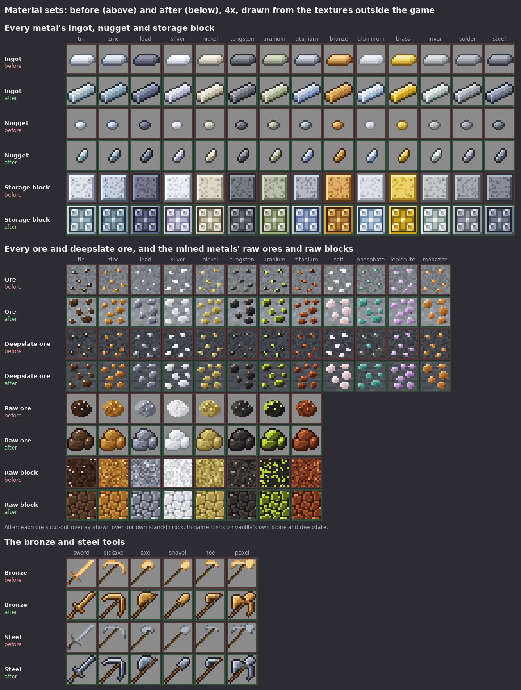

# Material sets: how an ore and everything made from it look

How a material's whole set is drawn: its ore, the raw ore, nugget, ingot and blocks, and the tools, armor and weapons made
from it. Follow it for every new ore that turns into gear, and when an existing material's set is redrawn.

On 5 October 2026 the owner drew a complete set for a new ore in one chartreuse palette. It covers the ore in stone and
deepslate, the raw chunk and raw block, nugget, ingot, a storage block, sword, pickaxe, axe, shovel and hoe, helmet,
chestplate, leggings and boots (each plain and gold-trimmed), daggers, a sabre, longswords, a spear, a hammer, a spiked
mace, a bow, a crossbow, an arrow and horse armor. They asked: "maybe we can use this for a basis on how new ores that
turn into tools are styled?". It is the same style as their weapon sheet, which the arms' 16×16 icons follow (PR #201).
This page is that basis. Jugcraft's existing metals and ores were redrawn on it first
([features/material-sets.md](features/material-sets.md)); thallite, the owner's chartreuse ore, is the first new ore
drawn on it ([features/thallite.md](features/thallite.md)).

The owner's pictures are references for the style. Every texture in the repository is drawn fresh by code, and nothing
is recoloured from Mojang's files ([CLAUDE.md](../CLAUDE.md)). Where a set takes vanilla's form (an ingot, a nugget), the
form is drawn fresh in our own symbols; vanilla's pixels are never copied, traced or sampled.

*Jugcraft's metals, ores and bronze and steel tools before (above) and after (below) their redraw in this style, drawn
from the textures outside the game at 4×. The new ores are shown over a stand-in rock: in game each sits on
vanilla's own stone or deepslate.*

## The look

A set looks as if vanilla had one more material:
- **Size:** 16×16, everything.
- **Shapes:** vanilla's forms. A pickaxe is a pickaxe, an ingot is vanilla's ingot and a nugget vanilla's nugget, so ours
  sit beside vanilla's in an inventory as one set.
- **Colour:** the whole set in **one clear hue**, told apart from vanilla's copper, iron and gold, stepped into four tones and
  an outline.
- **Outline:** a one-pixel outline in that colour's darkest tone.
- **Light:** from the top left, with a bright edge along the lit side of every blade, head and plate.
- **Handles:** a stick's two browns.
- **Sameness:** every item in the set shares the same tones, so the set reads as one material from across a chest.

## The palette

One hue, in up to four tones a material plus its outline (`D M L H` and `O`). The lightness (HSL) is what the owner's
approved bronze and steel measure; the luma ladder under The metals is the rule each ramp is solved to, as in
[ITEM_ICONS.md](https://github.com/jimbozoomer-byte/jugcraft/blob/claude/arms-icons-16/docs/ITEM_ICONS.md) (PR #201),
which wins where the two differ:

| Tone | Lightness | Use |
|---|---|---|
| Outline | about 14–15% | every edge against air or another material; never pure black |
| Dark | about 31–34% | shaded sides, the lower right of blades and plates, ore blobs' undersides |
| Mid | about 47–48% | most of every surface; the most saturated tone |
| Light | about 61–65% | lit faces, upper-left halves |
| Highlight | about 78–85%, nudged towards white or yellow | the lit edge of a blade, the top of an ingot, a glint on armor |

- **Saturation is highest in the mid tones** and eases off towards the highlight.
- **The hue must be told apart from vanilla's copper, iron and gold;** it need not be bold. The owner's steel is a
  low-saturation blue-grey.
- **Check the palette across the whole set,** not one item: the ingot, a sword and a chestplate side by side.

Other materials keep their own tones:
- **Handles:** a stick's two browns, with a dark brown outline.
- **Set stones:** a contrasting gem colour; the owner's chartreuse set uses emerald green.
- **The trimmed look:** gold and orange.

### The metals

The owner chose bronze's and steel's palettes (the "alternate versions" of their comparison). They set the ladder every
metal stands on, measured above: luma about **O 37, D 86, M 127, L 169, H 216**. Each other
metal is its old palette moved onto that ladder by one rule, with four numbers of its own (a hue, a saturation floor and
ceiling, and a luma offset):
- per tone, the old tone's hue (or the metal's own hue) and saturation; the saturation raised to the floor, × (1.0, 1.15,
  1.2, 1.05, 0.9), then held under the ceiling;
- the HLS lightness solved to hit the ladder's luma plus the metal's offset × (0.35, 0.8, 1.0, 1.0, 0.8), capped at 246.

The four numbers were chosen together, so that:
- **No two metals look alike:** every two ramps are at least **8** apart (`PAIR_FLOOR`: the mean CIEDE2000 of their
  dark, mid and light tones, an ingot's body), and so is every ramp from the mod's stand-ins for vanilla's iron, gold and
  copper (`COPPER_METAL`, `IRON_METAL` and `GOLD_METAL` in `tools/generate_textures.py`).
- **Each ingot keeps its own metal's tint:** the plates, gears and dusts are still drawn from the old palettes, so each
  ramp was kept as close in tint to them as the first rule allows.

Most of the fourteen are greys, so they are told apart mostly by lightness: lead and tungsten are darker than the
ladder, steel sits on it, zinc and solder a little above it, titanium and uranium higher, and tin, silver, nickel,
aluminum and invar palest.

| Metal | Character | Hue°, floor, ceiling, offset | O | D | M | L | H |
|---|---|---|---|---|---|---|---|
| tin | pale, faintly cyan white | 197, .16, .18, +40 | `2a363b` | `5f7e89` | `97adb7` | `c7d4d8` | `f4f6f7` |
| zinc | light blue-grey | 204, .16, none, +16 | `242c32` | `516776` | `7b95a7` | `a6becd` | `dae7f0` |
| lead | dark slate blue-grey | 225, .16, .18, −28 | `191b23` | `393f51` | `5a6381` | `838ca7` | `bcc1cd` |
| silver | the brightest: a cool, faintly violet white | 240, .12, .30, +56 | `373745` | `7f7f9e` | `b5b5cc` | `dedeed` | `f5f5f7` |
| nickel | bright warm cream | its old hues, .12, none, +60 | `3d3b30` | `8e866c` | `c1bdaa` | `e7e5d9` | `f8f7f0` |
| tungsten | dark neutral grey | 220, 0, .06, −28 | `1a1c1e` | `3d4045` | `5f646c` | `898d94` | `bfc1c6` |
| uranium | pale olive | 78, .16, .18, +36 | `303426` | `6e7a55` | `a0ab86` | `cbd0be` | `f4f5f1` |
| titanium | light periwinkle grey | its old hues, .24, .30, +36 | `2a3144` | `5e73a4` | `95a4c5` | `c5cddd` | `f3f5f7` |
| **thallite** | the owner's chartreuse sheet, its outline darkened (below) | | `303f12` | `4e611d` | `7c8a37` | `aab053` | `dbdd85` |
| aluminum | very pale blue-white | its old hues, .24, .30, +60 | `2e3d4b` | `6c8cab` | `afbdd3` | `dfe5ec` | `f5f6f9` |
| **bronze** | the owner's choice | | `3e2410` | `7e5222` | `b4803c` | `dcaa5c` | `f6d696` |
| brass | deep yellow, darker and more ochre than gold | 46, 0, none, +32 | `3c310c` | `8d7116` | `cca21a` | `eecb5a` | `faf2d5` |
| invar | pale sage white | 165, .08, .10, +60 | `343d3b` | `768d88` | `b3c0bd` | `e2e6e5` | `f5f7f6` |
| solder | plain mid grey | 228, .08, .08, +20 | `2a2c31` | `616572` | `8f93a0` | `babcc5` | `e7e7ea` |
| **steel** | the owner's choice | | `1e2129` | `4a5262` | `6e7889` | `98a2b4` | `d0d8e4` |

Every metal's ramp steps up in luma with D at least 30 above O, and no two metals are closer than 8, vanilla's iron, gold
and copper included (`tools/check_mod_data.py` checks both).

**Thallite** is not on the ladder: it is the owner's own chartreuse sheet, as drawn. Only its outline moved: the sheet's
`354514` is 25 luma under its dark tone, so it is darkened to `303f12`. That is the same hue and saturation,
CIEDE2000 2.0 away, and now 30 under. Its nearest metal is uranium, 15.9 away.

The same choice gave each a second material for fittings and trim (outline, dark, mid, light): **brass** on bronze,
`3e2a06 8c6814 c8a02a f2da6a`, and **gunmetal** on steel, `16181e 363a44 565c68 868e9c`. None of the tool, ingot,
nugget, block or ore maps has fittings, so no texture uses them yet; they wait for bronze's and steel's weapons and armor
in this style.

### The ores

An ore's overlay, raw ore and raw block use **the ore's own five tones**, from its mineral (cassiterite's brown-black,
galena's grey, rutile's red-brown and so on), not the metal's: `ORE_RAMPS` in `tools/material_icons.py`, as the owner
approved them. Thallite's are the sheet's sage, `4a5a2e 6e8048 98a86a c0cc8e e4ecb8`.

## Each item

| Item | How it is drawn |
|---|---|
| **Ore** (`<ore>_ore`, `deepslate_<ore>_ore`) | **Vanilla's own stone or deepslate with our overlay on top.** The block model references `minecraft:block/stone` (or `minecraft:block/deepslate`, with `deepslate_top` on top and bottom) by name, never copied, so the ore matches the rock around it exactly. The ore's texture is only the **overlay**: five to seven **chunky, rounded blobs** of the ore, each 3 to 5 pixels, cut out (fully clear or fully opaque, nothing between) and clear everywhere else. **Each blob:** a highlight on its lit top-left, light along its top and left, mid in the body, dark along its lower right. **No outline round blobs:** the rock is the outline (at most a single contact pixel of the darkest tone under a big lump). **Three layouts**, `ore_a`, `ore_b` and `ore_c`, taken in turn so neighbouring ores do not look alike; **the same layout** in stone and deepslate. **Clearly visible:** the blobs are bigger and bolder than the mod's older ores' specks. |
| **Raw ore** (`raw_<ore>`) | **One lumpy, rounded chunk** filling most of the slot, in the lighter tones, lit top-left, outlined. |
| **Raw block** | **Rounded lumps packed like cobblestone,** each lit top-left, with dark joints between them. |
| **Nugget** | **Vanilla's nugget form, drawn fresh:** a small shard on the diagonal in the middle of the slot (about 7 by 8 pixels with its outline), leaning to the upper right, lit along its upper-left edge with a dark lower right, outlined. |
| **Ingot** | **Vanilla's ingot form, drawn fresh:** one bar lying on the diagonal, rising from the lower left to the upper right, seen from above and in front. A light top face with the highlight along its back edge, a front face in mid and dark, small end faces, outlined. It fills the slot's width (columns 0 to 15, rows 3 to 14), with a squared near end. |
| **Storage block** | **A bevelled square:** a light frame, inside it a field divided by a cross into **four rounded inset panels** (a four-panel inlay), each lit top-left. The block a player stacks is the material's emblem, so it is the most decorated piece. |
| **Tools** (sword, pickaxe, axe, shovel, hoe, paxel) | **Vanilla's silhouettes on the diagonal,** the head in the material and the handle a two-tone stick. **The head:** a highlight along its lit edge, dark along the other, outlined. **No extra parts.** |
| **Armor icons** (helmet, chestplate, leggings, boots) | **Rounded vanilla shapes in the material,** lit along their upper parts. **A gem** (two tones of a contrasting colour) may sit at the knees or ankles, as the owner's leggings and boots carry emeralds. |
| **The trimmed look** | **An upgraded version of each armor piece:** the same piece with **gold or orange trim** on its corners and edges and a brighter highlight. What earns it is the material's design to decide (an upgrade, attunement, an enchantment). |
| **Horse armor** | **Vanilla's blanket shape in the material,** with one coloured band (the owner's is red). |
| **Weapons** | **The arms' 16×16 maps** (`tools/arms_icons/`, PR #201), coloured in the material: swords, daggers, sabres, spears, hammers, maces, bows and crossbows, as in the owner's sheet. |

The ingot and nugget forms are drawn from memory of vanilla's modern ingots and nuggets; no vanilla texture was read. The
client test (`MaterialSetsClientGameTests`) shows vanilla's iron, gold and copper ingots and nuggets beside ours, close up
and in the inventory, and that is where the form is judged.

## How a set is made

- **The maps:** each item kind is one hand-drawn 16×16 map of symbols in `tools/material_icons/` (`ingot`, `nugget`,
  `storage_block`, `raw`, `raw_block`, the tools, the ore overlays `ore_a`, `ore_b` and `ore_c`, and `host_stone` and
  `host_deepslate`, our own rock for previews and the fallback). `O D M L H` are the material's five tones, `w b B` the
  stick, `r s t u` the host rock, `.` clear. Lines starting with `#` are comments or directives (`# type: face` for a full
  block face, `# type: overlay` for an ore overlay).
- **The palette:** a material is a five-tone ramp that fills the map in: `METAL_RAMPS` and `ORE_RAMPS` in
  `tools/material_icons.py`, which also draws the textures and writes the ore models.
- **Regenerating:** `python3 tools/generate_textures.py` writes the PNGs and `python3 tools/generate_material_data.py` the
  ore models; `python3 tools/check_mod_data.py` fails if a committed PNG or model differs from its map.
- **What a new ore then needs:**
  - a palette, from a colour the owner approves;
  - one of the three ore layouts;
  - its design: where it is found, its tier, what its gear does.
- **The arms:** the arms' 16×16 icons are drawn the same way from their own maps (`tools/arms_icons.py`, PR #201).

When an existing material is redrawn in this style, it follows this page too.

## Checklist
- [ ] 16×16; vanilla's forms; drawn by code from maps, nothing recoloured from Mojang's files.
- [ ] One clear hue, told apart from vanilla's metals, in four tones and an outline, the same across the whole set.
- [ ] One-pixel outline in the darkest tone; light from the top left; a highlight on every lit edge.
- [ ] Ore: an overlay of chunky rounded blobs, cut out, on vanilla's own stone and deepslate, readable at a glance.
- [ ] Storage block decorated as the material's emblem; ingot and nugget in vanilla's form, drawn fresh; raw ore a lumpy chunk.
- [ ] Armor in a plain look, and a trimmed look in gold if the material has an upgrade.
- [ ] Every item checked beside the rest of the set and beside vanilla's at 1× and 2×, and in game beside vanilla's.
