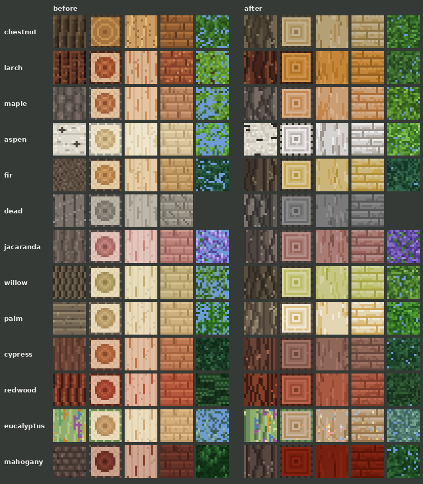

# Natural textures: fitting the vanilla world

How Jugcraft's woods, leaves and other natural textures are drawn so they sit in the vanilla world as if they belonged
there. Follow it for every new wood, tree, leaf, sapling, plant, stone, soil or ore texture.

On 5 October 2026 the owner repainted 24 stripped logs and asked for every wood to follow them and "look more similar to
how the vanilla textures are" ([features/wood-repaint.md](features/wood-repaint.md)). After seeing the result in game
they said: "All the wood looks so so good now ... take note of how you did that ... and then add that in as instructions
for how we want any additional wood or natural textures to look ingame". This page is that note. The code that does it
is `tools/wood_style.py`; read it beside this page.

## The look

The woods read as if they were drawn by the same hand as vanilla's oak, spruce and birch.
- **Size and scale:** 16×16 a face, nothing finer.
- **Tones:** each material is one colour stepped through a few tones.
- **Marks:** short marks that follow how the material grows or is cut. Bark furrows run up the trunk, stripped wood
  shows straight grain, planks are four boards, a log's end shows square rings, and leaves are a speckle of small
  clumps.
- **Contrast:** soft, about as much as vanilla's, never more.
- **What it avoids:** no outlines, no gradients, no photographic noise, and no bands across a trunk.
- **Identity:** each tree is told apart first by its colour, taken from the owner's paintings, and then by one trait of
  its own:
  - the aspen's dark marks;
  - the eucalyptus's rainbow streaks;
  - the cypress's and redwood's stringy bark.

Seen among vanilla trees, ours look like more of the same world, not a different game.

## The rules

### 1. Vanilla's size, vanilla's manner
- 16×16 for every block face, as vanilla's are. No 32 or 64 for natural blocks.
- Vanilla is the reference for *manner* only. Never copy, trace or recolour a Mojang texture. That rule stands even
  though recolouring vanilla's logs was suggested as a shortcut ([CLAUDE.md](../CLAUDE.md): no copied proprietary
  assets). Draw it fresh, by code, in the same manner.

### 2. One colour, stepped into tones
- Each material is **one base colour**, made into a ramp of six tones by lightness alone (`wood_style.ramp`).
  - The factors on the base's lightness are 0.58, 0.72, 0.86, 1.0, 1.12 and 1.24.
  - The shadows are a little more saturated (+8%) and the lights a little less (−4%), as paint is.
- **Most of a face uses the middle three tones.**
  - The darkest is only for furrows, seams and the pith.
  - The lightest is only for small highlights.
  - Nothing is pure black or pure white.
- **Bark has its own, darker ramp** (`BARK`), so a log and its planks belong together but are not the same.

### 3. Colours from the owner's paintings, kept within vanilla's range
- **Take a new wood's colour from the owner's paintings** (`WOOD`: which painting, and the colour sampled from its
  painted side). If there is no painting, ask for one, or pick a colour the owner approves.
- **Check it beside vanilla's woods:** oak, spruce, birch, jungle, acacia, dark oak, mangrove, cherry and pale oak. It
  should be no brighter, no more saturated and no more contrasting than they are. It should also differ from the
  nearest of them in hue, so the wood is worth having.

### 4. Marks follow the material
Texture comes from short marks that run the way the material does, never from random pixels everywhere.

| Texture | Marks |
|---|---|
| Bark (`<wood>_log`) | **Vertical.** Ridges are columns two or three pixels wide, each in one of the dark-to-mid tones. Three to seven furrows (the darkest tone, with a dark tone beside it) wander a pixel left or right along a sine as they climb. Five to nine light flecks sit on the ridges. |
| Log end (`<wood>_log_top`) | **Square rings** out to the edge, round a dark pith, inside a one-pixel rim of bark. From the rim inwards the bands' tones run: light, dark, light, mid, dark, light, then the pith. Up to nine ring pixels step in or out, so the rings are not ruled. |
| Stripped log (`stripped_<wood>_log`) | **Straight vertical grain**, a mid-tone field with about twelve broken streaks (3 to 9 pixels) in two darker tones, which sometimes jog a pixel halfway. Seven short light streaks. |
| Stripped end | The log end's rings inside a darker ring of the wood instead of bark. |
| Planks (`<wood>_planks`) | **Four boards** of four rows each. A lit top row, two mid rows with a few darker pixels, then a dark seam. Three short grain dashes a board, and one butt joint a board (a dark pixel with a light one beside it), each at least four pixels from the board above's. Stairs, slabs, fences and gates use the planks. |
| Leaves | A **speckle of one- and two-pixel clumps** in four tones, from a smoothed noise field (each pixel 55% its own value, 45% the mean of the pixels above and left of it). The tone follows the field (below .38, .55, .72, then the lightest). Clumps' tops are one tone lighter half the time, and about ten pixels take the highlight. |
| Bare branches | Four wandering twigs of about fourteen pixels in the bark's colours, with short side branches; the rest open. |

### 5. No bands across a trunk
**Bark never has horizontal rings, bands or plate breaks across it.** The owner said: "I don't want rings in the trees
make them similar to vanilla in terms of that". The only short horizontal marks allowed are a birch-like tree's dark
eyes (the aspen's), a few pixels long and scattered. Rings belong only on a log's end.

### 6. Leaves that read as foliage
- **Leaves are dense, with only a few small see-through gaps**: about 1 pixel in 20 (0 to 7% of the texture), from the
  field's lowest values. Needles and blossom are the densest, and fronds and broad leaves the most open.
- **The see-through pixels keep a dark colour at zero alpha.** With fast graphics they draw as dark, dense foliage, not
  pale holes.
- **Our leaves are coloured in their texture,** not tinted by the biome (they keep their look anywhere).
- **The same seed draws every seasonal look** (green, autumn colours, bare), so a tree changes colour through the year,
  not shape.
- **Each kind has its own trait:**
  - needles: short slanting strokes;
  - blossom: flower clumps over a little green showing at the edges;
  - fronds: long leaflets on a lit midrib;
  - fruit: a few clusters set on the leaves (the chestnut's burs and nuts).

### 7. Restraint
- **Keep contrast low.** Neighbouring tones are close.
- **Randomness is clustered or placed** in runs of 2 to 9 pixels. Leaves are the only per-pixel random texture, and
  even they come from a smoothed field.
- **One trait per species,** not several. A wood is its colour plus one thing.
- **Light comes from above, gently:** the top of a clump or board is lighter and a seam darker. Minecraft shades a
  block's faces itself, so no shadow is baked across a face.

### 8. Seamless and stable
- **Every mark wraps at the edges** (`% 16`), so blocks tile with no seam. Check a 3×3 tiling.
- **Every texture is drawn from a fixed seed,** so regenerating changes nothing unless the code changes.

## Other natural textures

The same rules carry over to other natural blocks and plants.

| Texture | How to draw it |
|---|---|
| Plants and saplings | A 16×16 cross sprite in the leaves' own tones, with a one- or two-pixel stem or trunk in the bark's. Flowers take two or three tones of their petal colour, with a lighter centre. |
| Stone and rock | Irregular blotches of two to four pixels in three tones of one colour, and an occasional darker crack two or three pixels long. Nothing ruled, no outlines. |
| Soil, sand and gravel | Fine, low-contrast clumps; sand finer and paler than soil; gravel in rounder, more contrasting pebbles. |
| Ores | The host rock as above, with three or four small clusters of the mineral in three tones, lit on their upper sides. |
| Water-side and swamp blocks | Muted, slightly greyed versions of the land colours, as vanilla's swamp and mangrove blocks are. |

## Adding a new wood or tree
The trees the biomes still need, with their proposed shapes and colours, are planned in
[branches/TREES.md](branches/TREES.md).

1. **Get its colour:** a painting from the owner, or an approved colour. The owner's second set of paintings waits in `OWNER_BANK` (`tools/wood_style.py`): seven woods with their bark, each under a suggested species ([features/wood-repaint.md](features/wood-repaint.md#the-owners-second-set)). Add it to `WOOD` with the painting's number and
   the sampled colour.
2. **Give it bark:** a darker ramp and a kind (`furrowed`, `plated`, `stringy`, `streaked`, `marked`) in `BARK`.
3. **Give it leaves:** a ramp and a kind (`leaves`, `needles`, `blossom`, `fronds`) in `LEAVES`, one entry for each
   seasonal look. If it goes bare in winter, add it to `BARE` too.
4. **Register the tree:**
   - its wood set and tree in `tools/agriculture.py` (`WOOD_SETS`, `TREES`);
   - its shape in `tools/trees.py`, using vanilla's trunk and foliage placers, so its silhouette fits too: straight,
     forking, bending, fancy, giant trunks; blob, spruce, acacia, cherry, random-spread crowns.
5. **Regenerate:** `python3 tools/generate_textures.py` and `python3 tools/generate_material_data.py`.
6. **Check:**
   - preview its textures at 1× and 8×, tiled, and as blocks beside vanilla's;
   - add the tree to `WoodClientGameTests` so CI grows it and shoots it in game, beside the others;
   - compare it with the owner's painting.

## Checklist
- [ ] 16×16, drawn by code from a fixed seed; nothing copied or recoloured from Mojang.
- [ ] One base colour a material, from the owner's paintings, stepped into a lightness ramp; within vanilla's range.
- [ ] Marks follow the material: vertical bark and grain, four boards, square end rings, clumped leaves.
- [ ] No rings or bands across bark; no outlines, gradients or scattered noise.
- [ ] Leaves dense, with a few small see-through gaps (about 1 pixel in 20), dark under them; seasonal looks share one layout.
- [ ] Tiles seamlessly; looks right beside vanilla blocks in game.
