# Jugcraft technology tree

How every implemented material, machine and part works and connects. **Implemented** means it is in the mod and compiles in CI; nothing here has been play-tested yet. Planned work is marked **planned** and links to its branch document.

## Branches

| Branch | Status | Scope |
| --- | --- | --- |
| **Materials** | Implemented | Ores, raw materials, ingots and alloys. See [base-materials.md](features/base-materials.md). |
| **Power** | Implemented | Generators, batteries and cables (JE energy). See [machines-and-power.md](features/machines-and-power.md). |
| **Mechanical processing** | Implemented | Physical transformation of materials: smelting, crushing, alloying, pressing, drawing, assembling. |
| **Fluids** | Implemented | Pipes, tanks and pumps that move and store water, lava and other mods' fluids; physical only, no reactions. See [Fluids](#fluids) below. |
| **Chemistry** | **In progress** | Reactions that change what a substance *is*: electrolysis, acids, fertilizer, refining. The dieselpunk oil line is being built first: see [branches/CHEMISTRY.md](branches/CHEMISTRY.md) and [petrochemistry.md](features/petrochemistry.md). |
| **Agriculture** | First slice implemented | Crops, seeds, food and hand farm tools; its own starting branch, needing no machines. Corn grows 3 blocks tall for fields and mazes. See [branches/AGRICULTURE.md](branches/AGRICULTURE.md). |

The mechanical branch changes the **shape or mix** of materials (crush, melt, alloy, press, draw, assemble). Anything that needs a chemical reaction belongs to the Chemistry branch, even when it currently has a temporary blast-furnace or arc-furnace stand-in.

## How it fits together

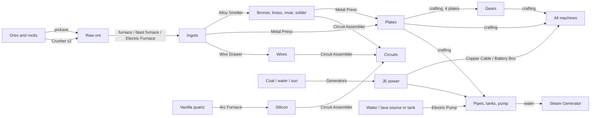

## Progression, step by step

1. **Mine and smelt** tin, zinc, lead and copper with a stone pickaxe and a vanilla furnace. Make **bronze** by hand: 3 copper + 1 tin, crafted into bronze blend, then smelted.
2. **Craft a Machine Casing** (bronze + zinc), **Copper Cable** (copper + tin) and a **Coal Generator**. This is the first power.
3. **Early machines:**
   - **Electric Furnace:** twice the vanilla furnace's speed.
   - **Crusher:** doubles ore.
   - **Battery Box:** stores power; needs lead.
4. **Alloy Smelter:** makes bronze without crafting, and unlocks brass, invar and solder.
5. **Metal Press** (bronze, piston, anvil) → **plates**; 4 plates → **gear**. **Wire Drawer** (brass, shears) → **wires**.
6. **Arc Furnace multiblock** (nickel casings) → **silicon** from quartz, plus aluminum, lithium carbonate and rare-earth oxide.
7. **Circuit Assembler** (built from tin plates and a bronze gear): silicon + copper wire + solder → **basic circuit**; 2 basic circuits + silver wire + an invar plate → **advanced circuit**.
8. **Better power:**
   - **Steam Generator:** an upgraded coal generator that also burns bitumen.
   - **Solar Panel:** needs silicon.
   - **Wind Turbine** (9 blocks tall with a 7-block rotor, aluminum plates): free power that grows with height.
   - **Geothermal Generator** (2×2×2, needs a basic circuit): runs on lava. An electric pump on lava feeds it through pipes.
9. **Fluids:** **Bronze Fluid Pipes** and the **Tinplate Tank** are crafted from press-made plates; the **Electric Pump** adds iron gears, a bucket and a casing. A pump on water, piped to a steam generator, keeps the boiler full without buckets.

## Machines

All machines hold their own internal battery and accept power from cables or directly from an adjacent generator or battery. Where power goes in is described in [Power connections](#power-connections). By default hoppers insert into input slots from the top and sides and extract results from the bottom; each face can be changed on the machine's screen (see [Item logistics](#item-logistics)).

| Machine | Branch | Does | Power | Built from |
| --- | --- | --- | --- | --- |
| Coal Generator | Power | Burns coal, charcoal (¾ as long), coal blocks or coke → 32 JE/t | produces | bronze, cable, furnace, casing |
| Steam Generator | Power | Boils water with coal or bitumen → 64 JE/t | produces | coal generator, bronze, bucket, cable, casing |
| Solar Panel | Power | Daylight under open sky → 8 JE/t (4 in rain) | produces | glass, silicon, bronze, cable |
| Battery Box | Power | Stores 400,000 JE; outputs from its front | stores | lead, cable, redstone block, casing |
| Electric Furnace | Mechanical | Any vanilla smelting recipe, 100 ticks | 10 JE/t | bronze, redstone, cable, furnace, casing |
| Crusher | Mechanical | Ore → 2 raw; minerals, sulfur, oil sand, cobble → gravel → sand | 16 JE/t | flint, cable, casing, bronze, redstone |
| Alloy Smelter (3 wide, 2 deep, 6 tall) | Mechanical | Two ingredients (any order) → bronze, brass, invar, solder. Power **only** through its copper socket | 20 JE/t | bronze, cable, 2 furnaces, casing, redstone |
| Metal Press | Mechanical | Ingot → plate (1:1) | 16 JE/t | bronze, piston, cable, casing, anvil |
| Wire Drawer | Mechanical | Ingot → 3 wires | 12 JE/t | brass, shears, cable, casing, redstone |
| Circuit Assembler | Mechanical | Up to three ingredient stacks (any order) → circuits | 32 JE/t | tin plates, bronze gear, cable, casing, redstone |
| Pulverizer | Mechanical | Ore → 2 dust + byproduct; washed ore, raw metal, ingot → dust ([Ore processing](#ore-processing)) | 20 JE/t | flint, iron gears, bronze plates, cable, casing |
| Ore Washer | Mechanical | Ore + 500 mB water → 3 washed ore | 16 JE/t | invar plates, bucket, bronze gears, basic circuit, casing |
| Sieve | Mechanical | Gravel → flint, soul sand → soul soil, with small finds | 8 JE/t | iron plates, iron bars, hopper, cable, casing |
| Sawmill | Mechanical | Log → 6 planks + sawdust; planks → 3 sticks | 12 JE/t | iron, iron gear, iron plates, cable, casing |
| Coke Oven (2×2, 2 tall, chimney on top) | Steel | Coal → coke, 600 ticks ([Steel tier](#steel-tier)) | none | bricks, iron, furnace |
| Steel Foundry (2×2, 5 tall) | Steel | Iron ingot + coke → steel ingot, 400 ticks | none | bricks, hopper, iron plates, blast furnace |
| Geothermal Generator (2×2×2) | Power | Lava → 64 JE/t (1 mB/t; a bucket lasts 1,000 ticks) | produces | invar plates, tinplate tank, bronze gears, casing, basic circuit |
| Wind Turbine (9 tall, 7-block rotor) | Power | 12–72 JE/t by height above sea level; ×1.5 in rain, ×2 in thunder; the rotor turns (drawn by the client) and needs a clear 7×7 square in front of the top | produces | aluminum plates, bronze gears, casing, bronze plates, cable |
| Arc Furnace (3×3×3 multiblock) | Mechanical (with chemistry stand-ins) | Quartz → 2 silicon; raw nickel, tungsten or uranium → ingot; bauxite, lepidolite and monazite stand-ins | 64 JE/t | 26 arc furnace casings (bricks + nickel) + controller |

## Machine looks: steampunk and classic

Machines are drawn in a **steampunk** style by default: brass, copper and riveted iron, with gauges, gears, valve wheels, glowing fireboxes and portholes. The look is purely visual. Blocks, recipes, footprints, screens and power connections are the same in both styles.

From the steel tier up, machines are **dieselpunk** instead: gunmetal and olive paint, hazard stripes, chrome, phosphor gauges and caged lamps (see [ART_DIRECTION.md](ART_DIRECTION.md)). The steel foundry, capacitor bank, steel tank, ore drill and high-pressure extractor already use it; the renders below predate that.

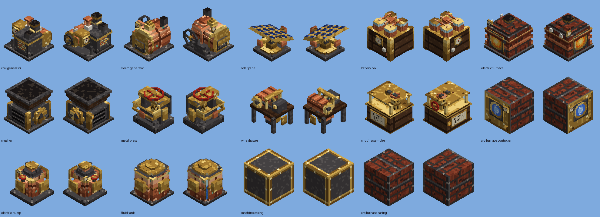

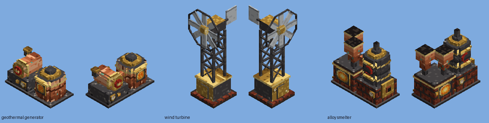

*Approximate renders of the generated models, not game screenshots. Machines that glow are shown running.*

**Switching back to the classic look**

- **In game, per player:** Options → Resource Packs → turn on **Jugcraft: Classic Machines**.
  - This pack is built into the mod and off by default.
  - Every machine goes back to its original model; turn the pack off to get steampunk back.
  - Nothing in the world or on the server changes.
- **For everyone, permanently:**
  - Set `DEFAULT_STYLE = "classic"` in `tools/model_writer.py` and run `python3 tools/generate_material_data.py`.
  - The mod then ships classic by default, and the built-in pack becomes **Jugcraft: Steampunk Machines**.
- **Remove steampunk entirely:** revert the pull request that added it (a single squash commit).

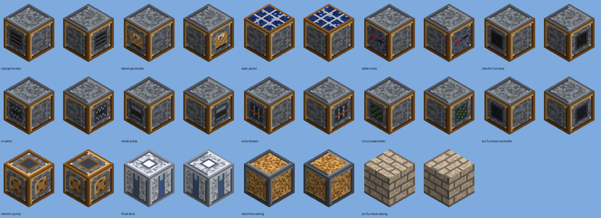

**How it is built**

- `tools/steampunk_models.py`: every steampunk model. The models are built from helpers for round boilers and drums, gears, valve wheels, gauges, lamps and pipes. One-block machines stay inside their block, and multi-block ones are sliced per block as described below.
- `tools/steampunk_textures.py`: the original steampunk textures (`sp_*`).
- `tools/model_writer.py`: writes either style. The classic style is the earlier output, byte for byte.
- `src/main/resources/resourcepacks/alternate_machines/`: the generated built-in pack.
- `tools/check_mod_data.py` checks three things:
  - both styles cover every machine and every block state;
  - everything the models reference exists;
  - no model leaves Minecraft's −16…32 range.
- **Glowing parts:** firebox doors, portholes and lamps switch to their lit texture while a machine runs.
- **Where cables and pipes meet the machine:** near the middle of each side, every steampunk machine has a terminal, flange or plate within about two pixels of the edge, so a connecting cable or pipe touches the machine. The solar collector's top is the exception, because it has to see the sky.
- **Neighbouring blocks:** because the models are not full cubes, machine blocks no longer hide the faces of the blocks next to them.

## Multi-block machines

Most machines stay **simple one-block machines**. The ones where size is part of what they are (towers, tanks, big engines) are **multi-block machines**: you place one item and it fills two or three blocks with one detailed model. This works like Immersive Engineering's pump and sample drill; no Immersive Engineering code or art is used.

| Alloy Smelter: furnace, crucible tower, hoppers; cable in its socket | Geothermal Generator: body plus a lava tank to its right | Wind Turbine: base, mast and rotor |
| --- | --- | --- |
| 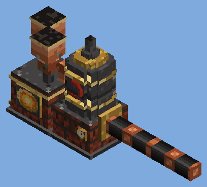 | 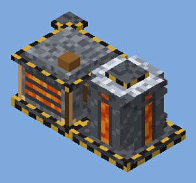 | 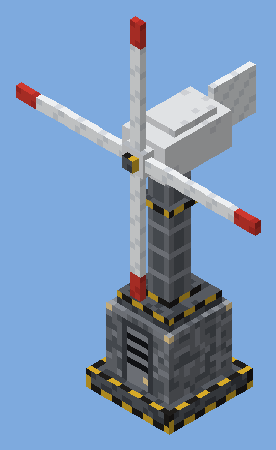 |

*Approximate renders made from the generated block models and textures, not game screenshots.*

**How they behave**

- **Placing:**
  - The item places only if every block of the machine is free (air, grass, water and so on) and inside the world.
  - The machine faces you, and its extra blocks turn with it.
- **Breaking:** breaking **any** part removes the whole machine and drops **one** item, so nothing is lost and nothing is duplicated. Pistons leave the parts alone (vanilla never pushes entity blocks; not yet checked in game).
- **Using:**
  - Every part acts as the machine. Right-click any part to open the screen.
  - Hoppers feed and empty it through any part: the top and sides fill the inputs, and the bottom takes the output.
  - Cables and pipes connect to any part, and comparators read the machine through any part.
  - Buckets fill its tank through any part.
- **Server cost:**
  - Only the main block (part 0) has a block entity and ticks. The other parts are plain blocks.
  - Energy and fluid lookups on a part go straight to the main block.
- **Look:** each part renders its own slice of one big model. Blades, stacks and fins may reach into the air beside the machine. The wind turbine needs that air clear to turn.

**How it is built** (to add another one)

1. Give the machine a `MachineKind` with a `footprint()`: the blocks it fills, written for a north-facing machine (`Footprint.tall(3)`, or offsets such as `new Vec3i(-1, 0, 0)` for "one block to the right").
2. Author its model in both styles, in structure coordinates with the main block at 0–16 on each axis: `tools/steampunk_models.py` for the default look and `tools/large_machines.py` for the classic one.
3. Run `python3 tools/generate_material_data.py`. It slices the model into one model per block and writes the blockstates for every facing and part, plus a scaled-down model for the inventory.
4. `tools/check_mod_data.py` checks that the Python and Java footprints match and that no model leaves Minecraft's −16…32 limit.

Code: `machine/Footprint.java` (offsets and rotation) and `machine/LargeMachineBlock.java` (placing, breaking, forwarding to the main block).

## Power connections

Every powered block follows one of two rules, and a cable shows which by where it connects:

| Rule | Machines | What you see |
| --- | --- | --- |
| **Any side** | Every one-block machine, generator and battery; the electric pump; the geothermal generator and wind turbine (any face of any of their blocks) | A cable next to any face bends to it and connects. A generator or battery placed directly against the machine also powers it. |
| **No power** | The Coke Oven and Steel Foundry | Cables never connect; the machines run on the heat of their charge. |
| **Power socket only** | The Alloy Smelter | Its **copper socket in a brass frame** (a yellow-and-black frame in the classic look), on the outer side of its lower right block (seen from the front). Cables connect only there; a cable along any other face doesn't bend toward it. |

The battery box and capacitor bank are "any side" for charging. It gives power out only through its front, and a cable at the front still connects.

In code, one check decides both the drawn connection and the flow: `MachineBlock.acceptsPower(state, side)`, built from `MachineKind.usesPower()` and `MachineKind.powerPort()` (null means any side). The energy lookup and the cable's connection arms both use it. `tools/large_machines.py` (`POWER_PORTS`) places the socket in the model, and `check_mod_data.py` keeps the two in sync.

## Cables and pipes

Cables, the Bronze Fluid Pipe and the Brass Item Pipe are *transmitters*, built like the ones in other tech mods (Mekanism, Thermal, IC2).

**Cable tiers.** Tiers connect to each other, and a network carries as much as its slowest cable:

| Cable | JE per tick | Built from |
| --- | --- | --- |
| Copper Cable | 256 | 2 copper + 1 tin → 6 |
| Silver Cable | 1,024 | 3 silver wire + 3 copper cable → 3 |
| Aluminum Cable | 4,096 | 2 aluminum wire + 1 steel plate + 3 silver cable → 3 |

There is no faster fluid pipe yet. A pump moves 100 mB/t, less than the bronze pipe's 250, so a faster pipe would change nothing until faster pumps exist.

**Transmitter design:**

- **Thin, not full blocks.** Each is a 4-pixel (¼-block) core. An arm reaches out toward each connected neighbor, and the hitbox follows the same shape. For comparison, Mekanism's cables and pipes are 6 pixels.
- **Connect automatically.**
  - A cable joins other cables and any block that stores or uses energy on the touching face.
  - A pipe joins other pipes and any block with a fluid storage on that face, including tanks, pumps, the steam generator, vanilla cauldrons and other mods' fluid blocks.
  - Cables and pipes never connect to each other, so they can run side by side.
- **Visual connection = real connection.** The arms use the same lookup (`EnergyStorage.SIDED` / `FluidStorage.SIDED`) as the transfer code, so if it looks connected it is connected.
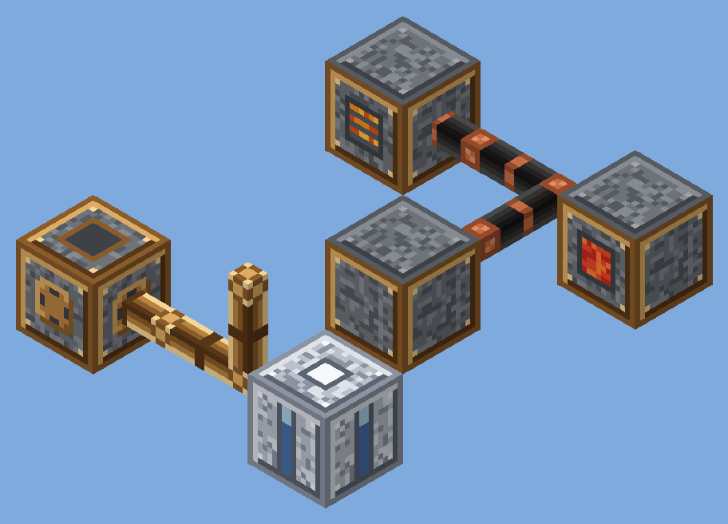

*Approximate isometric render made from the mod's own textures and model boxes, not a game screenshot.*

- **Look:**
  - The cable is black rubber insulation with copper connectors. The pipe is bronze, darker at its flanged ends.
  - In the inventory both show as a short 3D segment.

## Fluids

The fluid branch moves liquids around. It never changes what a liquid *is*: that is chemistry.

| Block | Does | Numbers | Built from |
| --- | --- | --- | --- |
| Bronze Fluid Pipe | Carries fluid pushed into it by a pump to every fluid storage it touches | 250 mB/t per push, up to 1,024 pipes per network | 2 bronze plates + glass → 4 |
| Tinplate Tank | Stores one fluid; fill or empty with buckets, right-click with an empty hand to read it, comparators show how full it is | 16,000 mB (16 buckets); contents are lost if broken | 8 tin plates + glass |
| Electric Pump | Pulls from below, pushes out of its top and four sides | 100 mB/t, 8 JE per tick it moves fluid, 4,000 JE battery, 4,000 mB buffer | bronze plates, bucket, 2 iron gears, casing, cable |

**How the pieces work together**

1. **The pump is the only thing that moves fluid.** Pipes and tanks are passive, like cables: nothing ticks in them.
2. **What the pump pulls from, directly below it:**
   - a tank, or any other mod's fluid storage;
   - a **water source block**, which is treated as a spring and not used up (the same rule as the steam generator);
   - a **lava source block**, which *is* used up: one bucket per second, and the block becomes air.
3. **Where it pushes:** out of its top and sides, straight into an adjacent fluid storage, or into a pipe network. The network splits the flow evenly across every storage it touches that has room, except the pump itself. Outside storages cannot push into a pump, so fluid only flows out of it.
4. **Who accepts fluid:**
   - tanks take any single fluid;
   - the **Steam Generator** takes water into its 8,000 mB boiler tank (from any side);
   - vanilla cauldrons and other mods' tanks work through Fabric's fluid API.
5. **Units.** Jugcraft numbers are millibuckets (1 bucket = 1,000 mB). Internally Fabric counts droplets (1 bucket = 81,000), so 1 mB = 81 droplets.

**Performance.** Pipe networks are found once by a bounded search and cached per dimension. They are rebuilt only after a pipe, tank, pump or machine is placed or removed, or a pipe's neighbor changes. A pump does two storage moves per tick at most, plus one per network endpoint.

## Storage

| Block | Holds | Details | Built from |
| --- | --- | --- | --- |
| Item Crate | 32 stacks of one item | Right-click with an item to put it in; with an empty hand to take a stack (sneak to just look). Pipes, extractors and hoppers use it; comparators read how full it is. Breaking it drops everything. | iron plates, planks |
| Capacitor Bank (2 wide, 2 tall) | 4,000,000 JE | Charges from any side; gives power out of the copper sockets on its front, 4,096 JE/t (a job for aluminum cable). Comparators read its charge. | steel plates, 4 battery boxes, advanced circuit |
| Steel Tank (2 wide, 2 deep) | 128 buckets of one fluid | Buckets, pumps and pipes fill and empty it from any face; right-click with an empty hand to read it. Comparators read how full it is. | 8 steel plates, tinplate tank |

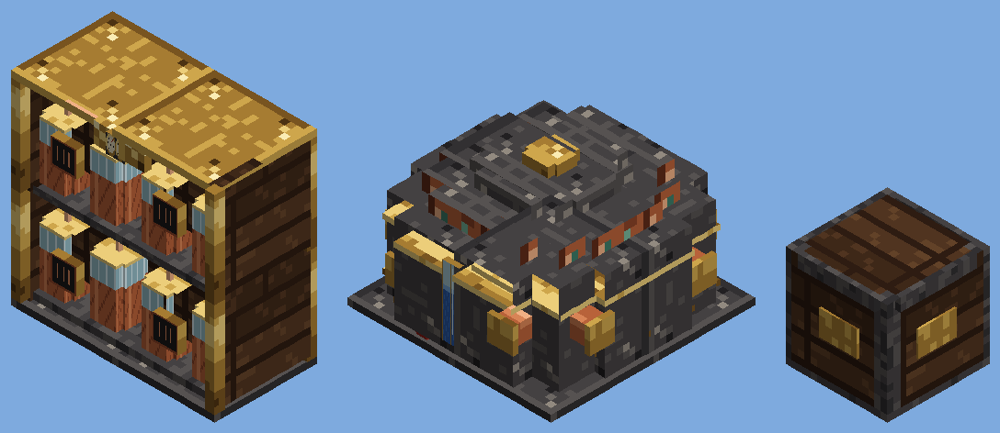

*Approximate isometric render made from the mod's own textures and model boxes, not a game screenshot.*

## Mining and prospecting

| Block or tool | What it does | Details | Built from |
| --- | --- | --- | --- |
| Geo-Resonance Prospector (hand tool) | Surveys the 3×3 chunks around you | Shows each ore family found as 1–5 bars with a rough depth (shallow Y ≥ 40, middle 0–39, deep below 0). Readings are deliberately vague: every second column is sampled, a quarter of readings are one bar off, and no positions are given. 3-second cooldown. | brass plates, copper wire, glass pane, basic circuit |
| Ore Drill (2 tall) | Mines the ores in a 9×9 column below it | One `c:ores` block every 40 ticks at 32 JE/t, from the layer under it down to the bottom of the world. Ores come out whole (like silk touch) into three result slots, and each hole is refilled with stone, deepslate or netherrack. It has upgrades, side configuration, eject, redstone modes and comparator output. It stops when full. | steel plates, steel gear, 2 basic circuits, machine casing, diamond pickaxe |

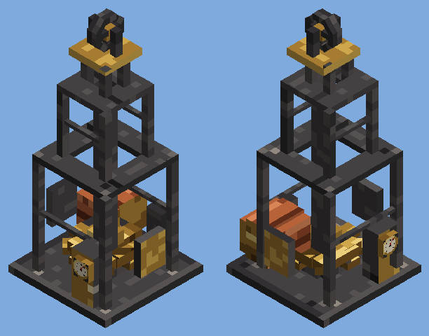

*Approximate isometric render made from the mod's own textures and model boxes, not a game screenshot. The prospector's screen appears in the CI client screenshots.*

**Code:** `prospecting/` (`OreSurvey`, `SurveyPayload`, `ProspectorItem`, `JugcraftProspecting`), `client/ProspectorScreen`, and `machine/OreDrilling` with `MachineKind.ORE_DRILL`.

## Automation

| Block | What it does | Details | Built from |
| --- | --- | --- | --- |
| Auto-Crafter | Crafts the recipe in its 3×3 grid, 40 ticks per craft, 8 JE/t | Each grid slot keeps one item as the pattern, so it crafts while every filled slot has two or more. Pipes and hoppers only top up slots that already hold that item. Remainders (empty buckets, bottles) go to the slot above the output. Any crafting-table recipe the server knows. Unstackable ingredients can't be automated yet. | brass plates, basic circuit, 2 crafting tables, casing, hopper |

**Code:** `MachineKind.AUTO_CRAFTER` and `MachineBlockEntity.tickCrafter` (vanilla `RecipeType.CRAFTING`). The grid layout is in `MachineMenu.inputX/inputY(kind, slot)`.

## Kinetic power

A second, mechanical power system measured in **KE** (kinetic energy) per tick. Shafts carry rotation along their length and gearboxes out of all six sides. Machines at the end of a line run straight off it (1 KE = 1 JE, no loss), and a dynamo bridges it into JE cables at 75%.

| Block | What it does | Details | Built from |
| --- | --- | --- | --- |
| Hand Crank | 16 KE/t into the block it faces | Each right-click turns it for 5 s (up to 20 s); costs a little food. | planks, iron shaft |
| Steam Engine | 64 KE/t out of its back | Burns generator fuel and 10 mB water per tick, only while something takes the power. Loaded by right-click, hoppers, pipes and pumps, or a water source below. | bronze, bucket, 2 pistons, furnace, iron shaft |
| Iron Shaft | Carries rotation along its axis | Placed like a log; shows turning while driven. | 2 iron ingots → 4 |
| Brass Gearbox | Passes rotation out of all six sides | Branches and turns lines; power is shared evenly. | brass plates, bronze gears, iron shaft |
| Dynamo | KE → JE at 75%, 128/t | Pushes JE into cables on every side. | copper, redstone, iron shaft |
| Belt Pulley | A shaft that can hold a belt | Carries rotation along its axis like a shaft, and to the pulley it is belted to. | planks, iron shaft |
| Leather Belt | Links two pulleys | Use on one pulley, then another: same axis, level along it, up to 16 blocks apart. Breaking a pulley drops the belt. | leather, string |
| Electric Motor | JE → KE at 75%, up to 96 KE/t | Takes JE from cables and drives the block it faces. | iron plates, copper wire, iron shaft, copper cable |

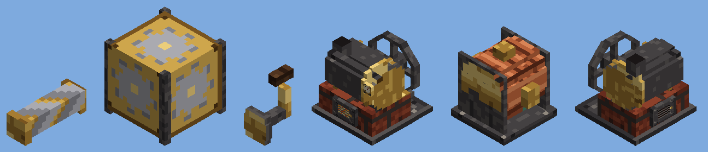

*Approximate isometric render made from the mod's own textures and model boxes, not a game screenshot.*

**Code:** `kinetic/` (`KineticNetworks`, `KineticConsumer`, `ShaftBlock`, `GearboxBlock`, `HandCrankBlock(Entity)`, `SteamEngineBlock(Entity)`, `DynamoBlock(Entity)`, `BeltPulleyBlock(Entity)`, `BeltItem`, `ElectricMotorBlock(Entity)`, `JugcraftKinetics`; client `BeltRenderer`). `MachineBlockEntity` implements `KineticConsumer`.

## Renewable resources

| Block | What it does | Details | Built from |
| --- | --- | --- | --- |
| Water Wheel (2 tall) | Power from flowing water | The wheel on its right side (seen from the front) turns in the column of blocks beside it: 8 JE/t per block of flowing water there, 12 if falling, up to 24 JE/t. Source water does not count. Cables connect to its house. | planks, sticks, bronze gear, copper cable |
| Cobblestone Generator | 1 cobblestone per 20 ticks, 4 JE/t | Needs water and lava touching any sides; neither is used up. | bronze, water bucket, lava bucket, cable, casing |
| Tree Farm | Sapling → 6 logs in 400 ticks, 16 JE/t | The sapling comes back (byproduct slot) with a 10% chance of the tree's extra (apple, cocoa beans, pink petals, pale moss carpet or a stick). Recipes are data (`jugcraft:tree_growing`) for all nine vanilla trees. | glass, glowstone, dirt, bronze, casing, basic circuit |

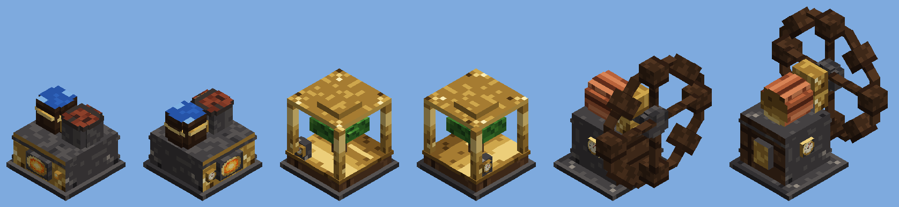

*Approximate isometric render made from the mod's own textures and model boxes, not a game screenshot.*

## Machine control

Every **powered processing machine** now has two **upgrade slots** (below the output) and a **redstone button** (the "R" above the face buttons). Comparators read every machine.

**Upgrades** are the first things made from steel. Each slot holds up to 4 cards, and at most 4 of each kind count.

| Upgrade | Per card | Four cards | Built from |
| --- | --- | --- | --- |
| Speed Upgrade | time ÷ (1 + 0.5 per card); energy per item +25% | 3× as fast, twice the energy per item | 4 steel plates, 2 redstone, 2 steel gears, basic circuit |
| Efficiency Upgrade | energy use −20% (compounding) | 41% of the energy | 4 steel plates, 4 copper wire, basic circuit |

- Speed and efficiency combine. Four of each gives 3× the speed at about 82% of the base energy per item.
- The highest draw (four speed cards) stays within each machine's input rate, so an upgraded machine never outruns its own cable intake.
- Upgrade slots are never offered to hoppers or pipes. Shift-click puts upgrades straight into them.

**Redstone mode** (click "R" to cycle):

- **Ignored** (gray): always runs.
- **High** (red): runs only while any block of the machine receives a redstone signal.
- **Low** (dark red): runs only without a signal.

A paused machine keeps its progress. The mode is saved with the side configuration.

**Comparators:**

- **Generators and the battery box:** stored energy (0 empty, 15 full).
- **Processing machines:** how full their input, output and byproduct slots are, like a chest.
- A comparator works against any block of a multi-block machine.

## Steel tier

Steel is the second material tier. It needs **no power** and no new ore, only iron, coal and two brick multi-blocks. Machines placed as one item fill several blocks and break together, like the other [multi-block machines](#multi-block-machines).

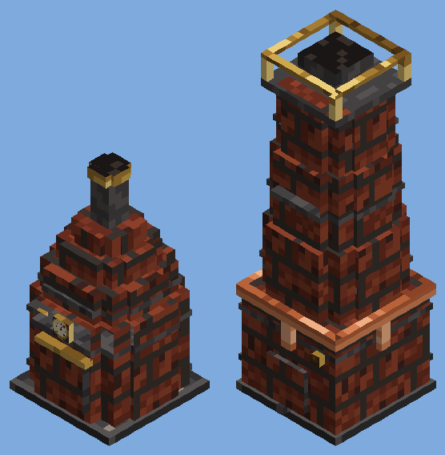

*Approximate isometric render made from the mod's own textures and model boxes, not a game screenshot.*

| Block | Does | Numbers | Built from |
| --- | --- | --- | --- |
| Coke Oven (2×2, 2 tall + chimney) | Bakes coal into **Coal Coke** | 600 ticks per coal; no power, no fuel | bricks, iron, furnace |
| Steel Foundry (2×2, 5 tall) | 1 iron ingot + 1 coke → 1 **steel ingot** (either slot) | 400 ticks; no power | bricks, hopper, iron plates, blast furnace |

- **Coal Coke** (`c:coal_coke`) burns twice as long as coal in the Coal and Steam Generators (3,200 ticks). It is the carbon for steel.
- **Steel** has the usual ingot, nugget and block, plus a **steel plate** (Metal Press) and a **steel gear**. The first things built from steel are the [machine upgrades](#machine-control).
- **Metal accounting:** one iron ingot's metal becomes one steel ingot's. The coke is carbon, not metal, so nothing is gained.
- **Unpowered machines** have no battery, and cables never connect to them. Their screens show no energy bar.
- Both work with hoppers, pipes, side configuration and eject like any processing machine.

## Powered tools

The first dieselpunk gear (see [ART_DIRECTION.md](ART_DIRECTION.md)). The tools hold JE instead of wearing out, and are charged at a charging station fed by cables.

| Item / block | What it does | Details | Built from |
| --- | --- | --- | --- |
| Mining Drill | JE pickaxe and shovel, faster than netherite, diamond-tier drops | 100,000 JE, 60 JE a block. Sneak + use cycles one block / 3×3 / whole ore vein (32) | tungsten plate, 3 steel plates, steel gear, advanced circuit, lead ingot |
| Chainsaw | JE axe that also cuts leaves; fells whole trees | 100,000 JE, 40 JE a block; sneak to cut one log | 3 tungsten plates, 3 steel plates, steel gear, advanced circuit, lead ingot |
| Rocket Pack | Chest slot: hold jump in the air to fly | 200,000 JE, 50 JE a tick; no fall damage while firing; dedicated servers need `allow-flight=true` | 2 steel plates, advanced circuit, 2 fluid tanks, leather, 2 tungsten plates |
| Charging Station | Two blocks tall; charges the tool on its cradle from cables | 50,000 JE buffer, 1,024 JE/t in, 512 JE/t into the tool; lamp lights while charging | 4 steel plates, redstone lamp, 2 copper cables, advanced circuit, battery box |

Empty tools mine like a bare hand and get no drops.

**Upgrade modules** fit at the charging station (use one on a station holding the tool): Overclock (+50% speed, +100% JE a block; up to 2), Range (drill area mode 5×5), Capacity (base charge again; up to 2), Silk Touch (drill, chainsaw), Fortune (drill, up to III; not with Silk Touch). See [powered tools](features/powered-tools.md).

**Code:** `tools/` (`JugcraftTools`, `Chargeable`, `PoweredToolItem`, `MiningDrillItem`, `ChainsawItem`, `RocketPackItem`, `RocketThrustPayload`, `ChargingStationBlock(Entity)`); client `ChargingStationRenderer`, `RocketPackClient`.

## Oil

The first part of the Chemistry branch: the dieselpunk oil line ([plan](branches/CHEMISTRY.md#petrochemistry-the-dieselpunk-oil-line), [feature record](features/petrochemistry.md)). Refining, fracking and diesel power are still to come.

| Thing | What it does | Details | Built from |
| --- | --- | --- | --- |
| Crude Oil | A thick black fluid with a bucket; flows slowly and never makes new sources | `c:crude_oil` | reservoirs, oil sand |
| Oil reservoirs | Hidden under Overworld chunks, fixed by the seed: conventional (about 1 chunk in 12, 50–250 buckets) or shale (about 1 in 4 of the rest, 200–800 buckets, fracking only) | finite; the prospector reports Oil and Shale oil | – |
| Pumpjack | 1 wide, 3 tall, 3 long; pumps the conventional reservoir under its wellhead | 2 mB/t at 32 JE/t, 16-bucket tank, pushes into pipes | 4 steel plates, 2 steel gears, electric pump, casing |
| Oil Sand Extractor | 2×2×2 hot-water extraction | oil sand + 250 mB water → 500 mB crude oil + sand (160 ticks); bitumen + 100 mB water → 150 mB (80 ticks); 32 JE/t | 4 steel plates, hopper, 2 tinplate tanks, casing, steel gear |

**Fluid processing machines** (the pumpjack and extractor are the first): input tanks take only fluids the machine's recipes use; output tanks push into neighbouring tanks and pipes; the screen shows a gauge per tank. Recipes are data in `data/jugcraft/recipe/<type>/` (see [petrochemistry.md](features/petrochemistry.md)).

## Ore processing

Ore processing gives more metal per ore and turns everyday blocks into useful things, without chemistry. There are three routes for an ore, each needing more machines:

| Route | Machines | Ingots per ore | Extras |
| --- | --- | --- | --- |
| Smelt it | furnace | 1 | — |
| Crush or pulverize | Crusher → furnace, or Pulverizer → furnace | 2 | the Pulverizer rolls a byproduct |
| Wash, then pulverize | Ore Washer (water) → Pulverizer → furnace | 3 | a byproduct roll for each washed ore |

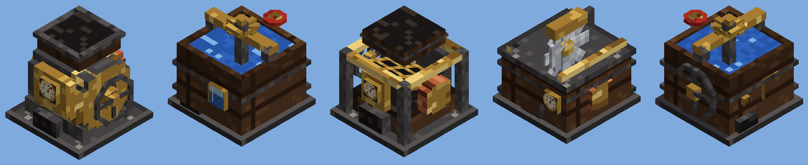

*Approximate isometric render made from the mod's own textures and model boxes, not a game screenshot.*

| Machine | Does | Numbers | Built from |
| --- | --- | --- | --- |
| Pulverizer | Ore → 2 dust (+ byproduct); washed ore, raw metal or an ingot → 1 dust | 20 JE/t; ore takes 200 ticks, the rest 100 | flint, 2 iron gears, 2 bronze plates, cables, casing |
| Ore Washer | Ore + 500 mB water → 3 washed ore | 16 JE/t, 200 ticks; 8,000 mB tank, filled by pipes, buckets or a water source block below (a spring, 20 mB/t) | invar plates, bucket, bronze gears, basic circuit, casing |
| Sieve | Gravel → flint (12% iron nugget, 8% tin nugget); soul sand → soul soil (15% quartz, 8% gold nugget) | 8 JE/t, 100 ticks | iron plates, iron bars, hopper, cables, casing |
| Sawmill | Log → 6 planks (bamboo block → 3), 50% sawdust; planks → 3 sticks | 12 JE/t, 100 ticks (sticks 60) | iron ingots, iron gear, iron plates, cables, casing |

**Dusts** exist for copper, iron, gold, tin, zinc, lead, silver, nickel, tungsten and uranium, tagged `c:dusts/<metal>`. A dust smelts into one ingot wherever that metal's raw ore can be smelted. Nickel, tungsten and uranium dust melt in the Arc Furnace instead, like their raw ores. **Washed ores** (`washed_<metal>_ore`) are an intermediate: grind them, don't smelt them. Four **sawdust** make a sheet of paper.

**Byproducts** (pulverizing ore or washed ore): copper → gold, iron → nickel, gold → silver, tin → tungsten (5%), zinc → lead, lead → silver, silver → lead, nickel → iron, tungsten → tin, uranium → lead, each 10% unless marked. The pairs follow ores that really occur together. A byproduct from a disabled feature switch is never made.

**Byproduct slots.** The Pulverizer, Sieve and Sawmill have two byproduct slots above the output. A machine waits rather than lose a byproduct: it only finishes an operation when every byproduct it might roll has room. Hoppers, pipes and *Eject* take from the byproduct slots as well as the output.

**Balance rules** (enforced by `tools/check_mod_data.py`):

- Only ore blocks get a bonus: ×2 for crushing or pulverizing, ×3 for washing.
- Byproducts may add at most 25% of the input's metal on average.
- The Sieve's renewable finds (no metal in) average under one nugget per operation.

**Recipe data.** A machine recipe may list byproducts:

```json
{"type": "jugcraft:pulverizing", "ingredient": "jugcraft:tin_ore", "result": {"id": "jugcraft:tin_dust", "count": 2}, "time": 200,
 "byproducts": [{"result": {"id": "jugcraft:tungsten_dust", "count": 1}, "chance": 0.05, "feature": "tungsten"}]}
```

## Item logistics

Item logistics moves finished goods around without hoppers everywhere. Like power and fluids, the pipes are passive; only *pushers* move items.

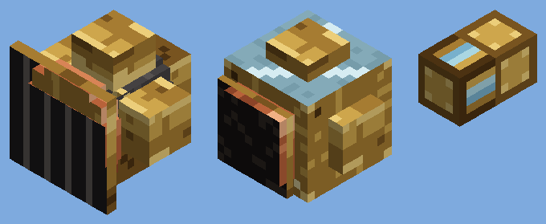

*Approximate isometric render made from the mod's own textures and model boxes, not a game screenshot.*

| Block / item | Does | Numbers | Built from |
| --- | --- | --- | --- |
| Brass Item Pipe | Joins pushers to every inventory it touches (chests, machines, other mods' storage) | 6-pixel core, up to 1,024 pipes per network; items arrive instantly | 2 brass plates + glass → 6 |
| Pneumatic Extractor | Pulls from the inventory it faces and pushes out of its other five sides into pipes or inventories; a redstone signal pauses it | 16 items every 8 ticks | 4 brass plates, hopper, item pipe |
| High-Pressure Extractor | The same, four times as fast (steel tier) | 32 items every 4 ticks | 4 steel plates, piston, pneumatic extractor |
| Item Sorter | Accepts items from pipes on any side but its front, and passes only items that match its 9-slot filter into the inventory it faces | An empty filter matches nothing | 5 brass plates, comparator, hopper, 2 item pipes |
| Conveyor | Carries items the way it faces while rotation drives it; loaded by pipes, hoppers, machines or dropped items; unloads into the conveyor or inventory ahead, or onto the ground | 2.5 blocks/s, 4 stacks per conveyor; 1 KE per conveyor per tick for the whole joined run (up to 64) | 3 leather belts, 2 iron plates, iron shaft → 6 |
| Conveyor Slope | Carries items one block up or down; use with an empty hand to switch | As the conveyor | 2 conveyors, iron plate → 2 |
| Conveyor Splitter | A conveyor that sends items left, straight on and right in turn | As the conveyor | conveyor, 2 bronze gears, brass plate |
| Brass Wrench | Right-click turns a machine, extractor or sorter; sneak + right-click dismantles a Jugcraft block, dropping it and its contents | Multi-block machines cannot be turned | 4 brass ingots |

**Routing.** A network offers each item first to a sorter whose filter matches it, then to the other inventories in turn (round-robin), so one chest does not fill before the rest. The inventory the items came from never receives them back. If nothing accepts an item, it stays where it was.

**Side configuration.** Every processing machine's screen has six face buttons (F, B, L, R, T, D: front, back, left, right, top, bottom, with left and right as seen from the front). Each click cycles the face between:

- **In** — hoppers and pipes may insert ingredients;
- **Out** — hoppers and pipes may extract results;
- **Both**;
- **Off**.

The defaults keep the old behavior: ingredients in from the top and sides, results out of the bottom. The configuration is saved with the machine and is relative to its front, so turning a machine with the wrench turns its sides too.

**Eject.** The *Eject* button makes the machine push its results itself, 16 items every 8 ticks, out of every face set to Out or Both, into adjacent inventories or pipes. Multi-block machines eject from every block they occupy.

**Conveyors.** Items ride the belt as whole stacks, drawn by the client. A conveyor feeding another from the side puts items onto its middle. A running conveyor carries players and mobs too; sneak to stand still. See [conveyors](features/conveyors.md).

**Code:** `logistics/` (`ItemNetworks`, `ItemPipeBlock`, `PneumaticExtractorBlock`, `ItemSorterBlock(Entity)`, `ConveyorBlock(Entity)`, `BrassWrenchItem`, `JugcraftLogistics`; client `ConveyorRenderer`) and `machine/SideConfig.java`. Items move through Fabric's `ItemStorage.SIDED` lookup, so other mods' inventories take part automatically.

## Components

| Component | Made by | Metals | Used for |
| --- | --- | --- | --- |
| Plate | Metal Press, 1 ingot → 1 plate | copper, iron, tin, bronze, brass, invar, aluminum, nickel, lead, tungsten | Gears; the Circuit Assembler (tin plates); advanced circuits (invar); pipes (bronze) and tanks (tin); future casings and rocket hulls |
| Gear | Crafting, 4 plates of one metal | iron, bronze, brass, invar | The Circuit Assembler (bronze gear); the Electric Pump (iron); future mechanical machines |
| Wire | Wire Drawer, 1 ingot → 3 wires | copper, silver, aluminum | Circuits (copper for basic, silver for advanced); future cable tiers |
| Basic Circuit | Circuit Assembler | silicon, copper wire, solder | Future higher-tier machines and upgrades |
| Advanced Circuit | Circuit Assembler | basic circuits, silver wire, invar plate | Future high-tier machines, rocketry |

Every part carries `c:` convention tags (`c:plates/bronze`, `c:gears/iron`, `c:wires/copper` and so on), so other mods' parts can be used, and Jugcraft parts work in their recipes.

## Machine recipes are data

Every machine recipe is an ordinary Minecraft recipe file. A data pack can add, replace or remove recipes without code, and `/reload` applies the change.

| Machine | Recipe type | Folder |
| --- | --- | --- |
| Crusher | `jugcraft:crushing` | `data/<namespace>/recipe/crushing/` |
| Arc Furnace | `jugcraft:arc_smelting` | `…/arc_smelting/` |
| Metal Press | `jugcraft:pressing` | `…/pressing/` |
| Wire Drawer | `jugcraft:wire_drawing` | `…/wire_drawing/` |
| Alloy Smelter | `jugcraft:alloying` (several inputs) | `…/alloying/` |
| Circuit Assembler | `jugcraft:circuit_assembly` (several inputs) | `…/circuit_assembly/` |
| Pulverizer | `jugcraft:pulverizing` (byproducts) | `…/pulverizing/` |
| Ore Washer | `jugcraft:ore_washing` (uses 500 mB water) | `…/ore_washing/` |
| Sieve | `jugcraft:sifting` (byproducts) | `…/sifting/` |
| Sawmill | `jugcraft:sawing` (byproducts) | `…/sawing/` |
| Coke Oven | `jugcraft:coking` | `…/coking/` |
| Steel Foundry | `jugcraft:steelmaking` (several inputs) | `…/steelmaking/` |
| Electric Furnace | vanilla `minecraft:smelting` | (vanilla furnace recipes) |

```json
{"type": "jugcraft:crushing", "ingredient": "#c:ores/tin", "result": {"id": "jugcraft:raw_tin", "count": 2}, "time": 160}
{"type": "jugcraft:alloying",
 "ingredients": [{"ingredient": "minecraft:copper_ingot", "count": 3}, {"ingredient": "jugcraft:tin_ingot", "count": 1}],
 "result": {"id": "jugcraft:bronze_ingot", "count": 4}, "time": 200}
```

- `ingredient` accepts an item, a list or a `#tag`.
- `time` is in ticks.
- Multi-input ingredients can sit in any input slot, and every unused slot must be empty.
- Jugcraft's own recipes are generated from `tools/machines.py`, where the metal audit runs. Edit them there, not in the JSON.
- Code: `machine/MachineRecipe.java` and `MultiMachineRecipe.java` (formats), `MachineRecipeTypes.java` (registration), `MachineRecipes.java` (lookup).
- **Recipe viewers:** recipe viewers (EMI, JEI, REI) show a new recipe type only through a small plugin. No viewer build for Minecraft 26.3 has been confirmed yet, so that plugin is a follow-up.

## Engineer's Handbook

An in-game guide: craft a **book + a copper ingot** and right-click it.

- Chapters are on the left: Getting Started, Materials, Power, Processing, Ore Processing, Steel, Fluids, Logistics and Upgrades.
- Each page shows the block's icon, what it does, its power use, its crafting grid and example recipes (with byproduct chances).
- Hover over any item for its name.

The content (`assets/jugcraft/handbook/en_us.json`) is **generated by `tools/handbook.py`** from the same tables as the mod, so numbers and recipes can't drift from the game. Only the prose is written by hand. `check_mod_data.py` verifies every item the book shows. The book is English-only for now.

## Automated game tests

`src/gametest/` holds in-game tests that `./gradlew build` runs on a headless server (Fabric game test API), so CI checks them on every pull request. They cover:

- crushing recipes loading from data;
- the crusher doubling ore;
- a coal generator powering an electric furnace through cables;
- a pump filling a tank through pipes;
- the 3×2×6 alloy smelter placing all 36 blocks, taking power only at its socket, and making bronze;
- a multi-block machine disappearing whole when one block breaks;
- an extractor moving items through pipes into a chest;
- a sorter routing matching items to its inventory and the rest elsewhere;
- a machine ejecting its results into a chest below;
- recipe byproducts loading from data;
- the pulverizer grinding ore into two dusts, and a dust smelting into an ingot;
- the ore washer tripling ore with water from a source below, and waiting when it has none;
- the sawmill and the sieve;
- the coke oven and steel foundry working without power;
- cables connecting only where power goes in (never to unpowered machines; only to the alloy smelter's socket);
- speed and efficiency upgrades, the "high" redstone mode, comparator output and upgrade-slot isolation;
- cable tiers setting a network's rate, and the high-pressure extractor.

**Client game tests** (`JugcraftClientGameTests`) start a real game client with software rendering in CI (job `client`). They:

- build a showroom of every machine;
- open a machine screen and the handbook;
- save screenshots, kept as the `client-screenshots` artifact of each CI run.

These are real game renders, but they are not play-testing: nobody is steering the game.

To add a test, write a public method annotated `@GameTest` in `JugcraftGameTests` that builds its setup and ends with `helper.succeed()` or `helper.succeedWhen(...)`.

## Rules that keep it balanced

Full numbers, conversion losses and the loops that were checked: [BALANCE.md](BALANCE.md).

- **No free metal.** Every recipe keeps or loses metal: plates 1:1, 4 plates → 1 gear, 1 ingot → 3 wires, and alloys at exact ratios. The only gain is the crusher's ore doubling, defined once for all ores. `tools/check_mod_data.py` audits every recipe, including two- and three-input machine recipes.
- **Nothing is hand-only or machine-only without reason.** Bronze has a hand route; plates, wires and circuits need their machines, because processing is what those machines are for.
- **Stand-ins are temporary.** Blast-furnace and arc-furnace recipes that really need chemistry are listed in [branches/CHEMISTRY.md](branches/CHEMISTRY.md) and will move there without changing item IDs.

## Where to change things

| To change | Edit | Then run |
| --- | --- | --- |
| Materials, parts, tags, worldgen | `tools/materials.py` | `python3 tools/generate_material_data.py` |
| Machines, machine recipes, crafting | `tools/machines.py` (plus the matching Java: `MachineKind`, `JugcraftComponents`) | `python3 tools/generate_material_data.py` |
| Machine looks | `tools/steampunk_models.py` and `tools/steampunk_textures.py` (steampunk), `tools/large_machines.py` (classic multi-block models), `DEFAULT_STYLE` in `tools/model_writer.py` | `python3 tools/generate_textures.py`, then `python3 tools/generate_material_data.py` |
| Fluid blocks and their numbers | `tools/machines.py` (`PIPES`, `FLUID_BLOCKS`, `FLUID_STATS`) plus the constants in `fluid/FluidPipeBlock`, `FluidTankBlockEntity` and `ElectricPumpBlockEntity` | `python3 tools/generate_material_data.py` |
| Ore processing | `tools/machines.py` (`_pulverizer`, `_ore_washer`, `SIEVE`, `_sawmill`, `BYPRODUCTS`), `COMPONENTS["dust"]` and `WASHED_ORES` in `tools/materials.py`, plus `MachineKind` | `python3 tools/generate_material_data.py` |
| Item logistics | `tools/machines.py` (`ITEM_PIPES`, `LOGISTICS_BLOCKS`, `TOOLS`), `tools/logistics_models.py`, plus the constants in `logistics/` | `python3 tools/generate_material_data.py` |
| Textures | `tools/generate_textures.py` | `python3 tools/generate_textures.py` |
| Crops, seeds, foods, sickles, wild plants (Agriculture) | `tools/agriculture.py` (plus the matching Java in `agriculture/`) | `python3 tools/generate_material_data.py` |
| Crop and farm-item textures | `tools/crop_textures.py` (previews: `tools/render_agriculture.py`) | `python3 tools/generate_textures.py` |
| Verify | — | `python3 tools/check_mod_data.py` and `./gradlew build` |
