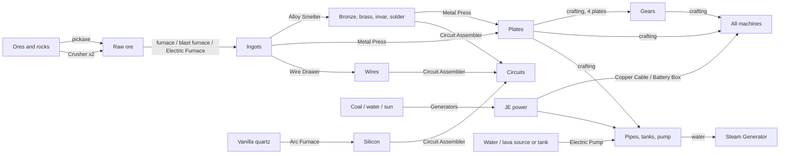

# Jugcraft technology tree

How every implemented material, machine and part works and connects. **Implemented** means it is in the mod and compiles in CI; nothing here has been play-tested yet. Planned work is marked **planned** and links to its branch document.

## Branches

| Branch | Status | Scope |
| --- | --- | --- |
| **Materials** | Implemented | Ores, raw materials, ingots and alloys. See [base-materials.md](features/base-materials.md). |
| **Power** | Implemented | Generators, batteries and cables (JE energy). See [machines-and-power.md](features/machines-and-power.md). |
| **Mechanical processing** | Implemented | Physical transformation of materials: smelting, crushing, alloying, pressing, drawing, assembling. |
| **Fluids** | Implemented | Pipes, tanks and pumps that move and store water, lava and other mods' fluids; physical only, no reactions. See [Fluids](#fluids) below. |
| **Chemistry** | **Planned** | Reactions that change what a substance *is*: electrolysis, acids, fertilizer, refining. See [branches/CHEMISTRY.md](branches/CHEMISTRY.md). |

The mechanical branch changes the **shape or mix** of materials (crush, melt, alloy, press, draw, assemble). Anything that needs a chemical reaction belongs to the Chemistry branch, even when it currently has a temporary blast-furnace or arc-furnace stand-in.

## How it fits together

## Progression, step by step

1. **Mine and smelt** tin, zinc, lead and copper with a stone pickaxe and a vanilla furnace. Make **bronze** by hand: 3 copper + 1 tin, crafted into bronze blend, then smelted.
2. **Craft a Machine Casing** (bronze + zinc), **Copper Cable** (copper + tin) and a **Coal Generator**. This is the first power.
3. **Early machines:**
   - **Electric Furnace:** twice the vanilla furnace's speed.
   - **Crusher:** doubles ore.
   - **Battery Box:** stores power; needs lead.
4. **Alloy Smelter:** makes bronze without crafting, and unlocks brass, invar and solder.
5. **Metal Press** (bronze, piston, anvil) → **plates**; 4 plates → **gear**. **Wire Drawer** (brass, shears) → **wires**.
6. **Arc Furnace multiblock** (nickel casings) → **silicon** from quartz, plus aluminum, lithium carbonate and rare-earth oxide.
7. **Circuit Assembler** (built from tin plates and a bronze gear): silicon + copper wire + solder → **basic circuit**; 2 basic circuits + silver wire + an invar plate → **advanced circuit**.
8. **Better power:**
   - **Steam Generator:** an upgraded coal generator that also burns bitumen.
   - **Solar Panel:** needs silicon.
9. **Fluids:** **Bronze Fluid Pipes** and the **Tinplate Tank** are crafted from press-made plates; the **Electric Pump** adds iron gears, a bucket and a casing. A pump on water, piped to a steam generator, keeps the boiler full without buckets.

## Machines

All machines hold their own internal battery and accept power from cables or directly from an adjacent generator or battery. Hoppers insert into input slots from the top and sides and extract results from the bottom.

| Machine | Branch | Does | Power | Built from |
| --- | --- | --- | --- | --- |
| Coal Generator | Power | Burns coal, charcoal or coal blocks → 32 JE/t | produces | bronze, cable, furnace, casing |
| Steam Generator | Power | Boils water with coal or bitumen → 64 JE/t | produces | coal generator, bronze, bucket, cable, casing |
| Solar Panel | Power | Daylight under open sky → 8 JE/t (4 in rain) | produces | glass, silicon, bronze, cable |
| Battery Box | Power | Stores 400,000 JE; outputs from its front | stores | lead, cable, redstone block, casing |
| Electric Furnace | Mechanical | Any vanilla smelting recipe, 100 ticks | 10 JE/t | bronze, redstone, cable, furnace, casing |
| Crusher | Mechanical | Ore → 2 raw; minerals, sulfur, oil sand, cobble → gravel → sand | 16 JE/t | flint, cable, casing, bronze, redstone |
| Alloy Smelter | Mechanical | Two ingredients (any order) → bronze, brass, invar, solder | 20 JE/t | bronze, cable, 2 furnaces, casing, redstone |
| Metal Press | Mechanical | Ingot → plate (1:1) | 16 JE/t | bronze, piston, cable, casing, anvil |
| Wire Drawer | Mechanical | Ingot → 3 wires | 12 JE/t | brass, shears, cable, casing, redstone |
| Circuit Assembler | Mechanical | Up to three ingredient stacks (any order) → circuits | 32 JE/t | tin plates, bronze gear, cable, casing, redstone |
| Arc Furnace (3×3×3 multiblock) | Mechanical (with chemistry stand-ins) | Quartz → 2 silicon; raw nickel, tungsten or uranium → ingot; bauxite, lepidolite and monazite stand-ins | 64 JE/t | 26 arc furnace casings (bricks + nickel) + controller |

## Fluids

The fluid branch moves liquids around. It never changes what a liquid *is*: that is chemistry.

| Block | Does | Numbers | Built from |
| --- | --- | --- | --- |
| Bronze Fluid Pipe | Carries fluid pushed into it by a pump to every fluid storage it touches | 250 mB/t per push, up to 1,024 pipes per network | 2 bronze plates + glass → 4 |
| Tinplate Tank | Stores one fluid; fill or empty with buckets, right-click with an empty hand to read it, comparators show how full it is | 16,000 mB (16 buckets); contents are lost if broken | 8 tin plates + glass |
| Electric Pump | Pulls from below, pushes out of its top and four sides | 100 mB/t, 8 JE per tick it moves fluid, 4,000 JE battery, 4,000 mB buffer | bronze plates, bucket, 2 iron gears, casing, cable |

**How the pieces work together**

1. **The pump is the only thing that moves fluid.** Pipes and tanks are passive, like cables: nothing ticks in them.
2. **What the pump pulls from, directly below it:**
   - a tank, or any other mod's fluid storage;
   - a **water source block**, which is treated as a spring and not used up (the same rule as the steam generator);
   - a **lava source block**, which *is* used up: one bucket per second, and the block becomes air.
3. **Where it pushes:** out of its top and sides, straight into an adjacent fluid storage, or into a pipe network. The network splits the flow evenly across every storage it touches that has room, except the pump itself. Outside storages cannot push into a pump, so fluid only flows out of it.
4. **Who accepts fluid:**
   - tanks take any single fluid;
   - the **Steam Generator** takes water into its 8,000 mB boiler tank (from any side);
   - vanilla cauldrons and other mods' tanks work through Fabric's fluid API.
5. **Units.** Jugcraft numbers are millibuckets (1 bucket = 1,000 mB). Internally Fabric counts droplets (1 bucket = 81,000), so 1 mB = 81 droplets.

**Performance.** Pipe networks are found once by a bounded search and cached per dimension. They are rebuilt only after a pipe, tank, pump or machine is placed or removed, or a pipe's neighbor changes. A pump does two storage moves per tick at most, plus one per network endpoint.

## Components

| Component | Made by | Metals | Used for |
| --- | --- | --- | --- |
| Plate | Metal Press, 1 ingot → 1 plate | copper, iron, tin, bronze, brass, invar, aluminum, nickel, lead, tungsten | Gears; the Circuit Assembler (tin plates); advanced circuits (invar); pipes (bronze) and tanks (tin); future casings and rocket hulls |
| Gear | Crafting, 4 plates of one metal | iron, bronze, brass, invar | The Circuit Assembler (bronze gear); the Electric Pump (iron); future mechanical machines |
| Wire | Wire Drawer, 1 ingot → 3 wires | copper, silver, aluminum | Circuits (copper for basic, silver for advanced); future cable tiers |
| Basic Circuit | Circuit Assembler | silicon, copper wire, solder | Future higher-tier machines and upgrades |
| Advanced Circuit | Circuit Assembler | basic circuits, silver wire, invar plate | Future high-tier machines, rocketry |

Every part carries `c:` convention tags (`c:plates/bronze`, `c:gears/iron`, `c:wires/copper` and so on), so other mods' parts can be used, and Jugcraft parts work in their recipes.

## Rules that keep it balanced

- **No free metal.** Every recipe keeps or loses metal: plates 1:1, 4 plates → 1 gear, 1 ingot → 3 wires, and alloys at exact ratios. The only gain is the crusher's ore doubling, defined once for all ores. `tools/check_mod_data.py` audits every recipe, including two- and three-input machine recipes.
- **Nothing is hand-only or machine-only without reason.** Bronze has a hand route; plates, wires and circuits need their machines, because processing is what those machines are for.
- **Stand-ins are temporary.** Blast-furnace and arc-furnace recipes that really need chemistry are listed in [branches/CHEMISTRY.md](branches/CHEMISTRY.md) and will move there without changing item IDs.

## Where to change things

| To change | Edit | Then run |
| --- | --- | --- |
| Materials, parts, tags, worldgen | `tools/materials.py` | `python3 tools/generate_material_data.py` |
| Machines, machine recipes, crafting | `tools/machines.py` (plus the matching Java: `MachineKind`, `JugcraftComponents`) |
| Fluid blocks and their numbers | `tools/machines.py` (`PIPES`, `FLUID_BLOCKS`, `FLUID_STATS`) plus the constants in `fluid/FluidPipeBlock`, `FluidTankBlockEntity` and `ElectricPumpBlockEntity` | `python3 tools/generate_material_data.py` |
| Textures | `tools/generate_textures.py` | `python3 tools/generate_textures.py` |
| Verify | — | `python3 tools/check_mod_data.py` and `./gradlew build` |
