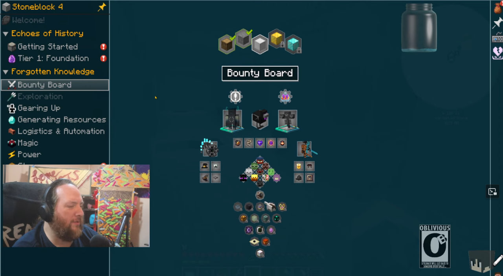
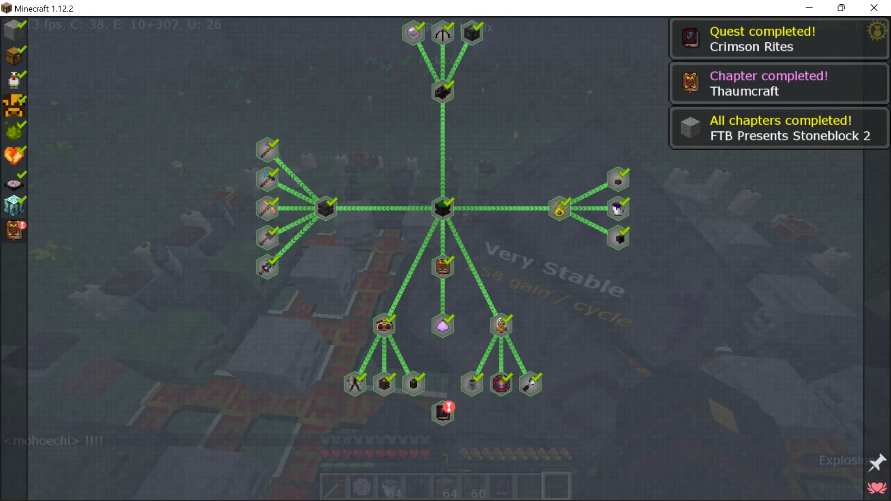
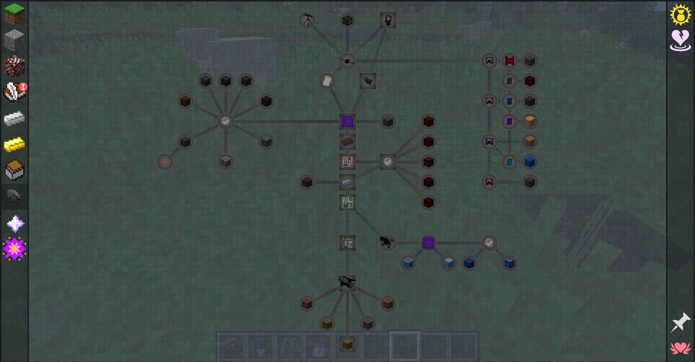
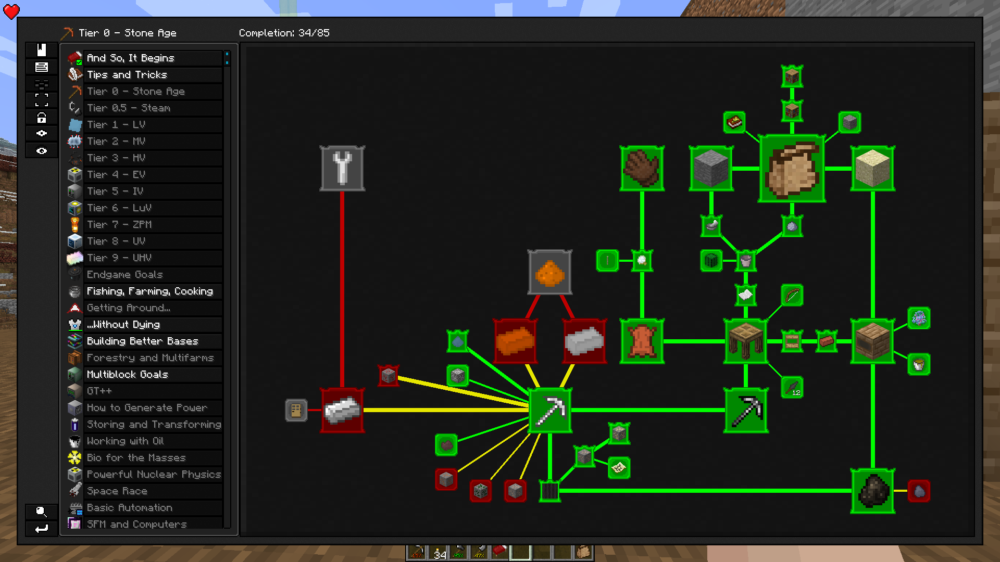
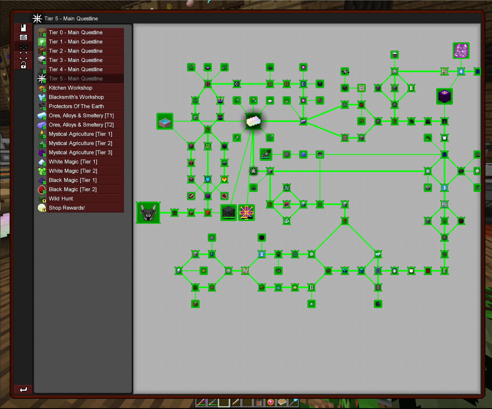
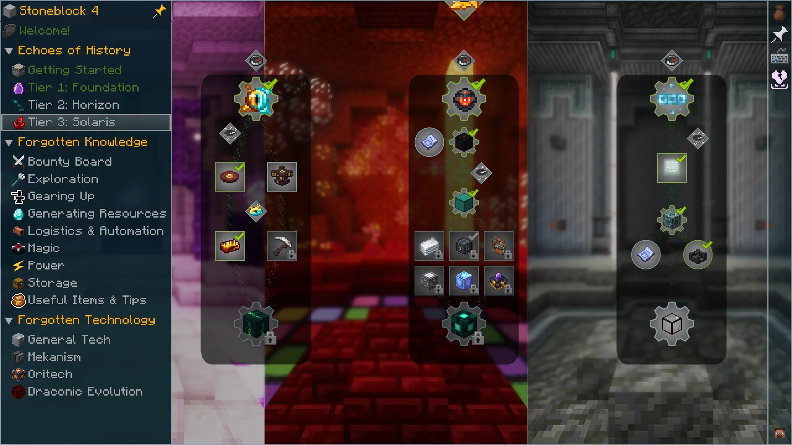
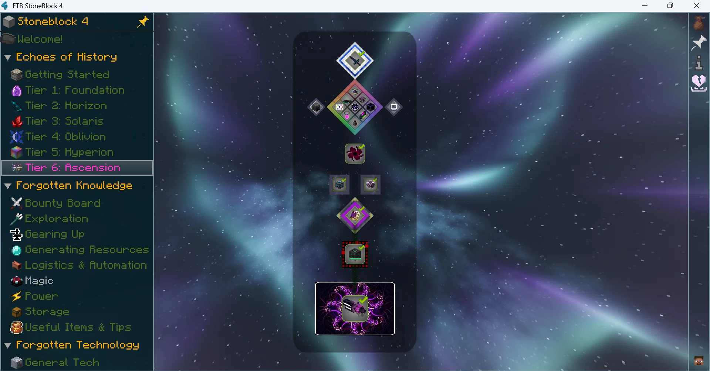
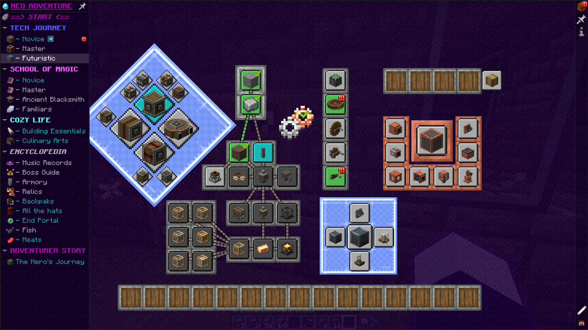
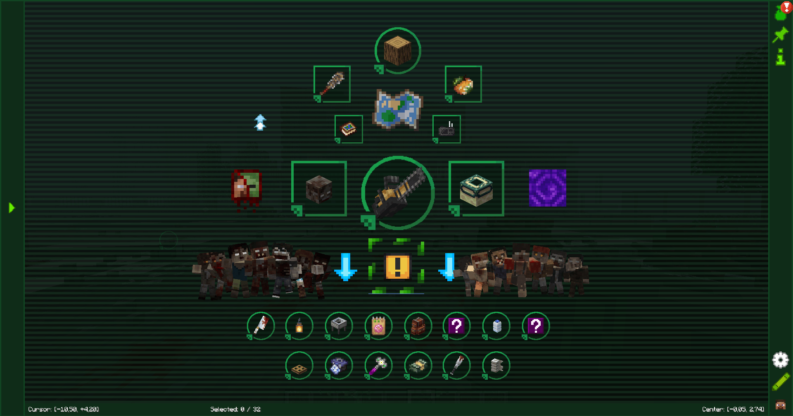
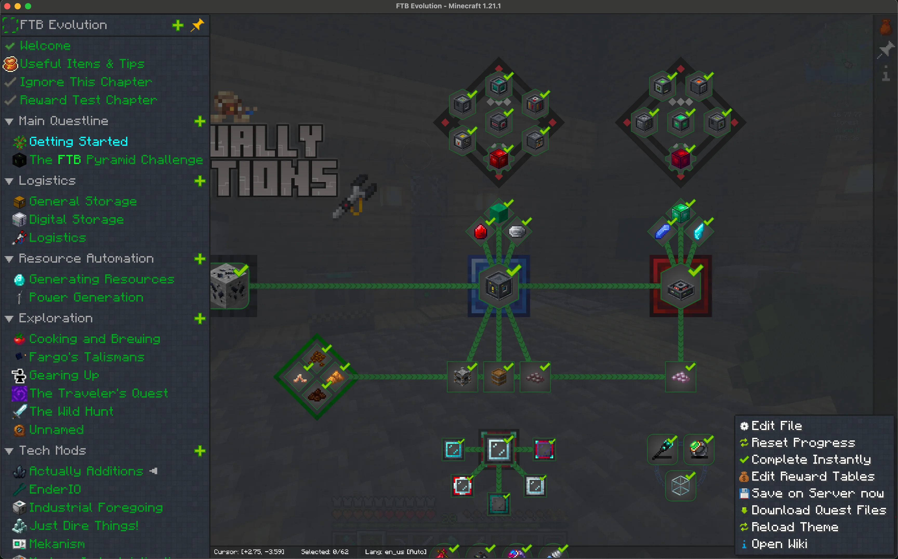

# Jugcraft TODO list

This list tracks concrete owner-requested follow-ups. An unchecked task is planned work, not implemented gameplay. See the [roadmap](ROADMAP.md) for the wider delivery direction and [existing-content map](WHAT_EXISTS.md) for current source. Feature details and dependencies belong in their linked briefs.

## Jugcraft Encyclopedia

Owner-requested 6 October 2026. Independent feature brief: [Jugcraft Encyclopedia](features/jugcraft-encyclopedia.md). All ten supplied screenshots are included in the [reference gallery](#reference-gallery) below and archived in the [reference folder](images/jugcraft-encyclopedia/README.md).

- [ ] **Build the full Jugcraft Encyclopedia UI**, covering technology, magic, detailed pathways and integrated quests.
- [ ] Add an inventory entry button and a configurable keybind. Both open the same Encyclopedia without crafting, carrying or using an Encyclopedia item.
- [ ] Provide a home view explaining the overall machinery/technology route and the overall magic route.
- [ ] Add chapter/specialty navigation and in-depth pages for each pathway within both routes, including useful products, entry requirements, process steps and optional branches.
- [ ] Explain the essential technology path and the substantial pre-electric workshop's sideways possibilities. Show steel and electricity as parallel capabilities under the owner's planning direction.
- [ ] Cover technology specialties such as ceramics/construction, mechanical power, metals, electricity, logistics, industrial agriculture, mineral separation, chemical refining, recovery/pollution and later precision/expedition systems as those features become available.
- [ ] Give magic its own overview and detailed school/ritual/spell/apparatus/reagent pathways, with useful crafting, cultivation, exploration and combat applications.
- [ ] Design route graphs with readable connections, grouped nodes and prominent milestones. Distinguish actual required materials/capabilities from recommendations, trade alternatives and suggested quest order.
- [ ] Provide detailed machine/material/spell/ritual entries and recipe/process links using canonical game data; clearly label planned versus implemented content.
- [ ] Include quests linked to their pathway explanations, with objectives and visible progress/completion. Keep the guide useful without requiring every player to complete every branch.
- [ ] Decide quest objective types, detection/consumption rules, reward policy, spoiler rules and individual/shared-party progress before implementing those behaviors.
- [ ] Implement authoritative quest completion and any approved rewards with stable identifiers, persistence and duplicate-claim prevention.
- [ ] Design search, navigation/history, accessibility and readable states across supported GUI scales; consider optional bookmarks and pinned goals.
- [ ] Decide compatibility for the existing Engineer's Handbook while preserving saved registrations. The new Encyclopedia itself is not an item.
- [ ] Build an original Jugcraft visual presentation informed by the ten references, without importing their depicted artwork or requiring an external quest mod by assumption.
- [ ] Verify both entry points, route/content accuracy, GUI behavior, bounded performance, and relevant two-client/restart/reconnect/quest persistence behavior.

Exact visuals, default key, quests/rewards and release order remain to design. The feature is broader than the industrial plan: it must independently explain magic and the deeper pathways in both routes.

## Progression and balance

- [ ] Tune the minimum fresh-world route to first electricity toward **2–4 active hours when following known recipes**, excluding optional building detours. This is an approximate playtest target, not a timed gate or a measured result.
- [ ] Map the reachable essential ceramics/mechanical workshop/electrical component route and its bootstrap requirements, with parallel steel progression.
- [ ] Place substantial construction, agricultural, mineral and recovery choices beside the essential route; do not require completing every specialty before moving to another capability.
- [ ] Validate the route in representative solo and trade scenarios, then adjust material quantities, processing time and power costs from actual playtest evidence.

Related owner planning records: [industrial agriculture, PR #208](https://github.com/jimbozoomer-byte/jugcraft/pull/208), [mineral sands/refining, PR #209](https://github.com/jimbozoomer-byte/jugcraft/pull/209), and [waste/recycling/pollution, PR #210](https://github.com/jimbozoomer-byte/jugcraft/pull/210). These are planning work, not claims that those proposed systems are implemented.

## Industrial chemistry, gas fuels and advanced materials

Owner-requested 7 October 2026. Independent briefs: [industrial chemistry and fuels](features/industrial-chemistry-and-fuels-plan.md) and the [complete chemical, machine and consumer catalog](features/industrial-chemical-catalog-and-routes.md). These follow-ups are planning work, not implemented recipes or tested balance.

- [ ] Map a reachable **steel-built electrical chemistry entry**, preserving the earlier workshop/first-electricity route and prioritizing gas processing, aluminum and titanium.
- [x] Record all ten owner-selected A choices in the [eighth starter-factory batch](features/industrial-starter-gas-and-acid-factory.md#recorded-starter-factory-choices-eighth-batch): forms, Separator/nickel costs, automatic heat, full first acid chain, water/lye overflow, one residue and provisional processing/generation rates. This completes planning choices, not gameplay implementation.
- [x] Record all eight A selections in the [ninth catalyst/coal batch](features/industrial-starter-gas-and-acid-factory.md#recorded-acid-catalyst-and-coal-processing-choices-ninth-batch): independent mineral catalyst supply, recirculating initial acid, shared contact conversion, sulfur/carbon feeds, optional oxygen assistance, combined cleanup and useful stabilized residue. Planning only.
- [ ] Specify the selected starter catalyst/mineral preparation and absorber carrier accounting, coal carbon/heat/yields, residue binder/processing, and remaining construction/unit/energy limits before gameplay implementation.
- [ ] Resolve the [ten pending magnesium/aluminum/titanium processing questions](features/industrial-chemistry-and-fuels-plan.md#magnesium-aluminum-and-titanium-processing-questions-pending), preserving previously selected sources, alloys, products and entry boundaries.
- [ ] Deliver the selected **first starter gas/acid factory milestone**: water/brine electrolysis, CO/H2 preparation, synthesis, HCl/sulfuric supply, portable tanks/shared pipes and usable H2/methane generation. Use the [first-factory map](features/industrial-chemistry-and-fuels-plan.md#first-delivery-milestone-starter-gas-and-acid-factory); specify reachable construction/first acid catalyst and complete budgets before gameplay. Magnesium/aluminum/titanium and alloy expansion follows.
- [ ] Build the selected shared hydrogen/methane gas-burning generator role and separate lower-output **Bio-Generator for cleaned biogas and bioethanol**; methane improves electricity per tank and upgraded gas-generator output. Audit complete processing/generation energy to prevent closed positive-power loops.
- [ ] Define distinct CO2 + 4 H2 and CO + 3 H2 methanation recipes, the reusable first catalyst bed from existing nickel/ceramic supplies, optional later ruthenium improvement, readable heat requirements and recovered water.
- [ ] Keep gas-pipe pressurization automatic, with no player-managed compressor machines/modules, pressure tiers/settings or per-pipe pressure simulation.
- [ ] Add the earlier steel-era coal gasifier's CO/hydrogen mixture, cleanup and separation into useful gases, with substantial numeric pollution; keep CO separate from digester CO2.
- [ ] Design the substantial first bulk Anaerobic Digester, with larger versions later, using the selected 60/40 methane/CO2 game mixture, usable digestate, direct cleaned-biogas Bio-Generator use and optional hydrogen upgrading into separated methane.
- [ ] Develop the earlier milling/mashing -> fermentation -> distillation Bio-Generator fuel route, adding dehydration for later demanding fuel/blending uses and brewery CO2 collection/cleanup; preserve existing bioethanol IDs and consumers.
- [ ] Add optional CO2 capture/release to industrial carbonate cement processing and optional Coke Oven gas/condensate recovery. Full CO2 capture storage defaults to continued production/excess venting, with optional stop-instead; account for material, energy and recovered/released amounts once.
- [ ] Use earlier copper conductors in entry aluminum-processing equipment, with aluminum improvements later; verify construction and reagent producers without self-output gates.
- [ ] Verify filled gas tanks retain exact content through break, pickup and placement and reconnect through shared pipes; cover joined-tank partitioning, simultaneous transfers and multiplayer pickup.
- [ ] Detail H2/chlorine -> HCl and selected refinery-derived ethylene -> ethylene dichloride -> vinyl chloride -> PVC, with appropriate HCl recovery/reuse; retain existing PVC, butadiene rubber and natural-rubber routes.
- [ ] Expand process-specific reagents, useful rigid/flexible/protective/heat-resistant polymers and advanced ceramic linings/insulators/cutting/precision parts. Limit purity grades to meaningful consumers; prioritize refining/electronics over broad new everyday finishes.
- [ ] Develop titanium mineral treatment -> crude titanium chloride -> purification -> magnesium reduction -> titanium sponge -> melting using compatible shared equipment. Supply first magnesium through **pumped coastal seawater -> concentrated/prepared magnesium-bearing brine -> magnesium chloride -> molten-salt electrolysis**; define coastal source representation and account for chlorine, water/residues and shared alloy demand, with independent earlier construction and no magnesium from freshwater/pure sodium-chloride brine. Preserve existing routes until replacements work.
- [ ] Add aluminum's affordable bulk electrical/lightweight structural/panel/vehicle roles; titanium advanced process/precision equipment and vehicle components; and stronger titanium tools/armor above steel with balanced statistics.
- [ ] Build the selected shared **Polymer Molding Press with reusable molds** for housings, fittings, insulation, gaskets, flexible hoses and vehicle panels; use earlier supplies for the first station/tooling.
- [ ] Implement ceramic powders -> blanks -> firing -> shared grinding/polishing where needed: clay foundation, porcelain-style insulators and alumina, then specialist zirconia; shared finishing also serves metals/optics and clay-based first steel casting remains reachable.
- [ ] Develop selected **chromium/nickel stainless steel** for advanced chemical vessels/fittings/components and **aluminum-magnesium structural alloy** for frames/panels/vehicles on compatible shared alloy/forming equipment. Regional chromium-bearing ore deposits feed shared refining; define mineral/regions, exact grades/ratios and independent producer recipes. Titanium alloys follow later.
- [ ] Begin refining with compact functional stations and optional larger bulk plants. Larger chemical machines gain **higher throughput and lower energy per unit**; upgraded small machines remain useful for smaller production lines. Balance complete process chains and retain the separately selected substantial first Anaerobic Digester.
- [ ] Develop general storage first, including requested lead-acid, later LiPF6 lithium-ion and major vanadium redox-flow chemistry; defer portable packs and specialty high-output banks.
- [ ] Map the requested Electrolytic Separator, Chemical Infuser, Chemical Oxidizer, Chemical Dissolution Chamber and Rotary Condensator roles onto existing shared systems; preserve current IDs and automatic gas-pipe pressure. Develop **both installed upgrade chips/modules and larger advanced physical versions**, with explicit compatible capabilities and independently reachable first controls.
- [ ] Make sulfuric acid a central industrial supply with reachable sulfur oxidation/conversion/absorption and useful fertilizer/battery/mineral/petroleum consumers. Implement selected **ordinary, concentrated and electronic-grade supplies**, distinguishing concentration from purity and accounting for water/impurities/losses. Avoid first-acid catalyst dependency cycles.
- [ ] Map the selected **shared reagent purification station** with specific electronic-grade sulfuric-acid and other demanding reagent recipes. Account for **water conditioning inside those recipes**, including water/energy/loss costs, without requiring a separate produced/stored purified-water fluid. Define earlier construction/controls and actual per-product capabilities; no self-output purifier gate or universal pure-fluid conversion.
- [ ] Design **substantial underground fluorite deposits in snow biomes with occasional surface outcrops**, with eligible biome IDs/tags, abundance/depth, discovery and existing-world behavior explicitly reviewed. Add independently reachable fluorite CaF2 -> heated concentrated-sulfuric processing -> HF plus accounted calcium sulfate; define gas/aqueous recovery and compatible starter hardware before HF/PTFE exists.
- [ ] Add phosphate-rock wet/hydrometallurgical dissolution, slurry filtration and phosphoric-acid recovery, with triple-superphosphate fertilizer and advanced technology consumers.
- [ ] Extend nitric/ammonia chemistry for ammonium-nitrate fertilizer and compatible finished game ammunition/rocketry products; review owner-requested aged pine/maple finishes separately.
- [ ] Define selected **named nitrogen/phosphate fertilizers, broad crop-group applications and optional mixed-farm blends**, including ammonium-nitrate/triple-superphosphate consumers. Balance group/tag membership, benefits, application/blend costs and feedback loops with agriculture; retain ordinary compost/fertilizer and optional farm specialization.
- [ ] Connect HCl-assisted corn-starch hydrolysis to finished glucose syrup; acetic acid/vinegar to acetate monomers and PVAc adhesives/appropriate fibre applications; citrus/citric acid to preservation, sour candy and drinks; food-grade phosphoric acid to cola.
- [ ] Plan acetylsalicylic-acid medicine with independently reachable precursors and defined game effects; keep pharmacy optional to industrial progression.
- [ ] Implement the selected first advanced-chip core: **sulfuric/peroxide cleaner, TMAH developer and selective HF oxide etching**, with **resin + light-sensitive additive -> one initial photoresist**. Connect separate shared wet-processing and lithography stations to wafer finishing/assembly; add silane/deposition later. Select exact precursor identities/independent producers and earlier controls without self-output chip gates.
- [ ] Assemble **one general advanced chip into distinct speed, efficiency and automation upgrades** using shared circuit/assembly systems. Speed raises throughput/power draw; efficiency reduces energy per batch; first automation adds recipe priorities/stock targets, with remote/coordinated controls later. Define costs, compatibility, caps/curves and bounded stock accounting; preserve existing chip/circuit IDs and consumers during transition.
- [ ] Add ethylene -> HDPE/LDPE polymerization -> pellets and the selected **shared Polymer Extruder for suitable films, hoses and insulation** alongside discrete molding. Develop named fluorochemical intermediates/monomers -> PTFE -> selected **chemical-resistant seals, fittings and liners in advanced-machine construction recipes**. PTFE lining retrofits are not selected; earlier starter construction stays compatible and routine replacement upkeep is excluded. Define stock forms/dies and compatible machine recipes.
- [ ] Develop coal/biomass/gas -> cleaned/conditioned CO/H2 syngas -> reusable cobalt-catalyzed Fischer-Tropsch capability -> synthetic hydrocarbon feed -> shared refining/upgrading into gasoline and other fuels; audit complete material/energy allocations.
- [ ] Connect existing RP-1/LOX and requested methane/LOX, LH2/LOX and hydrazine/MMH/N2O4 families to compatible game rocket/station roles. Use selected **ordinary Rotary Condensator and upgraded Cryogenic Liquefier roles** with explicit per-fluid capabilities; preserve old routes and account for powered conversion without gas/liquid duplication.
- [ ] Extend existing vanadium electrolyte/Flow Battery for VOSO4-based formulated electrolyte and major grid storage, with paired functional sides, **modular tank capacity additions and cell-stack charge/discharge output upgrades**. Define sizes, limits, losses and atomic shared storage accounting; no routine cycle aging, no free energy from electrolyte.
- [ ] Add boric-acid/boron connections for suitable nuclear control and advanced solar manufacturing, plus later sulfamic/sulfamate terminal plating with reviewed nickel/zinc compatibility.
- [ ] Deliver industrial fertilizers, refining and polymers before the new optional chemical drinks, preservatives, adhesives and medicine; preserve independently useful earlier agriculture, food and adhesive routes.
- [ ] Document actual machine roles, recipes, consumer links and optional paths in the Encyclopedia; audit reachability, gas/element units, energy loops, pollution, bounded factory work and persistence before gameplay delivery.

## Monkey King: make him a boss

Owner-requested 10 October 2026. The Monkey King (Sun Wukong) is modelled and animated but not implemented: `tools/monkey_king.py` builds the Blockbench projects `art/monkey_king/monkey_king.bbmodel` (the king, bones `body > kilt, head, tail, left_arm, right_arm`, `left_leg`, `right_leg`, with the clips `idle`, `walk`, `jump`, `roar`, `attack_smash`, `attack_sweep`, `attack_thrust`) and `art/monkey_king/ruyi_staff_large.bbmodel` (his staff, grip at the origin, to be parented to the right hand), plus 22 textures of his own; see [art/monkey_king/README.md](../art/monkey_king/README.md). He is three times the Monkey Monk's scale (about 150 pixels to the feather tips). **The owner wants him made into a boss later**:

- [ ] Register a `jugcraft:monkey_king` boss entity on the server (GeckoLib per [FRAMEWORKS.md](FRAMEWORKS.md)) using the model, textures and clips as exported; keep the ID stable from the first release.
- [ ] Give him a move set from the clips: `attack_thrust` as the quick poke, `attack_sweep` as a knockback whirlwind that hits everyone in reach, `attack_smash` as a ground slam with a shockwave, `jump` as the cloud-somersault gap closer, `roar` as the phase-change taunt; `idle` and `walk` for the rest. Validate every hit on the server (reach, cooldown, line of sight).
- [ ] Decide where he lives and what he guards (a mountain realm or cave arena from the realms/caves branches), his health and tier, and the drops (the ruyi staff as a weapon is the natural reward); record tier, costs, unlocks and failure behaviour in `docs/features/monkey_king.md` before any of it ships.
- [ ] Two-client dedicated-server playtest of every attack before release.

## Reference gallery

All ten original owner-attached UI screenshots are preserved unchanged. They are documentation/design references, not Jugcraft runtime textures. Descriptions and individual file links are in the [independent feature brief](features/jugcraft-encyclopedia.md#visual-references-and-provenance); provenance and integrity metadata are in [the manifest](images/jugcraft-encyclopedia/reference-manifest.json).

Show all ten Encyclopedia UI references

| Reference 01: chapter sidebar / quest board | Reference 02: completed magic route |
| --- | --- |
|  |  |

| Reference 03: resource/process dependencies | Reference 04: tier and specialty navigation |
| --- | --- |
|  |  |

| Reference 05: main and side pathways | Reference 06: thematic route columns |
| --- | --- |
|  |  |

| Reference 07: focused major-milestone route | Reference 08: technology, magic and encyclopedia |
| --- | --- |
|  |  |

| Reference 09: illustrated chapter overview | Reference 10: grouped logistics/resource routes |
| --- | --- |
|  |  |

Reference rights and exceptions to the repository's default MIT grant are recorded in the [reference README](images/jugcraft-encyclopedia/README.md) and manifest. The screenshots inform navigation, grouping, route explanations and quest states; final Jugcraft visuals remain to design.
