# Agriculture branch

Status: **three slices implemented in source: the Fall Harvest (crops, wild plants, sickles), the Kitchen Garden (trellises, seven crops, the Cooking Pot) and the Festival Crops (gourds on stems, turnips and Turnip Lanterns, cranberry bogs, the chestnut tree), plus pumpkin carving (the Carving Knife), the Halloween harvest (giant pumpkins, the Harvest Scale, scarecrows, heirloom pumpkins, ornamental corn and fall decorations), the pumpkin regatta and trick-or-treating, the Halloween festivities (the carving contest, costumed mobs, the Halloween Peddler, spooky decorations and sweets), Halloween nights (will-o'-wisps, the Pumpkin Chunkin' Trebuchet, a bigger Candy Bag, the Harvest Moon and the Headless Horseman), and the thirty Halloween decorations (string lights, the Candy Bowl, the Coffin, the Haunted Portrait, the Fog Machine, luminarias, floating candles, the Skeleton Hand Sconce, soul-flame carvings, bat bunting, the graveyard: the cemetery fence and gate, the crypt set, the Grave Mound, the Mourning Angel and the Pop-Up Skeleton, the witch's cottage: the Bubbling Cauldron, the Apothecary Shelf, the Crystal Ball, the Grimoire Stand and the Witch's Broom, the harvest party: the Bobbing for Apples Tub, the Pumpkin Crate, the Hay Bale Seat, the Autumn Wreath and the Leaf Piles, and the haunted house and yard: the Rocking Chair, the Lurking Eyes, the Silhouette Window, the Spooky Music Box and the Giant Fake Spider), and the eight batches of more Halloween, the haunted house inside (the Haunted Chandelier, the Phantom Pipe Organ, the Suit of Armor, the Dust Sheet, the Spirit Mirror, Tattered Curtains and the Creepy Doll) the mad scientist and monsters (the Tesla Coil, the Lab Table, the Specimen Jar, the Mummy Sarcophagus, the Raven on a Perch and the Black Cat Figure) the yard and porch (the Yard Inflatables, the Animatronic Porch Witch, Grasping Hands, the Poseable Skeleton, Bone Wind Chimes, the Weathervanes, the Spooky Sign, the Haunted Archway and the Dead Hollow Tree) lighting and glow (the Black Light and Glow Paint, the Witch Fire Brazier, the Shadow Puppet Lamp, the Mini Pumpkin Stack and the Floating Witch Hat) party games (the Jump-Scare Trap, the Costume Contest, Pumpkin Bowling, the Candy Cache, the Monster Mash Dance Floor, Ghost Tag and the Fortune Teller's Table) night events (trick-or-treaters at your door, Toilet Paper Rolls, the Haunted Hayride and the Halloween Bonfire) treats (the Witch's Brew Punch Bowl, Soul Cakes and the Barmbrack, pumpkin spice lattes, pumpkin bread, spiderweb cupcakes, bat-wing cookies and Giant Candy) and costumes (the Vampire Cape, Mummy Wraps, the Skeleton Suit, the Werewolf Mask, Cat Ears and Tail, Bat Wings and the Costume Trunk), the Farmhouse Kitchen (the Kitchen Stove, the Skillet, the Cutting Board, knives and kitchen cabinets), feasts and food displays (five feasts served a bowl at a time, pies in the owner's art, the pumpkin pie set down, plates, platters and serving trays), the menu (55 dishes and ingredients from the owner's food art, every dish set down as a 3D model, the Cooking Pot in the owner's pot, nachos, and food for pets), rice and wet farming (rice paddies, wild rice, straw, rice and straw storage, tatami and the rice dishes), and soil, compost and storage (organic compost, rich soil and its farmland, produce crates and baskets).** They compile in CI and have automated in-game tests, but nobody has played them yet. Everything marked *planned* below is a design proposal, not a promise. See [../features/fall-harvest.md](../features/fall-harvest.md), [../features/kitchen-garden.md](../features/kitchen-garden.md), [../features/festival-crops.md](../features/festival-crops.md), [../features/pumpkin-carving.md](../features/pumpkin-carving.md), [../features/halloween-harvest.md](../features/halloween-harvest.md) , [../features/pumpkin-regatta-and-trick-or-treat.md](../features/pumpkin-regatta-and-trick-or-treat.md) [../features/halloween-festivities.md](../features/halloween-festivities.md) [../features/halloween-nights.md](../features/halloween-nights.md), [../features/halloween-decorations.md](../features/halloween-decorations.md), [../features/more-halloween.md](../features/more-halloween.md) [../features/farmhouse-kitchen.md](../features/farmhouse-kitchen.md), [../features/feasts-and-food-displays.md](../features/feasts-and-food-displays.md), [../features/the-menu.md](../features/the-menu.md), [../features/rice-and-wet-farming.md](../features/rice-and-wet-farming.md) and [../features/soil-compost-and-storage.md](../features/soil-compost-and-storage.md) for the implemented slices and their test evidence.

Agriculture is Jugcraft's third starting branch, alongside technology and magic ([DESIGN.md](../DESIGN.md)). A farmer can begin on day one with a hoe and whatever grows nearby, and never needs a machine or a spell. Industrial farming (powered harvesters, planters, sprinklers, crop processors) comes later and belongs to the engineering branch; see [Boundaries](#boundaries).

## What exists now: the Fall Harvest

| Crop | Grows | Plant with | Harvest | Uses now |
| --- | --- | --- | --- | --- |
| **Corn** | **3 blocks tall** on farmland | Corn Kernels | Right-click ripe corn to pick 2–3 ears; the stalk stays standing and regrows ears | Food (raw, roasted, popcorn), kernels, pig feed, Three Sisters Stew |
| **Sunflower** | **2 blocks tall**, a big yellow head when ripe | Sunflower Seeds | Right-click the ripe head for 2–4 seeds; the plant stays standing | Roasted seeds, chicken and parrot feed; oil later |
| **Beans** | 1 block, a bushy legume | Beans | Break when ripe (like potatoes) | **Speed up the crops around them**; Three Sisters Stew |
| **Sweet Potato** | 1 block of purple vines | Sweet Potato | Break when ripe | Food (raw, baked), pig feed |
| **Flax** | 1 block, blue flowers, then golden stems | Flax Seeds | Break when ripe (like wheat) | 2 flax → 1 string; chicken and parrot feed; linen and linseed oil later |

In the game: a corn maze and the Fall Harvest fields. These are real screenshots from the client game test that CI runs, using software rendering (small previews).

| A corn maze from above, beside a solid cornfield | At the maze entrance, in a wall of ripe corn |
| --- | --- |
| 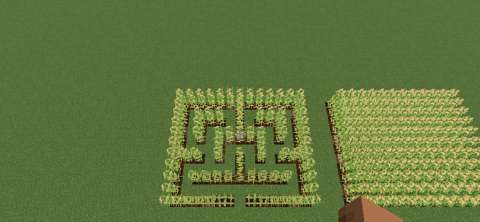 | 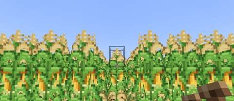 |
| **The farm:** corn, sunflowers, then rows of beans, sweet potatoes and flax | **A sunflower field** in bloom |
| 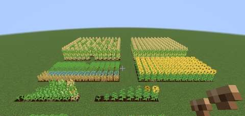 | 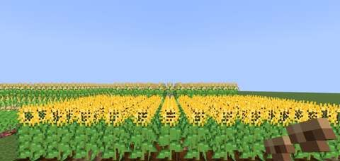 |

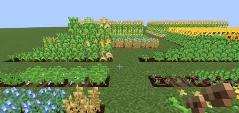

The growth stages of the two tall crops, drawn from the generated textures (approximate renders, not game screenshots):

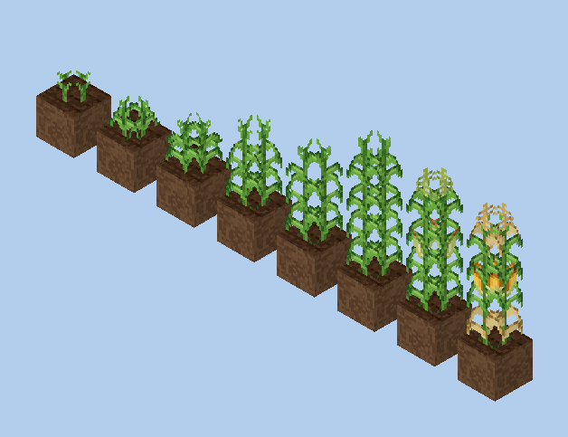

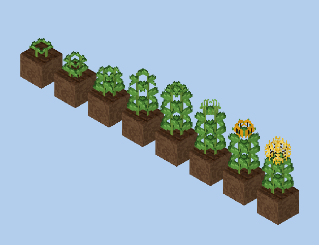

### Cornfields and corn mazes

Corn is built for fields you want to look at and walk through.

- **Tall and dense.** Ripe corn is three blocks of leaves, ears and golden tassels. Planted side by side, the rows read as a solid wall of corn. Unlike vanilla crops, dense planting is not penalised.
- **It stays standing.** Harvesting is *picking*: right-click a ripe plant (any of its three blocks) and the ears drop, but the plant stays three blocks tall and grows new ears. A field or a maze never has to be torn down and regrown.
- **Walls you cannot walk through.** Once corn is two blocks tall it blocks movement like a hedge, and mobs path around it. Knee-high corn can still be walked through, like wheat. That is what makes a maze work: plant the walls, leave the paths as grass or dirt path, and wait.
- **No irrigation needed.** Corn keeps its farmland from drying back to dirt (the same rule as vanilla crops). Water nearby only makes it grow faster.
- **Easy to shape.** Corn only grows into air. A block above a plant stops it at that height, and breaking any block of a plant removes the whole plant and drops its kernel.
- **Or let a gate plant it.** The [Corn Maze Gate](#the-corn-maze) carves a maze from its own seed and plants it in close-set maze corn, ready to run at once and timed on the server.

The maze in the screenshots above is 13 × 11 blocks with one-block paths, planted by the client game test in `AgricultureClientGameTests`.

### Getting your first seeds

Every crop has two independent entry points, so none is locked behind a biome, another branch or luck:

1. **Wild plants.** Patches of Wild Corn, Wild Sunflower, Wild Beans, Wild Sweet Potato and Wild Flax grow on grass where each crop comes from. Break one for 1–2 of its seeds; shears take the plant itself as decoration. They appear in chunks generated after this feature was added.

| Wild plant | Found in | Why there |
| --- | --- | --- |
| Wild Corn | plains, savanna | Corn's wild ancestor (teosinte) is a warm-grassland grass |
| Wild Sunflower | plains | Sunflowers are native to open prairies |
| Wild Beans | forest, jungle | Wild beans climb at forest edges |
| Wild Sweet Potato | savanna, jungle | A warm, tropical vine |
| Wild Flax | plains, flower-rich biomes | A meadow flower |

2. **Short grass.** Breaking short grass has a 12.5 % chance to drop one Jugcraft seed, as often as vanilla wheat seeds, chosen evenly from every Jugcraft crop (twenty-four so far). Adding crops never makes grass drop more seeds overall. This works in any biome and in worlds created before this feature.

### Systems

- **Tall crops ([`TallCropBlock`](../../src/main/java/io/github/jimbozoomer/jugcraft/agriculture/TallCropBlock.java)).** One block type per crop; a `section` property says which block of the plant it is, and every section shows its own slice of the same growth stage. Only the bottom block ticks and has loot, so a plant can never drop twice. Heights, pick yields and growth speed live in [`TallCrop`](../../src/main/java/io/github/jimbozoomer/jugcraft/agriculture/TallCrop.java) and [`tools/agriculture.py`](../../tools/agriculture.py); adding another tall crop is a table entry plus textures.
- **Picking.** Ripe tall crops go back to a younger stage *of the same height* when picked (corn and sunflowers go back to stage 5 of 7), so they regrow produce without shrinking.
- **Legumes feed their neighbours.** Crops next to beans (any of the 8 surrounding blocks) grow **1.5× as fast**. Beans themselves do not get the bonus, so the best field mixes crops. This is the classic *Three Sisters* planting (corn, beans and squash) that the stew is named after. The legume list is the block tag `jugcraft:nitrogen_fixing_crops`, so data packs and later crops can join it.
- **Growth.** Otherwise Jugcraft crops grow like vanilla crops: farmland under and around the plant, moisture, and light 9 or more. Corn takes 1.5× and sunflowers 1.25× as long as wheat per stage, because they are bigger plants that regrow after picking. Bone meal works: 1–2 stages on tall crops, as far as there is room above.
- **Sickles.** Right-click a crop with a sickle to harvest every *ripe* crop around it: 3×3 for the **Flint Sickle**, 5×5 for the **Bronze Sickle**, one block up or down. One-block crops (including vanilla wheat, carrots, potatoes and beetroots) are replanted automatically with a seed from their own drops; tall crops and cranberry bushes are picked and stay standing; squash and gourds still on their stems are cut off (gourds set down as decoration are left alone); unripe crops are left alone. Each use costs 1 durability. The sickle checks spawn protection and claims for every block it touches.
- **Composting and animal feed.** Every crop item composts at vanilla-like rates (seeds 30 %, produce 65 %, cooked food 85 %). Pigs eat corn, sweet potatoes, cabbage, turnips and chestnuts; rabbits eat cabbage and turnips; foxes eat cranberries; cows, sheep and goats eat oats and barley; horses eat oats; chickens and parrots eat every Jugcraft seed (vanilla animal-food tags, so breeding works).

### Food

| Food | Made from | Hunger | Saturation modifier | Vanilla comparison |
| --- | --- | --- | --- | --- |
| Corn (raw) | picked | 3 | 0.6 | Carrot |
| Roasted Corn | furnace, smoker or campfire | 5 | 0.6 | Baked potato |
| Popcorn | cook Corn Kernels | 2 | 0.3 | A snack |
| Sweet Potato (raw) | harvested | 2 | 0.3 | Slightly better than a raw potato |
| Baked Sweet Potato | furnace, smoker or campfire | 5 | 0.6 | Baked potato |
| Roasted Sunflower Seeds | cook Sunflower Seeds | 2 | 0.3 | A snack |
| Three Sisters Stew | bowl + corn + beans + pumpkin | 10 | 0.6 | Rabbit stew; returns the bowl |

1 Corn crafts into 2 Corn Kernels for replanting. Every cooked food uses vanilla times (furnace 200 ticks, smoker 100, campfire 600).

## What exists now: the Kitchen Garden

The second slice turns a farm into a kitchen: vegetables and grains for everyday meals, trellises for climbing crops, and a Cooking Pot for dishes with several ingredients.

| **Tomatoes on trellises**, ripe and ready to pick | **The kitchen garden:** trellis rows, oat and barley fields, and rows of every new crop |
| --- | --- |
| 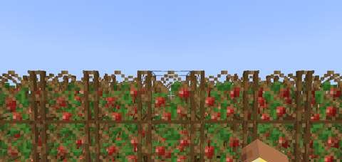 | 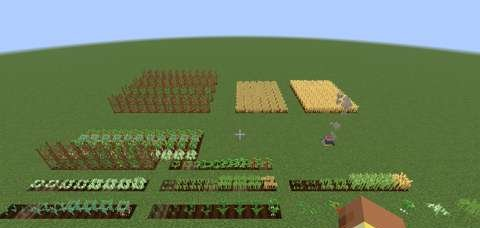 |
| **Every growth stage:** tomatoes, peppers, cabbage, oats, barley, onions and garlic, youngest on the left, with the wild plants | **The Cooking Pot** on a campfire, cooking chili |
| 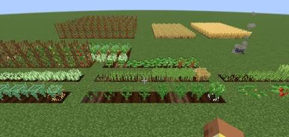 | 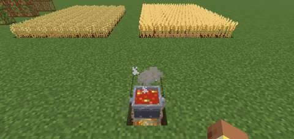 |

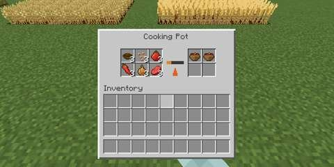

*Real screenshots from the client game test that CI runs (`KitchenGardenClientGameTests`, software rendering, small previews, hotbar cropped).*

| Crop | Grows | Plant with | Harvest | Uses now |
| --- | --- | --- | --- | --- |
| **Tomato** | **Climbs a trellis, 2 blocks tall**: yellow flowers, green fruit, then red | Tomato Seeds, on a trellis standing on farmland | Right-click the ripe plant to pick 2–4 tomatoes; it stays on the trellis and flowers again | Raw, tomato soup, chili, garden salad; 1 tomato → 2 seeds |
| **Pepper** | 1-block bush, white flowers, then green and red chilies | Pepper Seeds | Right-click to pick 1–3 peppers; the bush flowers again | Raw, chili, garden salad; 1 pepper → 2 seeds |
| **Onion** | 1 block of hollow leaves; the bulb shows when ripe | Onion | Break when ripe (like carrots) | Most soups, cabbage rolls |
| **Garlic** | 1 block; a curly flower stalk when ripe | Garlic | Break when ripe | Onion soup, cabbage rolls |
| **Cabbage** | 1 block; a pale head forms in a ring of leaves | Cabbage Seeds | Break when ripe (like wheat): a head and seeds | Raw, sauerkraut, salad, vegetable soup, cabbage rolls; rabbit and pig feed |
| **Oats** | 1 block of grass with nodding grain | Oat Seeds | Break when ripe | Porridge; horse, cow, sheep and goat feed |
| **Barley** | 1 block of grass with long whiskered heads | Barley Seeds | Break when ripe | Barley bread, mushroom barley soup; cow, sheep and goat feed |

### Trellises and climbing crops

- **The trellis** is a square wooden lattice (2 trellises from 5 sticks in an X). It stands on farmland, on any solid top or on another trellis, so you can stack them. It blocks movement like a fence and keeps the farmland under it from drying out.
- **Planting.** Use Tomato Seeds on a trellis that stands on farmland. The plant grows inside it.
- **Climbing.** A climbing crop only grows into **trellis**, never into air: put a second trellis on top and the tomato climbs to two blocks; without one it stays small. Later climbing crops (grapes, hops, pole beans) will use the same rule.
- **Nothing is lost.** Picking keeps the plant. Breaking any block of the plant gives back its seed, its tomatoes if ripe, and **every trellis it grew in**.

### The Cooking Pot

- **Crafting:** 5 iron ingots in a U with 2 sticks as handles.
- **Heat:** it cooks only while a heat source is directly under it: a lit campfire (or soul campfire), fire, lava or a magma block. The heat sources are the block tag `jugcraft:heat_sources`, so data packs and other branches can add their own. Without heat, progress drains away like a furnace going out.
- **Cooking:** put the ingredients in any of the six slots, in any order. Each batch makes one dish; stack the ingredients to cook batch after batch, into four result slots (soups do not stack). A slot holding something the recipe does not use stops the pot, so nothing is cooked by mistake.
- **Automation:** hoppers put ingredients in from the top and sides and take meals out from the bottom; a comparator reads how full the result slots are. No power is involved.
- **Recipes** are data-driven (`jugcraft:pot_cooking`, in the same format as Jugcraft's multi-input machine recipes), so data packs can add dishes.

| Dish | Ingredients | Time (ticks) |
| --- | --- | --- |
| Tomato Soup | bowl, 2 tomatoes, onion | 200 |
| Onion Soup | bowl, 2 onions, garlic, bread | 200 |
| Vegetable Soup | bowl, cabbage, carrot, potato, onion | 200 |
| Mushroom Barley Soup | bowl, barley, brown mushroom, onion | 200 |
| Oat Porridge | bowl, 2 oats, sugar | 200 |
| Chili | bowl, beans, tomato, pepper, onion, raw beef | 300 |
| Cabbage Rolls (2) | cabbage, raw beef, onion, garlic | 300 |

Made by hand: **Garden Salad** (bowl, cabbage, tomato, pepper), **Sauerkraut** (2 cabbage and 1 Jugcraft salt make 2; salt comes from rock salt in the mining branch) and **Barley Bread** (3 barley in a row, like bread).

### Kitchen Garden food

| Food | Made from | Hunger | Saturation modifier | Vanilla comparison |
| --- | --- | --- | --- | --- |
| Tomato (raw) | picked | 3 | 0.3 | Between an apple and a carrot |
| Pepper (raw) | picked | 2 | 0.3 | A snack |
| Cabbage (raw) | harvested | 3 | 0.6 | Carrot |
| Barley Bread | 3 barley | 5 | 0.6 | Bread |
| Sauerkraut | 2 cabbage + salt (makes 2) | 4 | 0.6 | Between a carrot and bread |
| Garden Salad | bowl, cabbage, tomato, pepper | 7 | 0.6 | Between mushroom stew and rabbit stew; returns the bowl |
| Oat Porridge | Cooking Pot | 6 | 0.6 | Mushroom stew |
| Tomato, Onion and Mushroom Barley Soup | Cooking Pot | 8 | 0.6 | Between mushroom stew and rabbit stew |
| Vegetable Soup | Cooking Pot | 10 | 0.6 | Rabbit stew (five ingredients) |
| Chili | Cooking Pot | 10 | 0.8 | Rabbit stew with a steak's saturation: the best dish so far, six ingredients including beef |
| Cabbage Rolls | Cooking Pot (makes 2) | 6 | 0.8 | A cooked meat dish, like cooked mutton |

Every bowl dish returns its bowl and stacks to 1, like vanilla stews.

### New seed sources

| Wild plant | Found in | Why there |
| --- | --- | --- |
| Wild Tomato | jungle, savanna | Tomatoes come from the warm Andes and Central America |
| Wild Pepper | savanna, badlands | Chilies are native to dry, hot scrubland |
| Wild Onion | plains, hills | A steppe and meadow plant |
| Wild Garlic | forest, taiga | Wild garlic carpets woodland floors |
| Wild Cabbage | windswept hills, hills | Wild cabbage grows on windy coastal cliffs |
| Wild Oats | plains, taiga | A grass of cool fields |
| Wild Barley | savanna, hills | Barley's wild ancestor grows on dry hillsides |

Short grass drops these seeds too (see [Getting your first seeds](#getting-your-first-seeds)).

## What exists now: the Festival Crops

The third slice fills the autumn and winter table and yard: squash and gourds for fall displays, turnips carved into the original jack-o'-lanterns, cranberries from a bog, and a chestnut tree to roast from. **Nothing here is seasonal.** Everything grows all year and stays in the world; the planned Halloween and December events ([CONTENT_BRANCHES.md](../CONTENT_BRANCHES.md#seasonal-content)) can build on these permanent crops, never the other way round.

| **The festival harvest:** a gourd patch, a cranberry bog, chestnut trees and a chestnut-wood market stall | **A gourd patch:** butternut squash, acorn squash and warty gourds on their stems, a few stems still growing |
| --- | --- |
| 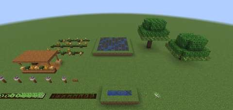 | 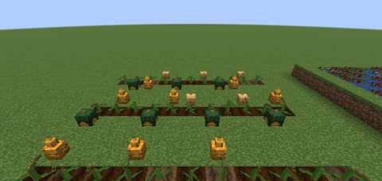 |
| **A cranberry bog:** bushes standing in water one block deep over mud, ripe and in flower | **Chestnut trees** with burs under their leaves, most of them ripe |
| 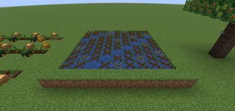 | 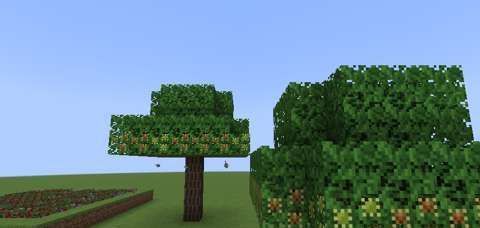 |
| **Every growth stage:** turnips, a butternut stem and cranberries in a trench, youngest on the left, then the sapling and a wild turnip | **Turnip Lanterns** on chestnut fence posts at midnight, in front of the market stall |
| 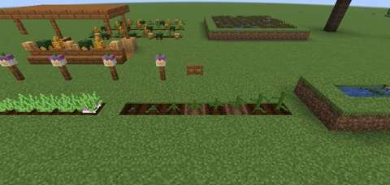 | 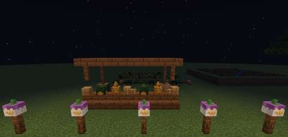 |

*Real screenshots from the client game test that CI runs (`FestivalClientGameTests`, software rendering, small previews, hotbar cropped).*

| Crop | Grows | Plant with | Harvest | Uses now |
| --- | --- | --- | --- | --- |
| **Butternut Squash** | A stem on farmland that grows a squash on the ground beside it, like a pumpkin | Butternut Squash Seeds | Break the squash (or sweep a sickle); the stem grows another | Squash soup, squash pie; a fall decoration; 1 squash → 4 seeds |
| **Acorn Squash** | The same, a dark green ribbed squash | Acorn Squash Seeds | The same | Baked acorn squash; decoration; 1 squash → 4 seeds |
| **Warty Gourd** | The same, a knobbly orange-and-green gourd | Warty Gourd Seeds | The same | Decoration for fall displays; composting; 1 gourd → 4 seeds |
| **Turnip** | 1 block of lobed leaves; the purple shoulder shows when ripe | Turnip | Break when ripe (like carrots) | Raw, harvest stew, the **Turnip Lantern**; pig and rabbit feed |
| **Cranberry** | A low bush **standing in water one block deep** over bog soil; white-pink flowers, then red berries | Cranberries, used on the bottom of the water | Right-click (or sickle) to pick 2–3; the bush flowers again | Raw, cranberry sauce; fox feed |
| **Chestnut tree** | A sapling that grows into a broad tree; its leaves grow burs that ripen | Chestnut, planted like a sapling | Right-click a ripe (split, brown) bur to pick 1–2 chestnuts; the tree is never cut down | Roasted chestnuts; pig feed; a wood set |

### Gourds on stems

- **Planting.** Gourd seeds go on farmland. The stem grows through eight stages, then puts its gourd on a free block beside it that could hold a plant (grass, dirt, farmland, moss and so on) and bends towards it. Leave room around each stem.
- **Harvest.** Break the gourd, or sweep a sickle: the stem straightens and grows another. The stem itself stays.
- **The Three Sisters.** Stems grow by the same rules as Jugcraft crops, so squash planted next to beans grows **1.5× as fast**, and corn, beans and squash make the classic companion field.
- **Decoration.** Gourds are blocks that face the way you place them. Stack them on hay, line a porch or fill a market stall.

### Cranberry bogs

- **A bog crop.** A cranberry bush lives in a still **water source one block deep**, rooted in bog soil: dirt, mud, grass, sand, clay or gravel (block tag `jugcraft:bog_soil`). Plant it by using cranberries on the bottom of such water. It will not go on dry land or into deeper water.
- **Growth.** It grows only while there is **open air above the water** and light 9 or more, a stage in about 5 random ticks like sweet berries. Deep water or a block above stops it.
- **Its water.** The bush holds its own water, like seagrass: breaking it leaves the water behind, and it never drains a pond.
- **Where to find them.** Ripe bushes grow wild in swamp shallows, and grass drops cranberries anywhere.

### The chestnut tree

- **Planting.** A chestnut is the tree's seed: use it on dirt or grass to plant a chestnut sapling, which grows like a vanilla sapling (bone meal works) into a broad tree 6–8 blocks tall.
- **Fruit.** Leaves the tree grew itself, with air below them, grow a green spiny bur that ripens and splits open, about a Minecraft day in all. Right-click a ripe bur to pick 1–2 chestnuts; the leaves start again. Leaves a player places never fruit, so a hedge of chestnut leaves is only a hedge. Broken leaves drop chestnuts and sticks like oak leaves drop saplings.
- **Wood.** Chestnut logs, wood, stripped logs and wood, planks, stairs, slabs, fences and fence gates. Any axe strips a log, and the sawmill saws a log into 6 planks. The wood joins vanilla's wood tags, so it makes sticks, crafting tables and chests, burns as fuel and catches fire like oak.
- **Where to find it.** Chestnut trees grow wild in forests, and grass drops chestnuts anywhere.

### The Turnip Lantern

A turnip over a torch makes a **Turnip Lantern**: a hollowed turnip with a carved, candle-lit face, the jack-o'-lantern of the old autumn festivals before pumpkins came from America. It gives light 13 (a torch gives 14) and faces the player who placed it.

### Festival food

| Food | Made from | Hunger | Saturation modifier | Vanilla comparison |
| --- | --- | --- | --- | --- |
| Turnip (raw) | harvested | 3 | 0.6 | Carrot |
| Cranberries (raw) | picked | 2 | 0.1 | Sweet berries |
| Roasted Chestnuts | cook a chestnut (furnace, smoker or campfire) | 4 | 0.6 | Between a carrot and a baked potato |
| Baked Acorn Squash | cook an acorn squash | 6 | 0.6 | Cooked mutton's hunger |
| Squash Pie | butternut squash, sugar, egg | 8 | 0.3 | Pumpkin pie |
| Candy Corn (4) | corn, sugar, honey bottle | 2 | 0.1 | A sweet, like a cookie |
| Butternut Squash Soup | Cooking Pot: bowl, butternut squash, onion, garlic | 8 | 0.6 | Between mushroom stew and rabbit stew |
| Harvest Stew | Cooking Pot: bowl, turnip, carrot, onion, raw mutton | 10 | 0.6 | Rabbit stew (five ingredients) |
| Cranberry Sauce | Cooking Pot: bowl, 2 cranberries, sugar | 5 | 0.6 | A side dish |

Raw chestnuts are not food; roast them.

### Festival seed sources

| Wild source | Found in | Why there |
| --- | --- | --- |
| Butternut Squash | plains, savanna | Squash is a warm-country crop of the Americas |
| Acorn Squash | forest, taiga | Grown by the forest peoples of North America |
| Warty Gourd | swamp, spooky biomes (dark forest) | Gnarled gourds for the gloomiest places |
| Wild Turnip | taiga, birch forest | Turnips are a northern European field crop |
| Cranberry bushes | swamp shallows | Cranberries are bog plants |
| Chestnut trees | forest | A broadleaf woodland tree |

Gourds lie on grass like vanilla pumpkins (break one and craft it into seeds). Short grass drops all six new seeds too.

## What exists now: Pumpkin Carving

Carve any face into a pumpkin, a pixel at a time, at Minecraft's own pixel size. Nothing here is seasonal either: carved pumpkins stay all year.

| **The carving screen:** the Classic face pressed in, mirror on, candle preview lit | **A row of carved pumpkins** on hay bales by day: Classic, Cat, Ghost (shaved), Spooky, a bat and a star; the pumpkin at the left is carved on two sides |
| --- | --- |
| 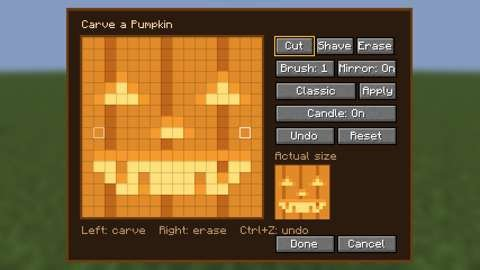 | 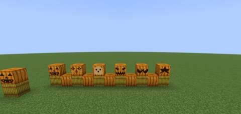 |
| **The same row at midnight**, each with a torch inside | **A pumpkin carved through the screen** above, lit |
| 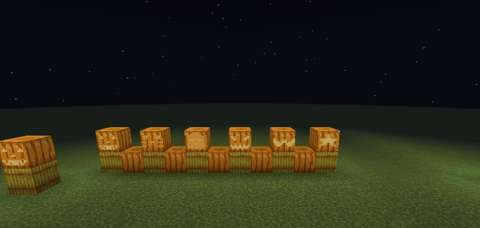 | 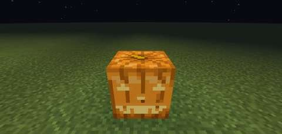 |

*Real screenshots from the client game test that CI runs (`CarvingClientGameTests`, software rendering, small previews, hotbar cropped). The close-up pumpkin was carved by pressing the screen's buttons and Done; the server then held the face.*

### The Carving Knife

Craft it from an iron ingot over a stick. Use it on the **side** of a pumpkin (not the top) to open the carving screen for that side.

| On the screen | What it does |
| --- | --- |
| **Cut** | Carves right through: a hole the candle shines out of |
| **Shave** | Peels the skin only, so light glows softly through it |
| **Erase** (or right-drag) | Takes back this session's strokes |
| **Brush 1–3** | Carves one pixel, a 2×2 or a 3×3 square at a time |
| **Mirror** | Copies every stroke to the other half of the face |
| **Starter faces** | Classic, Cat, Ghost and Spooky, pressed in with **Apply** |
| **Candle** | Shows the face lit or dark |
| **Undo** (Ctrl+Z), **Reset** | Steps back, or back to how the side was when you opened it |
| **Done** | Carves it (one use of the knife's 238) |

A knife can't put skin back: what was carved before you opened the screen is fixed, and you can only carve deeper. Every side of a pumpkin can carry its own face.

The first cut opens the pumpkin: its 4 seeds fall out, as with shears, and it becomes a **Hand-Carved Pumpkin** facing the side you carved. Roast the seeds in a furnace, smoker or campfire for **Roasted Pumpkin Seeds** (2 hunger).

### Lighting it

Use a **torch** on a hand-carved pumpkin to put it inside. It glows more the more is carved out: 4, plus 1 for every 3 holes and every 12 shaved pixels, up to 15 (a face about the size of the vanilla jack-o'-lantern's gives 15). Use it with an empty hand to take the torch back out. Broken, a carved pumpkin drops with its design and its torch, and placed again it faces you with the same carving.

### On servers

The server checks every carving before anything changes (the knife in hand, reach, permission to build there, and that the carving only goes deeper). A carved pumpkin records who carved it last, for server operators. A server that wants no free drawing can set `carving.free_draw=false` in `config/jugcraft.properties`; then only the starter faces can be carved.

## What exists now: the Halloween harvest

Eleven additions for a fall pumpkin patch, all permanent. Details, numbers and test evidence: [../features/halloween-harvest.md](../features/halloween-harvest.md).

| **The pumpkin patch** from above: giant pumpkins, scarecrows, heirlooms, ornamental corn and the shed | **Giant pumpkins:** one carved with a jack o'lantern face, one by its Harvest Scale, a 2×2×2 and a seedling, with heirloom pumpkins on the right |
| --- | --- |
| 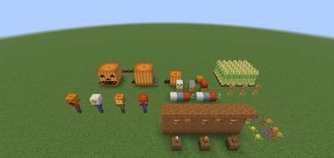 | 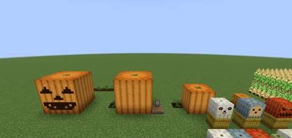 |
| **Scarecrows** in four shirts, wearing a hand-carved pumpkin, a carved white pumpkin, a jack o'lantern and a carved Cinderella pumpkin on their shoulders | **Heirloom pumpkins** and bottle gourds, hand-carved heirlooms on hay bales, corn shocks and ripe ornamental corn |
| 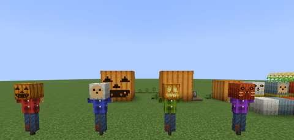 | 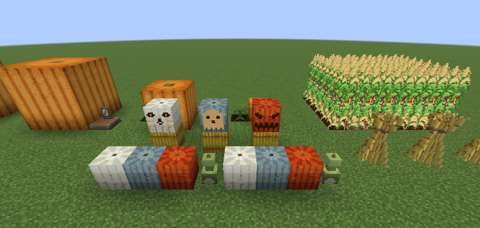 |
| **The shed:** ornamental corn bundles, gourd birdhouses under the eaves, potted mums and wild mums | **Carving a giant pumpkin:** the 48×48 screen with a stencil from the other hand pressed in |
| 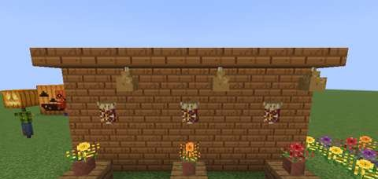 | 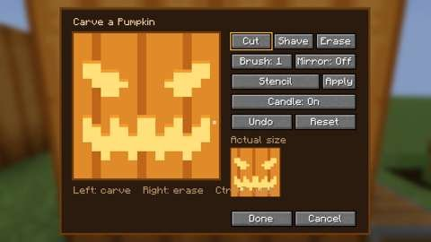 |
| **At midnight:** the carved giant with a torch inside, and the one carved from the stencil | **The scarecrows at midnight** |
| 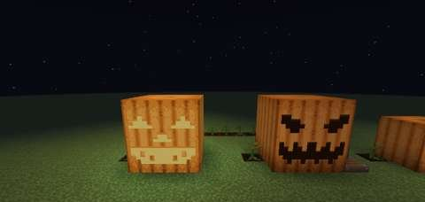 | 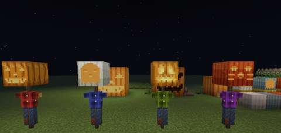 |
| **A scarecrow's head:** worn like an armor stand's pumpkin, bigger than a head, its carving facing out | **The same at midnight,** the carving lit and the scarecrow lit by it |
| 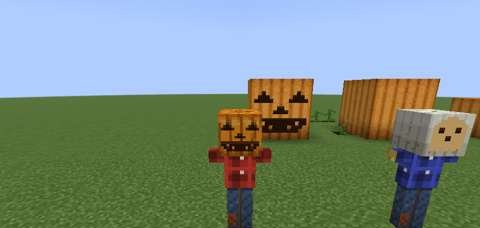 | 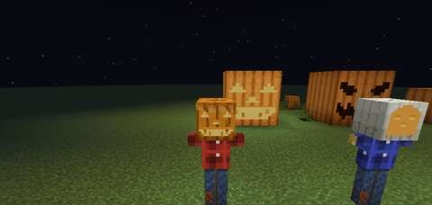 |

*Real screenshots from the client game test that CI runs (`HalloweenClientGameTests`, software rendering, small previews, hotbar cropped). The giant was carved from the stencil through the screen; the server then held the face.*

### Giant pumpkins

Plant **Giant Pumpkin Seeds** on farmland. The vine grows like a pumpkin stem (1.5× slower), then sets **one** small fruit beside it. While the vine holds it, the fruit grows: faster on moist farmland, faster still when watered from a **Gourd Canteen**. Bone meal works all the way: it grows the vine, sets the fruit on a full-grown vine, and feeds the fruit (given to the vine or the pumpkin). It swells to **2×2×2**, then **3×3×3**, away from its vine, if there is room on ground fruit can lie on. Full grown, it weighs 100–120 kg and keeps putting on weight, up to 1000 kg, until it is carved.

A giant pumpkin is **one prop**: break any block and you pick up the whole pumpkin as one **Giant Pumpkin** item that keeps its size, weight and carving; place it anywhere and the whole cube goes back down, reaching away from you. Chop it up with an **axe** instead for 9 pumpkins and 1–3 giant seeds when full grown. Pistons can't move it.

Every side of a full-grown giant carves with the Carving Knife as **one 48×48 face**, three times as fine as a pumpkin's; the screen shrinks its cells and offers bigger brushes, and the starter faces come blown up. A torch inside lights every block of it.

Where the seeds come from: the first cut into any pumpkin **scoops** it, and sometimes a giant seed comes out with the **Pumpkin Guts** (they cook into Pumpkin Soup). Short grass drops them too.

### The weigh-off

Put a **Harvest Scale** beside a full-grown giant pumpkin (or carry the pumpkin over and set it down beside the scale) and use it. It weighs the pumpkin and keeps the three heaviest it has weighed on its board. The first time a pumpkin places, whoever weighed it wins a **First, Second or Third Prize Ribbon**. A comparator reads the last weight.

### Fall decorations and treats

| Addition | How to get it | What it does |
| --- | --- | --- |
| **Pumpkin Stencil** | Use a Blank Stencil (two paper) on a carved side | Traces the design; hold it in your other hand while carving to press it in, on any pumpkin or a giant |
| **White, Jarrahdale and Cinderella pumpkins** | Wild in birch forests and snowy places, savannas and windswept hills, plains and flower forests; grass drops their seeds | Grow from stems; carve like pumpkins into their own hand-carved blocks; bake into pumpkin pie |
| **Scarecrow** | Wool over hay between sticks | Two blocks tall; dye its flannel shirt any colour; give it any pumpkin and it wears it for a head (a lit one lights it); it keeps [crows](#crows-and-working-scarecrows) off the crops round it |
| **Ornamental corn** | Wild Corn sometimes drops its kernels; grass drops them | Grows like corn; its multicoloured ears tie into an **Ornamental Corn Bundle** for walls and door frames |
| **Corn Shock** | Six Corn Stalks (from breaking any corn 3 blocks tall) and string | A two-block stook for porches |
| **Caramel, Caramel Apple, Popcorn Ball** | Smelt sugar; add an apple and a stick, or two popcorn | Treats (2, 6 and 5 hunger); the apple's stick comes back |
| **Bottle Gourd** | Wild in jungles and savannas; grass drops its seeds | Dry it in a furnace; with string it makes a **Gourd Birdhouse** (stands or hangs), with leather a **Gourd Canteen** (3 sips of water for giant pumpkins, farmland, fire or a cauldron) |
| **Mums** | Wild patches in flower forests, meadows and forests | Yellow, orange, red and purple flowers for pots, dye and suspicious stew |

## What exists now: the pumpkin regatta and trick-or-treating

Two things to do with the Halloween harvest. The regatta works all year; trick-or-treating only while the Halloween event runs. Details, numbers and test evidence: [../features/pumpkin-regatta-and-trick-or-treat.md](../features/pumpkin-regatta-and-trick-or-treat.md).

| **The regatta pond:** a carved Pumpkin Barge with two villagers aboard, a Pumpkin Racer, numbered buoys and the Regatta Flag on the shore | **The barge** close up: a 3×3×3 giant hollowed out, its carved face kept |
| --- | --- |
| 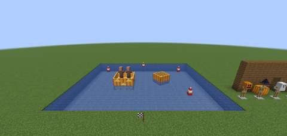 | 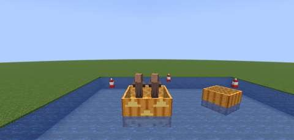 |
| **At midnight:** the barge's torch lights its carving | **Costumes:** a carved pumpkin, Witch Hat, Ghost Sheet, Scarecrow Hat and a hand-carved pumpkin, by a door with its jack o'lantern porch light |
| 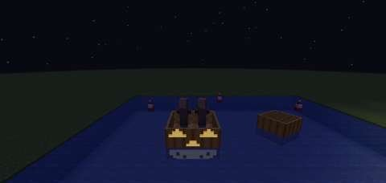 | 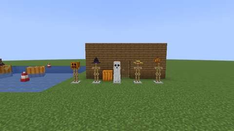 |
| **The Ghost Sheet** on its stand: a hood with eye holes, draped to the ground | **Worn by a player:** the sheet over the head, body and arms, moving with them |
| 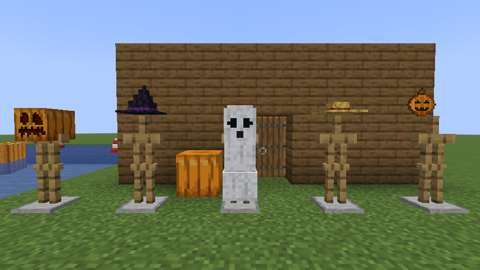 | 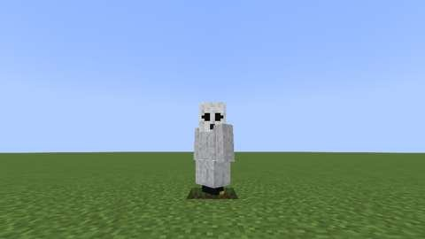 |

*Real screenshots from the client game test that CI runs (`RegattaClientGameTests`, software rendering, small previews).*

### Pumpkin boats and the regatta

Sneak and use the Carving Knife on top of a giant pumpkin to **hollow it out into a boat**. A full-grown 3×3×3 giant makes a **Pumpkin Barge**: four seats, and it keeps its weight, carving and torch, so a carved barge glows on the water at night. A 2×2×2 giant (stop it there by cutting its vine or giving it no room) makes a **Pumpkin Racer** for one. Lighter boats are faster: a racer 1.15–1.30× a boat, a barge 0.70–0.95×. Hollowing gives the pumpkin's guts and, full grown, its giant seeds, but not its pumpkins.

For a race, put a **Regatta Flag** on the shore and **Regatta Buoys** on still water, and number them by using them (1–16; sneak to count down). Used on foot, the flag finds its course and shows the board. Used from a pumpkin boat's driver's seat, it starts a run: after a three-second countdown, pass within 5 blocks of each buoy in order and come back to the flag. The server times it. The flag keeps the three best times, one per racer, and the first time you place you get the Harvest Scale's ribbon for that place.

### Trick-or-treating

While the Halloween event runs (by default 20 October to 3 November; the server operator sets the dates), use a **Candy Bag** on a villager's wooden door between dusk and midnight. Wear a costume on your head (a carved pumpkin, any hand-carved one, or a **Witch Hat**, **Ghost Sheet** or **Scarecrow Hat**), and make sure a porch light burns by the door (a jack o'lantern, a turnip lantern, or a lit hand-carved or giant pumpkin). The villager whose bed is inside opens up and hands you a treat: candy, caramel, cookies, a popcorn ball, a caramel apple or, rarely, a **King-Size Candy Bar**. Each home gives each player one treat a night; knock again and you get a harmless prank. Ten homes in one night earn **Full Bag**. When the event ends, nobody answers, but every treat and costume stays.

## What exists now: the Halloween festivities

More to do around Halloween, and decorations and sweets for any time of year. Voting, costumed mobs and the Peddler only happen while the Halloween event runs. Details, numbers and test evidence: [../features/halloween-festivities.md](../features/halloween-festivities.md).

| **The festivities:** costumed mobs, the graveyard, a haunted arch, the Judging Stand, the sweets and the Peddler | **At midnight:** the Candle Skulls and the carved pumpkin on the stand glow |
| --- | --- |
| 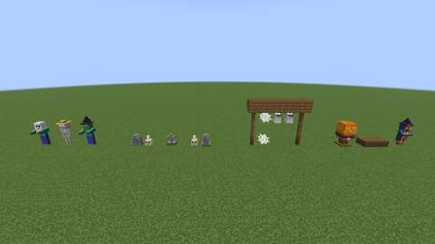 | 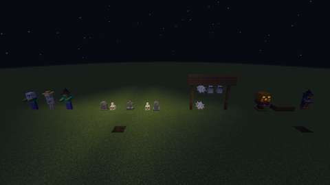 |
| **The graveyard:** Rounded, Cross and Obelisk Gravestones, engraved, with Candle Skulls | **An engraving** up close: "Here lies Jack O'Lantern, carved too deep" |
| 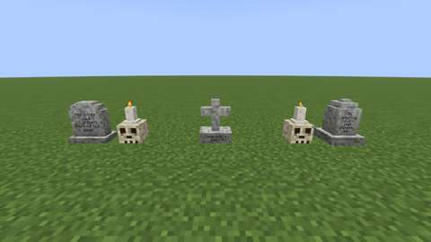 | 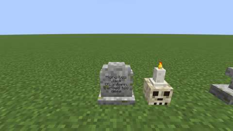 |
| **The Judging Stand** with a lit carving, the four sweets, and the Halloween Peddler in his Witch Hat | |
| 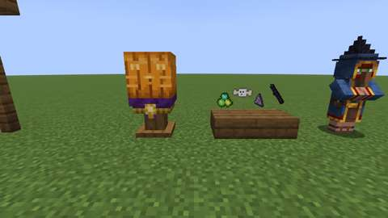 | |

*Real screenshots from the client game test that CI runs (`FestivityClientGameTests`, software rendering, small previews).*

### The carving contest

Put a hand-carved pumpkin on a **Judging Stand** and use the stand with an empty hand to enter it (only its carver can). While the event runs, everyone else uses the stand to vote for its carver: one vote per player per Halloween, moved by voting elsewhere, never for yourself. Sneak-use a stand for the standings. When the event ends, the three carvers with the most votes get the Harvest Scale's ribbons, once.

### Costumed mobs and the Halloween Peddler

During the event, 15 % of zombies, husks, skeletons, strays and zombie villagers wear a Witch Hat, Ghost Sheet, Scarecrow Hat or carved pumpkin, and drop a sweet when a player kills them. Wandering traders arrive as the **Halloween Peddler**, in a Witch Hat, selling four Halloween goods for emeralds: pumpkin seeds (giant and heirloom), costumes, decorations and sweets.

### Spooky decorations and sweets

**Gravestones** (Rounded, Cross and Obelisk, from a stonecutter) take a name: use a Name Tag named in an anvil on one, and its name is engraved on the stone. The **Spun Cobweb** looks like a cobweb but never slows anyone; the **Hanging Ghost** hangs under a block; the **Candle Skull** lights and snuffs like a candle. The Cooking Pot boils sugar into four sweets that work even on a full stomach: **Glow Gum** (Glowing), **Ghost Taffy** (a moment of invisibility), **Fizz Rocks** (Jump Boost) and **Witch's Licorice** (Night Vision).

## What exists now: Halloween nights

Things that happen on Halloween nights, and a throwing contest for any time of year. Wisps, the Horseman and the Harvest Moon only come while the Halloween event runs; everything they leave behind stays. Details, numbers and test evidence: [../features/halloween-nights.md](../features/halloween-nights.md).

| **Halloween nights** by day: the cornfield and scarecrow, three trebuchets, jars and lanterns, the cloak | **At midnight:** wisps over the corn, the Horseman, glowing jars and lanterns |
| --- | --- |
| 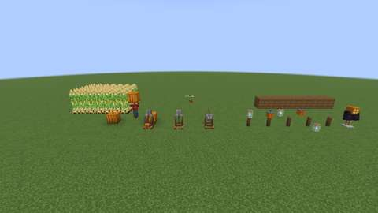 | 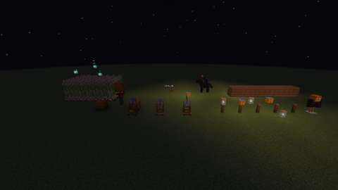 |
| **Trebuchets:** loaded, ready and just thrown, with a landing marker | **Wisps in Jars and Horseman's Lanterns**, standing and hanging, and the cloak on an armor stand |
| 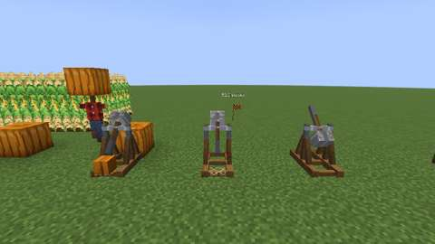 | 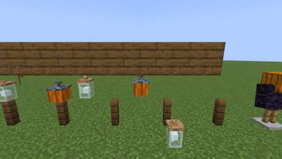 |
| **Will-o'-wisps** over the corn at midnight | **The Headless Horseman** between two of his lanterns |
| 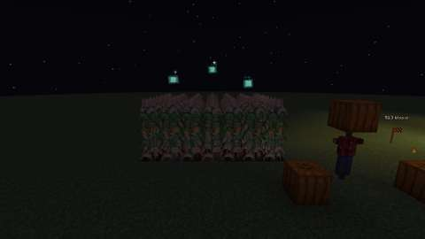 | 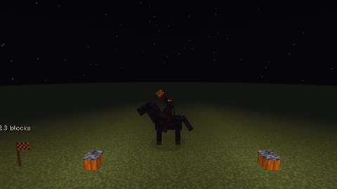 |
| **The Harvest Moon:** sparks over lit carvings | |
| 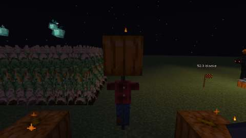 | |

*Real screenshots from the client game test that CI runs (`NightClientGameTests`, software rendering, small previews).*

### Will-o'-wisps

On event nights, little glowing **will-o'-wisps** drift over swamps and cornfields and dart away when you come near (sneak to get close). Use a **glass bottle** on one to catch it in a **Wisp in a Jar**, a lantern that glows all year. At dawn they fade.

### The Pumpkin Chunkin' Trebuchet

Load a **Trebuchet** with a pumpkin (any kind, carved or not), sneak-use it to set the release angle (30°–60°), and use it with an empty hand to fling the pumpkin about 50 blocks. A marker shows where it landed and how far. The trebuchet keeps a board of the three longest throws and gives the Harvest Scale's ribbons once per thrower. Hollow carved pumpkins fly farthest. Throw 50 blocks for **Pumpkin Chunkin'**.

### The Candy Bag and the Harvest Moon

The **Candy Bag** now holds treats like a bundle; trick-or-treating fills it, and its tooltip counts tonight's homes. On the nights of 31 October (in the server's time zone) the **Harvest Moon** rises: crops and giant pumpkins grow twice as fast, and lit carvings throw sparks.

### The Headless Horseman

Near midnight during the event, give a Scarecrow a lit pumpkin for a head and sneak-use it under the open sky. The **Headless Horseman** rides in for his head: a boss with a boss bar who charges and throws flaming pumpkins (they burn creatures, never blocks), and throws three at once when enraged at half health. He keeps to his arena and rides off at dawn. Defeat him for the **Horseman's Lantern** and **Horseman's Cloak** and the **Lost His Head** advancement.

## What exists now: Halloween decorations

The first fifteen of thirty Halloween decorations; the rest follow five at a time. All of them work all year. Details, numbers and test evidence: [../features/halloween-decorations.md](../features/halloween-decorations.md).

| **The decorations** by day: string lights on posts, Candy Bowls, Coffins, portraits and the Fog Machine's fog | **String lights** at midnight |
| --- | --- |
|  |  |
| **Candy Bowls:** empty, half full and heaped | **Coffins:** one open on its red velvet, one shut |
|  |  |
| **The Haunted Portraits:** the Lady in Black, the Old Captain, the Black Cat and the Owl | **At night** their eyes glow red |
|  |  |
| **The Fog Machine** at night, fog lying on the ground | |
|  | |

*Real screenshots from the client game test that CI runs (`DecorClientGameTests`, software rendering, small previews).*

- **Jack-o'-Lantern String Lights:** fix **String Light Hooks** to floors, walls or ceilings and string a strand of tiny pumpkin bulbs between them (up to 16 blocks apart). A hook lights from redstone or from a trickle of electricity, and a strand glows while either end is lit.
- **Candy Bowl:** fill it with candy and cookies for trick-or-treaters at your home. Each visitor may take one treat a night; you take any time.
- **Coffin:** two blocks long; its lid lifts on a 27-slot chest, and sneak-using it lets you lie down in it like a bed to set your spawn.
- **Haunted Portrait:** four sitters in a gilt frame whose eyes follow you, glowing red at night.
- **Fog Machine:** a dieselpunk machine on the electric network that rolls low fog over the ground, 4 to 16 blocks around it.

The second five:

| **Batch 2** by day: luminarias, floating candles, sconces and soul-lit pumpkins | **Bat Bunting** beside string lights |
| --- | --- |
|  |  |
| **Luminarias** at midnight, in eight colours | **Floating Candles** at midnight |
|  |  |
| **Skeleton Hand Sconces:** two burning, one snuffed | **At night** |
|  |  |
| **Soul-flame carvings:** a soul torch, a torch and none | **A giant pumpkin** lit by a soul torch |
|  |  |

*Real screenshots from the client game test that CI runs (`Decor2ClientGameTests`, software rendering, small previews).*

- **Luminaria:** a paper bag with a candle in sand and a face cut in its sides. Light it like a candle, and dye it any of 16 colours.
- **Floating Candles:** up to four candles that hang in the air and bob gently.
- **Skeleton Hand Sconce:** a torch held out from a wall by a bony hand.
- **Soul-Flame Carvings:** a soul torch lights any carved pumpkin, giant ones too, with an ice-blue glow.
- **Bat Bunting:** orange and black pennants and paper bats, strung between String Light Hooks like the string lights.

The graveyard:

| **The graveyard** by day | **The fence** with a shut and an open gate |
| --- | --- |
|  |  |
| **Grave Mounds:** three hands up, two down | **The crypt front:** crypt stone, pillars, a chiseled frieze and the Crypt Door |
|  |  |
| **The Mourning Angel** | **Pop-Up Skeletons:** one sprung, one in its crate |
|  |  |

*Real screenshots from the client game test that CI runs (`Decor3ClientGameTests`, software rendering, small previews).*

- **Wrought-Iron Cemetery Fence and Gate:** spear-topped iron railings and a two-leaf gate.
- **Crypt set:** crypt stone, a chiseled skull stone, fluted pillars and a heavy stone Crypt Door.
- **Grave Mound:** a zombie's hand claws up out of the earth as you walk past (sneak to creep by).
- **Mourning Angel:** a marble statue with its head in its hands that weeps at night.
- **Pop-Up Skeleton:** a crate on the lawn whose skeleton springs out at passers-by.

The witch's cottage:

| **The witch's cottage** by day | **At midnight:** the brews and the gazing crystal ball glow |
| --- | --- |
|  |  |
| **Bubbling Cauldrons:** a green brew over a campfire, purple, orange and water | **Apothecary Shelves,** each set out its own way, and the broom |
|  |  |
| **Crystal Balls** (one being gazed into) and the **Grimoire Stand** | **The cauldrons at night** |
|  |  |

*Real screenshots from the client game test that CI runs (`Decor4ClientGameTests`, software rendering, small previews).*

- **Bubbling Cauldron:** water from a bucket, then a spider eye, nether wart or glowstone makes a glowing green, purple or orange brew that bubbles over a fire.
- **Apothecary Shelf:** wall shelves of jars and tinctures; sneak-use to set them out another way.
- **Crystal Ball:** gaze into its violet mist for one of ten fortunes.
- **Grimoire Stand:** an open spellbook; use it to turn through four spreads.
- **Witch's Broom:** a twig besom leaning on its bristles.

The harvest party:

| **The harvest party** by day | **Bobbing for Apples Tubs:** none, two and four apples |
| --- | --- |
|  |  |
| **Pumpkin Crates:** pumpkins, and heirloom pumpkins, squash and gourds | **Hay Bale Seats** and **Autumn Wreaths** in all four colours |
|  |  |
| **A wreath on a door** | **Leaf Piles,** one to four layers of each colour |
|  |  |

*Real screenshots from the client game test that CI runs (`Decor5ClientGameTests`, software rendering, small previews).*

- **Bobbing for Apples Tub:** a tub of water with floating apples; duck for one with an empty hand.
- **Pumpkin Crate:** a slatted crate that shows four of your pumpkins, squash or gourds.
- **Hay Bale Seat:** a straw bale to sit on.
- **Autumn Wreath:** leaves, corn and mums, on a wall or a door.
- **Leaf Piles:** heaps of red, orange and yellow leaves to jump into.

The haunted house and yard:

| **The haunted house** by day | **At midnight:** the windows glow, eyes peer from the hedge |
| --- | --- |
|  |  |
| **Rocking Chairs** on the porch | **The Spooky Music Box** playing, and the **Giant Fake Spider** |
|  |  |
| **Silhouette Windows** lit from inside: bat, cat and witch | **Lurking Eyes** in the hedge at night |
|  |  |

*Real screenshots from the client game test that CI runs (`Decor6ClientGameTests`, software rendering, small previews).*

- **Rocking Chair:** sit in it; at night, empty, it rocks on its own.
- **Lurking Eyes:** glowing eyes in a hedge at night that vanish when you come close.
- **Silhouette Window:** a bat, cat or witch cut-out that glows when a lamp lights the other side.
- **Spooky Music Box:** an original waltz on note-block sounds, played by redstone or wound by hand.
- **Giant Fake Spider:** a big hairy spider swaying on a silk thread.

## What exists now: more Halloween

Forty-five more Halloween ideas, one category a batch: the haunted house inside, the mad scientist and monsters, the yard and porch, lighting and glow, party games, night events, treats, and costumes. All of it works all year, except the trick-or-treaters, who come only during the Halloween event. Details, numbers and test evidence: [../features/more-halloween.md](../features/more-halloween.md).

| **The haunted room** by day: the organ, the suit of armor, sheeted furniture and the doll | **At midnight**, lit by the chandelier |
| --- | --- |
|  |  |
| **The Phantom Pipe Organ** playing, with **Tattered Curtains** at the windows (one drape drawn open) | **Dust Sheets** over a rocking chair, a chest and a stair |
|  |  |
| **The Creepy Doll**, turned away since it was last seen | **The Haunted Chandelier** at night |
|  |  |
| **The Suit of Armor** at night, its visor glowing | **The Spirit Mirror** at night, its face showing |
|  |  |

*Real screenshots from the client game test that CI runs (`Decor7ClientGameTests`, software rendering, small previews).*

- **Haunted Chandelier:** eight candles on an iron ring; at night a draft blows them out and they relight one by one.
- **Phantom Pipe Organ:** three blocks wide, two tall; plays the opening of Bach's Toccata and Fugue in D minor, its keys pressing themselves, and sometimes plays alone at night.
- **Suit of Armor:** its helmet slowly turns to follow the nearest player.
- **Dust Sheet:** drape it over furniture or a chest for a house shut up long ago; pull it off and everything is as it was.
- **Spirit Mirror:** at night a pale face fades in and out of the glass.
- **Tattered Curtains:** ragged cheesecloth drapes that sway in a draft and open and shut together.
- **Creepy Doll:** its head has turned every time you look back.

### The mad scientist and monsters

| **The mad lab** by day: Tesla Coils, specimen jars, the lab table, the sarcophagus, a raven and two black cats | **At midnight** |
| --- | --- |
|  |  |
| **Two Tesla Coils** running, arcing to each other | **The Lab Table**, its patient sitting up on redstone |
|  |  |
| **Specimen Jars**: an eye, a tentacle, a tiny pumpkin and a brain | **The Mummy Sarcophagus** open, its mummy stepping out |
|  |  |
| **The Raven** on its perch and **two Black Cats**, one hissing | **The black cats** at night, eyes glowing |
|  |  |

*Real screenshots from the client game test that CI runs (`Decor8ClientGameTests`, software rendering, small previews).*

- **Tesla Coil:** runs on the electric network (20 JE a tick); hums, glows and throws harmless violet arcs to other running coils within eight blocks.
- **Lab Table:** a sheeted patient that sits bolt upright on a redstone signal, and twitches at night.
- **Specimen Jar:** glowing green fluid with an eye, a tentacle, a tiny pumpkin or a brain floating in it; sneak-use to change it.
- **Mummy Sarcophagus:** use it or power it and the lid grinds open, the mummy lurches out, and four seconds later it all shuts again.
- **Raven on a Perch:** watches the nearest player, ruffles and croaks, caws when used.
- **Black Cat Figure:** its tail swishes, its eyes glow at night, and it hisses at anyone who runs past.

### The yard and porch

| **The yard** by day: the porch and its witch, the inflatables, signs, hands, skeletons, the archway and the dead tree | **At midnight** |
| --- | --- |
|  |  |
| **Yard Inflatables**: a ghost, a black cat, a pumpkin stack and a spider | **The inflatables at night**, glowing from inside |
|  |  |
| **The Animatronic Porch Witch**, cackling over her pot | **Bone Wind Chimes** under the porch roof |
|  |  |
| **The Poseable Skeleton** waving, lounging, hanging from a gallows and sitting on the porch | **Spooky Signs** and **Grasping Hands** |
|  |  |
| **The Haunted Archway** and **the Dead Hollow Tree** | **At night**, their lanterns lit and the tree's eyes glowing |
|  |  |
| **Weathervanes** on the porch roof, a bat and a witch | |
|  | |

*Real screenshots from the client game test that CI runs (`Decor9ClientGameTests`, software rendering, small previews).*

- **Yard Inflatables:** two blocks tall; a click or redstone and the blower fills them, they wobble and glow from inside; switched off, they sag flat.
- **Animatronic Porch Witch:** stirs her pot and watches you; walk up and she throws her head back and cackles.
- **Grasping Hands:** snatch at the ankles of anything that steps on them (a short, harmless Slowness II); sneak past.
- **Poseable Skeleton:** use it to pose it: sitting, waving, lounging, hanging.
- **Bone Wind Chimes:** swing and clack under a porch roof, more and louder in rain and storms.
- **Weathervanes:** a bat or a witch, turning to point into one wind shared by the whole world.
- **Spooky Sign:** painted warnings, or your own words from a named Name Tag or an anvil.
- **Haunted Archway:** a lantern-lit gateway three blocks wide and tall, placed and broken as one.
- **Dead Hollow Tree:** four blocks tall, a face in its bark with glowing eyes, lanterns hanging from its branches.

### Lighting and glow

| **Witch Fire Braziers**, Floating Witch Hats and Mini Pumpkin Stacks by day | **At midnight** |
| --- | --- |
|  |  |
| **Witch fire**: orange, green, purple and blue | **The braziers at night** |
|  |  |
| **Glow Paint under Black Lights**, and the Shadow Puppet Lamp | **The same at night** |
|  |  |
| **The Shadow Puppet Lamp's** cat on the wall | **The black lights off**: the paint is only a faint smear |
|  |  |

*Real screenshots from the client game test that CI runs (`Decor10ClientGameTests`, software rendering, small previews).*

- **Black Light** and **Glow Paint:** paint a skull, bat, spider, web, handprint or eye on any face; it blazes green-white under a black light within six blocks.
- **Witch Fire Brazier:** a dye turns its flame orange, green, purple or blue; a shovel puts it out; it burns nothing.
- **Shadow Puppet Lamp:** its turning paper shade throws a bat, a cat and a witch round the walls.
- **Mini Pumpkin Stack:** three little jack o'lanterns with candles in them.
- **Floating Witch Hat:** a candle-lit hat floating in the air, bobbing and turning.

### Party games

| **The party** by day: the costume contest, the bowling lane, the dance floor, the traps, the ghost bell, the fortune teller and a candy cache | **At midnight**, lit by the dance floor |
| --- | --- |
|  |  |
| **The costume contest:** a witch on the runway, the judges' score cards up | **Pumpkin bowling:** seven pins down |
|  |  |
| **The scoreboard** chalks the frame and the score | **Jump-Scare Traps:** one ready, one gone off |
|  |  |
| **The Ghost Bell** ringing, **the Fortune Teller's Table** and a **Candy Cache** | **A reading:** the Pumpkin card turned, the planchette at YES |
|  |  |
| **The Monster Mash Dance Floor** at night, villagers on it | |
|  | |

*Real screenshots from the client game test that CI runs (`Decor11ClientGameTests`, software rendering, small previews).*

- **Jump-Scare Trap:** walk up to it (not sneaking), or trip a wire, and a ghost on a spring shoots out with a shriek.
- **Costume Contest:** walk the Costume Runway in costume while the Judges' Table has a round open; the others vote by using their favourite; the most votes win a Best Costume Ribbon.
- **Pumpkin Bowling:** roll a Bowling Pumpkin at Skeleton Pins; the Bowling Scoreboard keeps ten-pin score and stands the pins up.
- **Candy Cache:** a hollow stump that hides treats like a Candy Bowl.
- **Monster Mash Dance Floor:** lights up in pulsing colours from a playing jukebox or redstone; villagers dance on it.
- **Ghost Tag:** ring the Ghost Bell; the ghost glows and tags others by hitting them, harmlessly.
- **Fortune Teller's Table:** a tarot card, a planchette and twenty silly fortunes.

### Night events

| **Night events** by day: a toilet-papered yard, the bonfire and the hayride | **At night** |
| --- | --- |
|  |  |
| **Toilet paper** hanging from the trees | **Trick-or-treaters** at the door, by the Candy Bowl |
|  |  |
| **The Halloween Bonfire**, food on its skewers | **The Haunted Hayride**, children aboard |
|  |  |

*Real screenshots from the client game test that CI runs (`Decor12ClientGameTests`, software rendering, small previews). The children at the door are posed for the photograph; in play they walk up, knock and leave.*

- **Trick-or-treaters:** during the Halloween event, village children in costume come to a Candy Bowl by a lit door between dusk and midnight; each takes a treat and leaves a thank-you gift, or, if the bowl is empty, they toilet-paper your trees.
- **Toilet Paper Rolls:** thrown, they drape streamers from leaves and over fences; rain washes them off.
- **Haunted Hayride:** a four-seat hay wagon on rails; at night its riders hear something spooky now and then.
- **Halloween Bonfire:** cooks what a campfire cooks, four at a time, twice as fast; toast marshmallows on a stick over it.

### Treats

| **A Halloween party table** by day: barmbracks, punch bowls, a Candy Bowl and giant candy | **At night**, the punch glowing |
| --- | --- |
|  |  |
| **The Witch's Brew Punch Bowl** at night, fog rolling over its rim | **Every treat**, framed on the wall |
|  |  |
| **The Barmbrack**, whole and cut | **Giant Candy**: candy corn, a lollipop, a wrapped sweet and a gumdrop |
|  |  |

*Real screenshots from the client game test that CI runs (`Decor13ClientGameTests`, software rendering, small previews).*

- **Witch's Brew Punch Bowl:** a berry brews two servings of glowing punch, up to twelve; a glass bottle ladles one out. Drinking it makes you glow.
- **Soul Cakes** and the **Barmbrack:** a fruit loaf eaten a slice at a time; one slice hides a ring, and every slice tells a fortune.
- **Pumpkin Spice Latte** (Speed for thirty seconds), **Pumpkin Bread**, **Spiderweb Cupcakes** and **Bat-Wing Cookies**; soul cakes, cupcakes and cookies are treats for Candy Bowls and Candy Bags.
- **Giant Candy:** block-sized props; an empty hand changes the design.

### Costumes

| **Six outfits** on armor stands: the vampire cape, mummy wraps, skeleton suit, werewolf mask, cat ears and tail, and bat wings | **From behind**: the cape, the tails and the folded wings |
| --- | --- |
|  |  |
| **At night** the skeleton suit's bones glow | **On mobs**: a crouching zombie wrapped in its cape, a skeleton in a werewolf mask, a husk in mummy wraps |
|  |  |
| **Bat wings** spread in the air | **The Costume Trunk**, open |
|  |  |

*Real screenshots from the client game test that CI runs (`Decor14ClientGameTests`, software rendering, small previews). The floating armor stand stands in for a jumping player.*

- **Six outfits**, worn on the head and drawn over the whole body: the **Vampire Cape** flares as you walk and wraps round you when you sneak; **Mummy Wraps**; a **Skeleton Suit** whose bones glow; a **Werewolf Mask** with fur, claws and a tail; **Cat Ears and Tail**; **Bat Wings** that spread and flap when you jump. All count as costumes for trick-or-treating.
- **Costume Trunk:** keeps nine costumes; an empty hand changes you into the next one.

## Fall additions

Ten more fall and Halloween additions, one per pull request ([features/fall-additions.md](../features/fall-additions.md)).

### The chandlery

| **The chandlery**: a pot of molten purple beeswax over a campfire, a cold pot of set tallow, and a table of Aura Candles | **Aura Candles** of one to four layers, in several colours and scents; the flame takes the colour of the first scent |
| --- | --- |
|  |  |
| **The Wax Melting Pot** from above: the wax in its colour, at its level | **At night**: the candles' light and flames |
|  |  |

*Real screenshots from the client game test that CI runs (`ChandleryClientGameTests`, software rendering, small previews).*

- **Wax Melting Pot:** set it over a fire and melt honeycomb (beeswax) or rotten flesh (tallow) in it; stir in dyes, up to two scents, glowstone dust (a stronger aura, a faster burn) and redstone (a longer burn).
- **Aura Candles:** dip string to start one, then dip it again once each layer has cooled, up to four layers. Each layer makes it bigger, brighter and wider-reaching, and adds its wax's colour, scents and burn time. A third scent muddles it.
- **Lit, a candle is a small beacon:** every four seconds it gives everyone in its radius its scents' effects, wards off monsters, makes creatures glow or speeds up crops, until it burns down. Broken, it keeps what is left.

### The cider mill

| **The cider mill**: an apple tree, two Cider Presses and three Cider Barrels | **An apple tree** in blossom and hung with ripe apples |
| --- | --- |
|  |  |
| **Cider Presses** from above: apples in the hopper and pulp in the basket; a cheese halfway pressed, with juice in the trough | **Cider Barrels**: sweet, sparkling and aged, by their chalk marks |
|  |  |

*Real screenshots from the client game test that CI runs (`CiderClientGameTests`, software rendering, small previews).*

- **Apple trees:** wild in plains and flower-rich places, or grown from apple seeds; the leaves blossom and then hang with apples to pick, without cutting the tree down.
- **Cider Press:** turn the crank to grind apples into pulp, one at a time; then four turns of the screw press out the juice (a serving an apple) and knock out the pomace. Bottle the juice as Sweet Cider.
- **Cider Barrel:** sweet cider ferments into Sparkling Cider in a day and matures into Aged Cider in three; broken, a barrel keeps its cider.
- **Mulled Cider** (Cooking Pot), **Apple Cider Donuts**, and **Apple Pomace** for pigs, compost and seeds.

### The preserves pantry

| **The pantry**: a Canning Kettle at the boil over a campfire, and two Pantry Shelves of preserves | **The Canning Kettle** from above: four jars in the boiling water |
| --- | --- |
|  |  |
| **Pantry Shelves**: jars sealed with gingham caps, and not | |
|  | |

*Real screenshots from the client game test that CI runs (`PantryClientGameTests`, software rendering, small previews).*

- **Preserves** cooked into **Mason Jars** in the Cooking Pot: jams, fruit butters, jelly, and pickles and relish in **Cider Vinegar**. A jar holds four servings; the last leaves the jar.
- **Unsealed jars spoil** three days after cooking. The **Canning Kettle** seals them in a boiling water bath: sealed jars keep until opened, stack, and wear a gingham cap.
- **Pantry Shelf:** shows off six jars.

### Crows and working scarecrows

| **Crows** over a carrot patch just out of a scarecrow's reach, and one of them down on it, pecking | **The working scarecrow**: wearing a pumpkin head, it guards the field eight blocks round |
| --- | --- |
|  |  |

*Real screenshots from the client game test that CI runs (`CrowClientGameTests`, software rendering, small previews). The pecking crow was sent after its crop and pecks for real; the others are posed in flight.*

- **Crows** come to fields by day in small flocks, wheel over them, and drop onto ripe crops to peck them three growth stages back (only while `mob_griefing` is on). Crops under a roof, tall crops, gourds and bushes are safe.
- **Scarecrows keep them off:** crows leave the crops within 4 blocks of a bare scarecrow alone, 8 of one wearing a pumpkin head, 12 of one wearing a lit head.
- Crows fly off from a player who comes close, from a blow, and at nightfall; they drop feathers. Details: [fall additions](../features/fall-additions.md#crows).

### Spooky fireworks

| **Spooky fireworks** at midnight: a bat, a jack o'lantern, a ghost and a skull, each drawn in sparks facing the camera | **A finale** fired from a Show Launcher: nine rockets fanned out, their pictures bursting together |
| --- | --- |
|  |  |
| **The Show Launcher**, loaded: a rocket's nose in each tube, the dial on its front set to "finale" | |
|  | |

*Real screenshots from the client game test that CI runs (`FireworkClientGameTests`, software rendering, small previews). The four pictures in the first are burst straight on the client; the finale is fired from the launcher for real.*

- **Spooky fireworks** burst into a bat, a jack o'lantern, a ghost or a skull in coloured sparks, the right way round for every player. Paper, gunpowder (the flight) and the picture's ingredients; glowstone dust to twinkle. They hurt and break nothing.
- **Show Launcher:** nine tubes of sixteen rockets each (spooky or vanilla), fired in sequence, in volleys or as a finale, by hand or redstone. Details: [fall additions](../features/fall-additions.md#spooky-fireworks).

### The sky lantern festival

| **Sky Lanterns** let go together at night in seven colours, rising together; one carries a wish, "A good harvest" | **Mooncakes:** red bean, chestnut and pumpkin, and a Sky Lantern, in item frames |
| --- | --- |
|  |  |

*Real screenshots from the client game test that CI runs (`LanternClientGameTests`, software rendering, small previews). The lanterns are let go for real and photographed as they rise.*

- **Sky Lanterns**, dyed any colour and named for a wish, rise glowing on a wind they all share and burn out after two minutes or so.
- **The lantern festival:** eight let go within 32 blocks in two minutes fill the sky, with Luck and A Sky Full of Wishes for everyone near.
- **Mooncakes** baked in the Cooking Pot, with Luck when eaten outdoors under a full moon. Details: [fall additions](../features/fall-additions.md#sky-lanterns).

### The Harvest Feast Table

| **A Harvest Feast Table** of four lengths, set with eight foods between hay bale seats | **The dishes** up close: bread, roasted corn, pumpkin pie, chicken, apples, mooncakes, baked potatoes and cookies, each heaped by its servings |
| --- | --- |
|  |  |

*Real screenshots from the client game test that CI runs (`FeastClientGameTests`, software rendering, small previews). The dishes are served on the server and drawn by the client.*

- **Harvest Feast Table:** lengths end to end join into one long table; each holds two dishes of up to eight servings of any food or drink.
- **The feast** grows with the variety on the table and the company at it: Regeneration, then Absorption, then Haste and Luck, then Health Boost and Harvest Home, shared with everyone who ate there lately. Details: [fall additions](../features/fall-additions.md#the-harvest-feast-table).

### The corn maze

| **A medium corn maze** (15 by 15) planted by its gate: the entrance on the near side, the exit with its finish post straight across | **The Corn Maze Gate**, its green pennant pointing into the maze between walls of maze corn |
| --- | --- |
|  |  |

*Real screenshots from the client game test that CI runs (`MazeClientGameTests`, software rendering, small previews). The gate plants the maze for real, a few stalks a tick.*

- **Corn Maze Gate:** choose a size, then use it holding corn kernels to plant a maze of three-tall corn from a fresh seed, one way through, with a finish post at the exit.
- **Runs** are timed on the server from the gate to the finish post and voided for flying, climbing out, leaving or a shortcut; the best times go on the gate's board, with prize ribbons and A-maze-ing. Details: [fall additions](../features/fall-additions.md#the-corn-maze).

### Ghost hunting

| **Restless spirits** revealed at night over a row of gravestones and grave mounds, lit by soul lanterns | **The hunter's kit:** a Spirit Lantern and a bottle of Ectoplasm in frames, and a lit Ghostly candle |
| --- | --- |
|  |  |

*Real screenshots from the client game test that CI runs (`GhostClientGameTests`, software rendering, small previews). The spirits are revealed on the server and drawn by the client.*

- **Restless spirits** rise from gravestones and grave mounds at night and drift about their graves, unseen until revealed.
- **The Spirit Lantern** reveals every spirit within 12 blocks to everyone near; a revealed spirit shies away but can be cornered, and a glass bottle catches it as **Ectoplasm**, the Ghostly candle scent (invisibility). Details: [fall additions](../features/fall-additions.md#ghost-hunting).

### Face paint

| **Face paint**, all six designs on the player's face: a skull, a jack o'lantern, a black cat, a vampire, a witch and a scarecrow (cropped and enlarged from the test's screenshots) | **A vampire**, the whole frame: the player in third person, seen from the front |
| --- | --- |
|  |  |

*Real screenshots from the client game test that CI runs (`FacePaintClientGameTests`, software rendering, small previews). Each design is painted on the server and drawn on the face by the client.*

- **Face Paint Kit:** paints one of six designs on a friend at once, or on your own face after a held use; good for 16 faces.
- **A painted face is a costume** for trick-or-treating and the costume contest, and washes off under water. Details: [fall additions](../features/fall-additions.md#face-paint).

## More fall additions

Ten more fall and Halloween additions, numbered on from the first ten, one per pull request ([features/more-fall-additions.md](../features/more-fall-additions.md)).

### The candy kitchen

| **Candy Kettles** on iron trivets over campfires, each at its own stage on the thermometer, the last one burning | **Candy** in frames: rock candy, lollipops, taffy, hard candy, fudge and the rest, flavoured and dyed |
| --- | --- |
|  |  |

*Real screenshots from the client game test that CI runs (`CandyClientGameTests`, software rendering, small previews). Each kettle was filled and set to its temperature on the server.*

- **Candy Kettle:** a copper sugar pot with a candy thermometer. A base (water for syrup, milk for cream), up to four sugar, two flavours and dyes go in before it boils; over a fire it climbs through the candy stages, a bell at each, and the hottest it reaches decides the candy.
- **Candy Tray:** rock candy grown for a day, candy corn in three coloured layers, taffy pulled while warm, hard candy and lollipops, caramel, fudge, cream caramels and toffee. Flavoured candy gives short effects. Details: [more fall additions](../features/more-fall-additions.md#the-candy-kettle).

### Autumn foraging

| **The forest floor**: chanterelles, porcini, puffballs, fly agarics and jack o'lantern mushrooms under the trees | **Wild mushrooms** up close |
| --- | --- |
|  |  |
| **A fairy ring at night**, the jack o'lantern mushrooms glowing | **The Foraging Basket and the dishes** in frames |
|  |  |

*Real screenshots from the client game test that CI runs (`ForagingClientGameTests`, software rendering, small previews).*

- **Wild mushrooms** grow in patches on forest floors, each in its own biomes, and spread in the shade up to five of a kind; bone meal spreads them in any light. The jack o'lantern mushroom glows.
- **Fairy rings:** on a full-moon night a mushroom may sprout a ring of its kind. Stand in the centre of a ring on a full-moon night for Luck II, once a night.
- **Foraging Basket:** holds forage; mushrooms picked with it in hand go straight in. Cook chanterelles, porcini and puffballs, or make Forager's Stew in the Cooking Pot. Details: [more fall additions](../features/more-fall-additions.md#wild-mushrooms).

### The Bat House

| **Bat Houses** on a barn wall, their trays holding no guano, a little, more and a pile; Bat Guano in a frame | **From above**, the guano in the trays |
| --- | --- |
|  |  |
| **At dusk** the bats pour out | |
|  | |

*Real screenshots from the client game test that CI runs (`BatHouseClientGameTests`, software rendering, small previews). Each house was filled with four bats and let them out itself, on the server.*

- **Bat House:** bats roost in it by day and pour out at dusk; at dawn the nearest bats come back in, up to four, each leaving a guano on the tray. A house with room gains a bat at dusk now and then. Scoop the guano with an empty hand; comparators read the bats.
- **Bat Guano** fertilizes the crops in a 3x3 patch, and four make a phosphate. Details: [more fall additions](../features/more-fall-additions.md#the-bat-house).

### The Hay Golem

| **Hay Golems** in a carrot and wheat field: one in a carved pumpkin, one bent over the carrots harvesting, one in a lit hand-carved white pumpkin with a cat's face; a chest at a post, and a T of hay waiting for its head | **Up close** |
| --- | --- |
|  |  |
| **At night**, the lit head glowing | |
|  | |

*Real screenshots from the client game test that CI runs (`HayGolemClientGameTests`, software rendering, small previews). The golems are posed (no AI) for the picture.*

- **Build one** from a T of four hay bales with a carved pumpkin on top. It keeps crows off crops within eight blocks (twelve with a lit head), harvests and replants the ripe crops round its post, and carries the harvest to the chest under its post.
- Lead it with wheat; wheat heals it; shears take it apart. Details: [more fall additions](../features/more-fall-additions.md#the-hay-golem).

### Knitting

| **Knitting:** Spinning Wheels (bare, with a skein of orange wool, half spun with purple) and, by a campfire, armour stands in knitwear: a cream beanie, pumpkin sweater and socks; a red striped sweater and green beanie; an orange bat sweater and black socks | **The knitwear** up close |
| --- | --- |
|  |  |
| **Spinning Wheels**, turning | **Yarn, needles and garments** |
|  |  |

*Real screenshots from the client game test that CI runs (`KnittingClientGameTests`, software rendering, small previews).*

- **Spin** wool into yarn on the Spinning Wheel, by hand or with redstone; **knit** it a row at a time on Knitting Needles into beanies, socks and sweaters, the colour of the blend of their rows.
- Knitwear keeps out powder snow, takes dye like leather, and two pieces by a campfire make you cosy. Details: [more fall additions](../features/more-fall-additions.md#knitting-needles-and-yarn).

### Pie baking

| **Pie baking:** three Hearth Ovens (lit with an apple pie baked golden, lit with a pumpkin cream pie just gone in, and cold with a burnt cranberry pie) and a table of pies | **The ovens** up close |
| --- | --- |
|  |  |
| **Pies**: whole, with one, two and three slices gone, and burnt | **Dough, raw pies, slices** and an oven |
|  |  |

*Real screenshots from the client game test that CI runs (`PieClientGameTests`, software rendering, small previews).*

- **Bake** in a Hearth Oven fed coal, charcoal, coke or logs: a raw pie bakes golden at 600 points while the oven is hot enough, and burns at 1,200.
- Pies are placed like cakes and eaten or cut a slice at a time. Details: [more fall additions](../features/more-fall-additions.md#the-hearth-oven).

### The Spirit Board

| **Spirit Boards**, one facing each way, the planchette on M, YES, NO and GOODBYE | **Up close**: the letters, and the planchette on M |
| --- | --- |
|  |  |
| **A séance** at night: a board between lit candles, a revealed restless spirit over it | |
|  | |

*Real screenshots from the client game test that CI runs (`SpiritBoardClientGameTests`, software rendering, small previews). The planchettes and the spirit are posed for the picture.*

- **Hold a séance** by candlelight, fingers on the planchette (friends make it faster): the nearest restless spirit spells its name and its wish.
- Give a revealed spirit its wish and it is laid to rest. Details: [more fall additions](../features/more-fall-additions.md#the-spirit-board).

### Wild turkeys

| **A flock**: two toms (one strutting), two hens and three poults | **Strutting toms** up close, their tails fanned |
| --- | --- |
|  |  |
| **Roast turkeys** on the table: whole, the drumsticks gone, the breast carved, the carcass | |
|  | |

*Real screenshots from the client game test that CI runs (`TurkeyClientGameTests`, software rendering, small previews). The turkeys are placed and the strut held for the picture.*

- **Wild turkeys** come to woods and meadows in flocks; seeds breed them, hens lay eggs, and toms strut for an audience.
- **Roast one** and set it on the table: six servings, eaten or carved. Details: [more fall additions](../features/more-fall-additions.md#wild-turkeys).

### The Theremin

| **Theremins**: the left one playing, its magic eye lit; the right one silent | **Up close**: the antennas, grille, knobs and the glowing eye |
| --- | --- |
|  |  |
| **At night**: the playing theremin's eye glows | |
|  | |

*Real screenshots from the client game test that CI runs (`ThereminClientGameTests`, software rendering, small previews). The note above the playing one is the camera standing in its range.*

- **Switch a theremin on** and it sings for whoever is nearest, higher the nearer they come.
- Silent or playing, **comparators read how near** the nearest creature is. Details: [more fall additions](../features/more-fall-additions.md#the-theremin).

### The Ofrenda

| **An ofrenda** under papel picado, a welcomed spirit over it, marigolds, candles and sugar skulls either side and a path of petals | **Up close**: the offerings on its tiers |
| --- | --- |
|  |  |
| **At night**: complete and glowing, a spirit welcomed among the offerings | |
|  | |

*Real screenshots from the client game test that CI runs (`OfrendaClientGameTests`, software rendering, small previews). The offerings and the spirit are placed for the picture.*

- **Set out an ofrenda** with flowers, a light, bread, a sugar skull and a drink, and at night it welcomes the spirits near.
- Marigolds, papel picado, sugar skulls and pan de muerto to make and decorate with. Details: [more fall additions](../features/more-fall-additions.md#the-día-de-muertos-ofrenda).

### The Graveyard: headstones

| **A gothic headstone** in white marble, a willow-and-urn slate behind | **Slates**: a willow and urn, a winged skull, and the lamb |
| --- | --- |
|  |  |
| **A lamb for a child**, and a mossy rustic scroll | **A broken column** and a Celtic high cross |
|  |  |
| **A table tomb and a ledger stone**, from their feet | **Weathering**: clean, worn, mossy and overgrown |
|  |  |
| **The epitaph screen**, opened with the Stonemason's Chisel | |
|  | |

*Real screenshots from the client game test that CI runs (`HeadstoneClientGameTests`, software rendering, small previews). The epitaphs and stages are set for the picture.*

- **Nine life-sized, carved memorials** in marble, slate, granite and sandstone, cut in a stonecutter or a crafting table from vanilla stone: the tall ones stand two or three blocks high, the tomb and ledger lie two blocks long.
- **Cut an epitaph** with the Stonemason's Chisel (an iron ingot over a stick): four lines, each as large as fits the stone. A named Name Tag cuts a name.
- **They weather**: worn, mossy, then overgrown with lichen and ivy, and the letters fade. A Brush scrubs them, honeycomb waxes them, bone meal ages them. Neglected graves stir more restless spirits at night. Details: [the graveyard pack](../features/graveyard.md).

### The Graveyard: monuments

| **A grand obelisk** in granite, the draped urn beside it | **The draped urn** on its pedestal |
| --- | --- |
|  |  |
| **The Angel at the Tomb**, kneeling at its end | **The trumpeting angel** on her column |
|  |  |
| **An iron mortsafe** and **the faithful hound** | **The row** along the path |
|  |  |

*Real screenshots from the client game test that CI runs (`MonumentClientGameTests`, software rendering, small previews). The epitaphs and stages are set for the picture.*

- **Six monuments**, two to four blocks each: a granite **obelisk**, a marble **draped urn**, the **Angel at the Tomb** grieving over an altar, a **trumpeting angel** on a fluted column, an iron **mortsafe** caged over a grave against the body-snatchers, and a bronze **faithful hound** on its plinth.
- They are headstones in every way: they weather (the mortsafe rusts, the hound grows verdigris), take an epitaph from the chisel and stir spirits. Details: [the graveyard pack](../features/graveyard.md#monuments).

### The Graveyard: buildings

| **The four buildings** along the path: the mausoleum, the lych gate, the cemetery gateway and the columbarium | **The family mausoleum**, its Bronze Mausoleum Door hung |
| --- | --- |
|  |  |
| **Inside**: the altar under the stained glass, the sanctuary lamp | **The crypt fronts**, each cut with its own name |
|  |  |
| **The lych gate**, its tie beam inscribed | **The cemetery gateway**, its name in gilt between the lanterns |
|  |  |
| **The columbarium**, six niches and a frieze | **The mausoleum overgrown** |
|  |  |
| **At night**, the gateway's lanterns lit | |
|  | |

*Real screenshots from the client game test that CI runs (`GraveyardBuildingClientGameTests`, software rendering, small previews). The inscriptions and stages are set for the picture.*

- **Four buildings**, each one item placed whole and broken as one: a walk-in **family mausoleum** (85 blocks: a temple front, twelve crypt fronts, an altar, stained glass and a sanctuary lamp), a **lych gate** of oak and slate, a granite and wrought-iron **cemetery gateway** with lanterns, and a marble **columbarium** of six niches.
- Every crypt front and niche takes **its own inscription** from the chisel, and the building its main one. They weather, wax and stir spirits as one. The **Bronze Mausoleum Door** fits the mausoleum's doorway. Details: [the graveyard pack](../features/graveyard.md#buildings).

### The Graveyard: grounds

| **The grounds** along a gravel path, lamp posts at either end | **A kerbed grave** before its headstone, **planted graves** beside it |
| --- | --- |
|  |  |
| **Kept and neglected**: one planted grave in flower, one gone to weeds | **An open grave**, its spoil heaped beside it, the cross waiting |
|  |  |
| **A memorial bench** with its plaque | **At night**, the lamp posts lit |
|  |  |
| **Grave vases** on their granite bases, a bouquet of each colour | |
|  | |

*Real screenshots from the client game test that CI runs (`GraveyardGroundsClientGameTests`, software rendering, small previews). The stages and epitaphs are set for the picture.*

- **Graves to lay out**: a **kerbed grave** of polished granite and marble chippings with an open book at its head, a **planted grave** whose flowers go to weeds if it is left, and an **open grave**, freshly dug, which stirs spirits twice as often.
- A **memorial bench** with an inscribed plaque that seats a player, and a **cemetery lamp post** three blocks tall, lit after dark.
- **Grave vases**: put small flowers in for a bouquet of their colour. While fresh they calm the graves within 3 blocks to half the spirits, then they wilt. Details: [the graveyard pack](../features/graveyard.md#grounds).

### The Graveyard: flora

| **A haunted churchyard**: the flora round headstones, a crypt wall, a mandrake bed and an oak hung with shroud moss | **The flowers**: black roses, spider lilies, foxgloves, a funeral lily, snowdrops, nightshade and bleeding hearts |
| --- | --- |
|  |  |
| **The tall plants** along the wall: foxglove, funeral lily, asphodel, withered grass and ghost ferns | **The crypt wall**: creeping ivy over its faces, potted flora on top |
|  |  |
| **Shroud moss** hanging from the oak's leaves | **The mandrake bed**, from seed to ripe, and a pulled root |
|  |  |
| **By night** | **Ghost pipes** glowing in the dark |
|  |  |

*Real screenshots from the client game test that CI runs (`GraveyardFloraClientGameTests`, software rendering, small previews). The crops' stages are set for the picture.*

- **Seventeen plants for a haunted churchyard**, sculpted like hand-built plants (bent stems, cut-out leaves and petals at angles, bells and berries as little boxes) rather than crossed pictures:
  - flowers to pot and dye: **spider lily**, **snowdrop**, **deadly nightshade**, **bleeding heart** and the glowing **ghost pipe**;
  - two-block flowers: **black rose**, **foxglove**, **funeral lily** and **asphodel**;
  - foliage: **withered grass** and the silvery **ghost fern** (bone meal grows both tall), **dead man's fingers**, **grave moss**, **shroud moss** hanging in strands from leaves, and **creeping ivy** over walls.
- **Where:** the Ghost Forest, Gloomweald, Hallowed Bog, Dead Swamp, Sludge Mire, Dead Forest and Bayou, and some in vanilla's spooky, swamp, snowy and forest biomes.
- **The mandrake:** pull a wild one for its roots and plant them on farmland. A ripe mandrake **screams** when pulled up, sickening every player within 8 blocks with nothing on their head (wear something: **Mind Your Ears**). Its root also makes **Flying Ointment** in the purple brew.
- **Grave vases** take the flora's flowers by colour. Details: [the graveyard flora](../features/graveyard-flora.md).

### The churchyard's ornaments

| **A catacomb corner**: ossuary walls, bone piles, gargoyles, giant bone hands and witch's lanterns | **The ossuary walls** and bone piles heaped at their foot |
| --- | --- |
|  |  |
| **Two gargoyles** on their inscribed plinths, one weathered to moss, and a bone hand | **The giant bone hands**, the right one clenched by a hidden redstone block |
|  |  |
| **Witch's lanterns** hanging from a beam, and two standing | **By night**, by the lanterns' violet light |
|  |  |

*Real screenshots from the client game test that CI runs (`ChurchyardOrnamentsClientGameTests`, software rendering, small previews). The gargoyles' inscriptions and weathering are set for the picture.*

- **Gargoyle**: crouched on a granite plinth, wings folded, jaws open for the rain. It weathers and takes an inscription on its plinth like the graveyard's monuments.
- **Bone Pile**: bones and skulls heaped up to four layers. **Ossuary Wall**: a catacomb's skulls and long bones as a building block.
- **Giant Bone Hand**: two blocks tall out of grave earth, clenching into a fist on a redstone signal.
- **Witch's Lantern**: gothic iron and violet glass, standing or hanging. Details: [the churchyard's ornaments](../features/churchyard-ornaments.md).

### The haunted house's props

| **A haunted parlour**: flying eyeballs staring from the air, candles on the table, monster's heads, webs and the harvest plushes | **The flying eyeballs**, each turned to stare at the player |
| --- | --- |
|  |  |
| **Pillar candles**, ivory and black, one to four in a cluster, lit | **Monster's heads**: asleep, and awake on a redstone signal with its jaw dropped and eyes glowing |
|  |  |
| **Spider webs** over the walls and ceiling of a corner | **The harvest plushes**: owl, hedgehog, acorn, corn and maple leaf |
|  |  |
| **By candlelight** at night | |
|  | |

*Real screenshots from the client game test that CI runs (`HauntedHousePropsClientGameTests`, software rendering, small previews). The candles are lit and one head is powered for the picture.*

- **Flying Eyeball**: a bloodshot eye on red bat wings that hovers in its block, bobbing and beating its wings, and **turns to stare at the nearest player**.
- **Pillar Candles**, ivory and black: dripping church candles, one to four in a cluster, lit and put out like vanilla's.
- **Spider Web**: a whole web, with its spider, strung over any face of a block.
- **Monster's Head**: a stitched green monster's head with bolts in its neck; on a redstone signal its jaw drops, its eyes glow and its bolts spark.
- **Harvest plushes**: an owl, a hedgehog, an acorn, an ear of corn and a maple leaf, five more prizes at the midway. Details: [the haunted house's props](../features/haunted-house-props.md).

### The Witch's Workshop

| **The workshop**: two horned skull cauldrons over ember beds, the candelabra, the cabinet of curiosities, the jars and the broom | **The cauldrons**: a potion's colour, its fumes rising over the heat and things floating in it |
| --- | --- |
|  |  |
| **The cabinet of curiosities**, with candelabra in purple and red wax | **The oddity jars**: eyeballs, a beating heart, a bat and a two-headed snake |
|  |  |
| **The Enchanted Broom** and its Dustpan | **By candlelight** at night |
|  |  |
| **The branching chandelier** and the wall girandole | **The moth cases** and the bell jar |
|  |  |

*Real screenshots from the client game test that CI runs (`WitchsWorkshopClientGameTests`, software rendering, small previews). The cauldrons are filled, heated and stocked, the candles lit and recoloured, and the broom woken, for the picture.*

- **Horned Skull Cauldron**: an iron pot with a ram's skull on its front that holds water or three bottles of one potion, brews over heat (an Ember Bed is one), floats a witch's ingredients, and, stirred with the Brew Ladle, wafts the potion onto up to four players near it at a quarter of its duration.
- **Wrought-iron candelabra**: a floor candelabrum, a table candelabrum, a wall girandole and a branching chandelier, in six waxes and four flames, lit by flint, burning arrows or redstone, dripping wax as they burn.
- **Enchanted Broom and Dustpan**: woken with Flying Ointment, the broom sweeps dropped items into a Dustpan for three in-game days. The Broom Rack shows three brooms.
- **Cabinet of curiosities**: the Curiosity Cabinet shows nine things on its shelves, the Bell Jar one, and the Moth Display Case pinned moths that stir at night.
- **Oddity jars**: eyeballs that watch you, a heart that beats as a redstone clock, a bat that wakes as you come near, a two-headed snake and a drumming hand. Details: [the Witch's Workshop](../features/witchs-workshop.md).

### The Crypt and the Ossuary

| **The crypt, the parlour and the buried giant**: sarcophagi and coffins, the bone throne and its bookcases, the colossus before a church wall | **The crypt**: stone brick, deepslate and blackstone sarcophagi carved with a knight, a lady and a skull, the deepslate one open; a locked Iron-Bound Coffin and an open one |
| --- | --- |
|  |  |
| **The Coffin Wardrobe**, dressed in odd armour, and an open coffin on its velvet | **The ossuary parlour**: the Bone Throne between two Ribcage Bookcases, the Skull Footstool and Vertebra Floor Lamps |
|  |  |
| **The Buried Colossus**: the skull with its jaw dropped, ribs arched over a spine, a femur and the Giant Bone Hand | **A church wall in a thunderstorm**: Chimera Finials with their wings spread, Gargoyle Rainspouts over cauldrons |
|  |  |
| **The parlour at night**, the throne's eyes burning | **The colossus at night**, a Gargoyle Sentinel watching a pumpkin-headed zombie |
|  |  |

*Real screenshots from the client game test that CI runs (`CryptAndOssuaryClientGameTests`, software rendering, small previews). The coffin is locked, the wardrobe dressed, the bookcases filled and the skull's jaw dropped, for the picture.*

- **Iron-Bound Coffin**: 54 slots, locked to a Skeleton Key cut from a Key Blank; locked, only its key opens it and hoppers can't reach in. Keys copy onto blanks. The **Coffin Wardrobe** swaps the armour you wear for the armour on its skeleton mannequin.
- **Stone Sarcophagi**: 27 slots under a lid that slides aside over a skeleton, recarved with the Stonemason's Chisel; at night, shut, they sometimes knock.
- **The ossuary parlour**: the Bone Throne (its crest's eyes glow while sat in at night), the Ribcage Bookcase (a chiseled bookshelf that powers enchanting tables), the Skull Footstool and the Vertebra Floor Lamp.
- **The Buried Colossus**: a Colossal Skull whose jaw drops on redstone, Colossal Ribs that meet as an arch, Colossal Vertebrae and a Colossal Femur.
- **The gargoyles**: the Gargoyle Sentinel signals the nearest monster by its distance, the Gargoyle Rainspout fills a cauldron in the rain, and the Chimera Finial reads rain and storms. Details: [the Crypt and the Ossuary](../features/crypt-and-ossuary.md).

### The Laboratory, the Larder and the Dining Room

| **The laboratory, the larder, the dining room and the yard**, from above | **The laboratory**: the Lightning Harness caught as it fires, the patient on the Lab Table sitting bolt upright; the Brain-Vat Consoles and a Tesla Coil |
| --- | --- |
|  |  |
| **The spider's larder**: Silk Cocoons hung from a beam, Egg Sac Clusters on the floor and wall, a Web Drape across the door and a Silk Spool Stack in three colours | **The dining room**: a Harvest Feast Table laid with Floating Table Settings for dinner, tea and a feast, Haunted Dining Chairs round it and the Grandfather Clock by the wall |
|  |  |
| **The yard**: a path of Witchlight Path Stakes in every colour, a Witchlight Lamp-Post, Hanging Witchlights under a fence arch, the six Yard Silhouettes and the Harvest Moon Lamp | **The dining room at midnight**: the candles lit and a chair slid out |
|  |  |
| **The yard at midnight**: the witchlights awake, the full moon lit | **The laboratory at midnight** |
|  |  |

*Real screenshots from the client game test that CI runs (`LaboratoryLarderDiningClientGameTests`, software rendering, small previews). The harness is fired, the candles lit and a chair slid out for the picture; the witchlights are kept awake by redstone torches under the path.*

- **The Reanimation Rig**: the Lightning Harness fires on a strong signal, a Tesla Coil's arc or lightning and wakes the Lab Table's patient; the Brain-Vat Console remembers the strongest signal at its back; the Crawling Hand drums its fingers and, powered, scuttles.
- **The Spider's Larder**: the Silk Cocoon (a 9-slot larder that wriggles), Egg Sac Clusters (spiderlings at night), the Web Drape (2 × 2, slows you) and the Silk Spool Stack (dye each spool).
- **The Poltergeist's Dinner Party**: the Haunted Dining Chair slides out at night, the Floating Table Setting is laid three ways, and the Grandfather Clock keeps the hour and the moon, strikes and pulses each hour, and shows a face at midnight.
- **The Witchlight Lantern Path**: three lamps that wake for a player near, in five colours.
- **The Yard Silhouettes and the Harvest Moon Lamp**: six black cut-outs whose eyes glow at night, and a 2 × 2 moon showing tonight's phase. Details: [the Laboratory, the Larder and the Dining Room](../features/laboratory-larder-dining.md).

### Pumpkin Night

| **The farm stand, the effigy and the choir**, from above | **The Farm Stand**: Red Kuri, Kabocha, apples, carrots, white pumpkins and corn in its crates, each price chalked on its tag and the owner's name on the header board; carved Red Kuri and Kabocha on hay bales beside it |
| --- | --- |
|  |  |
| **The Singing Pumpkins** caught mid-song, mouths open: bass, tenor, alto and soprano on hay bales, a Pumpkin Vine Garland and an Autumn Leaf Garland strung on the posts behind | **The Harvest Effigy at midnight**, burning: the blaze climbing round him to his carved Red Kuri head, his hands alight, his purple cloak |
|  |  |
| **The garlands at midnight**, their bulbs lit by the hooks' power | **The Farm Stand at midnight**, the carved heirlooms glowing their own colours |
|  |  |

*Real screenshots from the client game test that CI runs (`PumpkinNightClientGameTests`, software rendering, small previews). The choir is made to sing and the effigy lit for the pictures; the hooks are charged so the bulbs glow.*

- **Red Kuri and Kabocha pumpkins**: heirlooms with their own seeds, hand-carved pumpkins that glow ember orange and greenish gold, and Red Kuri Soup and Kabocha Tempura.
- **The Farm Stand**: an owner's stall of six crates sold for Jugs one item at a time, every sale checked on the server.
- **The garlands**: a Pumpkin Vine Garland and an Autumn Leaf Garland hung between String Light Hooks.
- **The Harvest Effigy**: burnt on a fall night for Harvest Cheer, once a night; he leaves Effigy Ashes that give Hearth Ash.
- **The Singing Pumpkins**: four voices tuned like note blocks and sung by redstone. Details: [Pumpkin Night](../features/pumpkin-night.md).

## Even more fall additions

Ten more fall and Halloween additions, numbered on from the twenty before, one per pull request ([features/even-more-fall-additions.md](../features/even-more-fall-additions.md)).

### Hex brews

| **Three hex brews** over magma, their draughts framed above | **The shrinking brew**, glyphs rising from it |
| --- | --- |
|  |  |
| **Shrunk**: the cauldrons from half a player's height | **A shrunk player** beside the cauldrons |
|  |  |
| **A giant**, 1.6 times as tall | |
|  | |

*Real screenshots from the client game test that CI runs (`HexBrewClientGameTests`, software rendering, small previews).*

- **Brew a hex:** over a lit campfire, fire or magma, stir a brown mushroom into the Bubbling Cauldron's green brew, beans into the orange or a phantom membrane (or a mandrake root, from the graveyard flora) into the purple. A hex brew fills three glass bottles.
- **Shrinking Draught:** half your size for 3 minutes, through one-block gaps. **Giant's Draught:** 1.6 times your size for 3 minutes, a block more reach, only where there is room. Each cancels the other. **Flying Ointment:** 30 seconds of slow falling. Details: [even more fall additions](../features/even-more-fall-additions.md#hex-brews).

### The flying broomstick

| **Brooms** by a cauldron of flying ointment: one hovering, one dry | **Riding** in a witch hat, from behind |
| --- | --- |
|  |  |
| **The rider** from in front | **At midnight** |
|  |  |

*Real screenshots from the client game test that CI runs (`BroomstickClientGameTests`, software rendering, small previews).*

- **Make one** from a Witch's Broom, a Flying Ointment and two feathers, and use it to get on. It flies where you look: forward to go, back to brake, jump to climb. It's a quarter faster in a witch hat.
- **Ointment is its fuel:** 2 minutes of flight each, up to 6. Run dry, it sinks gently down. Anoint a waiting broom with more; sneak-use takes it back. Fly high on a full-moon night for Over the Moon. Details: [even more fall additions](../features/even-more-fall-additions.md#the-flying-broomstick).

### Full-moon werewolves

| **Wolfsbane** growing wild in a spruce clearing, and potted on a stump | **Silver** framed above the fire, and the three rugs: brown, snow and shadow |
| --- | --- |
|  |  |
| **Up close** on a full-moon night: the snow werewolf, and the shadow werewolf snarling | **The three kinds** in the clearing: brown, snow and shadow, and their rugs by the fire |
|  |  |

*Real screenshots from the client game test that CI runs (`WerewolfClientGameTests`, software rendering, small previews; the night is lit by night vision for the picture).*

- **On full-moon nights,** werewolves come howling out of forests and taiga. They're fast, leap at you, shrug off half of any blow, and are gone at dawn. There are three kinds:
  - the **Brown Werewolf** (tier I) hunts your livestock too, calls its pack with a howl, and runs when badly hurt;
  - the **Snow Werewolf** (tier II), in snowy woods, freezes you with its bite (wear leather) and is faster on snow;
  - the rare **Shadow Werewolf** (tier III), most often in dark woods, steps out behind you from the shadows. Its howl darkens the night and sends the pack into a frenzy. Only planted wolfsbane keeps it off.
- **Silver** hurts them most: a Silver Dagger or Silver Arrows. **Wolfsbane**, a wild violet flower, wards them off: hold a sprig or plant it round your home. Each kind's pelt makes its own rug. Details: [even more fall additions](../features/even-more-fall-additions.md#full-moon-werewolves).

### Squirrels and acorns

| **A grey squirrel** with an acorn on a stump; a red and a grey one below | **Further back:** acorns on the ground and an oak sapling |
| --- | --- |
|  |  |
| **Side on:** the bushy tail curls up over its back | **Acorns** and roasted acorns, framed above a furnace |
|  |  |

*Real screenshots from the client game test that CI runs (`SquirrelClientGameTests`, software rendering, small previews).*

- **Squirrels**, red and grey, live in forests and taiga. They scamper up tree trunks, bolt when hurt, and follow anyone holding nuts: acorns or chestnuts breed them.
- **Acorns** drop from oak and dark oak leaves. Plant one on grass for an oak sapling, or roast it for a snack. A squirrel takes acorns lying near and buries them, and one in four grows into an oak. Details: [even more fall additions](../features/even-more-fall-additions.md#squirrels-and-acorns).

### The Pumpkling

| **Three Pumpklings** in a pumpkin patch; a carved pumpkin not yet woken on a hay bale, and a Wisp in a Jar | **Up close:** stencilled faces, one lit, one soul-lit blue |
| --- | --- |
|  |  |
| **At nightfall** | |
|  | |

*Real screenshots from the client game test that CI runs (`PumpklingClientGameTests`, software rendering, small previews).*

- **Wake a carved pumpkin:** use a Wisp in a Jar or a bottle of Ectoplasm on a hand-carved pumpkin with a face. It hops up as a Pumpkling, a little pet on vine legs wearing the face you carved.
- It follows you and sits when you use it with an empty hand. A torch lights its face. Crows keep away from crops near it, as from a scarecrow. A glass bottle settles it back into its pumpkin. Details: [even more fall additions](../features/even-more-fall-additions.md#the-pumpkling).

### The fall fair midway

| **The midway:** a prize booth under a striped awning, two High Strikers (one rung, its tower lit) and Ring Toss | **The prizes** on the booth's counter |
| --- | --- |
|  |  |
| **Ring Toss:** crates of nine bottles, one up on a hay bale | **At dusk** |
|  |  |

- **The High Striker** stands five blocks tall: a red-and-white tower with lamps up its front and a bell on top. Hit its pad with a **Carnival Mallet** and the puck climbs, lighting the lamps, as far as you hit it. A fully charged swing sometimes rings the bell; jump and hit it on the way down and it usually does. Ring it and win a prize.
- **Ring Toss:** toss **Toss Rings** at a crate of nine bottles from three blocks off or more. Land one over a bottle's neck to win a prize; misses can be picked up and thrown again.
- **Prizes** are plushes: a pumpkin, a ghost, a bat, a black cat, a squirrel, a rare werewolf, and the very rare Jumbo Pumpkin Plush. Squeeze one and it squeaks. Details: [even more fall additions](../features/even-more-fall-additions.md#the-fall-fair-midway).

### The Ferris wheel

| **At the fair:** the wheel, a High Striker and the plush prizes | **Its foot:** the booth, with the cars hanging over it |
| --- | --- |
|  |  |
| **From a car near the top** | **At night**, its lights on |
|  |  |

- **Raise one** by placing the **Ferris Wheel** booth where it has room (15 blocks across, 16 high, 3 deep). The wheel stands over it, facing you, with eight cars of two seats.
- **Turn it** with kinetic power against the booth: a **hand crank** (planks and an iron shaft) turns it at full speed, five seconds a crank, so one friend cranks while others ride; an engine turns it all day.
- **Ride it:** use the booth to climb into the car at the bottom. Sneak to get off and you're set down by the booth. Its lights come on while it turns. Details: [even more fall additions](../features/even-more-fall-additions.md#the-ferris-wheel).

### The piñata party

| **Three piñatas** (pumpkin, star and bat) hanging from a pergola | **Torn**, after half their hits |
| --- | --- |
|  |  |
| **The star bursts** in confetti, its candy flying | **Through the Blindfold** |
|  |  |

- **Hang a piñata** (a pumpkin, a star or a bat, of crepe-paper fringe) from the underside of a block, and let everyone fill it with candy and treats: anything goes in, a stack at a time.
- **Put on the Blindfold** and swing: a charged swing is a hit, and the Piñata Stick hits twice as hard. It tears as it weakens and bursts in confetti on its last hit, spraying its contents everywhere. Details: [even more fall additions](../features/even-more-fall-additions.md#the-piñata-party).

### The hot-air balloon fiesta

| **The fiesta field:** the Jack-o'-Lantern aloft on its mooring rope over Harvest Stripes and Harvest Moon, pibals rising | **Night glow:** its burner firing |
| --- | --- |
|  |  |
| **Up close:** the wicker basket, twin-coil burner and rigging | **From the basket,** 17 blocks up at the top of the rope |
|  |  |
| **Its pilot,** seated in a corner | **The glow** from below the envelope |
|  |  |

- **Balloons:** Harvest Stripes, the Jack-o'-Lantern and Harvest Moon. Set one up on open ground, fuel it with coal, charcoal or coke, and climb in: up to four ride, and the first aboard pilots.
- **Fly by heat:** hold jump to fire the burner and back to open the vent. You can't steer: the winds blow different ways at different heights, so pick the height that blows your way. Let a **pibal** go to see them. Go out low and come home higher for The Box.
- **Mooring Posts** tether a balloon for rides at a fair. At night, the envelopes glow while their burners fire. Details: [even more fall additions](../features/even-more-fall-additions.md#the-hot-air-balloon-fiesta).

### The leaf blower

| **The Leaf Blower** at the foot of a leafy lawn | **Blowing:** the piles herded up to the fence |
| --- | --- |
|  |  |
| **The heap** against the fence | **Vacuuming** it up |
|  |  |

- **The Leaf Blower** is a powered tool: charge it at a Charging Station. Hold use to blow, sneak and hold use to vacuum.
- **Blowing** herds leaf piles along the way you face, a layer at a time, until a wall, a fence or a full pile stops them: sweep a lawn into one heap. It blows dropped items along, nudges mobs, and puts out candles.
- **Vacuuming** takes leaf piles and leaf litter up into your inventory, a layer at a time, for the composter, and draws dropped items in. Details: [even more fall additions](../features/even-more-fall-additions.md#the-leaf-blower).

## What exists now: the Farmhouse Kitchen

The first slice of the [kitchen and cooking expansion](#the-kitchen-and-cooking-expansion-planned): cooking devices and a preparation step, drawn in the owner's own farming and food textures. Details and test evidence: [features/farmhouse-kitchen.md](../features/farmhouse-kitchen.md).

| **The Farmhouse Kitchen** | **Stoves:** a full hob, a skillet, a pot, and one out |
| --- | --- |
|  |  |

- **Kitchen Stove.** A brick range (3 iron, 5 bricks and a campfire). Light it with flint and steel or a fire charge; a shovel puts it out. Lit, it glows and heats whatever stands on it, so a Cooking Pot, a kettle or a Skillet cooks on top. With nothing on top, its **hob** cooks up to six raw foods at twice a campfire's pace: use them on its top, and each pops off cooked. Its hot top burns what stands on it unless they sneak.
- **Skillet.** An iron pan for any heat source: a lit stove, a campfire, fire, lava or magma. It takes up to 16 of one raw food and fries them one at a time at a furnace's pace; an empty hand takes everything out.
- **Cutting Board** and **knives.** Set anything on the board; use a knife on it to cut what lies there. Porkchops become bacon, beef minced beef, chicken cuts, mutton chops, cod and salmon slices (with bone meal), cabbage leaves, pumpkin slices, and a cake seven slices. Knives come in flint, iron, bronze, gold, steel, diamond and netherite (a smithing upgrade). Any knife, the Carving Knife included, also cuts slices from pies and cakes and servings from the roast turkey.
- **Kitchen cabinets** in eleven woods: a chest-sized cupboard whose doors swing open while someone looks inside.
- **New foods:** raw and cooked bacon, beef patties, chicken cuts, mutton chops and fish slices; cabbage leaves, pumpkin slices, slices of cake and fried eggs. A whole's cuts are never worth more than the whole.

## What exists now: feasts and food displays

The second slice of the [kitchen and cooking expansion](#the-kitchen-and-cooking-expansion-planned): food to set on the table and show off, in the owner's own textures. Details and test evidence: [features/feasts-and-food-displays.md](../features/feasts-and-food-displays.md).

| **Feasts:** whole, half eaten and leftovers | **The displays** laid with food |
| --- | --- |
|  |  |

- **Feasts:** Roast Chicken, Honey-Glazed Ham, Shepherd's Pie, Stuffed Pumpkin and the glowing Gleaming Salad, each crafted from five or six foods and placed whole. A bowl takes a serving away; a hungry player eats one in place. The model is eaten down a serving at a time to the leftovers, which a use clears (for a bone or pumpkin seeds). Four servings give about what the ingredients do.
- **Pies in the owner's art:** the apple pie (same ID and baking, the owner's look), and two new Hearth Oven pies, chocolate and the sweet berry cheesecake.
- **The pumpkin pie set down:** sneak and use vanilla's pumpkin pie on a block to set it down as a pie, eaten or cut in four slices that add up to the pie.
- **Plate, Platter and Serving Tray:** set food (or anything) on them to show it, one thing to the plate and four to the platter or tray, each where you use it.

## What exists now: the menu

The third slice of the [kitchen and cooking expansion](#the-kitchen-and-cooking-expansion-planned): dishes from the owner's own food art, each one set down as a 3D model. Details, the balance table and test evidence: [features/the-menu.md](../features/the-menu.md).

| **The table:** every dish set down | **The Cooking Pot** in the owner's pot, and the nachos |
| --- | --- |
|  |  |

- **55 new items:** drinks (hot cocoa, a creamy corn drink, melon juice, glow berry custard and a milk bottle that clears effects), soups and stews, plated meals and pastas, sandwiches, burgers, wraps and tacos, dumplings and ham, things on a stick (corn dogs, a barbecue stick, popsicles), cookies and caramel popcorn, boiled corn, cornbread, tortillas and chips, and the doughs and batters they start from. Corn on the cob gives its corncob back.
- **Every dish sets down:** sneak and use it on a block to set it down facing you, as a model fitted to the owner's icon (a bowl, a plate, a stacked sandwich, a standing mug or bottle, or the icon lying flat); an empty hand takes it back.
- **The owner's art on old favourites:** the onion, vegetable and pumpkin soups, cabbage rolls, roasted corn and mulled cider wear the owner's icons (same IDs, recipes and food), popcorn set down is the owner's striped popcorn box, and the **Cooking Pot** is the owner's iron pot (same block, recipes and screen).
- **Nachos,** a sixth feast served four times. **Dog Food** and **Horse Feed** heal your own tamed wolf or horse and give it a boost.

## What exists now: rice and wet farming

The fourth slice of the [kitchen and cooking expansion](#the-kitchen-and-cooking-expansion-planned), and slice 7 of the [crop roster](#crop-roster-what-comes-next-planned): rice grown in flooded fields, in the owner's own textures. Details, the balance table and test evidence: [features/rice-and-wet-farming.md](../features/rice-and-wet-farming.md).

| **The paddy** at every stage, and wild rice | **The table:** the rice dishes and the Rice Roll Medley |
| --- | --- |
|  |  |

- **Rice paddies.** Rice is its own seed: plant it into still water one block deep over bog soil (dirt, grass, mud, sand, clay or gravel) with air above. It grows two blocks tall, its panicles above the water; use a ripe plant or a sickle to pick 2-3 Rice Panicles, and the stalks stay to grow more. Flooded soil counts as moist farmland, under the plant and around it. The plant keeps its water when broken.
- **Wild rice** grows in swamp and river shallows (shears take the plant; otherwise it gives rice), and rice drops from short grass.
- **Straw and storage.** The Cutting Board cuts a panicle into two rice and a Straw. Nine rice make a Bag of Rice, nine panicles a Rice Bale and nine straw a Straw Bale, each crafting back into its nine.
- **Tatami.** Four straw weave a Tatami; set against a lone one, it pairs into a two-block mat. Full Tatami Mats lie two blocks long as a bed does, and Half Tatami Mats one.
- **Rice dishes,** each set down as the menu's are: Cooked Rice, Fried Rice and Mushroom Rice from the Cooking Pot; Salmon, Cod and Kelp Rolls, and Kelp Roll Slices cut from the kelp roll; and the **Rice Roll Medley**, a platter of rolls served one at a time, which gives the platter back.

## What exists now: soil, compost and storage

The fifth slice of the [kitchen and cooking expansion](#the-kitchen-and-cooking-expansion-planned): better soil and somewhere to keep the harvest, in the owner's own textures. Details and test evidence: [features/soil-compost-and-storage.md](../features/soil-compost-and-storage.md).

| **The garden:** rich farmland with wheat and corn, and the compost heap | **The storehouse:** produce crates, the kernel bag and the baskets |
| --- | --- |
|  |  |

- **Organic Compost** (dirt, four straw, two bone meal, two rotten flesh) rots through four stages into **Rich Soil**, every random tick while water touches it, otherwise half of them.
- **Rich Soil** counts as dirt; a hoe tills it into **Rich Soil Farmland**, which takes crops as farmland does, keeps moist by water or rain, is never trampled, and dries back into Rich Soil. Whatever grows on either gets an extra random tick for each of the soil's own, about twice the pace.
- **Produce crates** (beetroot, cabbage, carrot, corn, onion, potato, tomato) and the **Bag of Corn Kernels** hold nine each and craft back into them. The Pumpkin Crate is unchanged, as the owner chose.
- **Wooden and Bamboo Baskets** are nine-slot storage blocks of their own, open at the top: items dropped in are taken in, hoppers reach them, and a comparator reads them. The Foraging Basket is unchanged, as the owner chose.

## What exists now: orchards

The sixth slice of the [kitchen and cooking expansion](#the-kitchen-and-cooking-expansion-planned): four fruit trees that fruit every year, in Jugcraft's own art (the owner's library has no fruit trees; the owner chose to build it this way). Details and test evidence: [features/orchards.md](../features/orchards.md).

| **The orchard:** pear, peach, lemon and orange trees hung with fruit | **The table:** the new pies, juices, preserves and saplings |
| --- | --- |
|  |  |

- **Pear, peach, lemon and orange trees** grow from their seeds (the peach's pit) into oak-trunked trees, each in its own shape. As the [apple tree's](#the-cider-mill), their leaves blossom and then hang with ripe fruit; a right-click picks one to three, and the leaves fruit again. A fruit crafts into its seed.
- **Wild:** pears and peaches in the Orchard, lemons and oranges in the Mediterranean Forest and the Subtropics; pears in forests, peaches in plains and savannas, lemons in savannas and oranges in savannas and jungles elsewhere.
- **Orange Juice** and **Lemonade,** drinks that set down as the menu's do; **Peach** and **Lemon Meringue Pies** from the Hearth Oven; **Orange Marmalade**, **Peach Preserves** and **Pear Butter** in Mason Jars.

## What exists now: cakes

Seven cakes the owner drew and shared on 8 October 2026 ("CAKES & BAKES - 3D CAKES"), rebuilt from their drawing and baked in the Hearth Oven as the pies are, as the owner chose. Details and test evidence: [features/cakes.md](../features/cakes.md).

| **The display:** the seven cakes and the Burnt Cake, whole and cut | **As the owner drew it:** the carrot cake whole and cut |
| --- | --- |
|  |  |

- **Carrot, Birthday, Ice Cream, Red Velvet, Coffee and Apple Cakes and a Cheesecake.** Cake Batter (wheat, an egg, sugar and milk), a sugar and the cake's own two ingredients make a raw cake; the Hearth Oven bakes it, or burns it into a Burnt Cake.
- **Set down whole,** a block wide and facing whoever set it down, with the drawing's toppings: carrots, candles, a square of berry jam, apple slices. Eaten, or cut with a knife into slices, a quarter at a time: the front right quarter first, showing the cake's inside as the owner's INTERIOR drawing does.

## What exists now: fruit crops

Five fruits the owner asked for on 8 October 2026 before the milkshakes and the pies and tarts that need them, as crops in Jugcraft's own art (their library has none of these fruits; the owner chose to build them this way). Details and test evidence: [features/fruit-crops.md](../features/fruit-crops.md).

| **The bushes:** strawberries, blueberries and coffee, from planted to ripe | **The trees:** the plum and the banana hung with ripe fruit |
| --- | --- |
|  |  |

- **Strawberry Plant, Blueberry Bush and Coffee Plant:** bushes a block tall on farmland, planted from seeds (from short grass, a wild plant or a fruit); ripe, a right-click picks them and they fruit again, as the pepper does.
- **Plum and banana trees,** grown from a Plum Pit and a Banana Pup as the [orchards'](#what-exists-now-orchards) are; the banana on a Banana Stem of its own under drooping fronds.
- **Wild:** strawberries in forests and flower fields, blueberries in taigas and hills, coffee and bananas in jungles, plums in forests and taigas; plums in the Orchard, bananas in the Tropics and the Rainforest.
- **Coffee Beans** roasted from coffee cherries (the Coffee Cake now takes them); **Strawberry, Blueberry and Plum Jam** in Mason Jars.

## What exists now: pies and tarts

Ten pies and tarts the owner drew and shared on 8 October 2026 ("CAKES & BAKES - 3D PIES & TARTS"), rebuilt from their drawing and baked in the Hearth Oven as the pies and cakes are. Details and test evidence: [features/pies-and-tarts.md](../features/pies-and-tarts.md).

| **The pies,** whole in front and cut behind | **As drawn:** the strawberry pie and the blueberry tart, whole and cut |
| --- | --- |
|  |  |

- **Strawberry, Plum, Banoffee, Whipped Pumpkin and Pork Pies** and **Blueberry, Sweet Berry, Lemon, Strawberry and Coffee Tarts.** Pastry Dough, a sugar (none in the pork pie) and the bake's own ingredients make a raw pie or tart, from the [fruit crops](#what-exists-now-fruit-crops), the [orchards'](#what-exists-now-orchards) lemons and the farm; the Hearth Oven bakes it, or burns it into a Burnt Pie.
- **Set down whole,** a block wide and facing whoever set it down: a pie seven texels tall under its crust, a tart four, its rim standing round the filling and the drawing's berries, lemon or cream on top. Eaten, or cut with a knife into slices, a quarter at a time: the front right quarter first, showing the filling inside as the owner's page does.

## What exists now: milkshakes

Seven milkshakes the owner drew and shared on 8 October 2026 ("CAKES & BAKES - 3D MILKSHAKE"), each read off their drawing as its own sundae glass. Details and test evidence: [features/milkshakes.md](../features/milkshakes.md).

| **The seven** on a counter | **As drawn:** the strawberry and banana milkshakes |
| --- | --- |
|  |  |

- **Strawberry, Banana, Plum, Apple, Blueberry, Pumpkin and Chocolate Milkshakes,** made by hand from a Milk Bottle, a snowball, a sugar and the flavour (the [fruit crops'](#what-exists-now-fruit-crops) strawberries, blueberries, plums and bananas among them). Drunk even when full, for five food and half a minute of Haste, leaving the bottle.
- **Set down** by a sneaking player as the owner's glass: a foot of glass bars, the shake between the glass's posts, cream, the fruit on top and a leaning straw. An empty hand takes it back.

## The kitchen and cooking expansion (planned)

On 7 October 2026 the owner asked for "lots more crops, plants, food, cooking devices, preparation systems", with "lots and lots of the food to be very decorative and displayable", drawn from the farming and food textures in their own library ([art/owner-library](../../art/owner-library/README.md)). The plan is ten slices, each its own pull request; the owner chose the Farmhouse Kitchen first, then feasts and food displays. Where a slice meets something Jugcraft already has (its cabbage, onion, corn and tomato crops, the Cooking Pot, the apple pie), the owner decides one by one, seeing both looks side by side. Slices 1 to 6 are built; for slice 2 the owner gave the apple pie their art and let vanilla's pumpkin pie be set down in their art, for slice 3 they gave their art to the Cooking Pot, three soups, the cabbage rolls, roasted corn, mulled cider and set-down popcorn, for slice 5 they made their baskets storage blocks of their own and kept their produce crates separate from the Pumpkin Crate, and for slice 6, with no fruit trees in their library, they chose Jugcraft's own art and four trees: pear, peach, lemon and orange. On 8 October 2026 they shared pages of their own drawings: [seven cakes](#what-exists-now-cakes), built first from their drawing, then the new [fruit crops](#what-exists-now-fruit-crops) (strawberries, blueberries, bananas, plums and coffee) they asked for before their milkshakes and pies and tarts, then [ten pies and tarts](#what-exists-now-pies-and-tarts) and [seven milkshakes](#what-exists-now-milkshakes) from their drawings.

| Slice | What it adds | Ties to the roster above |
| --- | --- | --- |
| **1. Farmhouse Kitchen** ✅ | The Kitchen Stove, the Skillet, the Cutting Board, knives, cabinets | — |
| **2. Feasts and food displays** ✅ | Placeable feasts and pies served a portion at a time; platters, trays and plates to show food on | Pies and the Harvest Feast Table |
| **3. The menu** ✅ | 55 dishes and ingredients from the owner's food art, each dish placeable as a 3D model; the owner's Cooking Pot (their rice dishes came with slice 4) | Uses the cuts from slice 1 |
| **4. Rice and wet farming** ✅ | Rice paddies, wild rice, straw, rice and straw storage, tatami, and the owner's rice dishes and roll medley | Roster slice 7 |
| **5. Soil, compost and storage** ✅ | Organic compost, rich soil and its farmland, produce crates, the kernel bag, and storage baskets | Uses the rice slice's straw |
| **6. Orchards** ✅ | Pear, peach, lemon and orange trees, juices, pies and preserves (grapes and berries wait) | Roster slice 4 |
| **7. Garden crops, herbs and spices** | More vegetables, herbs and spices | — |
| **8. Mill, dairy and bakery** | Flour, butter, cheese, bread and pastry | Farm equipment below |
| **9. Preserving and curing** | Jams, pickles, smoking and curing | The preserves pantry |
| **10. Engineered dieselpunk kitchen** | Powered stoves, mixers and slicers that automate the earlier slices | The engineering branch |

## Crop roster: what comes next (planned)

The branch grows in small slices that each stand on their own. Each crop needs a job: a food, a material another branch wants, or a farming mechanic. Proposals are welcome.

| Slice | Crops | New mechanic | Why it matters |
| --- | --- | --- | --- |
| **1. Fall Harvest** ✅ | Corn, sunflower, beans, sweet potato, flax | Tall crops, picking, legumes, wild plants, sickles | Starter farming; mazes and fields; string, feed and stew |
| **2. Kitchen garden** ✅ | Tomato, onion, garlic, cabbage, pepper, oats, barley | Trellises for climbing crops; the **Cooking Pot** for multi-ingredient meals | A real kitchen: soups, salads, porridge. Cabbage + salt → sauerkraut uses Jugcraft's salt. Garlic can later double as a ward against the planned Vampirism school (not built yet) |
| **3. Festival Crops** ✅ | Butternut and acorn squash, warty gourds, turnip, cranberry, chestnut tree | Gourds grow from stems like pumpkins; bog crops in shallow water; a fruit tree | Halloween: Turnip Lanterns (the original jack-o'-lantern), gourd displays, candy corn. December: cranberry sauce, roasted chestnuts. All permanent, so nothing is lost after a season |
| **4. Orchards and vines** (apple, pear, peach, lemon, orange, plum, banana, blueberries ✅) | Apple (built: [the cider mill](#the-cider-mill)), pear, peach, lemon and orange trees (built: [orchards](#what-exists-now-orchards)); plum and banana trees and blueberries (built: [fruit crops](#what-exists-now-fruit-crops)); grapes and hops on trellises; raspberries | Fruit trees that grow from saplings and fruit every year without being cut down | Juices, pies, preserves; the cider press; long-term homestead beauty |
| **5. Fibre, oil and industrial crops** | Cotton, canola, sugar beet, rubber tree, indigo and madder | Tapping (rubber) and retting (flax to linen) | What engineers need from farmers: rubber for insulated cables and belts, plant oil for lubricant and biodiesel, sugar and corn for ethanol, fibres for canvas, dyes |
| **6. Magical botany** | One herb per magic school (proposal names: Emberroot, Frostcap, Stormreed, Stonebloom, Gravemoss, Bloodthorn, Nightshade, Moonpetal) | Attunement: an herb grows only near its school's influence or with a ritual catalyst | Reagents for the magic branch; see [CONTENT_BRANCHES.md](../CONTENT_BRANCHES.md#magical-workshops-and-schools) |
| **7. Rice and wet farming** (rice ✅) | Rice (built: [rice and wet farming](#what-exists-now-rice-and-wet-farming)), taro, water chestnut | Paddy crops that grow in one block of still water | A distinct regional farm; rice dishes. Taro and water chestnut wait for art |
| **8. Off-world farming** | Adapted crops for the Moon and beyond | Sealed greenhouse habitats | Expedition food; a shared engineering and agriculture milestone ([space](../CONTENT_BRANCHES.md#space-and-magical-realms)) |

The owner's [industrial agriculture planning brief](../features/industrial-agriculture-plan.md) expands slice 5 into textiles/coated fabrics, paper/packaging, panels/linoleum, rubber goods and later agricultural chemistry. It records flexible common feedstocks, early optional natural rubber, reusable hand/shaft/motor equipment and construction uses without new routine upkeep. These are planning directions, not implemented equipment or final balance values.

## Farm equipment (planned, not industrial)

Hand tools and farmstead blocks, made from wood, stone and early metals. None needs power.

| Equipment | What it does | Tier |
| --- | --- | --- |
| **Flint and Bronze Sickles** ✅ | Harvest and replant ripe crops in 3×3 or 5×5 | Discovery |
| Steel Sickle | 7×7 once the steel tier lands | Workshops |
| Watering Can (tinplate) | Moistens farmland in a 3×3 area and gives crops a small, bounded growth chance per use; refills at any water | Discovery |
| Seed Pouch | Holds several seed types; right-click plants a 3×3 patch of farmland from it | Discovery |
| **Trellis (wood)** ✅ | Supports climbing crops (tomatoes now; grapes, hops and pole beans later); also a garden decoration | Discovery |
| **Carving Knife** ✅ | Carves any face into the sides of a pumpkin, a pixel at a time; see [Pumpkin Carving](#what-exists-now-pumpkin-carving) | Discovery |
| **Scarecrow** ✅ | Decoration for fields and Halloween, in a flannel shirt you dye, with any pumpkin for a head; see [the Halloween harvest](#what-exists-now-the-halloween-harvest). Keeps [crows](#crows-and-working-scarecrows) off the crops round it (4 blocks, 8 with a head, 12 with a lit one) | Discovery |
| **Corn Shock** ✅ | A stook of corn stalks for fall porches and markets (decoration) | Discovery |
| **Harvest Scale** ✅ | Weighs giant pumpkins, keeps a board of the three heaviest and gives prize ribbons | Discovery |
| Bushel Basket | Small produce storage for markets | Discovery |
| Compost Bin | Turns scraps into Compost, an organic fertilizer that makes farmland *fertile* for a while (faster growth); the no-chemistry route | Discovery |
| Quern (hand mill) | Grinds corn into cornmeal and grain into flour (cornbread, pancakes) | Discovery |
| Drying Rack | Retts flax into linen fibre, dries herbs and fruit, makes jerky | Workshops |
| Fruit and Seed Press (apples ✅) | Apples into cider (built: the **Cider Press**, a Discovery-tier hand press; see [the cider mill](#the-cider-mill)); grapes into juice, and **sunflower or flax seeds into plant oil at a low hand-press yield**, so engineers can buy early lubricant from farmers (planned) | Workshops |
| Butter Churn and Cheese Press | Dairy from the husbandry slice | Workshops |
| **Cooking Pot** ✅ | Multi-ingredient meals over a campfire (expedition rations later) | Discovery (iron and a campfire; planned for Workshops, moved earlier because it needs no workshop) |

## Connections to other branches

The farmer's goods are useful elsewhere; nothing here *requires* another branch.

| Other branch | What agriculture gives | What it gets back |
| --- | --- | --- |
| Engineering | Plant oil (lubricant, biodiesel), ethanol (fuel), rubber, fibres, starch | Powered harvesters, planters, sprinklers and processors that automate the slow parts (later) |
| Chemistry ([CHEMISTRY.md](CHEMISTRY.md)) | Biomass, sugars, oils | Phosphate fertilizer: a stronger alternative to compost, never required |
| Magic | School herbs, flower essences, beeswax | Attunement catalysts that let rare herbs grow |
| Husbandry and creatures | Feed crops (corn, kernels, seeds) | Manure for compost; bees for pollination |
| Space | Expedition food and seeds | Greenhouse habitat modules |
| Seasons | Corn mazes, popcorn, gourds, cranberries and chestnuts | Seasonal recipes and decorations built on these permanent crops |

## Rules for this branch

- **Reachable from day one.** Every crop has a wild source and a grass-drop source. No crop needs another branch, a rare biome or a seasonal event to start.
- **No free loops.** Crops multiply through time and light, as in vanilla; recipes only convert downhill (corn → kernels, flax → string). `tools/check_mod_data.py` fails if agriculture recipes ever form a loop.
- **No chores.** Farmland under crops does not decay; crops do not die of neglect; fertilizer and irrigation speed things up but are never required.
- **Bounded server work.** Growth runs on vanilla random ticks. A tall crop ticks only in its bottom block and reads at most 17 block states per tick. A sickle touches at most 75 blocks per use (5×5×3). A Cooking Pot reads one block (its heat source) per tick and looks up its recipe only when its slots change. A gourd stem reads the same 17 block states plus 2 when it places a gourd; a cranberry bush reads the block above it; chestnut leaves read the block below them, and only leaves a tree grew tick at all (they tick all the time to grow burs, where vanilla leaves tick only while decaying). Carved pumpkins never tick; a carving checks its 256 pixels once (2,304 on a giant). Only a giant pumpkin's corner block ticks, reading at most 3 blocks, or 54 when it grows a size; breaking one removes at most 27 blocks. The Harvest Scale reads 5 neighbours when used. Nothing scans the world.
- **One source of truth.** IDs, heights, yields, foods and biomes live in [`tools/agriculture.py`](../../tools/agriculture.py); the Java must match it, and the checker compares them.
- **Stable IDs.** Crop blocks keep their IDs after release. The `agriculture` switch in `config/jugcraft.properties` turns off recipes, wild plants in new chunks and grass drops, but never removes registered blocks or items, so planted fields survive.

## Boundaries

- **Industrial farming belongs to engineering, later.** Powered harvesters, automatic planters, sprinklers on the fluid network, crop processors, oil press machines, fermenters and distilleries are engineering machines that *use* this branch's crops. They will live in the machine roadmap, not here.
- **No world seasons.** Minecraft has no seasons, and adding them would add chores. "Fall crops" grow all year. The Halloween and December events reuse these permanent crops.
- **Vanilla crops stay vanilla.** Sickles harvest vanilla crops, but the legume bonus applies only to Jugcraft crops, because changing vanilla growth would need a mixin.
