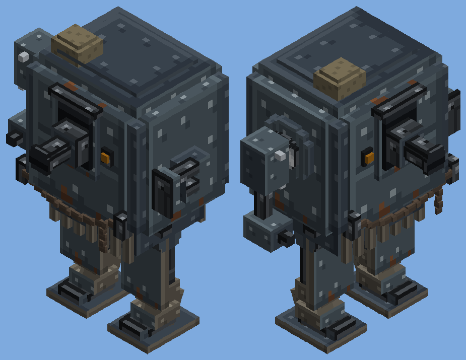

# The Armoured Walker (batch 58)

Status: implemented (pending CI and review)
Proposal issue: none. On 5 October 2026 the owner shared a render of a walker they had modelled in Blender and asked for "a version for our minecraft server that looks just like it". They chose to have it **both** as a walker players pilot and as the raiders' walker, in the clean texture style, built after the raider targeting test was fixed.
Owner: jimbozoomer-byte
Target milestone and tier: steel tier. It is an upgrade of the Diesel Walker (batch 47).
Primary specialty and supported player role: combat; a heavy walker for defending a base or going on the attack

## Player experience

The model follows the owner's Blender render, part by part, in Jugcraft's blocky style.

| Part | In the owner's model | Here |
| --- | --- | --- |
| Hull | A tall riveted box with chamfered corners and top edges | The same: the four vertical corners cut back and the roof chamfered, so it reads as an octagon. Riveted blue-grey plates with a horizontal seam, and a belt of plate round the bottom. |
| Gun port | A framed slot in the front with a cannon in a box mount | A raised dark frame round a recess, a box mount and the barrel standing out of it. |
| Lamps | Two small lamps beside the port | Two amber lamps, glowing at full brightness. |
| Chain | A heavy chain slung between two front brackets, one end hanging | The same, with links alternately face-on and edge-on, sagging between the brackets, and one end hanging down. |
| Pouch | A sandbag on the roof | A canvas bag on the roof at the front corner. |
| Skirt | Dark slats under the hull | A dark core with slats hanging in front and behind. |
| Right side | A drum hatch, and a short jointed arm with pinned brackets ending in a tool head | A drum hatch, an axle, a shoulder block with two pins, a forearm and a riveted tool head with a short barrel. |
| Left side | A piston arm reaching forward | A mount with two piston cylinders, and rods and a ram head that slide forward when it rams. |
| Legs | Flat armour slabs over the thighs, angled shins, hinged foot plates | The same: a broad slab hanging from just under the hull, a knee, a shin angled back, an ankle housing and a broad foot on a hinge pin. |

**Colours:** blue-grey steel plate with darker navy chamfers and recesses, brownish-grey legs and skirt, a dark iron chain and amber lamps. Rust appears only as a few warm touches on the plates' bottom edges, kept as restrained as the clean texture pass (the owner chose "match it, clean style").

### Piloting
- Place it from its item, use it to climb into the roof hatch (head out), and refuel it with a diesel or kerosene bucket, exactly like the Diesel Walker.
- **Movement:** walk, turn, jump and climb one-block steps with the movement keys. It burns 4 mB of fuel a second while it walks or turns.
- **Hold use: the hull cannon.** It fires a Heavy Shell where you look, every 2 seconds, taking one from your inventory (none in creative). Shells are damage-only blasts, like every gun's: they never break blocks. With no shells it tells you once.
- **Attack: the piston ram.**
  - The ram strikes whatever is in front, up to 2.6 blocks ahead, for 16 damage, and throws it hard.
  - It can ram again after 1.2 seconds.
  - The piston visibly slides out and back.
- **Toughness:** 90 damage to knock it down, against the Diesel Walker's 60. Knocked down, it drops its item.
- It has no drill. If you need one, the Diesel Walker still mines.

### The raiders' walker
- The Raider Walker (batch 57) now uses this model, painted in raider olive and black plate. Its numbers are unchanged: 120 health, 14 damage, 14 armour.
- It rams with its piston when it strikes.
- It lobs its grenades from the hull gun's muzzle.

## Connections
- **Recipe:** `PSP / PWP / R R`, an upgrade of the Diesel Walker:
  - steel plates (P) all round
  - a steel block (S) for the cannon
  - the Diesel Walker itself (W)
  - pistons (R) for the ram
- **Input producers:** the Diesel Walker (batch 47), the metal press's steel plates and steel blocks, and the big guns' Heavy Shells (batch 51) for the cannon.
- **Output consumers:** none. It is a vehicle.

## Balance and automation
- The cannon uses the same Heavy Shell, speed class and damage-only blast as the big guns.
- It fires no faster than once every 2 seconds and only with shells in hand. Shells are crafted, so nothing is free.
- The ram is a stronger, slower fist: 16 damage every 24 ticks, against the Diesel Walker's 12 every 16.
- It costs a whole Diesel Walker plus steel.
- No block breaking of any kind: no drill, damage-only shells.

## Multiplayer and persistence
- **Server-authoritative:** like the Diesel Walker, it is driven on the server from the pilot's keys, and the shells are fired on the server.
- **Saving:** its fuel is saved, as the Diesel Walker's is.
- Not verified with two players or on a dedicated server.

## Dependencies and assets
- No dependencies. The model is Jugcraft's own box model, made from the owner's Blender render (their own work, shared for this) by `tools/armoured_walker.py`:
  - hull, lamps, legs, tool arm, piston base and piston head, exported as quads to `assets/jugcraft/armoured_walker_quads.json`
  - textures drawn in the clean style: plate, seamed plate, dark plate, leg plate, chain, lamp, bore and canvas
- Code:
  - `walker/ArmouredWalker` extends `DieselWalker`. DieselWalker gains hooks for its use and attack actions, its cooldown, toughness, drop and seat.
  - `DieselWalkerItem` places either walker.
  - Client: `ArmouredWalkerParts` draws and animates the parts for both `ArmouredWalkerRenderer` and the raiders' `RaiderWalkerRenderer`.

## Verification
- Planned in CI:
  - `armouredWalkerWalksOnFuel`: it walks forward on fuel and burns it.
  - `armouredWalkerFiresItsCannon`: holding use for 60 ticks fires exactly twice (once every 40 ticks), each shell flying where the pilot looks.
  - `armouredWalkerRams`: attack hits a pig in front.
  - The raider tests run against the raider walker's new size.
  - The client screenshot `jugcraft_armoured_walker`.
- Done locally:
  - `check_mod_data.py` passes. It checks the numbers, the muzzle, the joints the renderers draw the parts at, and every exported part.
  - `check_repository.py` passes.
  - I compared offline renders of the model with the owner's render and adjusted it: the chain's sag and colour, the thigh slabs' size, the barrel's length and the plates' rivets and rust.
  - Gradle cannot run here, so the compile, tests and screenshot are left to CI.
- Not done: piloting it in a client, two players, a dedicated server.

## World and event applicability
- Not applicable for the player's walker: it is crafted and placed by players.
- The raider version comes only with raids.

## Rollout and open questions
- The owner may want the name changed: "Armoured Walker" is a placeholder.
- Possible later additions:
  - a working tool on the right arm (a flamer or a grapple)
  - the sliding gun-port shutter animating as it fires
