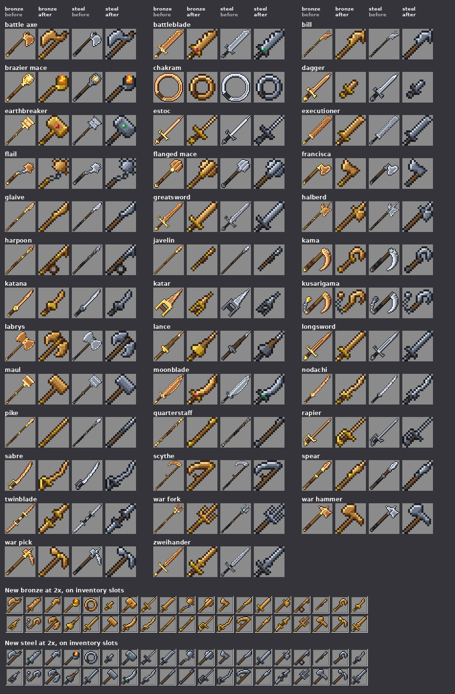

# Arms icons in the owner's 16×16 style

Status: implemented on `claude/arms-icons-16`, awaiting review. Compiles and tests in CI only; **not yet played**.
Proposal issue: none. On 5 October 2026 the owner sent a sheet of weapon icons: "heres how I draw my style for texturing
most weapons does this help?". They then asked to "keep the 3d models in hand" and "show me all the new weapon icons when
done".
Owner: jimbozoomer-byte
Target milestone and tier: art only, for the 38 arm kinds of [arms.md](arms.md) to [arms-vi.md](arms-vi.md), and the
thrown arms of Arms VIII once they merge.
Primary specialty and supported player role: fighting (looks only).

## Player experience
Every arm's inventory icon is redrawn at vanilla's own size, 16×16, in the owner's manner:
- **On the diagonal, as vanilla's swords and tools are:** the hand end at the bottom left, the point or head at the top
  right. Long arms run nearly corner to corner; short ones keep the same line.
- **A one-pixel outline round every part,** in a dark tone of that part's own material, never black. It is a
  four-neighbour outline: along a diagonal edge it is a staircase of single pixels.
- **Light from the top left:**
  - a blade's upper-left edge is lit, its middle the mid tone and its lower-right edge shaded;
  - a haft is light above and dark below.
- **Flat tones,** three or four a material plus the outline, with no noise.
- **Chunky parts that read at a glance:**
  - blades two or three pixels across (one for the rapier and estoc);
  - a guard straight across the blade and a two-pixel grip;
  - axe, hammer and mace heads as solid blocks at the top right.
- **Each kind is told apart from its siblings at 1× and 2×.** For example:
  - the greatsword has a broader blade and a four-row grip;
  - the zweihander has leather on its ricasso and parrying lugs;
  - the nodachi has a longer, wider blade than the katana;
  - the pike has langets and a ring, where the javelin has a thin shaft.
- **The 3D models in the hand stay,** as the owner asked. Their palettes change with the icons', in the colours the owner
  chose from two options on 5 October 2026 ("I like the alternate versions for steel and bronze"):
  - bronze is a tan bronze (#7e5222 to #f6d696), apart from vanilla's copper and matching the mod's bronze ingots;
  - steel is a dark blue-grey (#4a5262 to #d0d8e4), apart from vanilla's iron and matching the mod's steel.
- **The big arms show the whole weapon.** The first 16×16 drafts of nine kinds were cropped, so their guards and grips
  filled half the icon. The owner said: "redo Sabre, Zweihander, Moonblade, Greatsword, Battleblade, Executioner,
  Halberd, Longsword, Nodachi. I get that those are big but just cutting them off doesn't really work well".
  - They are redrawn whole, every part present, to fit the full diagonal in proportions that read at 16: a blade two
    thirds of the length (nine or ten steps of fifteen), a slim guard, a short grip and a small pommel. The halberd has
    a full-length haft and a compact head.
  - Two designs were made for each and judged against the old 32 and 48-pixel icons' proportions and the owner's sheet,
    then critiqued and checked as a family. Small to large at 2×, they read: dagger, katana, rapier and estoc, longsword
    and sabre, zweihander, greatsword and the broad blades.

  The longbows, arbalests, shields and the Arms VII variants take the same palettes, so they shift slightly too.

The owner's sheet is third-party art, studied for its manner only. Nothing of it is used, and it is not committed.
Every map was drawn fresh.

## How it works
- **One map a kind:** `tools/arms_icons/<kind>.txt`, 16 lines of 16 symbols that the owner can edit in any text editor.
- **A map names materials, not colours,** so one map serves every metal:

  | Symbol | Material |
  |---|---|
  | `.` | transparent |
  | `O D M L H` | blade or head: outline, dark, mid, light, highlight |
  | `g f F Y` | fittings: outline, dark, mid, light |
  | `w b B` | haft wood: outline, dark, light |
  | `k K` | grip wrap |
  | `a A` | set stone |
  | `e E` | the style's accent |
  | `c C` | chain |
  | `x X` | flame |

- **Colouring:** `tools/arms_icons.py` colours a map from a style's materials (`tools/arms_pixel.py` `STYLES`):
  - bronze: brass fittings, leather grip, oak haft and a garnet;
  - steel: gunmetal fittings, black rubber grip, dark wood and a phosphor-green stone.

  These are the same materials the 3D model in the hand is painted in.
- **The brazier mace's flame flickers:** alternate pixels of its body and tips trade places between frames.
- **The generator:** `tools/arms.py` `draw_all` uses a kind's map when it has one, and its old drawing otherwise.
  - The 3D model texture (`<item>_model.png`) is still drawn by `tools/arms_art.py`, so the models are as before.
  - A variant can have a map too (`tools/arms_variants.py`, coloured by its line's style in
    `tools/arms_variants_art.py` `LINE_STYLES`). None has one yet, so variants keep their drawn icons.
- **How the maps were made:** each family was drawn, then critiqued against the owner's sheet, revised, and checked
  across the whole set for consistency (weight, lighting and outline). The critique's measurements were scripted:
  - no fill pixel touching transparency;
  - no stray outline pixels;
  - no enclosed pinholes.
- **The rules for every item icon,** measured from these maps, are in [ITEM_ICONS.md](../ITEM_ICONS.md).
  `tools/check_icon_maps.py` checks the maps, the materials they are coloured in and every item icon's size against
  them, and `tools/check_mod_data.py` runs it and its self-test in CI. The five maps with a deliberate hole declare it
  in a comment: the chakram's ring, the harpoon's rope (whose inner edge is also left unoutlined), the katar's hand gap,
  the rapier's knuckle bow and the war fork's tines.

## Connections
None changed: no recipes, numbers, IDs, tags, components or Java. Every arm keeps its tooltips, motion and weapon art.

- Existing input producer: not applicable (art only).
- Existing output consumer: not applicable (art only).
- Technology connection: none.
- Magic connection: none.
- Reachable entry path: unchanged.
- For infrastructure and cosmetics: the textures of existing items only.

## Balance and automation
Not applicable: no gameplay change.

## Multiplayer and persistence
- Textures only; nothing is saved.
- Item IDs are unchanged, so arms already in worlds just show their new icons.

## Dependencies and assets
- No dependencies.
- Every texture is drawn by code from the maps in `tools/arms_icons/`.

## Verification

| Check | Result |
|---|---|
| `python3 tools/generate_textures.py` | Run. 209 textures differ from main, all under `textures/item/`: 34 kinds' icons and models in bronze and steel, plus the bows, arbalests, shields, 20 variants and one smithing pattern re-tinted by the new palettes. Running it again changes nothing. |
| Each map's 16 rows of 16 known symbols | Run: all 38 pass. |
| `python3 tools/check_icon_maps.py` ([ITEM_ICONS.md](../ITEM_ICONS.md)) | Run: PASS. 38 maps with no warning; the materials of the 2 arms styles and the 12 Arms VII lines; 669 item icons' sizes, 122 of them legacy. 5 warnings, all on Arms VII lines' palettes that no variant map uses yet (ITEM_ICONS.md, rule 6). Before the five maps declared their holes, it failed exactly those five. `--self-test`: PASS, every planted break caught. |
| Generator output against the preview renderer | Compared pixel by pixel before the palettes changed: bronze was identical, and steel differed only in the haft and grip, which the generator draws in steel's dark wood and rubber (the 3D models' materials). Since the owner's palettes, the generator's colours are the only ones that ship. |
| `python3 tools/check_mod_data.py` | PASS: 1437 material IDs, data files and recipe audit. |
| `python3 scripts/check_repository.py` | PASS. |
| `./gradlew build` and the server game tests (CI job `mod`) | Not run locally. PR #201 CI on 1254ba18: passed. |
| `ArmsClientGameTests` (every arm in an item frame, as an inventory sprite, and held), CI jobs `client (shard 0, 1 and 2 of 3)` | PR #201 CI on 1254ba18: all three shards and the `client` result passed. The close-up shots `jugcraft_arms_frames_close_1` to `_9` show all 34 kinds on main in both metals in item frames, read at a glance; the four thrown arms are not on main yet. |
| Played in a client | Not done. |

## World and event applicability
Not applicable: art only.

## Rollout and open questions
- **The four thrown arms** (chakram, francisca, harpoon and javelin, in [Arms VIII](https://github.com/jimbozoomer-byte/jugcraft/pull/194))
  already have maps here. Whichever of the two PRs merges second regenerates their textures.
- **Still to do, each in its own pass:**
  - the 32 Arms VII variants' maps;
  - the longbow and arbalest sprites (vanilla's bow and crossbow are 16×16 too);
  - the smithing patterns.
- **The owner may edit any map directly:** change the letters, run `python3 tools/generate_textures.py` and look.
