# The Cinder Tyrant

Status: implemented in source. CI builds it, and its game tests and client game test pass (below). This is part 2 of boss 4 in the [bosses plan](../branches/BOSSES.md#the-cinder-tyrant-the-plan-being-built), built by [the boss playbook](../branches/BOSS_PLAYBOOK.md): the boss of the Cinder Kiln, his Cinderlings and his spat and fallen things, and his loot. It is built on part 1, the kiln and the Kiln Seal that opens it ([cinder-kiln.md](cinder-kiln.md)), and on the lair framework ([hollow-acre.md](hollow-acre.md)). It has not been played by hand, and the two-client dedicated-server playtest is still to do.
Proposal issue: none. On 10 October 2026 the owner asked for "the next boss same way" as the Yeti King, and for the order he was made in to be saved as the plan for every boss (the playbook); the Cinder Tyrant is the next of the first eight in [branches/BOSSES.md](../branches/BOSSES.md).
Owner: @jimbozoomer-byte

Target milestone and tier: Specialization tier (dungeon expeditions), as the lairs are. He is reached only through the Kiln Seal, which takes things a player has once they reach the Nether. Nothing a tier needs comes only from him.
Primary specialty and supported player role: adventuring. His loot also serves the summoning's makers (Tyrant Scales in the next seal), brewers (magma cream for Fire Resistance), Nether and volcano travellers (the Salamander Charm) and costume wearers (trick-or-treating and the costume contest).

## Player experience

### He waits

The Cinder Tyrant lies sunk in the crucible of every Cinder Kiln, placed with the kiln, only the crest down his spine showing over the slag. He is a salamander lord the size of a cart, seven and a half blocks from his jaws to the end of his tail (2.6 blocks wide, 2.2 high):
- a long, low body of dark basalt scales on four sprawled legs;
- plates of obsidian along his back and flanks, with magma glowing in the seams between them;
- a crest of obsidian spikes down his spine, the tallest behind his head;
- a broad flat head with small burning eyes and a wide jaw, his throat glowing when he spits or breathes;
- a tail ending in a club of basalt, ringed with spikes.

Sunk, he takes no harm. He wakes when a player who can fight him (anyone not in creative or spectator mode) steps down onto the bowl's floor, or strikes him. Then:
- "The Cinder Tyrant rises from the crucible, slag streaming from his plates", and his bar shows;
- he rises roaring out of the slag for a second and crawls out over the crucible's rim in another, and nothing can hurt him meanwhile;
- his health is set for the party: 440, half as much again for each player after the first within 38 blocks of the bowl's centre, at most two and a half times (1100 for four or more).

He has armour 10 and cannot be knocked back. Fire, lava and burning never hurt him, and he takes no fall damage. He cannot ride, be leashed or be pushed. He crawls at 0.18 blocks a tick and stops three blocks short of his foe; he steps up onto the crucible's rim and the shelves. If he is ever more than 30 blocks from the bowl's centre, or fallen below it, he bounds back to its middle.

### His rule: the heat is his

While his seams glow he is **hot**, and every blow on him does **half** its damage.

To **quench** him, turn a sluice's wheel ([cinder-kiln.md](cinder-kiln.md)): its trough floods for 10 seconds. Bait his **Body Slam** into the flooded trough, by standing in it as he rears up. If he comes down with any of its stone under him, or within a quarter-block of his feet:
- "Steam bursts from the trough: the Tyrant's plates cool black and crack", in a cloud of steam;
- for **8 seconds** his seams are dark, every blow on him does **a quarter more** than its damage, and he crawls at half his pace;
- then his seams flare back over a second, and he is hot again.

The slag never cools while he lives. The shelves and the dry troughs are firm footing.

### Phase 1, the Kiln (full to half health)

Every attack has a wind-up you can read, a strike and a recovery. He waits at least a second between attacks.

| Attack | Read it by | What it does |
| --- | --- | --- |
| Tail Sweep | He coils sideways to his foe, his tail raised, embers dripping from its club (0.8 s) | His tail sweeps round his back and flanks, 4 blocks past his body, never the 45° either side of his head: 10 damage, a knockback, and you burn for 3 s. Close in, his most frequent attack |
| Ember Spit | His throat glows, and glowing marks spread on the floor round his foe (1.2 s) | Three gobs of magma arc from his jaws onto the marks, the first on his foe, the rest within 3 blocks: 8 damage within 1.5 blocks of where each bursts, or on the first player it strikes, and a patch of fire there |
| Body Slam | He rears up, his plates flaring, while a ring of fire glows where he will land (1 s) | He leaps onto where his foe stood (0.8 s in the air, 3 blocks high): 12 damage within 3 blocks, a knockback within 5. **Into a flooded trough, he is quenched** |
| Kiln Breath | He draws in, and a glowing sector spreads on the floor before him (1.5 s) | A blast of kiln heat from his jaws through a 60° sector, 8 blocks long, for 1.5 s: 3 fire damage every half-second, and you burn for 3 s |
| Mantle Shed | Flames run over his plates as he shudders (2 s) | Shards of his mantle crawl off as two **Cinderlings**, at most four at a time |

**Fire patches:** where a gob or a cinder bursts, the floor burns for 4 seconds, a block round. Standing in one burns: a point of fire damage every half-second, and you burn for 2 s. At most sixteen burn at once.

### The Eruption (at half health)

"The Eruption: the Tyrant roars from the forge mouth, and the mountain answers". He leaps up onto the forge's lip (a second) and roars there for 3 seconds, unhurt, while the vent spits cinders:
- the heat channel **surges**: "The heat channel surges!", and a second later its slag spills over its banks, two blocks either side, for 4 seconds. Every cell of floor there with open air over it is molten slag until it ebbs; the crucible, and anything standing on the floor, keep it off theirs;
- two **Cinderlings** crawl out of the slag onto the channel's banks.

Then he leaps back down into the bowl (a second), and the fight changes.

### Phase 2, the Eruption (half health to a fifth)

He keeps all five of the Kiln's attacks, and adds:

| Attack | Read it by | What it does |
| --- | --- | --- |
| Cinder Rain | He roars up at the vent, and glowing marks spread round his foe (1.2 s) | Six cinders fall one by one, a fifth of a second apart, from 12 blocks over the marks (the first on his foe, the rest within 3 blocks): 6 damage to a player within a block of where one bursts, and a patch of fire |
| Lava Wave | He beats his tail on the floor, the floor round him cracking and glowing (1.5 s) | A low ring of slag rolls out from him to 12 blocks over 2 s: 8 fire damage and 4 s of burning to each player it passes on the floor, once a wave. Jump it, or stand a block up (a shelf, the crucible's rim), and it passes under |

Meanwhile:
- **the choke:** one sluice at a time is **choked** with slag. A glowing crust covers its panels, embers fall at its foot, and turned it only says "Slag chokes the sluice: it will not turn". Every 20 seconds the choke moves to the next gate (west, east, south, round again), never onto one that is open, so a flood a player has opened is not cut short and one or two gates always work;
- **the surges:** every 30 seconds the channel surges again, announced as before.

**Cinderlings:** little salamanders of glowing slag, 14 health, their bites 3 damage and 2 seconds of burning, quick. They go for the nearest player and are immune to fire. In a flooded trough they gutter out in a hiss of steam. They drop nothing, give no experience and are never saved, and they crumble to ash when he falls, resets or is gone. Whoever hurts one has taken part in his fight.

### The Molten Heart (below a fifth)

"The Molten Heart: his cracks blaze white". White-hot cores swell out of his seams. Every cooldown, and his pause between attacks, is a third shorter; his Ember Spit throws five gobs; his Kiln Breath sweeps 90°. Quenching him works as before.

### Fire Resistance

Fire Resistance, from a potion or the Ember invocation Hearthguard, stops his fire: the Kiln Breath, the Lava Wave, the fire patches, the slag and burning. It never stops his blows: the Tail Sweep, the Body Slam, the gobs' and cinders' impact and the Cinderlings' bites. It helps the prepared without emptying the fight.

### His fall

When he falls:
- his Cinderlings crumble, and his gobs, cinders and fire are gone;
- the surge's slag ebbs, every sluice is clear and every trough drained;
- each participant gets their loot (below) and Tempered;
- "The Cinder Tyrant falls, and the crucible cools to black glass": the crucible's slag cools to **obsidian** you can walk on, and a gate of **Grey Mist** two blocks wide and two high opens in the middle of the bowl. It takes players home, as the arch beside the ledge does;
- the instance is ended, and it closes once everyone has left. The next instance in that slot is placed fresh, its crucible molten, and he lies sunk in it again.

### Left alone

If no player he can fight is within 38 blocks of the bowl's centre for 10 seconds: "The Cinder Tyrant sinks back into the crucible". He heals fully and is hot again, the slag ebbs, the troughs drain and the sluices reset, his Cinderlings crumble and his things are gone. Who hurt him is forgotten, so a fresh fight starts from nothing.

### His loot

Each participant rolls their own loot. A participant is a player who hurt him or his Cinderlings and is within 64 blocks of the bowl's centre when he falls. The loot goes straight into their inventory, and what does not fit lands at their feet. "His molten hoard is yours".

| Loot | Chance |
| --- | --- |
| **Tyrant Scale**, a scale of obsidian veined with cooling magma | 3 to 6, always |
| **A trophy:** the Cinderbrand or the Magmaw, Arms VII's (one of the two) | 15%; one is certain on a player's first kill (whoever has not yet earned Tempered) |
| **Salamander Charm** | 25% |
| **The Tyrant's Crest** | 20% |
| 300 experience, shared out among the participants | always |
| The advancement **Tempered** (a challenge in the Adventure tab) | always |

He is no Witching Season boss: the Halloween event adds nothing to his loot.

**What they are for:**
- **Tyrant Scale:**
  - **Crushed:** one scale makes two magma cream, for Fire Resistance.
  - **A cheaper Kiln Seal:** four obsidian, a magma block, a gold ingot and two Tyrant Scales, shapeless. The scales take the two blaze powder's place and one gold ingot's. This is the plan's "part of what summons him again".
- **Salamander Charm:** a disc of obsidian in a ring of gold, a salamander on it. Held in the offhand, hot ground never burns its holder: a magma block's heat, the kiln's slag and the slag his surges spill neither hurt them nor set them burning. It does nothing against his fire, his blows, lava or burning.
- **The Tyrant's Crest:** a costume worn on the head, his crest in small: a ridge of obsidian, three spikes rising from it and magma glowing between them. It counts for trick-or-treating and the costume contest.
- **The Cinderbrand and the Magmaw:** Arms VII's two Cinder Tyrant trophies, until now in the creative tab only. The Cinderbrand fights as the steel greatsword does and the Magmaw as the steel earthbreaker; both are epic, last twice as long as steel, read "Trophy of the Cinder Tyrant", and carry his boon, **Ember:** a hit sets the foe alight for 3 seconds.

### Settings

His settings are the ones every lair boss shares, in `config/jugcraft.properties` (`lair/LairBosses.java`):
- `lairs.boss_health` (1.0, from 0.25 to 4): multiplies his health;
- `lairs.boss_damage` (1.0, from 0.25 to 4): multiplies his blows, gobs, cinders, breath, wave and fire patches (not his Cinderlings' bites).

`lairs.event_loot` does not touch him: he has no Halloween extra. His damage numbers are Normal difficulty's: Easy and Hard scale them as they scale every monster's blows.

## Changes from the plan

- **The Eruption is two leaps:** up onto the forge's lip, where he stands in the middle over the slag running across it, and back down into the bowl, a second each; he is unhurt from the first to the last. The plan said he "climbs onto the lip" and "comes down". The vent's cinders in it are sparks and flames, not falling cinders.
- **His Cinderlings in the Eruption crawl out on the channel's banks,** a block and a half from it on either side, halfway along; the surge spills over them a second later, which they do not mind.
- **Where he crawls out to when he wakes,** and lands from the Eruption: on the floor south of the crucible, eight blocks from its middle. The plan did not say.
- **The choke never falls on an open gate,** and stays where it is if the others are open. The plan only had it move every 20 seconds.
- **He is "in" a flooded trough** when any of its stone is under him or within a quarter-block of his feet: his bulk overhangs the trough's three blocks.
- **The fire patches and the Lava Wave are not blocks:** the server keeps where they burn and draws them in flames and sparks, and nothing of the floor changes for them. The surge's slag is real slag, restored cell by cell.
- **The crucible "cools to black glass"** as its top layer turning to obsidian; the deeper slag is out of reach under it.
- **His gobs leave from his jaws** (2.75 blocks ahead of his feet and 0.75 up, where his model's jaws meet), and a gob bursts on the first player in its path as well as on its mark.
- **The sluice gate (part 1's) has a fourth state, choked,** with its own model: the shut panel under a glowing crust of slag.
- **His Cinderlings are `jugcraft:cinderling`,** and **his gobs and cinders** `jugcraft:magma_gob` and `jugcraft:falling_cinder`.
- **His voice is a ghast's moan,** pitched low; struck, he clanks as an iron golem does; he dies with the wither's cry, and roars as the warden.
- **He is a monster:** on Peaceful he is gone, as every monster is, and the Cinder Kiln stands empty.
- **Animations by GeckoLib,** as the other lair bosses' are: GeckoLib 5.5.7 is already pinned.

## Connections

- **Inputs:** the way in is part 1's Kiln Seal, pressed into Nether or volcanic magma, so obsidian, a magma block, blaze powder and gold feed every fight.
- **Outputs:**
  - **Tyrant Scales** feed back into the summoning (the cheaper Kiln Seal) and into magma cream, for Fire Resistance;
  - **the Salamander Charm** is an offhand charm for magma blocks, the Nether and the volcanic lands;
  - **the Tyrant's Crest** is a costume for trick-or-treating and the costume contest (`#jugcraft:trick_or_treat_costumes` and `#jugcraft:costume_hats`);
  - **the Cinderbrand and the Magmaw** are Arms VII's boss trophies: the second of its eight bosses to drop his.
- **Technology and magic:** none required. Fire Resistance helps against his fire, from a potion or the Ember school's Hearthguard (the planning pack's Ember link); its Tide, Rime and Strata links wait for those schools.
- **Trade and solo routes:** a solo player can do everything. The sluices are turned by hand, the bait is standing in a trough, and a hot Tyrant still takes half damage from any weapon. His health is lowest for one player, and the first kill always brings a trophy. His loot can be traded like any item.
- **Reachable entry path:** the seal takes what a player who has reached the Nether has (part 1), and nothing he drops is needed to reach him.

## Balance and automation

- **Every fight costs a summoning:** a fresh Kiln Seal, as part 1 set it.
- **No gain loop:** scales make a seal that still needs obsidian, a magma block, gold and a whole fight, and a scale crushes into two magma cream, while magma cream makes no scale. Nothing he drops turns into more of itself. Nothing he drops sells to a Jugcraft shop for Jugs.
- **No leeching:** only participants get loot. A bystander who never struck him or a Cinderling gets nothing, and loot is rolled per participant, so nobody takes another's.
- **First kill once:** the trophy's first-kill guarantee is stored with the advancement, so it comes once per player.
- **Abandoning resets him:** leaving him alone for 10 seconds heals him and forgets everyone's part. He cannot be worn down between visits.
- **No automation:** he wakes only for a player, quenches only on his own slam, and his loot goes only to players. His Cinderlings drop nothing and give no experience. Only a player turns a sluice.
- **Units:** health and damage in half hearts, before `lairs.boss_health` and `lairs.boss_damage`. Times are in ticks, 20 a second; distances in blocks. Every number is in `tools/cinder_tyrant.py`, and `tools/check_mod_data.py` holds the Java to it.

## Multiplayer and persistence

- **Server authority:** the server decides everything: waking, targets, every attack's hits, the quench and the reheat, the surges and the choke, the fire patches, his Cinderlings, the charm, the loot and the advancement. Clients only draw what his synced state says (his action, his heat and the Molten Heart) and play the matching animations.
- **What is saved:** he is saved with his instance's chunks: his phase, the Molten Heart and the floor his surge has spilled over. When he is loaded the slag ebbs from that floor and every sluice is cleared and drained, so no choke is left behind; a passing moment (waking, the Eruption) lands where its leap would have ended and fights on; he loads hot, and his fire patches are gone. His Cinderlings, gobs and cinders are never saved. Instances close on a restart (part 1), and he goes with his.
- **The floor:** the surge's slag is set back cell by cell, cracked basalt in the bowl and rough basalt beyond it, and only where it is still slag.
- **Chunks:** nothing is force-loaded. His arena stays loaded while players stand in the kiln.
- **The charm** is looked at only when hot ground would hurt its holder; nothing about it is stored.
- **No griefing:** he cannot leave his lair, his attacks strike only players who can fight him, and the only blocks he changes are his own kiln's (the surge's slag, the sluices' choke and the troughs' water, the cooled crucible), every one of which comes back.
- **Still to do:** the two-client dedicated-server playtest.

## Dependencies and assets

No new dependency. GeckoLib 5.5.7 for 26.3 is already pinned (`distribution/frameworks.lock.json`); it draws him, his Cinderlings, his gobs and his cinders. Everything is drawn by code:
- **Bodies and clips:** `tools/cinder_tyrant_models.py` builds the GeckoLib models and animations on Vesperine's builder: 23 of his (sunk, rise, leap, idle, walk, every attack's wind-up and strike, the roar, death, and his heat, hot, quenched, flaring back and the Molten Heart, on a controller of their own), the Cinderling's walk and idle, the gob's spin and the cinder's fall.
- **Textures:** `tools/cinder_tyrant_art.py` paints them at four times Minecraft's scale: 1024 × 1024 for him (his parts need a 256 sheet), 256 × 256 for the Cinderling, the gob and the cinder. Each has a glowmask: his eyes, seams and cores, the Cinderling's core, the gob and the cinder whole. It also paints the worn crest's obsidian and magma.
- **Icons:** the Tyrant Scale, the Salamander Charm and the crest from icon maps (`tools/item_icons/`), on part 1's obsidian and magma icon materials; the trophies' art is Arms VII's.
- **Data:** `tools/cinder_tyrant_data.py` writes the names, tooltips and messages, the item models (the crest worn as its own model), the loot table, the two recipes, the costume tags and the advancement. The choked sluice's model and slag crust come from `tools/lair_data.py` and `tools/cinder_kiln_textures.py`.

No Mojang texture is read, traced or copied.

## Verification

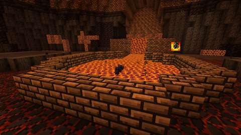
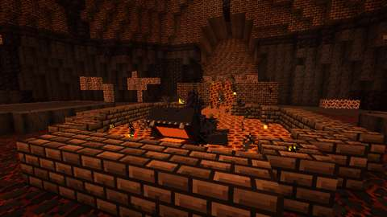
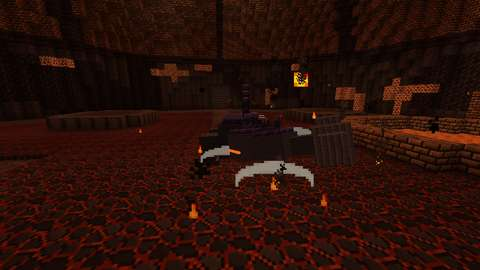
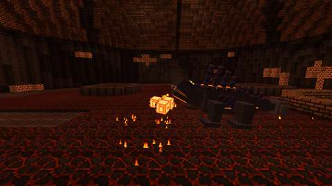
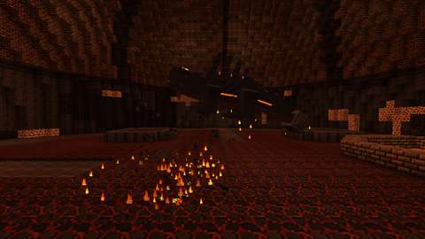
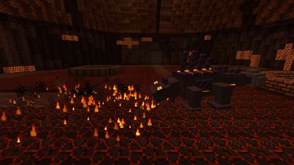
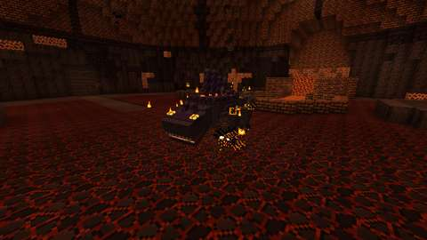
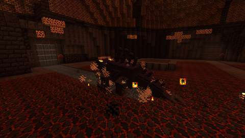
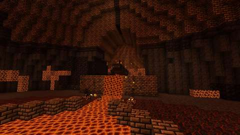
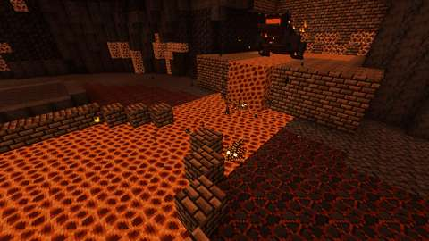
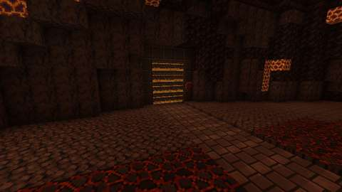
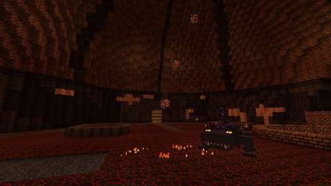
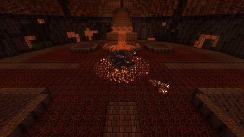
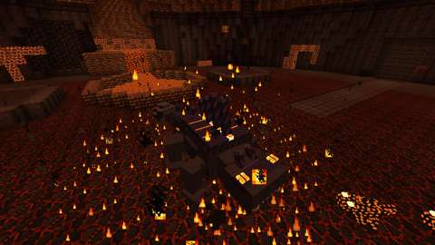
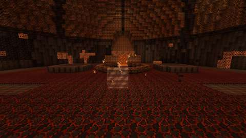

*The client game test's pictures (CI, commit `cc43a8e`): sunk and waking; the Kiln's Tail Sweep, Ember Spit, Body Slam, Kiln Breath and Mantle Shed; quenched in the south sluice's trough; the Eruption on the forge's lip, the surge and the west sluice choked; the Cinder Rain and the Lava Wave; the Molten Heart; and after his fall. Each attack is frozen mid-move. The test client renders at 480x270, and the kiln is dark: some of these are hard to read at that size.*

CI (10 October 2026, GitHub Actions, the pins in [PLATFORM.md](../PLATFORM.md)):

| Commit | What ran | Result |
| --- | --- | --- |
| `738fd70` | Build | **The game tests failed to compile:** his heat test set `Entity.invulnerableTime`, which is private in 26.3, to strike him twice in one tick. The main and client code built. Nothing else ran |
| `cc43a8e` | Build, data audit, every server game test with and without the optional integrations, and every client test class (his arena is a new structure file, which the selection counts as shared) | The test now waits out his hurt cooldown between blows. **All pass:** all 1313 required game tests (his fourteen among them), `optional integrations absent`, and every client test class in five jobs of 15 to 28 minutes, `CinderTyrantClientGameTests` (his whole fight) among them. The pictures above are from this commit |

Run locally (10 October 2026):

| Check | Result |
| --- | --- |
| `python3 scripts/check_repository.py` | Pass |
| `python3 tools/check_mod_data.py`: now also checks (`check_cinder_tyrant`) his Java numbers, attacks and his things' numbers against `tools/cinder_tyrant.py`, and his rule (half a blow hot, more quenched; a sluice's flood outlasting a Body Slam's wind-up and flight); that where his fight looks for the kiln's parts (`CinderKiln.java`: the bowl, its centre and radius, the crucible, the channel, the lip, the shelves and the sluices' wheels) is where `tools/cinder_kiln.py` builds them; that sunk he is in the crucible's slag with his back under it and his crest over it, and that where he crawls out to, where he roars on the lip, the banks his Cinderlings crawl out on and the Grey Mist he leaves are clear and stand on the kiln's floor; that his gobs leave from where his model's jaws meet; his registrations, names and renderers; the GeckoLib models, every clip the Java plays, sheet sizes, glowmasks and controllers' bones; the loot table and his trophies against Arms VII's; recipes, costume tags, advancement and messages; the Salamander Charm's hold on hot ground; and that nothing of his loads chunks or changes dimension. 28 deliberate changes to his Java, the tables and the data, one at a time, each failed it | Pass, 2168 IDs |
| `python3 tools/check_icon_maps.py` on the three new maps | Pass |
| `python3 tools/generate_material_data.py` and `tools/generate_textures.py`, then `git status` | Write this part's data and textures only (the PNGs they re-encoded with identical pixels were reverted) |
| `javac` on the new Java and tests, for syntax only | Only the expected errors for the game's missing libraries |
| `python3 -m unittest discover -s scripts/tests` | Pass, 14 tests; the busiest of the five client jobs is estimated at about 20 minutes with his client test |
| `./gradlew build`, game tests and client game tests | Not run locally (the Fabric Maven is out of reach here); to be run by CI |

The game tests (`CinderTyrantGameTests`) show what a game-test server can, with a Tyrant put down on his own (no lair) over a kiln laid out from the corner of an arena the kiln's width and length; each test lays the floor, troughs and gates it needs:
1. sunk in his crucible, he takes no harm; a player's blow wakes him at full health, and he crawls out onto the floor south of the crucible, to fight;
2. his health scales 1, 1.5 and 2.5 times for one, two and four or more players; in the Molten Heart his cooldowns are a third shorter and his breath wider;
3. hot, a blow does him half its damage and fire none; quenched, a quarter more, and he crawls at half his pace; 8 seconds later his seams flare back, and a second after that he is hot again;
4. his Tail Sweep strikes a player behind him and one beside him and sets them burning, and spares the one before his head;
5. his Body Slam strikes a player within 3 blocks and only throws back one 4 blocks off; landing in a flooded trough quenches him; he counts as in it with its edge a fifth of a block from his feet, and not with its edge two fifths off, nor over dry trough stone;
6. his Kiln Breath burns a player before him and one holding a Salamander Charm, and not one under Fire Resistance nor one forty degrees aside; in the Molten Heart it reaches forty degrees;
7. the Lava Wave burns a player on the floor once a wave, and passes under one standing a block up and one in the air;
8. the channel's surge spills over every open cell of floor within two blocks of it a second after its warning, not the crucible, a cell with a block on it, nor floor farther off; 4 seconds later every cell is what it was;
9. the choke falls on the west sluice first, passes over an open gate, clears the gate it leaves, stays put while the others are open, and a choked gate will not turn; a gate choked while open closes and drains; after a reset every gate is ready and every trough dry;
10. at half health the Eruption: unhurt, he leaps onto the forge's lip and roars, a Cinderling crawls out on each bank of the channel, the channel surges, and he comes back down into the bowl, where he can be hurt again;
11. a gob he spits bursts on its mark and a cinder on its, each striking the player there and leaving a patch of fire, and a player standing in a patch burns;
12. his Mantle Shed brings out four Cinderlings at most; one on a flooded trough gutters out, and when he sinks back into his crucible, healed, the rest crumble;
13. a Salamander Charm keeps the slag and hot ground off its holder, and they hurt a player without one;
14. his loot is each participant's own: two who struck him each get Tyrant Scales and, on a first kill, one trophy, and both earn Tempered; a bystander who never struck him gets nothing; and his crucible's slag cools to obsidian.

The client game test (`CinderTyrantClientGameTests`, CI job `client`) runs his fight in a real Cinder Kiln, with its one player in survival under Resistance:
1. he waits sunk in his crucible; stepping onto the bowl's floor wakes him, and he crawls out to fight;
2. each of the Kiln's attacks posed and photographed mid-move, gobs of magma in the air for the Ember Spit and Cinderlings out for the Mantle Shed;
3. the south sluice turned, the player standing in its trough, his Body Slam comes down in it and quenches him;
4. at half health the Eruption on the forge's lip; the channel's surge; he comes down, and the west sluice is choked and will not turn;
5. the Cinder Rain, with cinders falling, and the Lava Wave; the Molten Heart;
6. he falls: the player has Tyrant Scales, one trophy and Tempered; the crucible is obsidian, Grey Mist stands in the bowl's middle, every sluice is clear, the south trough is dry, the surge has ebbed and his Cinderlings are gone; a fresh instance in his slot has no mist and a molten crucible.

It takes fifteen pictures: sunk, waking, the five Kiln attacks, quenched, the Eruption, the surge, the choked sluice, the Cinder Rain, the Lava Wave, the Molten Heart and after his fall.

Not run: the two-client dedicated-server playtest, and play by hand.

## World and event applicability

The Cinder Kiln is its own dimension, so nothing here changes the Overworld or the Nether. The seal works at any hour, all year; no season gates him.

## Rollout and open questions

The shared framework's defaults hold: four players and eight instances, Grave Goods on death. His settings are the shared boss settings above. Open: the two-client playtest, and whether the Tyrant's 440 health and the quench's 8 seconds feel right in play.
