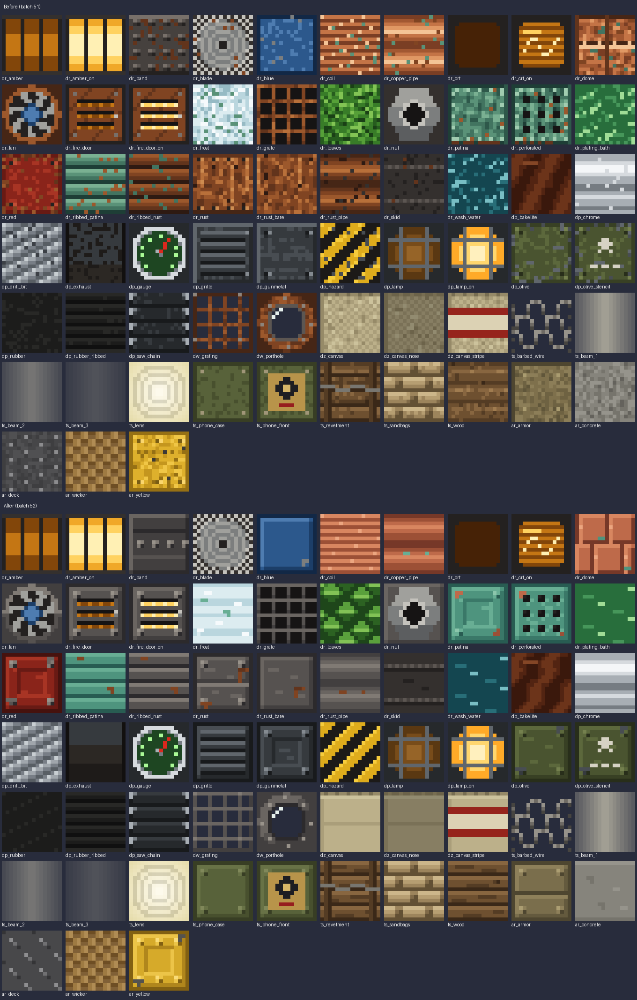

# Clean dieselpunk textures (batch 52)

Status: implemented (pending CI and review)
Proposal issue: none. On 4 October 2026 the owner said the dieselpunk textures were ugly: "the rust is so so so ugly, you are doing way too much in terms of noise". They asked for them to be textured more like four reference pictures: a vanilla copper block, a weathered pipe, Immersive Engineering Reimmersed's machine sheet and a car drawn in vanilla's palette. The pictures are third-party art and were used only to set the style. Every texture here is original and drawn by code.
Owner: jimbozoomer-byte
Target milestone and tier: steel tier and above (everything drawn in the dieselpunk style)
Primary specialty and supported player role: art (no gameplay change)

## Player experience
Every dieselpunk texture is redrawn. The old ones picked a random shade for nearly every pixel and covered whole faces in rust. The new ones follow the rules now written in [ART_DIRECTION.md](../ART_DIRECTION.md#texturing-keep-it-clean):
- **Flat fills from four or five shades.**
- **Bevelled panels:** lit on the top and left, shaded on the bottom and right, with a dark seam round the edge.
- **Details:** recessed insets and two-by-two bolts.
- **Wear only as placed marks:** a chipped corner, a stain weeping from a bolt or seam, or a few short streaks one shade off the fill.

The giants' main plate is now a warm weathered steel, close to tuff, instead of orange rust. Red paint, verdigris copper, blue caps and amber lamps stand out against it. Rust stays as a small accent.

| Set | Textures | Used by |
| --- | --- | --- |
| `dr_*` (`tools/dieselrust_textures.py`) | 28, plus the new `dr_soot` | The dieselpunk giants, Dieselworks blocks, zeppelin gondola, Diesel Walker, Landship, trench works and big guns |
| `dp_*` (`tools/dieselpunk_textures.py`) | 15 | Steel-tier machines, powered tools, the charging station and parts of the walker and guns |
| `dw_*` (`tools/dieselworks.py`) | 2 | Steel Grating and Porthole Window |
| `dz_*` (`tools/zeppelin.py`) | 3 | Zeppelin envelope canvas |
| `ts_*` (`tools/trenchworks.py`) | 3 of 10 redrawn | Sandbags, timber and the telephone case. The rest were already flat |
| `ar_*` (`tools/artillery.py`) | 4 of 5 redrawn | Warning yellow, concrete, tread plate and armour. The wicker was already a pattern |

The Diesel Walker and Landship item icons swap their rust brown for the same weathered steel.

### Mechs and vehicles
The owner asked for every mech and vehicle drawn with the old textures to be fixed as well. Most already were, because they draw from the shared sets above. A few borrowed textures from other sets were still noisy:
- **Sooty openings:** the Diesel Walker, Landship, zeppelin, big guns and dieselpunk giants used the steampunk `sp_hopper_inside` (a noisy black) for smokestack throats and engine openings. They now use a new clean `dr_soot`: a dark steel rim stepping down to a black throat. The steampunk machines keep `sp_hopper_inside`.
- **Kaiserpunk finishes:** `ik_brass` and `ik_lacquer` lose their random specks. They are on the Landship's casemate and turret, the guns and the searchlight, and are shared with the Kaiserworks blocks. The textures drawn over the lacquer (crest, frieze, gilt trim, iron column, riveted lacquer) lose them too. Their banding and sheen are unchanged.

Offline renders of the Diesel Walker, Landship, zeppelin, Self-Propelled Howitzer, Siege Mortar, Flak Gun and Observation Balloon were checked after the change. The Ronin and Vanguard exosuits were already drawn in flat colours and are unchanged.

Four Dieselworks blocks are renamed to match how they now look; their IDs do not change:

| ID (unchanged) | Old name | New name |
| --- | --- | --- |
| `rust_plate` | Rust Plate | Weathered Steel Plate |
| `riveted_rust_plate` | Riveted Rust Plate | Riveted Steel Plate |
| `ribbed_rust_pillar` | Ribbed Rust Pillar | Ribbed Steel Pillar |
| `rust_grating` | Rust Grating | Steel Grating |

## Connections
- Existing input producer: none changed.
- Existing output consumer: none changed.
- Technology/magic connection: none; art only.

## Balance and automation
No change: no recipe, number or behaviour differs.

## Multiplayer and persistence
Every texture name, block ID and item ID is the same, so worlds, placed blocks and inventories are untouched. Only the pictures and four display names change.

## Dependencies and assets
- Code: `tools/clean_metal.py` holds the shared helpers (bevels, insets, bolts, chips, stains and streaks). The texture functions in the files listed above now use them.
- The textures are deterministic: every function draws the same pixels each time, with no random source.
- All art is original.

## Verification
- Done locally: `generate_textures.py` and `generate_material_data.py` were rerun, and `check_mod_data.py` and `check_repository.py` pass. A contact sheet of all 63 textures, before and after, was reviewed (the image above).
- Planned in CI: the existing client screenshots, such as the Dieselworks, zeppelin, walker, landship, trench works and big guns scenes, will show the new textures on the models.
- Not done: an in-game look by the owner.

## World and event applicability
Not applicable.

## Rollout and open questions
- The steampunk (`sp_*`) and kaiserpunk (`ik_*`) sets were not part of the complaint and are not changed. Some steampunk textures (iron, iron plate, brass plate, hopper inside) are noisy in the same way. They could get the same treatment if the owner wants.
