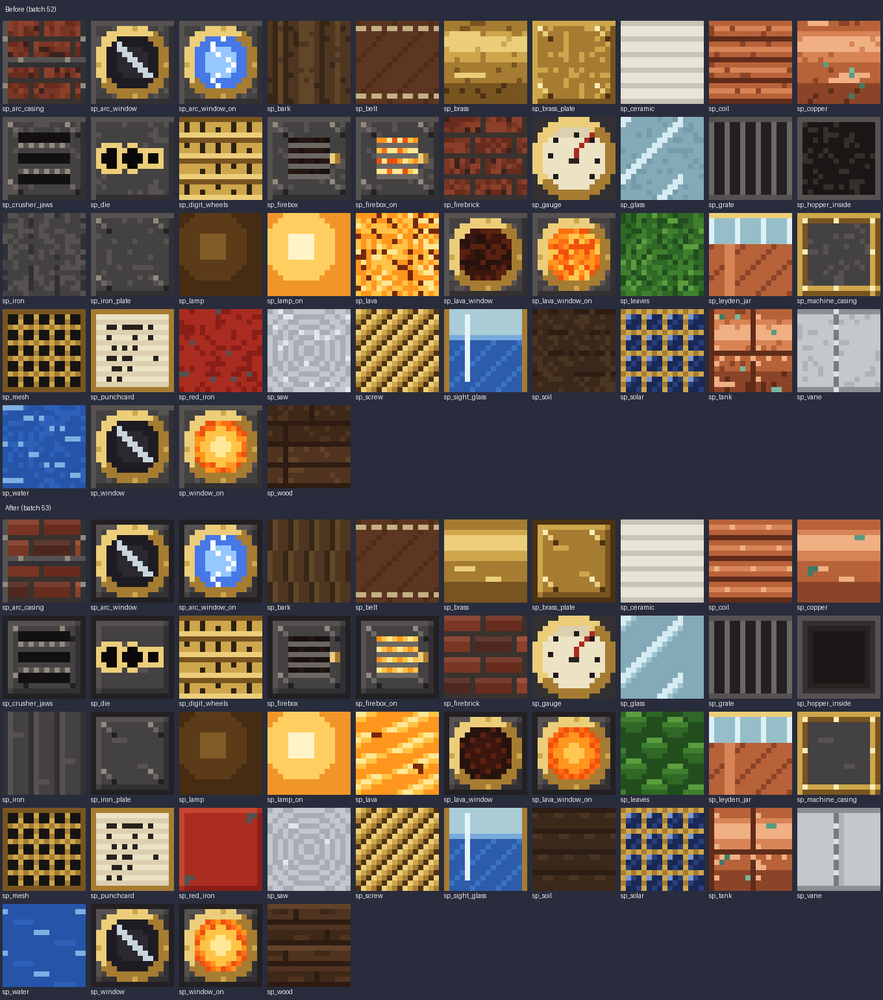

# Clean steampunk textures (batch 53)

Status: implemented (pending CI and review)
Proposal issue: none. After the dieselpunk textures were cleaned up ([batch 52](clean-dieselpunk-textures.md)), the owner asked on 4 October 2026 to "clean up the steampunk textures the same way".
Owner: jimbozoomer-byte
Target milestone and tier: stone, bronze and early steel tiers (everything drawn in the steampunk style)
Primary specialty and supported player role: art (no gameplay change)

## Player experience
The steampunk textures (`sp_*`, drawn by `tools/steampunk_textures.py`) follow the same rules as the dieselpunk ones ([ART_DIRECTION.md](../ART_DIRECTION.md#texturing-keep-it-clean)): flat fills from short palettes, bevelled plates with rivets, banded sheens, and wear only as a few placed marks. No texture picks a random shade per pixel any more.

| Texture | Was | Now |
| --- | --- | --- |
| Iron plate, brass plate (and the portholes, firebox, crusher, casing and die drawn on them) | Speckled fill | A dark seam, a lit top and left edge, a shaded bottom and right edge, two faint streaks and four rivets |
| Wrought iron | Random shades, broken bars | Flat bars, each lit on its left with a dark joint |
| Brass, copper, copper tank | Random shading and scattered green specks | The same banded sheen without noise, two bright scratches and a few small verdigris blooms |
| Planks | Random grain | Four planks lit along the top, fixed joints and grain lines |
| Firebrick (and the strapped arc-furnace brick) | Every pixel a different red | Each brick one shade, lit along its top edge, with two sooty bricks |
| Coil, glass, vane, saw | Random flecks | The same patterns without flecks |
| Red iron (valve wheels) | Speckled paint | A flat coat, lit on top and left, chipped at two corners |
| Hopper inside | Black and brown noise | An iron rim stepping down to a black throat |
| Water, lava, porthole glow and crust | Random pixels | Regular ripple lines and currents |
| Leaves, bark, soil | Random pixels | Overlapping leaves, ridged bark, furrowed soil |

The punch card's holes and the counter wheel's engraved figures are left as they were: they are patterns, not noise. The gauge, lamps, sight glass, Leyden jar, solar cells, screw, mesh, belt, grate and ceramic were already clean.

## Connections
- Existing input producer: none changed.
- Existing output consumer: none changed.
- Technology/magic connection: none; art only.

## Balance and automation
No change.

## Multiplayer and persistence
Texture names and every ID are unchanged, so worlds and inventories are untouched.

## Dependencies and assets
`tools/steampunk_textures.py` now uses the shared helpers in `tools/clean_metal.py` (batch 52). All art is original and drawn by code. The alternate machines resource pack is separate and unchanged.

## Verification
- Done locally: `generate_textures.py` and `generate_material_data.py` were rerun, and `check_mod_data.py` and `check_repository.py` pass. A contact sheet of all 44 textures, before and after (the image above), was reviewed.
- Planned in CI: the client screenshots that show steampunk machines.
- Not done: an in-game look by the owner.

## World and event applicability
Not applicable.

## Rollout and open questions
- None.
