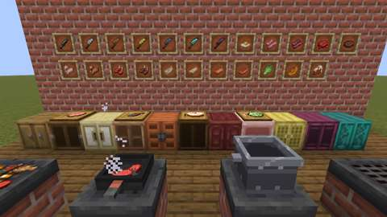
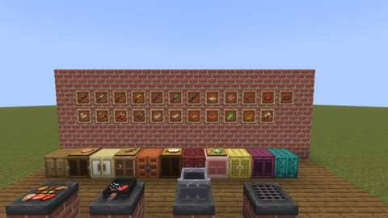

# Farmhouse Kitchen: the Kitchen Stove, the Skillet, the Cutting Board, knives and cabinets

Status: implemented in source; **not yet played**. The Build workflow compiles it; see Verification for what has actually run.
Proposal issue: none; requested directly by the owner on 7 October 2026 ("Ok lets begin expanding agriculture and cooking ... cooking devices, preparation systems ..."). The owner chose this slice first from the ten-slice plan in [branches/AGRICULTURE.md](../branches/AGRICULTURE.md#the-kitchen-and-cooking-expansion-planned).
Owner: @jimbozoomer-byte
Target milestone and tier: Milestone 3 (first homestead); Discovery tier. A flint knife and a cutting board need only flint, sticks and planks; the stove needs iron, bricks and a campfire; the bronze and steel knives follow the metals branch.
Primary specialty and supported player role: cooking; supports farmers, ranchers, fishers and builders (kitchens to furnish)

## Player experience
Build a kitchen and cook in it:

- **Kitchen Stove.** A brick range. Light it with flint and steel or a fire charge, and put it out with a shovel. Lit, it glows (light 13) and heats whatever stands on it, as a campfire does: a Cooking Pot, a Skillet or a kettle cooks on top. With nothing on top, its **hob** cooks up to six foods at once at twice a campfire's pace. Use a raw food on its top to put it on; each pops off cooked. Its top burns anything standing on it, as a magma block does (sneak to cross it).
- **Skillet.** A cast-iron pan for any heat source. Use up to 16 of one raw food on it and it fries them one after another at a furnace's pace (three times a campfire's). The fried food heaps up in the pan; use it with an empty hand to take everything out.
- **Cutting Board.** Set anything on it, to cut or just to show. Use a knife on it to cut what lies there: a porkchop into bacon, a fish into slices (and bone meal), a cabbage into leaves, a pumpkin into slices, a cake into seven slices. Each cut costs the knife one use.
- **Knives.** Flint, iron, bronze, golden, steel, diamond and netherite. Light, quick blades (half a point of damage over the material, fast swings), enchantable like swords. Any knife, and the Carving Knife, also cuts a slice from a pie, a serving from the roast turkey, and a Slice of Cake from a cake. A hungry cook with a knife slices the cake rather than eating it.
- **Kitchen cabinets.** A chest-sized cupboard in eleven woods. The doors swing open while anyone is looking inside.
- **New foods.** Bacon, minced beef and beef patties, chicken cuts, mutton chops, cod and salmon slices (raw and cooked), cabbage leaves, pumpkin slices, slices of cake and fried eggs. The cuts feed the dishes planned for later slices.

Every block wears the owner's own textures, imported unchanged (see Dependencies and assets).

| **The kitchen:** a cabinet counter in every wood with cutting boards, four stoves in front | **The stoves:** a full hob, a skillet of beef, a Cooking Pot, and one out |
| --- | --- |
|  |  |
| **The counter:** cabinets with food on the boards | **The wall:** the seven knives and the new foods |
|  |  |

*In-game screenshots from CI's client game test (`FarmhouseKitchenClientGameTests`, software rendering, small previews).*

## Connections
- Existing input producer: vanilla meat, fish, eggs, pumpkins and cakes; cabbage from the Kitchen Garden. The recipes use iron, bricks and a campfire for the stove; iron and a stick for the skillet; planks and a stick for the board; slabs and trapdoors for the cabinets. The bronze knife needs bronze (metals branch, `tin` feature) and the steel knife needs steel (`machines` feature).
- Existing output consumer: food for every player. The stove joins the block tag `jugcraft:heat_sources`, so the Cooking Pot, Canning Kettle, Candy Kettle, Wax Melting Pot and Skillet all cook on it. The cuts carry `c:foods/*` and `minecraft:meat` tags, so pets, other mods and later dishes can use them. The knives tag `jugcraft:knives` now covers the pie and the roast turkey, which used to take only the Carving Knife.
- Technology connection: optional. Cutting is a data-driven recipe type (`jugcraft:cutting`), so a later engineered kitchen (slice 10 of the plan) can cut by machine from the same recipes. The stove and skillet cook by vanilla's `campfire_cooking` recipes, so any data pack's campfire recipe works on them.
- Magic connection: none.
- Reachable entry path: a flint knife (flint and a stick) and a cutting board (planks and a stick) work from the first day; a campfire heats a skillet before any stove exists; the stove needs only iron, bricks and a campfire. Nothing needs a machine, another branch or an event. No circular unlock: none of these blocks is needed to make another.
- Required vs optional: all optional. Every cut and cooked cut is extra food; vanilla cooking still works.
- How this stays useful without other branches: faster cooking with no fuel, a dozen new foods, and kitchen furniture.

## Balance and automation
- **Cuts are never a gain.** A whole's parts are worth no more hunger and saturation than the whole, raw and cooked. Saturation is hunger × modifier × 2, as in Minecraft.

  | Whole (hunger / modifier) | Cut into | Raw parts | Cooked whole | Cooked parts |
  | --- | --- | --- | --- | --- |
  | Porkchop (3 / 0.3) | 2 bacon (1 / 0.3) | 2 / 1.2 | 8 / 12.8 | 2 cooked bacon (4 / 0.8): 8 / 12.8 |
  | Beef (3 / 0.3) | 2 minced beef (1 / 0.3) | 2 / 1.2 | 8 / 12.8 | 2 beef patties (4 / 0.8): 8 / 12.8 |
  | Chicken (2 / 0.3) | 2 chicken cuts (1 / 0.3) | 2 / 1.2 | 6 / 7.2 | 2 cooked cuts (3 / 0.6): 6 / 7.2 |
  | Mutton (2 / 0.3) | 2 mutton chops (1 / 0.3) | 2 / 1.2 | 6 / 9.6 | 2 cooked chops (3 / 0.8): 6 / 9.6 |
  | Cod (2 / 0.1) | 2 cod slices (1 / 0.1) + bone meal | 2 / 0.4 | 5 / 6.0 | 2 cooked slices (2 / 0.6): **4 / 4.8, a loss** |
  | Salmon (2 / 0.1) | 2 salmon slices (1 / 0.1) + bone meal | 2 / 0.4 | 6 / 9.6 | 2 cooked slices (3 / 0.8): 6 / 9.6 |
  | Cabbage (3 / 0.6) | 2 cabbage leaves (1 / 0.5) | **2 / 2.0, a loss** | — | — |
  | Cake (7 bites of 2 / 0.1) | 7 slices of cake (2 / 0.1) | 14 / 2.8 | — | — |
  | Pumpkin (not food) | 4 pumpkin slices (2 / 0.3) | 8 / 4.8 | — | — |
  | Egg (not food) | cooked into a fried egg (3 / 0.6) | — | — | — |

  A pumpkin cut into slices gives as much food as a pumpkin pie without its sugar and egg, about as much as a melon block gives. Nothing turns a cut back into its whole, so there is no conversion loop (`tools/check_mod_data.py` walks every agriculture recipe, cutting included, for loops).
- **Cooking times.** Vanilla's campfire recipes are the reference: 600 ticks for meat and fish. On the hob a food takes half that (300 ticks), six at a time; in the skillet a third (200 ticks), one at a time from a stack of up to 16. Neither burns fuel, as a campfire doesn't. The cooked cuts also have furnace (200 ticks), smoker (100 ticks) and campfire (600 ticks) recipes, with 0.35 experience each.
- **Automation.** None. The hob and the skillet are filled by hand and are not containers, so hoppers and pipes cannot reach them. The cabinets are 27-slot containers that hoppers reach like a chest.
- **Knives.** Durability is the material's own: flint as stone, then iron, bronze, gold, steel, diamond and netherite. Damage is the material's sword damage + 0.5, at attack speed −2.0 (faster than a sword). A cut costs one durability.

## Multiplayer and persistence
- All changes happen on the server; the client only predicts. The stove and skillet decide what goes on them by the campfire's inputs, which both sides know, so the client predicts the same thing the server does. Cutting recipes are looked up on the server only. Vanilla's interaction packet checks reach and spawn protection before any of this runs. Slicing a cake checks `mayUseItemAt` and runs after the town's protection, so a protected cake is not cut.
- Concurrent use: one interaction at a time on the server thread. The cabinet counts its openers like a chest, and its doors shut when the last one leaves.
- Persistence: the hob saves each food with its progress (`hob`), the skillet its raw food, fried food and progress, the board its one item (`item`), and the cabinet its 27 slots. Breaking any of them drops everything in it. Chunk unload and restart keep them.
- Disabling `agriculture` removes the recipes (load conditions) but keeps the registrations, so saved blocks and items survive. IDs are new in this slice; nothing is renamed or migrated.

## Dependencies and assets
No new dependency; Fabric API's use-block event, already used elsewhere, carries the cake slicing.

**The owner's own textures.** On 7 October 2026 the owner said of their library's farming and food textures: "I have already made a ton of custom textures and food similar to Farmer's Delight but I made all of the textures in there myself its all mine." They are used as drawn. `tools/owner_art.py` copies each file byte-for-byte from `art/owner-library/originals/Blocks/farming and food textures/`, with its `.png.mcmeta` animation where it has one (the sidecar's line ends made LF, as Git stores the mod's text files). `tools/generate_textures.py` runs that import last so no generator draws over them, and `tools/check_mod_data.py` fails if a runtime copy differs from its source. Imported: 75 textures and 2 animation files, plus 2 recolourings.

| Runtime texture (`assets/jugcraft/textures/`) | Library file (`farming and food textures/`) | Change |
| --- | --- | --- |
| `block/kitchen_stove_{front,front_on,side,top,top_on,bottom}` | `stove_{front,front_on,side,top,top_on,bottom}` | renamed; `front_on` and `top_on` keep their animation `.mcmeta` |
| `block/skillet_{top,side,bottom}`, `block/cutting_board` | the same names | none |
| `block/<wood>_cabinet_{front,front_open,side,top}`, for oak, spruce, birch, jungle, acacia, dark oak, mangrove, cherry, bamboo, crimson and warped | the same names | none |
| `item/{flint,iron,golden,diamond,netherite}_knife` | the same names | none |
| `item/bronze_knife`, `item/steel_knife` | `iron_knife` | the blade's tones swapped for the approved bronze and steel ramps (`tools/arms_pixel.py`) |
| `item/{bacon,cooked_bacon,minced_beef,beef_patty,chicken_cuts,cooked_chicken_cuts,mutton_chops,cooked_mutton_chops,cod_slice,cooked_cod_slice,salmon_slice,cooked_salmon_slice,cabbage_leaf,pumpkin_slice,cake_slice,fried_egg}` | the same names | none |

The library's [catalog](../../art/owner-library/catalog/files.csv) lists each source file's SHA-256. The models (`tools/kitchen_data.py`) are drawn to fit the owner's textures: the skillet's pan, rim and handle and the board's outline follow each texture's opaque pixels.

## Verification
CI so far (7 October 2026, GitHub Actions, the pins in [PLATFORM.md](../PLATFORM.md)):

| Commit | What ran | Result |
| --- | --- | --- |
| `558a572` | Build, data audit, client game tests | **Failed.** The stove recipe asked for `#minecraft:campfires`, a block tag with no item version, so recipes failed to load and no test world started. The two stove animation `.mcmeta` copies differed from the library in a fresh checkout (line ends). Both are fixed in `a2fefe5`. Everything compiled. |
| `a2fefe5` | Build, data audit, game tests, client game tests | Build, data audit and all three client shards (with `FarmhouseKitchenClientGameTests`) **pass**. Game tests: every test passes except `skilletFriesOnHeat`, which found a real bug: using an item the pan can't fry (a stick) on a skillet emptied it into the player's hands. Fixed in `fcff850`. |
| later | the same | Recorded by the PR's checks. |

Run locally (7 October 2026):

| Check | Result |
| --- | --- |
| `python3 scripts/check_repository.py` | Pass |
| `python3 tools/check_mod_data.py`: also checks the kitchen's Java numbers, knives and cabinet woods against `tools/kitchen.py`, every cutting recipe file, that no cut outweighs its whole raw or cooked, the knives tag, the kitchen's messages, and that every imported owner texture still matches its source | Pass, 1545 IDs |
| `python3 tools/owner_art.py --check` | Pass: every imported owner texture matches its source |
| `python3 tools/generate_textures.py`, then `git status` | No drift: the generator rewrites every texture as committed |
| `./gradlew build`, game tests and client game tests | Not run locally (no Minecraft jar here); run by CI, above |

The 10 new game tests (`FarmhouseKitchenGameTests`):
1. a placed stove is out and cold; flint and steel lights it (light 13, heats the block on top) and is worn; a shovel puts it out; a fire charge relights it and is used up;
2. a lit stove heats a Cooking Pot on it, which cooks a tomato soup;
3. raw beef used on a lit stove's top goes on the hob one at a time, six at most; a stick stays in hand; the six pop off as cooked beef; a stove with a block on top does not cook on its hob;
4. a Cooking Pot and a Skillet used on a lit stove's top are placed there and are heated;
5. a pig on a lit stove is burnt; one on an unlit stove is not;
6. a skillet on a campfire takes two beef at once, refuses a porkchop beside them and a stick, fries both, and hands the steaks back to an empty hand; one on stone does not fry;
7. the board takes one porkchop and holds one thing; an iron knife cuts it into two bacon at one use; a cod into two slices and bone meal; dirt is not cut and is taken back by hand;
8. every knife cuts on the board; a hungry cook with a flint knife slices a cake rather than eating it, the Carving Knife slices too, and seven slices take the cake; a golden knife cuts a slice of apple pie;
9. no meat, fish or cabbage cut outweighs its whole, raw or cooked; those cutting recipes and their furnace, smoker and campfire recipes load, as do the stove's, skillet's, board's, oak cabinet's, knives' and fried egg's; every knife is in `jugcraft:knives`;
10. every wood's cabinet holds 27, opens as a chest with its doors open and shuts after, and broken drops itself and what is inside.

The client game test (`FarmhouseKitchenClientGameTests`, CI job `client`) builds a kitchen: a counter of cabinets in every wood with cutting boards on it, four stoves (a full hob, a skillet of beef, a Cooking Pot, and one out) and a wall of the knives and foods in item frames. It takes four screenshots; it passed on `a2fefe5`, and the pictures under Player experience are from that run.

Not done: play in a real client and a two-client dedicated-server session (two cooks at one stove, board and cabinet).

## World and event applicability
Kitchen equipment and food only: no world generation, creatures, dimensions or loot tables beyond each block dropping itself. Nothing is seasonal.

## Rollout and open questions
- The Cooking Pot and the apple pie already exist in Jugcraft's own art, and the owner's library has its own versions. As the owner chose, each overlap is decided one by one when a slice touches it; this slice keeps Jugcraft's pot and pie and only extends the pie's slicing to every knife.
- The Carving Knife and the Stonemason's Chisel already share a crafting pattern; this slice does not change either.
- Later slices (the menu of placeable dishes, feasts and displays, rice, soil and storage, orchards, garden crops, the mill, dairy and bakery, preserving, and the engineered kitchen) are in the plan, not built.
