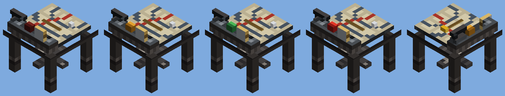

# Fire control (batch 56)

Status: implemented (pending CI and review)
Proposal issue: none. On 4 October 2026 the owner asked to "do those 1-6... each very carefully and detailed... one at a time with lots of depth". This is idea 2: a fire-control table directing several guns, with sectors and an optional sentry mode. It builds on fortifications (batch 55), which are not merged yet.
Owner: jimbozoomer-byte
Target milestone and tier: steel tier, after the big guns (batch 51) and tower guns (batch 54)
Primary specialty and supported player role: base defence; running a battery of guns from one place

## Player experience
Two new things:

| Thing | What it is |
| --- | --- |
| **Fire Control Table** | A steel plotting table: a firing chart with range arcs and the line of fire, a brass pointer and plotting pins, and on its far edge a range dial, the field handset and the **mode lamp** (dim red: hold, amber: converge, green: parallel, bright red: sentry). It faces the way you look when you place it, towards the enemy, so you stand behind it. |
| **Fire Control Wire** | A reel of signal cable that links guns to a table. It is a tool and is not used up. |

### Linking guns
1. Use the wire on a table.
2. Use it on each gun within **64 blocks** of that table. Each one links (the overlay counts them: "Gun linked (3 of 8)").
- A table directs up to **8 guns**.
- Using the wire on a gun already linked to that table unlinks it.
- Linking a gun to a second table drops its link to the first.
- Sneak and use the wire on a table to cut every link.
- Knocking a gun down, or breaking the table, drops the link.

Every crewed gun can be linked: the Siege Mortar, Self-Propelled Howitzer and Flak Gun (batch 51) and the five tower guns (batch 54).

### Using the table
- **Empty-handed:** the next mode.
- **Sneaking, empty-handed:** the next sector width: 90°, 180°, 270° or all round (the default), centred on the way the table faces.
- **With a Range Finder:** the table's target becomes your current Range Finder mark. Sneaking with it clears the target.
- **Every use** shows the table's state, for example: "Fire control: Converge, 3 of 3 guns ready, sector 360°, target 143 blocks away".

### The modes
The table lays only guns that **have nobody at their controls**. A gunner aboard always has the gun to themselves. Orders given while they crew it are not saved up for later.

- **Hold:** the guns stand still.
- **Converge:** every gun turns and elevates onto the table's target (the same ballistics as a gunner's mark), then waits. **A redstone pulse into the table fires one round from each gun**: a salvo, for a multi-barrel gun. One pulse is one salvo: holding the signal on does not fire again. A gun still reloading fires as soon as it is ready. Anything that gives a pulse works: a button, a lever, a daylight sensor, or a **field telephone** (batch 50) ringing beside the table, so a spotter far off can call for fire.
- **Parallel:** as converge, but each gun lays on its own point, **6 blocks apart across the line of fire**, in the order they were linked. Their shells land in a line instead of on one block.
- **Sentry:** every gun picks its own target, checking every half second: the nearest **hostile mob** (anything vanilla counts as an enemy) that is:
  - inside the table's sector, as seen from the table;
  - within 96 blocks of the gun but **no closer than 12**;
  - in reach of the gun's shells;
  - for a gun firing on the low arc, in sight (no block in the way);
  - **with no player within 8 blocks of it** ("check fire").

  It leads a moving target by how far the mob moves while the shell flies, and fires whenever it is laid and reloaded. It never targets players. Check fire is tested again at the moment it fires.

### Shells and the comparator
- A gun the table fires uses **only shells from ready racks within 2 blocks of it** (batch 55), never a player's inventory, and it is never free, even beside a creative player.
- An ammo hoist can keep the racks stocked, so a stocked fort can defend itself.
- **A comparator reads how many linked guns are ready:** laid on their point (or, on sentry, on a mob), reloaded, and with a shell in a rack. Updated every half second.

## Connections
- Recipes:
  - Fire Control Table: `RTC / PMP / S_S`: a Range Finder, a Field Telephone, a comparator, steel plates and a map (1).
  - Fire Control Wire: 8 copper wire round a stick (1).
- Input producers: the big guns' Range Finder, the trench works' Field Telephone, the metal press's steel plates and copper wire.
- Output consumers: the crewed guns. Redstone reads the table's comparator output.

## Balance and automation
- **Nothing is made from nothing.** A table fires only shells that were made and put into a rack, one per barrel, exactly as a gunner would.
- **Sentries cost shells.** A sentry kills mobs with shells, so a mob farm built on one costs shells and gives no experience (the kill is not a player's). It is not cheaper than vanilla's ways of killing mobs.
- **No griefing:** every shell is still a damage-only `Blast` that never breaks, moves or burns a block.
- **Sentries never shoot near players,** checked when choosing a target and again when firing.
- **Fire missions do not check fire.** The player ordering the pulse chooses the target.
- **Cost of aiming:** each aim is a search over simulated flights, as a gunner's mark already is. A sentry only tries the 4 nearest mobs that pass the cheap checks when picking a target, so a crowd of mobs does not multiply the work.

## Multiplayer and persistence
- **Server only:**
  - The table's orders (mode, target, sector, salvo count and links) live in its block entity.
  - The guns poll their table each tick and do the laying and firing themselves, so the table never needs a list of loaded entities.
  - Clients see the mode lamp (a block state) and the guns' aim (already synced).
- **Saving:**
  - The table saves its links, target, sector and salvo count.
  - Each gun saves its table's position and the last salvo it saw, so a reload does not fire an old order.
  - A link in progress (the wire used on a table) is not saved.
- **Unloaded chunks:**
  - A gun whose table is in an unloaded chunk, or more than 64 blocks away (a howitzer that drove off), waits, keeping its link.
  - A gun drops the link only when its table is gone or has cut it.
- Not verified with two players or on a dedicated server.

## Dependencies and assets
- No dependencies. All art is original, drawn in the clean style (`tools/clean_metal.py`) by `tools/fire_control.py`: the firing chart, four mode lamps and the wire icon. The table model is built from boxes with the existing dieselpunk textures.
- Code:
  - `building/FireControl` (registration, the wire's linking) and `FireControlTableBlock` (the block, its modes and orders).
  - `artillery/CrewedGun` gains laying and firing for a table, sentry targeting and check fire.
  - `Spotting.own` (a player's own mark) and `ReadyRackBlock.has` (a rack check that takes nothing).
  - `JugcraftArtillery`: using the wire on a gun links it instead of climbing aboard.

## Verification
- Planned in CI:
  - `fireControlTableLinksGuns`:
    - The wire links a Triple Battery and the gun knows its table.
    - The table takes 8 guns and refuses a ninth.
    - On a parallel sheaf straight down the range, three guns lay 6 blocks apart across it, with the middle one on the target.
    - The wire on the linked gun unlinks it.
  - `fireControlSalvoOnPulse`:
    - An uncrewed battery on converge lays on the target but does not fire before a pulse. It reports ready, and the table's comparator reads 1.
    - A redstone block beside the table fires one three-shell salvo from the ready rack (5 to 2).
    - The held signal fires nothing more.
  - `fireControlSentryKeepsToItsSector`, on sentry with a 90° sector facing south:
    - A husk to the east (outside the sector) is never targeted.
    - A husk to the south with a player 2 blocks from it is never targeted, and nothing is fired.
    - With those gone, a husk in the sector is fired on.
  - The client screenshot `jugcraft_fire_control`: a table on converge with three linked Bastion Mortars on plinths, each with a stocked rack, laid on a target to the north.
- Done locally:
  - `check_mod_data.py` passes. It checks the table's strength, the modes, the sectors and every number against the tool.
  - `check_repository.py` passes.
  - I reviewed offline renders of the table in each mode.
  - Gradle cannot resolve the Loom snapshot offline here, so compiling and the game tests run in CI only.
- Not done: a two-player server, a long sentry watch with many mobs, and reloading a world mid-salvo.

## World and event applicability
Not applicable: everything is crafted and placed by players. The raider faction (idea 3) is meant to give sentries something to shoot at.

## Rollout and open questions
- Next is **idea 3, a dieselpunk raider faction.** Its raiders will count as hostile mobs, so sentries engage them.
- Possible later additions: a creeping barrage (the target stepping forward each salvo), and letting a crewed gun follow the table's target as well as the gunner's own mark.
