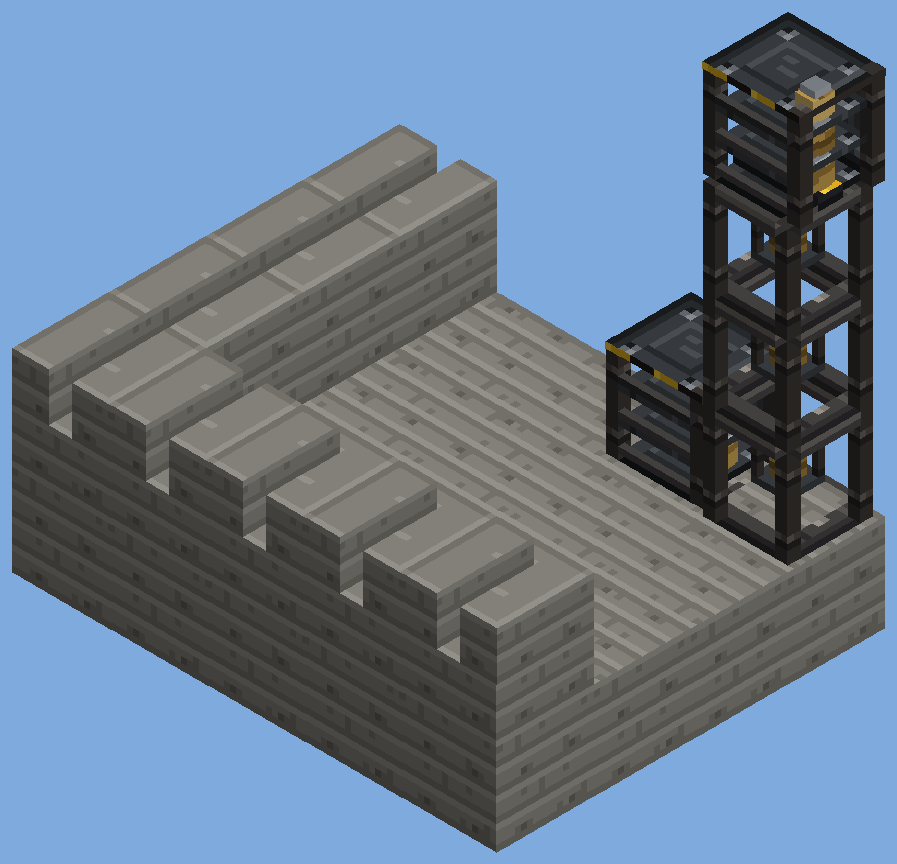

# Fortifications (batch 55)

Status: implemented (pending CI and review)
Proposal issue: none. On 4 October 2026 the owner asked to "do those 1-6", the ideas list that followed the tower guns, "each very carefully and detailed... one at a time with lots of depth". This is idea 1: gun towers and fortifications, so a tower gun (batch 54) has a tower worth standing on and a way to keep it supplied.
Owner: jimbozoomer-byte
Target milestone and tier: steel tier, with the construction chemistry's concrete and rebar (batch 32)
Primary specialty and supported player role: building and base defence; logistics for supplying guns

## Player experience
Six new blocks:

| Block | What it is |
| --- | --- |
| **Bastion Concrete**, with slab, stairs and **wall** | Board-marked cast concrete: four courses of plank imprints and the round tie holes the formwork leaves. It resists blasts nearly three times as well as plain concrete (24, against plain concrete's 9; blast-proof concrete is 1200). The wall is Jugcraft's first wall block: it joins vanilla walls and fence gates, and joins diagonally like vanilla's walls ([diagonal connections](diagonal-connections.md)). |
| **Bastion Parapet** | A crenellated top for a gun deck: a half-height footing carrying two merlons with a 4-pixel gap (the crenel) between them. The gap runs the way you face when you place it, so a ring of parapets round a deck has gaps to see and shoot through. Its collision shape matches the model, so you can stand in the gap. |
| **Steel Ladder** | Two steel rails and rungs, climbable like a ladder, for tower shafts. |
| **Blast Door** | A heavy riveted steel door: a vision slit in the top half, the locking handwheel and a hazard-striped kick plate in the bottom. Like an iron door, **only redstone opens it**. It is as blast-proof as blast-proof concrete (1200) and needs a diamond pickaxe. |
| **Ammo Hoist** | Stack hoists into a shaft (the top one shows a pulley head). Each holds up to 16 items. Every 8 ticks each lifts up to 4 of them into the hoist above. The top hoist hands them to the container on top of it or, failing that, beside it. A shaft of any height carries a steady 10 items a second. |
| **Ready Rack** | Nine slots of shells (Heavy, Flak and Great Shells; nothing else fits), with three shelves that fill with shells as it fills up. **A gunner with no shell of the kind their gun fires draws one from any ready rack within 2 blocks of the gun.** |

### Extras: doors, gates, corners and gun slits
| Block | What it is |
| --- | --- |
| **Bunker Door** | A heavy timber door for dugouts and bunkers: vertical spruce boards crossed by two black iron straps, a viewing hatch in the top half and a ring pull. **Opens by hand**, like a wooden door. Tougher than one: 4 hardness, 12 blast resistance. Mined with an axe. |
| **Sliding Gate** | A panel of heavy steel bars between two hazard-striped rails, **opened only by redstone**. **Gates side by side or stacked (facing the same way) form one gate:** a signal into any panel slides them all aside together, up to 64 panels. They close when no panel is powered. Closed, it is a full-height barrier you can see and shoot through. Open, only the slim end post is left and you walk through; mobs path through it only when it is open. It cannot be pushed by pistons. |
| **Bastion Parapet Corner** | The parapet's footing with one big merlon on its outer corner, to turn a ring of parapets round a corner. Its merlon stands at the front-left of the way you face when you place it. |
| **Bastion Embrasure** | A full block of bastion concrete with a **gun slit** two pixels high and six wide at eye height, running the way you face when you place it. You see and shoot out through it; most of what comes back meets concrete. |

### Supplying a gun tower
- **Loading a hoist:** use it with an item in hand, or feed it from pipes, hoppers or conveyors. They can load any hoist in the shaft, but **nothing can take items back out of a hoist**, so a hopper under the shaft cannot rob it.
- **The top of the shaft:** the top hoist puts items into whatever is on it (a ready rack, a chest or a crate), or failing that into containers beside it.
- **Ready racks:**
  - Use one with shells to stock it, or empty-handed to take the last stack back. It tells you how many shells it holds.
  - Pipes, hoppers and conveyors can stock or empty a rack.
- **Drawing shells:**
  - Every crewed gun draws from racks: the Siege Mortar, Self-Propelled Howitzer and Flak Gun (batch 51) and all five tower guns (batch 54).
  - The gunner's own shells are used first. A salvo draws one shell a barrel.
  - A rack counts when it stands within 2 blocks of the gun's own size, from one block below the gun to one block above its top.

## Connections
- Recipes for the extras:
  - Bunker Door: `PP / PI / PP`, spruce planks and an iron ingot (1).
  - Sliding Gate: `SRS` three times, steel plates and rebar (3).
  - Bastion Parapet Corner: `B_ / BB` (2).
  - Bastion Embrasure: 2 × 2 Bastion Concrete (4).
- Recipes:
  - Bastion Concrete: `CRC / RCR / CRC`: 5 concrete and 4 rebar (makes 8).
  - Bastion Concrete Slab: 3 in a row (6). Stairs: the usual pattern (4).
  - Bastion Concrete Wall: 6 Bastion Concrete (6).
  - Bastion Parapet: `B_B / BBB` (4).
  - Steel Ladder: `S_S / SNS / S_S`: steel plates and an iron nugget (8).
  - Blast Door: `PP / PB / PP`: steel plates and blast-proof concrete (1).
  - Ammo Hoist: `SCS / SGS / SCS`: steel plates, iron chains and a steel gear (4).
  - Ready Rack: `S_S / PPP / S_S`: steel plates and wooden slabs (2).
- Input producers:
  - The construction chemistry's concrete, rebar and blast-proof concrete.
  - The metal press's steel plates.
  - The steel tier's gears.
- Output consumers:
  - The big guns and tower guns, which draw shells from ready racks.
  - Any container a hoist feeds.

## Balance and automation
- Nothing is made from nothing. The hoist and the rack only move and hold items, and every block costs more material than it returns.
- A hoist cannot be emptied by a hopper, so a shaft cannot be used to duplicate or lose items.
- Breaking a hoist or a rack drops what it holds.
- The guns still need a gunner. A rack only saves the gunner carrying shells.
- A hoist shaft moves 10 items a second, four times a hopper's 2.5, and only upwards.

## Multiplayer and persistence
- **Server only:** the hoist works on scheduled ticks (every 8), and the rack's contents and fill change on the server. Clients only see the block states.
- **Saving:**
  - A hoist saves its load and a rack its nine slots.
  - Scheduled ticks are saved with the chunk, so a shaft resumes after a reload.
- **Racks during chunk load:** a rack restored from disk does not touch the world while loading.

## Dependencies and assets
- No dependencies. All art is original, drawn in the clean style (`tools/clean_metal.py`) by `tools/fortifications.py`:
  - concrete and its cap
  - the ladder
  - the hoist chain
  - the door's two halves and the item icons
- The parapet, hoist and rack models are built from boxes. The wall, ladder and door use vanilla's model templates with these textures.
- Code:
  - `building/Fortifications`, `ParapetBlock`, `AmmoHoistBlock` and `ReadyRackBlock`.
  - `artillery/CrewedGun` gains its ready-rack fallback.
  - `diagonal/DiagonalWalls` now registers diagonal walls for Jugcraft's own walls as well as vanilla's.
  - New tags:
    - `#jugcraft:artillery_shells`
    - the bastion wall in `#minecraft:walls`
    - the ladder in `#minecraft:climbable`
    - the door in `#minecraft:doors`

## Verification
- Planned in CI:
  - `fortificationBlocksPlace`: every block places. The parapet is full height but not a full cube. The wall is a wall and the ladder is climbable. The hoist and rack have their block entities.
  - `blastDoorOpensOnlyByRedstone`: the door's set cannot be opened by hand, and a redstone block beside it opens it.
  - `ammoHoistLiftsShellsToTheRack`: four stacked hoists show the right top and bottom states, and refuse extraction. 8 Heavy Shells put in the bottom climb into the rack on top, which then shows its first shelf filled.
  - `gunsDrawShellsFromReadyRacks`: a Triple Battery whose gunner carries no shells fires its three-shell salvo from a rack beside it, leaving 2 of 5.
  - The client screenshot `jugcraft_fortifications`: the tower as described under "Player experience", with its parapets, ladder, door, hoist, stocked rack and wall in front.
- Done locally:
  - `check_mod_data.py` passes. It checks the block list, strengths and numbers against the tool, the shell tag, and the bastion wall's diagonal wall like vanilla's.
  - `check_repository.py` passes.
  - I reviewed offline renders of the concrete, parapets, hoist shaft and racks, and a sheet of the new textures. The wall, ladder and door use vanilla templates that the offline renderer cannot draw; the CI screenshot will show them.
- Not done: a two-player server, and a long-running shaft across a chunk reload.

- Fortification extras, planned in CI:
  - `fortificationExtras`:
    - The bunker door opens by hand.
    - The embrasure's slit runs right through it.
    - The parapet corner's merlon turns with its facing.
    - Two sliding gates side by side open together from one redstone block, each leaving only its post.
  - The fortifications screenshot now has corner merlons, gun slits in the tower and a sliding gate in the front wall.

## World and event applicability
Not applicable: everything is crafted and placed by players.

## Rollout and open questions
- **Fire control (idea 2) comes next:** a fire-control table to direct several guns at once, and an optional sentry mode. The racks will feed sentries as they feed gunners.
- The bunker door, sliding gate, parapet corner and embrasure are now done (above).
