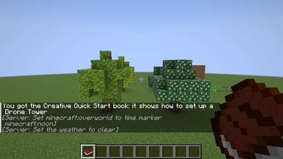
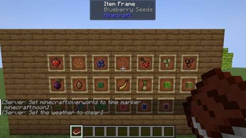

# Fruit crops: strawberries, blueberries, coffee, plums and bananas

Status: implemented in source; **not yet played**. The Build workflow compiles it; see Verification for what has actually run.
Proposal issue: none; requested directly by the owner on 8 October 2026. Their pages of milkshakes and pies and tarts (shared with the [cakes](cakes.md)) take fruit Jugcraft did not grow, so the owner was asked how to go on and chose to add them first, as crops in Jugcraft's own art ("Add as crops, Jugcraft art"), all also found wild: strawberries, blueberries, bananas, plums and coffee. Their library has no art for any of them. Part of the [kitchen and cooking expansion](../branches/AGRICULTURE.md#the-kitchen-and-cooking-expansion-planned), before the milkshakes and the pies and tarts.
Owner: @jimbozoomer-byte
Target milestone and tier: Milestone 3 (first homestead); Discovery tier. Seeds come from grass, a wild plant or a traded fruit; nothing needs a station but the furnace, the Cooking Pot and the Canning Kettle the farm already has.
Primary specialty and supported player role: farming; supports cooks (jams, the Coffee Cake, and the owner's pies, tarts and milkshakes to come) and traders (fruit from biomes others do not live in)

## Player experience
Grow five new fruits:

- **Three bushes on farmland,** a block tall at every age, as the pepper is: the **Strawberry Plant**, the **Blueberry Bush** and the **Coffee Plant**. Each is planted from its seeds, leafs out, flowers white and sets green fruit that ripens: red strawberries hanging over the edge of their three-part leaves, blue berries on a twiggy bush, red coffee cherries along the branches of a glossy shrub. **A right-click picks a ripe bush** (one to three strawberries, two to four blueberries or one to three coffee cherries) and it flowers again, never needing to be replanted.
- **Two trees,** grown from their seed as the [orchards'](orchards.md) are: the **Plum**, an oak-trunked tree that blossoms white and hangs with purple plums, and the **Banana**, a soft green-brown **Banana Stem** of its own under a crown of bright fronds that droop and hang, flowering purple and then hung with yellow bunches. A right-click picks the ripe fruit (one to three plums, two to four bananas) and the leaves fruit again. A plum crafts into its **Plum Pit**; a banana into a **Banana Pup** (the sucker a banana plant grows from).
- **Seeds:** breaking short grass now and then gives Strawberry, Blueberry or Coffee Seeds, as the other crops' seeds; a strawberry, blueberries or coffee cherries craft into their seeds.
- **Wild:** Wild Strawberries in forests and flower fields, Wild Blueberries in taigas and hills, Wild Coffee in jungles, broken for one or two seeds (or, with shears, the plant itself); plum trees in forests and taigas and in the Orchard, banana trees in jungles and in the Tropics and the Rainforest.
- **Coffee:** Coffee Cherries roast into **Coffee Beans** in a furnace, smoker or campfire. The **Coffee Cake** now takes coffee beans where it took Mulling Spices, and the owner's coffee tart will.
- **Jams:** **Strawberry Jam**, **Blueberry Jam** and **Plum Jam**, cooked into a Mason Jar in the Cooking Pot, sealed in the Canning Kettle and set out on a Pantry Shelf as the other preserves are.

| **The bushes:** the Strawberry Plant, Blueberry Bush and Coffee Plant in rows on farmland, from planted (left) to ripe (right) | **Ripe:** the plum (left) and the banana (right) grown from their saplings and hung with fruit, the wild bushes before them |
| --- | --- |
|  |  |
| **In blossom:** the same two trees grown again, seen from the other side: the banana (left) and the plum, white with blossom (right) | **The wall:** the crops' items in item frames |
|  |  |

*In-game screenshots from CI's client game test (`FruitCropClientGameTests`, software rendering, small previews; the chat at the bottom is the test world's start-up messages).*

## Connections
- Existing input producer: short grass and wild plants for the seeds, wild trees for the pit and pup; farmland and water, bone meal; sugar and Mason Jars for the jams.
- Existing output consumer: the fruit are foods (`c:foods/berry`, `c:foods/fruit`) and crops (`c:crops/<crop>`), the seeds `c:seeds/<crop>`, for other mods' recipes; the jams join the pantry (`PreserveJarItem`, the Canning Kettle and Pantry Shelf); the coffee beans go into the Coffee Cake; the hydroponic bay grows the three bushes' seeds as it grows the other crops'. The owner's pies, tarts and milkshakes are the next consumers.
- Technology connection: the bushes are tall crops, so the hydroponic bay grows them (two fruit and one or two seeds a harvest, as every crop); the jams and the coffee are data recipes, ready for the engineered kitchen (slice 10).
- Magic connection: none.
- Reachable entry path: short grass anywhere gives the bushes' seeds; wild plants and trees give the rest; a traded fruit starts a farm. No circular unlock: nothing grown here is needed to reach it.
- Required vs optional: all optional, more food.
- How this stays useful without other branches: the fruit feed a farm and stock a kitchen on their own.

## Balance and automation
Units are hunger points (docs/BALANCE.md); the numbers are in `tools/fruit_crops.py` and `tools/orchard.py`.

| Food | Hunger (saturation modifier) | Made from |
| --- | --- | --- |
| Strawberry | 2 (0.3); vanilla's sweet berries give 2 | a bush |
| Blueberries | 2 (0.2) | a bush |
| Plum | 4 (0.3), as an apple | a tree |
| Banana | 4 (0.4) | a tree |
| Coffee Cherries, Coffee Beans | not eaten | a bush; cherries roasted |
| Strawberry Jam, Blueberry Jam | 4 servings of 3 (0.4) | 6 berries (12), 2 sugar, a jar |
| Plum Jam | 4 servings of 3 (0.4) | 3 plums (12), 2 sugar, a jar |

- **The jams give what went in** (twelve hunger for twelve), as the pantry's other preserves; `tools/check_mod_data.py` checks every preserve against its ingredients.
- **Growing:** a bush grows as a crop does, through eight ages on farmland in light, scaled as the pepper (1.25 times vanilla's time; the coffee plant 1.5). Picked, it goes back to age 5 and ripens again. The trees fruit as the orchards' (one stage in 10 random ticks).
- **Seeds:** short grass gives one Jugcraft seed one time in eight, as vanilla's wheat seeds, chosen evenly among every crop's (now 31), so the new seeds do not make grass give more. One fruit crafts into one seed; a wild plant gives one or two.
- **No loops:** nothing makes fruit from a recipe; fruit to seed, cherries to beans and fruit to jam go one way. `tools/check_mod_data.py` follows every agriculture recipe and fails on a loop.
- **Bounded work:** the bushes and leaves tick only when the game random-ticks them.

## Multiplayer and persistence
- All changes happen on the server; picking is a normal block use, so vanilla's reach check and the town's protection apply. A pick drops items into the world as breaking a block does.
- Persistence: a bush's age and a leaves block's fruit are block state; nothing else is stored.
- Every ID is new; nothing existing is renamed or migrated. The bushes are added at the end of `TallCrop` and the trees at the end of `OrchardTree`. The Coffee Cake's recipe changes (coffee beans for Mulling Spices); its ID does not, and a baked or set-down Coffee Cake is unchanged.
- Disabling `agriculture` removes the recipes and the wild patches but keeps the registrations, so saved bushes, trees, fruit and jars survive. The Jugcraft biomes' plum and banana trees are placed under the `biomes` switch, as the orchards' trees are.

## Dependencies and assets
No new dependency.

**Jugcraft's own art,** drawn by code from fixed seeds, as the owner chose; no Mojang texture is read, traced or recoloured, and none of the owner's files is used (their library has none of these fruits). The bushes' six stages, the fruit, seeds and coffee beans are drawn by `tools/fruit_crop_textures.py` for the crop model (upright planes, as the pepper's); the plum and banana trees' leaves, saplings, fruit, pit and pup, and the Banana Stem, by `tools/orchard_textures.py` with the orchards' trees (the leaves painted as every Jugcraft tree's are, the banana's as broad fronds); the jams by the pantry's painter. If the owner draws any of these, their files can replace these under the same IDs.

The banana follows the [tree roster's](../branches/TREES.md#banana) banana where it can: a `banana_stem` of its own in `#minecraft:logs` (so its fronds stay while it stands) but not `#minecraft:logs_that_burn`, under vanilla's cherry foliage shape so the fronds droop and hang. Unlike the roster's, it is built as an orchard tree, so it fruits on its own leaves (`banana_leaves`) as the other fruit trees do instead of a separate bunch block, and its sapling is planted from a Banana Pup.

## Verification
CI (8 October 2026, GitHub Actions, the pins in [PLATFORM.md](../PLATFORM.md)):

| Commit | What ran | Result |
| --- | --- | --- |
| `9a378f1` | Build, data audit, game tests, and the client game test classes the change picks (`FruitCropClientGameTests` and `OrchardClientGameTests`) | Compiled; data audit pass, 1767 IDs; **all 962 required game tests passed**, the fruit crops' among them; **both client classes passed**. The screenshots above are from this run |

Run locally (8 October 2026):

| Check | Result |
| --- | --- |
| `python3 scripts/check_repository.py` | Pass |
| `python3 tools/check_mod_data.py`: also checks the bushes in `TallCrop` against `tools/agriculture.py` (with the other tall crops), the grass seeds against Java and the game test, the plum and banana in `OrchardTree` against `tools/orchard.py`, each tree's sapling, leaves, loot, tags, words, feature (its trunk, oak or the banana's stem, its foliage type and shape), wild patch and the Jugcraft biomes that pick it; the Banana Stem (registered as a pillar, its blockstate for each axis, textures, item, words, loot, and tags: logs and axe, not fuel); the jams as preserves; and, with the others, the foods, seeds, recipes and models | Pass, 1767 IDs |
| `python3 tools/owner_art.py --check` | Pass |
| `python3 tools/generate_material_data.py`, then `git status` | Writes this slice's data only; the four orchard trees' features are unchanged |
| `python3 tools/generate_textures.py` | Writes this slice's textures; it also rewrites the same 24 unrelated Styx textures as before, left as committed |
| `./gradlew build`, game tests and client game tests | Not run locally (the Fabric Maven is out of reach here); run by CI |

The new game tests (`FruitCropGameTests`):
1. each bush's seeds plant it on farmland, and it ripens through every age a block tall;
2. a ripe bush is picked for its fruit (as many as `TallCrop` gives), goes back to its regrowth age and ripens again;
3. each wild plant broken by hand gives one or two of its crop's seeds, and its loot table and wild patch load;
4. a strawberry, blueberries and coffee cherries craft into their seeds, and coffee cherries roast into coffee beans in a furnace, smoker and campfire;
5. the three jams' recipes load and the Cooking Pot makes each from a jar, its fruit and sugar;
6. the strawberry, blueberries, plum and banana are foods of their value, the jams preserves of 3 a serving, and the coffee is not eaten as it is.

`OrchardGameTests` now covers six trees: the plum and banana saplings grow their trees (the banana on its stem), and every test that loops over the trees (blossoming, ripening and picking, ripe leaves broken, fruit to seed to sapling, loot tables and wild placements) includes them, laid out to fit the test area. `AgricultureGameTests.grassDropsJugcraftSeeds` counts the three new seeds.

The client game test (`FruitCropClientGameTests`, CI job `client`) sets out a row of each bush on farmland at every age, from planted to ripe; grows the plum and banana trees twice, a row ripe and a row in blossom, with the wild bushes before them; hangs the crops' items on a wall; and takes four screenshots. `OrchardClientGameTests` keeps to its own four trees.

Not done: play in a real client and a two-client dedicated-server session.

## World and event applicability
Farming and food. The plants grow wild in new chunks only, in the biomes above. The trees' leaves are evergreen, as the orchards' are. Nothing is seasonal.

## Rollout and open questions
- Next: the owner's pies and tarts, then their milkshakes, from these fruits.
- The tree roster's Lush Grassland bananas, its banana bunch block and cherry trees stay for the trees branch.
- The owner's own art for any of these, if they draw it, replaces Jugcraft's under the same IDs.
