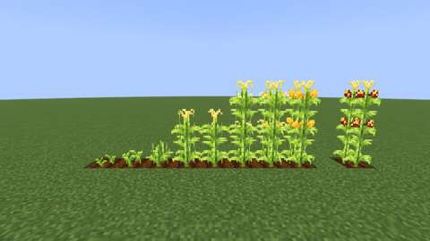
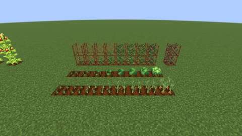
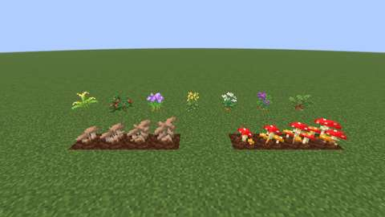
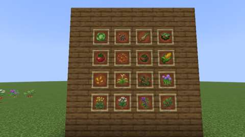

# Garden crops in the owner's art: cabbage, onion, tomato and corn, wild roots, rotten tomatoes and mushroom colonies

Status: implemented in source; **not yet played**. The Build workflow compiles it; see Verification for what has actually run.
Proposal issue: none; requested directly by the owner. Slice 7 of the [kitchen and cooking expansion](../branches/AGRICULTURE.md#the-kitchen-and-cooking-expansion-planned) meets crops Jugcraft already grows, so the owner was shown both looks and the overlaps on 9 October 2026, and chose the recommendations ("go with the recommendations"): their cabbage, onion, tomato and corn growth stages for Jugcraft's crops, their wild plants (carrots, potatoes and beetroots new, the cabbage, onion and tomato redrawn), their mixed salad as the Garden Salad, a rotten tomato from vines left too long, and their mushroom colonies as a crop. This is part a; new vegetables, herbs and spices follow as part b.
Owner: @jimbozoomer-byte
Target milestone and tier: Milestone 3 (first homestead); Discovery tier. Everything grows from seeds, wild plants or vanilla mushrooms, on farmland, a trellis or Rich Soil the farm already has.
Primary specialty and supported player role: farming; supports cooks (the same crops and salad as before, and mushrooms on demand) and traders (wild roots from biomes others do not live in)

## Player experience
- **The cabbage, onion, tomato and corn wear the owner's growth stages.** Nothing about how they grow changes: the same seeds, ages, heights, picking and drops.
  - The **cabbage** shows a stage of its own at each of its eight ages (it had four).
  - The **onion** keeps four stages.
  - The **tomato** is the owner's budding vine while it is one block tall, then their fruiting vine in the trellis: flowering, green, turning and red, the vine climbing into the upper trellis.
  - The **corn** is their corn: a sprout, a young plant, then a stalk two and three blocks tall, tasselled at the top, its ears ripening gold. It stays three blocks tall, so cornfields and the corn maze ([fall additions](fall-additions.md)) keep their height (the maze stands in the owner's ripe corn). **Ornamental corn** grows as corn does and ripens with flint corn's red, gold and purple kernels on the owner's ears.
- **Tomatoes go over.** A ripe tomato vine left unpicked turns over-ripe in time (about eleven minutes on average, at the default tick speed): the owner's withered vine, its fruit gone soft. Picked or broken then, it gives **Rotten Tomatoes** instead of tomatoes, as many, and picked it flowers again as usual, fresh. Pick on time for tomatoes.
- **Rotten Tomato:** thrown like a snowball (a right-click; stacks of 16). It bursts in a red splat where it lands, bumping whoever it hits without hurting them, or it goes on the compost (a good chance, as baked food).
- **Wild Carrots, Wild Potatoes and Wild Beetroots,** in the owner's art: patches on grass in plains and flower fields (carrots), taigas and hills (potatoes), plains and swamps (beetroots). Broken, they give one or two carrots, potatoes or beetroot seeds; shears take the plant. Vanilla's own crops become reachable in the wild, not only from villages and zombies. The **Wild Cabbage, Onion, Tomato and Corn** wear the owner's drawings too.
- **The Garden Salad** keeps its recipe and name; its icon is the owner's mixed salad. The cabbage, onion, tomato and corn items and their seeds are the owner's too.
- **Mushroom colonies.** Use a brown or red mushroom on the top of **Rich Soil** to plant a **Brown or Red Mushroom Colony** (sneak to place a plain mushroom instead). It grows through the owner's four stages, from a single cap to a cluster, but only in the shade, as mushrooms spread: where the light is 12 or less (a cellar, a cave, a roofed shed), never under the open sky. Bone meal grows it a stage anywhere. Grown, **shears or a knife** pick two or three mushrooms and it goes back to its second stage to grow again. Broken, it gives back its mushroom, and grown, two or three more. It also stands on mycelium, podzol and nylium.

| **Corn:** corn at every age, left to right, the owner's sprout to the ripe stalk three blocks tall, and ripe ornamental corn beside it | **The kitchen garden:** tomatoes climbing their trellises (one vine gone over, at the right), cabbages and onions at every age |
| --- | --- |
|  |  |
| **Wild plants and colonies:** the seven wild plants in the owner's art, and the brown and red mushroom colonies at every stage on Rich Soil | **The wall:** the crops, seeds, the Garden Salad and a Rotten Tomato in item frames |
|  |  |

*In-game screenshots from CI's client game test (`GardenClientGameTests`, software rendering, small previews).*

## Connections
- Existing input producer: the crops' own seeds (short grass, the wild plants, the produce); vanilla's brown and red mushrooms (caves, swamps, dark forests, mushroom fields) and the [soil slice's](soil-compost-and-storage.md) Rich Soil for the colonies; farmland, trellises, water and bone meal.
- Existing output consumer: unchanged for the four crops (the Cooking Pot's soups and salads, the menu, the feasts, the corn maze, popcorn and roasted corn); the wild roots give vanilla's carrots, potatoes and beetroot seeds, which every vanilla and Jugcraft recipe takes; the colonies' mushrooms go into vanilla's mushroom stew, suspicious stew and fermented spider eyes and the Cooking Pot's mushroom barley soup and mushroom rice; rotten tomatoes go on the compost (vanilla's composter, so towards bone meal).
- Technology connection: the colonies are a hand-tended mushroom crop beside the hydroponic bay, which already grows mushrooms from mushrooms with power; everything is data (loot tables, blockstates, worldgen) for automation to read.
- Magic connection: none.
- Reachable entry path: brown and red mushrooms are found in caves, swamps, dark forests and mushroom fields; Rich Soil comes from Organic Compost (dirt, straw, bone meal and rotten flesh), and colonies also stand on mycelium and podzol found in the world. The wild roots are found by walking. No circular unlock: nothing here is needed to reach itself.
- Required vs optional: all optional; the restyle changes no recipe.
- How this stays useful without other branches: mushrooms and roots feed a farm on their own.

## Balance and automation
Units are items and random ticks; the numbers are in `tools/garden.py` (the record of truth for the Java constants, which `tools/check_mod_data.py` compares).

| What | Number | Why |
| --- | --- | --- |
| A ripe tomato vine going over | 1 in 10 of its random ticks; about 11 minutes at the default speed (a block's random tick comes about every 68 seconds) | Long enough to pick a field on any round of the farm; on Rich Soil Farmland, which gives the vine twice the ticks, it ripens and goes over twice as fast |
| Rotten tomatoes from a vine gone over | as many as tomatoes: 2-4 picked or broken (Fortune adds as it does to tomatoes) | Nothing is gained by letting a vine go over, and nothing lost but the fresh fruit |
| A colony growing | 1 in 5 of its random ticks, only at light 12 or less; about 6 minutes a stage (half on Rich Soil) | Slow, and only indoors or in shade |
| A colony picked | 2-3 mushrooms, back to its second stage (two stages to regrow, about 11 minutes, half on Rich Soil) | A cellar of colonies is steady, not a flood |
| A colony broken | its mushroom back; grown, 2-3 more | Planting costs nothing in the end; picking first and breaking later is the same |
| A wild root broken | 1-2 carrots, potatoes or beetroot seeds | As every wild plant |
| Rotten Tomato compost chance | 85% a layer (`COMPOSTABLE_MEDIUM_HIGH`) | As baked food |

- **No loops:** a mushroom planted is given back, no more. Composting mushrooms makes bone meal at about ten mushrooms a bone meal, and a colony needs two bone meal from picked to grown for two or three mushrooms; rotten tomatoes make bone meal at about eight a bone meal, and a vine needs one or two to ripen again for two to four. Neither gives more than went in. `tools/check_mod_data.py` follows every agriculture recipe and fails on a loop.
- **Bounded work:** the vine and the colonies only act on the game's own random ticks; a vine gone over and a grown colony stop ticking. The thrown tomato lives until it hits something, as a snowball.

## Multiplayer and persistence
- Everything happens on the server. Picking, planting and harvesting are normal block uses, so vanilla's reach check and the town's protection apply; planting a colony also checks that the player may build there. A thrown tomato is a vanilla-style projectile: its damage source names its thrower, it deals none, and it touches no block.
- Persistence: a vine's age, section and over-ripeness and a colony's stage are block state; nothing else is stored.
- **Save compatibility:** the tomato block (`jugcraft:tomato_crop`) gains a block state property, `overripe`; tomatoes saved before load with it `false`, so a world's vines are unchanged. Every other ID is unchanged or new (`jugcraft:rotten_tomato`, its entity, `jugcraft:wild_carrots`, `wild_potatoes`, `wild_beetroots`, `brown_mushroom_colony`, `red_mushroom_colony`). Only textures and models are replaced and removed; no saved block or item is renamed.
- Disabling `agriculture` removes the recipes and the wild patches but keeps the registrations, so saved vines, colonies and items survive.

## Dependencies and assets
No new dependency.

**The owner's own textures,** used as drawn. `tools/owner_art.py` copies each file byte-for-byte from `art/owner-library/originals/Blocks/farming and food textures/`, runs last in `tools/generate_textures.py`, and `tools/check_mod_data.py` fails if a runtime copy differs from its source. Imported here: 62 textures (`tools/garden.py` `TEXTURES`): `cabbages_stage0`-`7`, `onions_stage0`-`3`, `budding_tomatoes_stage0`-`3`, `tomatoes_stage0`-`3`, `tomatoes_on_rope_stage0`-`3`, `tomatoes_old_stage3`, `corn_crop_stage0`-`7`, `corn_top_stage3`-`7`, the wild plants (`wild_corn`, `wild_tomatoes`, `wild_onions`, `wild_cabbages`, `wild_carrots`, `wild_potatoes`, `wild_beetroots`), the items (`cabbage`, `cabbage_seeds`, `onion`, `tomato`, `tomato_seeds`, `corn`, `corn_seeds` as Corn Kernels, `rotten_tomato`, `mixed_salad` as the Garden Salad) and the colonies' stages (`brown_mushroom_colony_stage0`-`3`, `red_mushroom_colony_stage0`-`3`).

One adaptation: **ornamental corn's ripe stage** (`ornamental_corn_crop_stage7`, `ornamental_corn_top_stage7`) is the owner's `corn_crop_stage7` and `corn_top_stage7` with the ears' three golden tones (the only pixels of those colours) swapped for flint corn's red, with every third kernel gold and some purple, each shaded as the tone it replaces (`garden.flint_ears`). `tools/owner_art.py --check` compares these with what the recolouring writes.

**How the stages fit.** The owner's corn is two blocks tall and Jugcraft's three, so a three-block plant stands on the owner's stage-4 stalk (before the ears), the stage's own stalk with its ears in the middle and its top above; their tops for the first three stages go unused, as Jugcraft's corn is one block tall until age 3. The tomato's budding vine is its one-block stages; at age 3, two blocks tall in the trellis, the budding vine's second stage stands in the upper trellis. The rope versions of the fruiting vine are drawn without a rope, so the trellis stays the support. The cabbage's eight stages are one an age; the onion's four keep the old mapping (ages 0-1, 2-3, 4-6, 7).

Removed: Jugcraft's own drawings of these crops, their items, the wild corn and wild tomato, and ornamental corn's ripe middle (28 block textures and 26 models no longer used, and the code that drew them in `tools/crop_textures.py`, `tools/kitchen_textures.py` and `tools/halloween_textures.py`). No Mojang texture is read, traced or recoloured.

## Verification
CI (9 October 2026, GitHub Actions, the pins in [PLATFORM.md](../PLATFORM.md)):

| Commit | What ran | Result |
| --- | --- | --- |
| `d1a9419` | Build, data audit, game tests, client game tests | Compiled; **all 1185 required game tests passed** (`GardenGameTests` among them, and the crops' existing tests); the client shard with `GardenClientGameTests` passed and took the screenshots above. Two failures not this branch's, both red on its base `integration/oct9-ready-prs` (`0ddeb86`) too: the client shard that runs the most classes finished its tests (`BUILD SUCCESSFUL in 29m 19s`) but went past the job's 30-minute limit and was cancelled, so the `client` summary failed; and in the job without the optional integrations, `ArmsVIIIGameTests.javelinStrikesAndComesDown` failed, the javelin passing through its pig without striking, a test that fails now and then on the base as well |

Run locally (9 October 2026):

| Check | Result |
| --- | --- |
| `python3 scripts/check_repository.py` | Pass |
| `python3 tools/check_mod_data.py`: also checks `TomatoVineBlock` (its chance, property and rotten item) and its registration for the tomato, the vine's blockstate for every age, section and over-ripeness (withered only when ripe) and its loot (tomatoes fresh, rotten tomatoes gone over); `RottenTomatoItem`'s speed, the stack of 16, the entity and its renderer, its words and compost chance; `MushroomColonyBlock`'s constants against `tools/garden.py` COLONY, both colonies' registration, Rich Soil's planting, blockstates, cross models, loot, words and that they have no item; the wild roots in `WILD_CROPS`, their loot (vanilla's crop), biomes and textures; and that the owner's ripe corn has the golden tones ornamental corn's recolouring swaps. Breaking any of these on purpose (the over-ripe chance, a colony's growth, the throw speed, a wild root's drop, the ear tones) makes it fail | Pass, 1915 IDs |
| `python3 tools/owner_art.py --check` | Pass |
| `python3 tools/generate_material_data.py`, `python3 tools/generate_textures.py`, then `git status` | Writes this slice's data and textures only |
| `./gradlew build`, game tests and client game tests | Not run locally (the Fabric Maven is out of reach here); run by CI |

The new game tests (`GardenGameTests`):
1. a ripe vine keeps ticking until it goes over, every block of it at once, then stops; picked, it gives 2-4 rotten tomatoes and no tomato, and goes back to its regrowth age, fresh;
2. broken gone over, a vine drops rotten tomatoes, no fresh ones, its seeds and both trellises;
3. a vine that is not ripe cannot go over;
4. a rotten tomato dropped on a cow bursts on it: the cow is hit by the thrower but not hurt, and nothing is left;
5. thrown from the hand, a rotten tomato is used up and flies;
6. a brown or red mushroom used on Rich Soil plants its young colony and is used up; on plain dirt no colony grows;
7. a colony shut away from the light grows to its last stage and rests; one under the open sky does not grow (the test first reads both lights); bone meal grows it a stage there;
8. a bare hand picks nothing; shears pick 2-3 mushrooms, set the colony back to its second stage and wear a use; a knife picks too;
9. a young colony broken gives back its mushroom, a grown one its mushroom and 2-3 more, and one whose soil is taken away pops off;
10. the wild carrots, potatoes and beetroots, broken, give 1-2 carrots, potatoes and beetroot seeds.

The existing tests of these crops (`AgricultureGameTests`, `KitchenGardenGameTests`, `HalloweenGameTests`, the corn maze's) run unchanged.

The client game test (`GardenClientGameTests`, CI job `client`) sets out corn at every age with ripe ornamental corn beside it; tomatoes on trellises, cabbages and onions at every age, with a tomato vine gone over; the seven wild plants and both colonies at every stage on Rich Soil; and the items in item frames; and takes four screenshots.

Not done: play in a real client and a two-client dedicated-server session.

## World and event applicability
Farming and food. The wild roots grow in new chunks only, in the biomes above. Nothing is seasonal.

## Rollout and open questions
- Part b of slice 7: new vegetables, herbs and spices in Jugcraft's art (the candidates shown to the owner: lettuce, cucumber, radish, spinach, eggplant, zucchini, peas; basil, mint, rosemary, thyme, parsley, sage, dill and chives in pots, planters and drying bundles; black pepper, ginger, a cinnamon tree, vanilla on a trellis, mustard, saffron and paprika from chili on a spice rack).
- Vanilla's carrots, potatoes and beetroots keep vanilla's look as crops; only their wild plants are the owner's.
