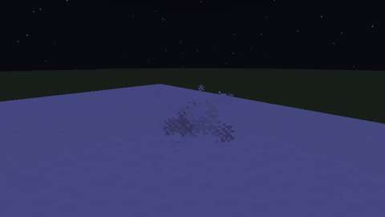
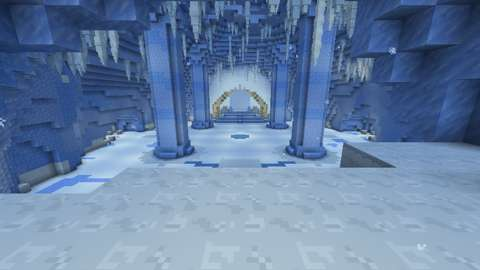
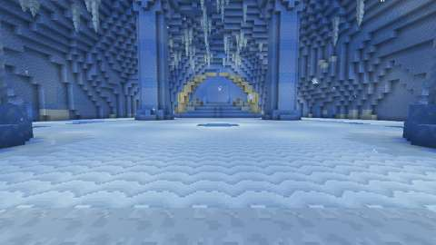
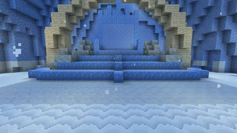
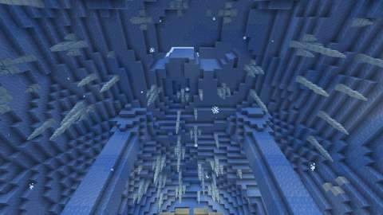
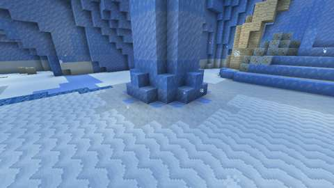
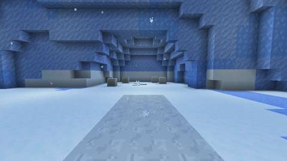
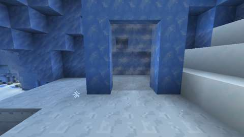

# The Glacier Hall, and the Frost Horn

Status: implemented in source; CI builds it and its game tests and client game test pass (below). Part 1 of boss 3, the Yeti King, in the [bosses plan](../branches/BOSSES.md#the-yeti-king-the-plan-being-built): the Glacier Hall, a third lair on the shared framework ([hollow-acre.md](hollow-acre.md)), and the summoning that opens it. The Yeti King and his loot are part 2, in their own pull request. It has not been played by hand, and the two-client dedicated-server playtest is still to do.
Proposal issue: none. On 10 October 2026 the owner chose to "build a new boss" the way Madame Tatterlace was built ("lair, summoning, fight, loot, tests and pictures"); the Yeti King is the owner's own example in the bosses brainstorm.

Target milestone and tier: Specialization tier (dungeon expeditions), as the Witching Season's lairs are. The horn takes Discovery-tier things: a goat horn, gold, leather and snow.
Primary specialty and supported player role: adventuring, in the cold biomes.

## Player experience

### The Frost Horn

1. Craft a **Frost Horn**: a goat horn bound with two gold ingots and two leather, packed with two snow blocks (leather, gold, leather over snow, goat horn, snow over a gold ingot).
2. At night, in the Overworld, blow it standing on snow or ice: a snow block or layer, powder snow, ice of any kind, or Jugcraft's winter snow (`#jugcraft:frost_horn_ground`).
3. Its call rolls over the snow and a roar answers it. The snow at your feet splits and a whirl of white mist and snowflakes rises there. You fall through and land on the ledge in the Glacier Hall, frost on your skin (it fades in three seconds and does no harm). The horn is used up.
4. For 60 seconds (`lairs.gate_seconds`) the whirl stays open, with a sound of wind. Anyone who uses it follows you in, frosted too, while the party has room (`lairs.party_size`). Nobody is taken in by standing near it.
5. When something is missing, the horn only says what, and nothing is used up:
   - by day: "Nothing answers the horn by day";
   - off the snow: "Blow it standing on snow or ice";
   - outside the Overworld;
   - where a whirl is already open, within 3 blocks: use the whirl to follow;
   - when every instance of the hall is taken.
6. Every blow, answered or not, rests the horn for two seconds.

The Yeti King is no Witching Season boss: the horn works all year, at night, whatever `lairs.off_season` says.

When the instance closes, the whirl closes at once.

### The Glacier Hall

A vast cavern in the heart of a glacier, 80 blocks across, 44 high and 88 long, walled and vaulted in packed ice veined with blue, its walls rippled and uneven. Snow drifts against their foot.

- **The arrival:** a ledge high in the south wall, ten blocks above the lake, floored with trampled snow. A snow-choked crevasse rises behind it through the ice to a sliver of pale sky. You land there facing north, over the lake.
- **The way home:** beside the arrival, Grey Mist hangs in an arch of blue ice. Use it at any time, in or out of a fight, to go back to exactly where you stood.
- **The snow ramp:** trampled snow on a drift banked against the wall, falling from the ledge to the lake's south shore half a block a block, so you walk down it (and back up it) without jumping. The drift's banks fall away a block a block either side.
- **The frozen lake**, the arena: 41 blocks across, crusted with drift snow in wind ripples. The wind has scoured a band of its shore and a patch in its middle to bare **glare ice**, as slick as blue ice. Four great **ice columns**, banded packed and blue ice, rise from it to the vault; round each, the snow is **trampled** hard. The snow is trampled at the ramp's foot, before the dais and on the paths to the dens too: the footing the Yeti King will never bare.
- **The throne:** on the north shore, a dais of three steps, each rimmed with blue ice and topped with trampled snow. On the top step stands a throne hewn from the ice, a white pelt on its seat and a crown of points along its tall back. Two **mammoth tusks** rise from the lowest step either side and arch in over it. His **frozen hoard** is heaped on the steps beside it: gold coins, a goblet and gems frozen in the ice.
- **The dens:** a cave in each of the east and west walls at the lake's level, old bones and white pelts on its snowy floor, a trampled path out to the lake.
- **Overhead:** **giant icicles** hang from the vault, some in clusters, none lower than 15 blocks above the lake. A crack runs across the vault's crown, open to the pale sky.
- **The light:** hidden light blocks, as if the daylight soaked through the ice: brightest under the crack and at the arrival. Snowflakes drift in the air.

Everything else is the shared framework ([hollow-acre.md](hollow-acre.md#lairs-the-shared-rules)): an instance per opening, at most eight; at most four players; nothing can be built or broken; the mist's toll at the edges; Grave Goods on death; closing after 30 seconds empty.

## Changes from the plan

- **The crevasse and the crack are open to the sky.** The plan has daylight soaking through the ice. Rather than clear ice (vanilla ice and snow layers melt under the hidden lights), the crevasse over the ledge and the crack across the vault are open, and show the hall's pale sky. Both are out of reach.
- **Glare ice is already in the hall.** The plan has the King bare glare ice in a fight. The wind has already scoured a band round the lake's shore and a patch in its middle, so the lake reads as a lake, and the patch marks where his Grey Mist will open when he falls.
- **The snow ramp is straight.** The plan has it curve down the wall. It runs straight from the ledge to the lake's south shore, as the Spindle Loft's tape does, so each block is exactly half a block lower than the last.
- **The whirl is the Mist Gate.** The Last Rites' gate entity serves: over the snow it draws a whirl of snowflakes and white mist and sounds of wind, and those who follow through it land frosted, as the horn's blower does.
- **The Frost Horn stacks to 16** and works all year (the plan: "no Halloween bonus").
- **Yeti Fur** in a cheaper horn comes with the Yeti King's loot in part 2.

## Connections

- **Inputs:**
  - a goat horn, from goats (mountain biomes) or pillager outposts;
  - gold and leather;
  - snow blocks, from snowballs;
  - snow or ice to stand on, in the cold biomes or under Jugcraft's winter snow (`seasons.snow`).
- **Outputs:** the way into the Glacier Hall, where the Yeti King will wait (part 2).
- **Technology and magic:** none; the hall is an adventuring destination. Its fight's loot (part 2) brings Arms VII's two Yeti King trophies into survival.
- **Reachable entry path:** every input is reachable in the Discovery tier without the hall: no circular unlock.

## Balance and automation

- **The cost:** every opening uses up a Frost Horn, and so a goat horn. There is no cooldown beyond the horn's two-second rest: the horn is the limit, as the other rituals' items are.
- **No loop:** nothing comes out of the hall in part 1. Its lair-only blocks drop nothing and have no items.
- **No automation:** only a player's own blow opens the hall, and only a player's own use of the whirl takes them in.

## Multiplayer and persistence

- **Server authority:** the server decides everything. Clients only send the use: the call, the refusals, the whirl and the entry all happen on the server, and the horn's rest is counted there.
- **What is saved:**
  - the whirl is never saved, since a restart closes its instance;
  - a player's visit and Grave Goods are saved with the player, as for every lair.
- **Chunks:** no chunk is force-loaded. The whirl shows itself only where its chunk is loaded (an entity, ticked by its chunk).
- **Griefing:** nobody is pulled in. A second horn where a whirl is open is refused and kept. Nothing in the hall can be changed.
- **Still to do:** the two-client dedicated-server playtest.

## Dependencies and assets

No new dependency. Everything is drawn by code:
- the hall is laid out by `tools/glacier_hall.py`, on `tools/lair_layout.py`. Its template has 20,274 blocks: only the ice touching the open air is kept, and nothing in it can melt;
- its six lair-only blocks' textures are painted by `tools/glacier_hall_textures.py`, in the manner of the vanilla blocks (`tools/block_style.py`);
- the Frost Horn's icon is a 16×16 map, `tools/item_icons/frost_horn.txt`, drawn by [ITEM_ICONS.md](../ITEM_ICONS.md), with a new material, `horn`, in `tools/icon_materials.py`, and checked by `tools/check_icon_maps.py`;
- the dimension files are written by `tools/lair_data.py` from the hall's line in `tools/lairs.py`. Its music is vanilla's frozen peaks.

No Mojang texture is read, traced or copied.

New IDs (all under `jugcraft`):
- the dimension, dimension type and biome `glacier_hall`;
- the structure `lair/glacier_hall`;
- the lair-only blocks `drift_snow`, `trampled_snow`, `glare_ice`, `giant_icicle`, `mammoth_tusk` and `frozen_hoard`;
- the item `frost_horn`;
- the block tag `frost_horn_ground`.

Nothing is renamed.

## Verification

*The client game test's pictures (CI, commit `ccdaca8`): the whirl where the horn was blown at midnight, then in the hall the view from the ledge, the lake from the ramp's foot, the throne, the vault, an ice column, the west den and the Grey Mist's arch. The test client renders at 480x270.*

CI (10 October 2026, GitHub Actions, the pins in [PLATFORM.md](../PLATFORM.md)):

| Commit | What ran | Result |
| --- | --- | --- |
| `ccdaca8` | Build, data audit, game tests, client game tests (main merged in) | **All pass:** all 1283 required game tests and `GlacierHallClientGameTests`. The pictures above are from this commit |

Run locally:

| Check | Result |
| --- | --- |
| `python3 scripts/check_repository.py` | Pass |
| `python3 tools/check_mod_data.py`: now also checks `Lair.GLACIER_HALL` against `tools/glacier_hall.py` (size, arrival, centre, bounds, floor, no moon), the Frost Horn's rest and frost, glare ice's friction, the icicles' parts and the trampled snow's heights against `tools/lairs.py`, the horn's ground tag, and the hall itself (`check_glacier_hall`: the arrival, the arch's mist, the ramp's half steps and headroom, the lake's snow and ice, the trampled rings, the icicles' clearance, and nothing that melts). Seven deliberate changes to the Java, one at a time, each failed it | Pass, 2156 IDs |
| `python3 tools/check_icon_maps.py tools/item_icons/frost_horn.txt` | Pass |
| `python3 tools/generate_material_data.py` and `tools/generate_textures.py`, then `git status` | Write this part's data and textures only |
| `./gradlew build`, game tests and client game tests | Not run locally (the Fabric Maven is out of reach here); run by CI |

The first audit run found the ramp had no headroom where it climbs into the south wall; the hall now carves four blocks over the ramp's surface.

The game tests (`GlacierHallGameTests`) show what a game-test server can:
1. the hall's dimension type and biome load from their files;
2. its template loads in the running game, at the size `Lair.GLACIER_HALL` gives, with all six of its own blocks and the Grey Mist, and the game's data version;
3. the horn's checks: not by day; at night not on grass or stone, but on a snow block, packed or blue ice, Jugcraft's winter snow or in a snow layer;
4. the horn blown in full when no instance can open: the hall is full, the horn is kept, nobody moves or is frosted; off the snow it is refused and kept;
5. the hall's snow and ice: glare ice is as slick as blue ice and the snow is not; trampled snow is a whole block or a half one; the six blocks cannot be broken and have no item.

The client game test (`GlacierHallClientGameTests`, CI job `client`) runs the horn from end to end in a real world, with its one player in survival:
1. the horn blown on the snow at midnight opens an instance in the hall's own dimension and places the hall (the ledge under the arrival, the arch's mist, the lake's drift snow, glare ice and trampled ring, the ramp's half step, the throne). It uses up the horn and rests it, opens a whirl where it was blown, and lands the player on the ledge, frosted but not frozen through, unable to build;
2. the arch's mist can be used, and a block cannot be placed on the lake; falling out of the hall throws the player back to the ledge for the mist's toll;
3. leaving takes the player back to where they stood. A second horn at the open whirl is refused and kept, and using the whirl takes the player back into the same hall, frosted again;
4. when the instance closes, the player goes home and the whirl is gone.

Then it takes eight pictures: the whirl in the snow at midnight, and in the hall the view from the ledge, the lake from the ramp's foot, the throne, the vault, an ice column, a den and the Grey Mist's arch.

Not run: the two-client dedicated-server playtest, and play by hand.

## World and event applicability

The Glacier Hall is its own dimension, so nothing here changes the Overworld but the whirl, which lasts its minute. The horn works all year, at night, on snow or ice: in the cold biomes, or wherever Jugcraft's winter snow has fallen. No season gates it.

## Rollout and open questions

The shared framework's defaults hold: four players and eight instances, Grave Goods on death.

Part 2, the Yeti King, adds the fight on the lake (his Ground Slam bares the drift snow to glare ice, never the trampled snow), his whelps from the dens, his loot (Yeti Fur, the Glacier Maul and Rimeclaw, the Yeti Mitten, his crown), and Yeti Fur in a cheaper horn.
