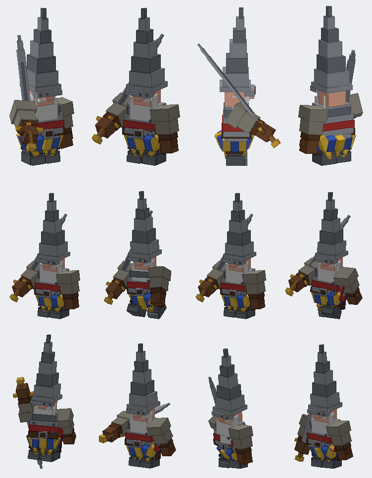

# The Gnome Knight (model)

Status: a model and its animation clips, in the repository as a Blockbench project. Not in the game: by the owner's choice there is no entity, renderer or data.
Proposal issue: none. On 10 October 2026 the owner sent a picture of a gnomish knight and asked for it "in the minecraft blockbench style ... in good detail".
Owner: @jimbozoomer-byte
Target milestone and tier: none yet.
Primary specialty and supported player role: a creature or guard, when it is made playable.

## What it is

A short stocky gnome in the Minecraft figure's manner (a body, a head, two arms, two legs, each a group at its joint), after the owner's picture:
- a tall conical steel helm in six tiers set a little forward so it leans, its riveted brim pulled down over the eyes;
- a big pink nose, a moustache and a great white beard in two tiers with sideburns;
- puffed blue-and-yellow striped sleeves over leather cuffs and brown gauntlets with thumbs;
- a riveted breastplate with a belly, a red sash with a tail at the hip, a buckled studded belt and a dagger in its sheath at the left hip;
- a dagged skirt of twelve pointed lappets, blue and yellow by turns, a gilt bell at every point;
- grey boots with toe caps and straps;
- a greatsword as tall as the gnome in the right hand: a wrapped grip, gilt pommel and crossguard, a long blade with a fuller and a tapered point. At rest the sword hand is up before the chest and the blade rises back over the shoulder.

All in `tools/gnome_knight.py`, which writes `art/gnome_knight/gnome_knight.bbmodel` with the textures embedded (`gk_*`, drawn flat and clean by the same file).

### The animation clips
Sampled from curves in the same file:
- **idle** (2 s, loops): breathing, a look about, the sword stirring on the shoulder, the skirt swaying.
- **walk** (0.8 s, loops): a stumpy march with short quick steps and a waddle, the free arm swinging, the skirt and bells swinging.
- **attack** (1.5 s, once): the sword hauled up over the head with the body turning away, swung down across the body as it turns into the cut, a hold, then back to the shoulder.

## Connections, balance, multiplayer
Not applicable: nothing is in the game.

## Dependencies and assets
No dependencies. The model and textures are Jugcraft's own, made from the owner's picture (their own work, shared for this). `tools/blockbench_export.py` writes the project and `tools/box_preview.py` renders the previews.

## Verification
- Done locally (10 October 2026): the project is written and offline renders of four views and eight animation frames were reviewed against the picture.
- Not applicable: the Gradle build and game tests.

## Rollout and open questions
- The arms have no elbows; the sword pose is made with the shoulder alone.
- The bells are part of the lappets; they swing with the skirt, not on their own.
