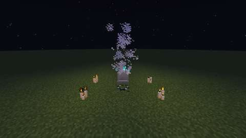
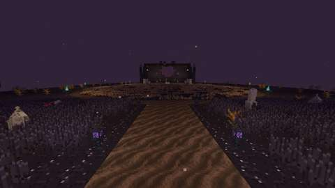
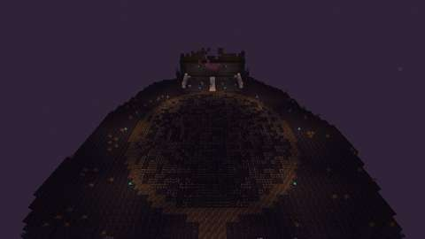
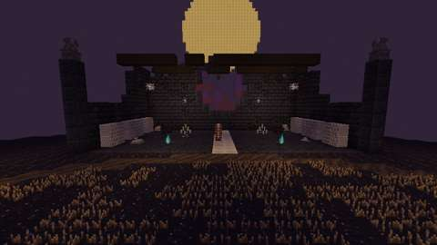
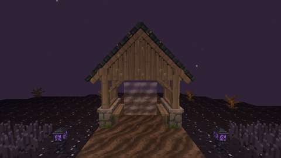
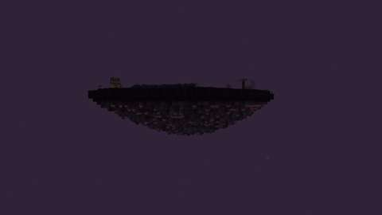

# The Hollow Acre: the lairs, and the Last Rites

Status: implemented in source; CI builds it and its game tests and client game test pass (below). Part 1 of boss 1 in the [Witching Season plan](witching-season.md#the-lairs-shared-rules): the shared lair framework, the Hollow Acre and the ritual that opens it. Vesperine, the Last Reaper, and her loot are part 2, in their own pull request ([vesperine.md](vesperine.md)). It has not been played by hand, and the two-client dedicated-server playtest the plan asks for is still to do.
Proposal issue: none. The owner approved the Witching Season plan on 4 October 2026, and on 10 October 2026 asked: "Do the bosses".

Target milestone and tier: Specialization tier (dungeon expeditions), as the plan sets it. The ritual takes Discovery-tier things: a headstone, candles, mourning flowers, a vine, a gold ingot, an iron nugget and a bone.
Primary specialty and supported player role: adventuring, with building (the graves) and farming (the flowers) feeding the ritual.

## Player experience

### The Last Rites

The Hollow Acre opens at a grave, by the player's own choice:
1. **The grave:** any Jugcraft headstone (`#jugcraft:headstones`), in the Overworld, at night.
2. **The candles:** at least four lit candles within four blocks of it. Vanilla candles count each candle on the block. Séance candles, aura candles, floating candles, candle skulls and the Chandlery's pillar candles count too (`#jugcraft:last_rites_candles`).
3. **The wreath:** a **Mourning Wreath** laid on the grave or beside it, within two blocks. It is four mourning flowers (black rose, funeral lily, spider lily, asphodel, snowdrop, lily of the valley or wither rose: `#jugcraft:mourning_flowers`) round a vine. It is also a decoration: it lies flat on the ground.
4. **The bell:** ring the **Death Knell** (a gold ingot over an iron nugget over a bone) within four blocks of the grave. Ringing never uses it up.

Then:
- the candles flare blue and the wreath is taken;
- a gate of grey mist stands over the grave for 60 seconds;
- the ringer goes through at once.

Anyone else who uses the gate in that time follows, while there is room (four players). Nobody is pulled in by standing near it. If a step is missing, the knell's chime says which one: no grave, not the Overworld, not night, too few candles (it counts them), no wreath. Nothing is used up then. If every Hollow Acre the server allows is taken, the knell says so, and again nothing is used up.

### The Hollow Acre

A floating island of black earth, 64 blocks across and 76 long, under a starless night that never ends. Its underside hangs in tuff, deepslate and roots over the void. From south to north:
- **The lych gate:** the graveyard's own Lych Gate on the south edge, its opening filled with **Grey Mist**. Players arrive just inside it, facing north. Using the mist takes them home at any time.
- **The black wheat:** a field of blighted wheat and weathered headstones, spider lilies at some of them, either side of a soul-soil path lit by witchlight stakes.
- **The Mown Circle:** the arena, a disc of cut stubble 40 blocks across, ringed in soul soil and edged with **soul braziers**. The four on its diagonals ward it in Vesperine's fight.
- **The bone chapel:** a ruin at the north end. Its north wall holds a broken rose window of red and purple glass. Ossuary walls line its sides, with sarcophagi in its aisles and bone piles and cobwebs in its corners. Witchlights hang from what is left of its roof beams, and gargoyles watch from its broken pillars. The Bone Throne stands at its open south side between two candelabra, facing the circle.
- **The harvest moon:** a vast pale-gold disc hanging north of the island.

The sky is near-black, the fog plum, ash drifts in the air, and the music is the soul sand valley's.

### Lairs: the shared rules

These are built here and reused by Boss 2's Spindle Loft.
- **One dimension per lair:** `jugcraft:hollow_acre`, a void with its own biome. It has:
  - no spawns;
  - a fixed time and no weather;
  - no sleeping, no setting spawn and no respawn anchors;
  - no raids.
- **Instances:** each ritual opens an instance in a free slot along the X axis, 1,024 blocks from the next. The template is placed fresh each time: anything left lying there is cleared and every block put back. At most `lairs.instances` (8) instances are open at once.
- **Getting out:**
  - the Grey Mist returns you to exactly where you stood when you went in (dimension, position and facing) at any time;
  - `/jugcraft lair leave` does the same from anywhere in a lair;
  - if your return dimension is gone, you go to the world spawn.
- **Nothing can be built or broken**, for everyone but an operator in creative mode:
  - breaking is refused before the block cracks;
  - using an item on a block, or using a block, is refused, except the lair's fixtures (the mist and the braziers);
  - buckets, spawn eggs, lily pads, frogspawn and end crystals are refused;
  - item frames, paintings and armour stands can't be used or struck;
  - inside, players lose the build ability, as in Adventure mode, and get it back on leaving.
  - Ender pearls, chorus fruit, food, potions and weapons work as anywhere. The lair-only blocks can't be broken or blown up at all, and they are in the `wither_immune` and `dragon_immune` tags.
- **The edges:** fly or fall off the island, and the mist throws you back to the arrival point for 4 damage, never below half a heart. The toll comes straight off health (armour and effects don't turn it aside); creative and spectator players pay nothing. Players in a lair are checked once a second.
- **Grave Goods:** dying in a lair costs no belongings.
  - What you drop (items and experience) is gathered at once and kept with you, across logouts and restarts.
  - You get it back when you respawn, outside the lair: into your inventory, the rest at your feet.
- **Closing:** an instance closes when its boss is dead and everyone has left, or when nobody has been inside for 30 seconds. A server restart closes every instance. Anyone who logs in inside a closed instance goes back to their return point.
- **Commands:** `/jugcraft lair leave` for anyone in a lair; for operators, `/jugcraft lair list` and `/jugcraft lair close <lair> <slot>`.
- **Settings** in `config/jugcraft.properties`:
  - `lairs.instances` (8, from 1 to 32);
  - `lairs.party_size` (4, from 1 to 16);
  - `lairs.gate_seconds` (60, from 10 to 600);
  - `lairs.off_season`: `on` lets the rites work on any night of the year; `off` only during the Halloween event.

## Changes from the plan

- **Settings in `jugcraft.properties`.** The plan named a separate `config/jugcraft-lairs.json`. The lairs' settings live in `jugcraft.properties` instead, as every other server option does (CLAUDE.md: extend the shared configuration). The boss's health and damage multipliers and the event loot bonus come with the boss, in part 2.
- **Instances are not saved.** The plan already resets every instance on a restart, so they live only while the server runs. Each player's visit (return point) and Grave Goods are saved with the player, as Fabric data attachments.
- **The gate is an entity.** It is drawn as rising mist and soul flames, so the ritual places no block in the Overworld.
- **The moon is blocks.** It is a disc of Harvest Moon blocks placed with each instance, so the fight can turn it red, not a sky texture.
- **Animations:** the plan's open question 3 assumed GeckoLib would need a platform PR. GeckoLib 5.5.7 for 26.3 is already a pinned framework (`distribution/frameworks.lock.json`, used by the Arcane Concordance), so part 2 can use it with no new dependency.

## Connections

- **Inputs:**
  - the graveyard's headstones (the grave);
  - the Chandlery's candles and vanilla's (the vigil);
  - the graveyard flora and vanilla flowers (the Mourning Wreath);
  - gold, iron and bone (the knell).
- **Outputs:** the way into the Hollow Acre, where Vesperine waits (part 2). The Mourning Wreath is also a decoration.
- **The furnishings:** the lair is furnished from Jugcraft's own props: the Lych Gate, headstones, gargoyles, ossuary walls, the Bone Throne, floor candelabra, blackstone sarcophagi, bone piles, skeleton-hand sconces, hanging witchlights and witchlight path stakes.

## Balance and automation

- **The ritual's cost:** every opening takes a Mourning Wreath (four flowers and a vine); the knell, the grave and the candles stay. There is no cooldown: the wreath is the limit, as the plan sets it.
- **No loop:** nothing comes out of a lair in part 1. The lair-only blocks drop nothing and have no items.
- **No automation:** only a player's own ringing opens a lair, and only a player's own use of the gate takes them in.

## Multiplayer and persistence

- **Server authority:** the server decides everything. Rings, gate uses, exits, edges and refusals all happen there, and clients only see what the server says.
- **What is saved:** a player's visit and Grave Goods are saved with the player. Instances live only while the server runs. Lair blocks are plain block states.
- **Chunks:** no chunk is force-loaded. Placing an instance loads its chunks for that moment only. Afterwards they stay loaded only while players stand in them.
- **Griefing:** a lair can't be opened on someone else's behalf, and nobody is pulled in. Nothing in a lair can be changed.
- **Still to do:** the two-client dedicated-server playtest.

## Dependencies and assets

No new dependency. Everything is drawn by code:
- the island is laid out by `tools/hollow_acre.py`;
- its blocks' and the wreath's and knell's textures are painted by `tools/lair_textures.py`;
- the dimension files are written by `tools/lair_data.py`, in the format vanilla 26.3 uses for its End. That format was logged from the running game by a temporary game test.

No Mojang texture is read, traced or copied.

## Verification

*The client game test's pictures (CI, commit `64dbaa9`): the Last Rites, the arrival point, the Mown Circle, the bone chapel, the lych gate and the island. The test client renders at 480x270.*

CI (10 October 2026, GitHub Actions, the pins in [PLATFORM.md](../PLATFORM.md)):

| Commit | What ran | Result |
| --- | --- | --- |
| `08a456a` | A temporary game test that logged vanilla 26.3's End dimension type, level stem and biome | Their formats, which `tools/lair_data.py` now writes |
| `356a690` | Build, data audit, game tests, client game tests | **Did not compile:** five names that 26.3 does not have (`ServerEntityWorldChangeEvents`, `ServerLevel.getStructureManager()`, `ServerPlayer.drop(ItemStack, boolean)`, `PushReaction.BLOCK`) |
| `51aad82` | The same, with 26.3's names | Compiled; **2 of 1168 game tests failed**, `hollowAcreDimensionLoads` and `lairsEndToEnd`: a game-test server builds its world from the flat preset alone, so it has no lair dimension. `LairClientGameTests` passed |
| `95f8019` | The framework tested end to end in the client game test's real world instead | **All pass:** 1168 game tests and `LairClientGameTests`. The pictures showed the black wheat pale grey, and the arena and island pictures badly placed |
| `a9ca0b9` | Darker wheat ears; the arena and island pictures moved | All pass. The camera still fell before two pictures: the client's own flying flag did not last through the teleports |
| `64dbaa9` | The server keeps the camera flying | **All pass:** all 1168 required game tests and `LairClientGameTests`. The pictures above are from this commit |

Run locally (10 October 2026):

| Check | Result |
| --- | --- |
| `python3 scripts/check_repository.py` | Pass |
| `python3 tools/check_mod_data.py`: also checks `Lair.HOLLOW_ACRE` against `tools/hollow_acre.py` (size, arrival, centre, bounds, floor, moon), the lairs' constants and settings against `tools/lairs.py` and `JugcraftConfig`, the registrations, the fixtures tag, the recipes, the wither- and dragon-immune tags, the dimension, dimension type, biome and template files, and that every message the lair code sends has its words | Pass, 1871 IDs |
| `python3 tools/generate_material_data.py`, then `git status` | Writes this part's data only |
| `./gradlew build`, game tests and client game tests | Not run locally (the Fabric Maven is out of reach here); run by CI |

The game tests (`LairGameTests`) show what a game-test server can:
1. the Hollow Acre's dimension type and biome load from their files;
2. its template loads in the running game, at the size `Lair.HOLLOW_ACRE` gives, with its blocks (the lych gate, the exit, the Bone Throne, the soil, the braziers, the wheat, the headstones) and the game's data version;
3. the Last Rites' checks in order: no grave within reach, not by day, too few lit candles (a block of candles counts each), no wreath, then every step done; nothing changes;
4. rites done in full when no instance can open: the knell says the lairs are full, the wreath stays, nobody moves and no gate opens.

The client game test (`LairClientGameTests`, CI job `client`) runs the framework from end to end in a real world, with its one player in survival:
1. the knell rung at the prepared grave opens an instance in the Hollow Acre's own dimension (from y 0, no ceiling), places the island (throne, Grey Mist, ward brazier, moon), takes the wreath, opens a gate over the grave and takes the ringer to the arrival point, unable to build;
2. placing a block, emptying a bucket and using a block are refused; ender pearls and the lair's exit are not;
3. flying off the island throws the player back for 4 damage; falling off at 2 health leaves half a heart;
4. dying there gathers the drops (3 diamonds, 7 experience) as Grave Goods and ends the visit; respawned outside, the player gets them all back;
5. the gate takes the player back in; leaving puts them back exactly where they stood, facing the same way, able to build;
6. a full party lets nobody else in;
7. an instance empty for 30 seconds closes, and its gate with it; after a restart, a player found in a closed instance is sent home;
8. no more instances open than `lairs.instances` allows, and a closed one's slot is free again.

Then it takes the six pictures above.

Not run: the two-client dedicated-server playtest the plan asks for, and play by hand.

## World and event applicability

The Hollow Acre is its own dimension, so nothing here changes the Overworld but the ritual's grave, where the wreath is taken. The rites work on any night by default. Ending the Halloween event never removes a lair, a player inside one or anything earned.

## Rollout and open questions

The plan's open questions keep their defaults:
- rites all year at night;
- Grave Goods on death;
- four players and eight instances.

GeckoLib now carries part 2's animations, as above.
