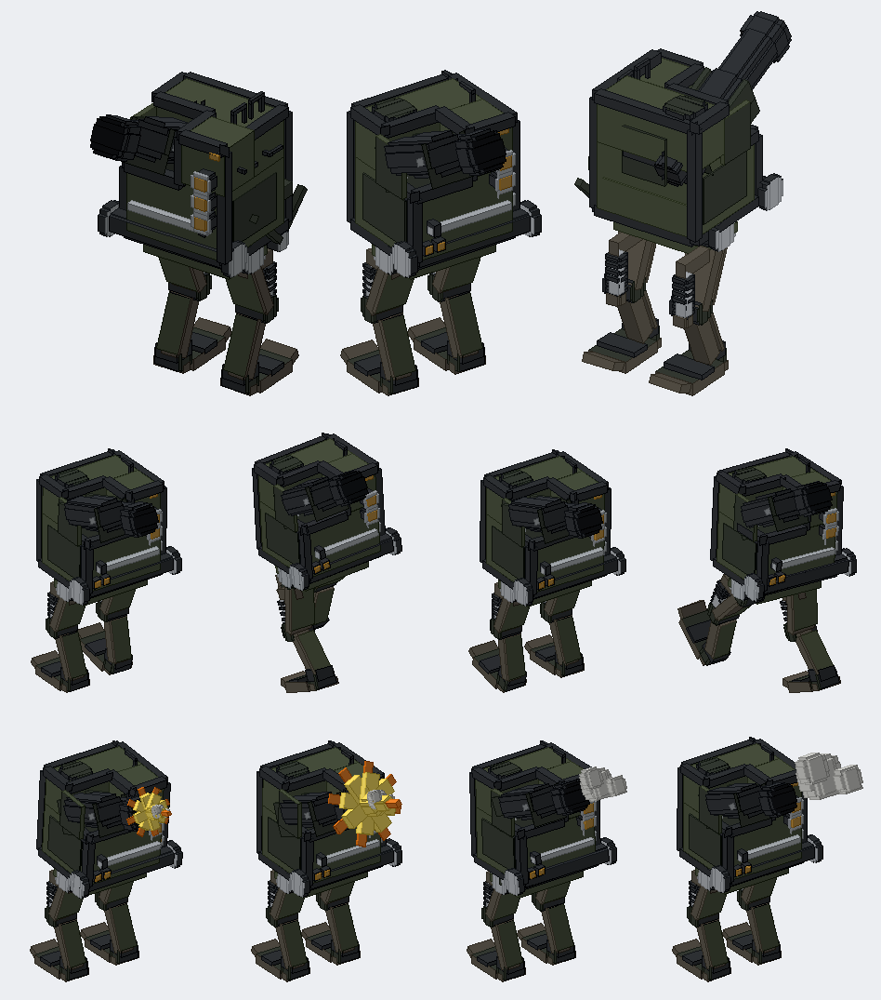

# The Howitzer Walker

Status: implemented in source; `check_mod_data.py` and `check_repository.py` pass locally; the Gradle build, game tests and screenshot wait for CI (no Java 25 on the owner's PC). Not yet played by hand.
Proposal issue: none. On 9 October 2026 the owner sent a render of a two-legged artillery walker they had modelled ("I want you to model this in blockbench next for the Jugcraft mod I just drew it"), then asked for it to match the drawing's shapes and parts closely, and for "a walking animation ... and then a shooting animation with a cartoony blast", with "its animations all floaty and bouncy".
Owner: @jimbozoomer-byte
Target milestone and tier: steel tier. It is an upgrade of the Armoured Walker (batch 58).
Primary specialty and supported player role: combat; a long-range artillery walker for a base's defence or a siege.

## Player experience

The model follows the owner's render part by part, in Jugcraft's blocky style:

| Part | In the owner's model | Here |
| --- | --- | --- |
| Hull | A riveted olive box with rounded edges, cut away at its front top corner for the gun | The same: a riveted olive box notched at its front top left, round bumper rails along every edge, dark recessed side panels, a chrome rail on brackets under the nose, a riveted plate and louvred vent on the back |
| Gun | A big howitzer lying in an open cradle, a thick jacket at its root and a flared muzzle | A trunnion hub in a cradle of a floor and two walls, open on top; a breech block and cap, the barrel with its jacket and a flared muzzle brake, recoil rods along the cradle; elevated 25 degrees |
| Pivot and linkage | A big axle with hubs under the nose and a wishbone down the right side | The front pivot axle with chrome hubs, and an A-arm of two bars from a hub on the hip up to a bracket on the hull's side |
| Lamps | Three ringed headlamps up the front's right, two small ones low on the left, an amber light at the top right | Three chrome-ringed amber lamps, two small lamps, the amber indicator, and one on the waist plate; all glow at full brightness |
| Roof and sides | Grab hoops on the roof, handles on the side, a hatch | Two hoops on the roof's right, two handles on the right side, the pilot's hatch ring at the roof's rear left |
| Waist | A flat plate over big round hips | A riveted waist plate, a centre block, the hip axle through big chrome-capped hubs |
| Legs | Reverse-jointed: a flat thigh plate angled back, a knee hub, a shin angled forward, a coil spring on a shock absorber behind, a round ankle, broad flat feet with upturned toes | The same: a hip drum, a broad flat thigh plate under its armour plate, a knee drum, a shin under a shin guard, a chrome shock absorber in a coil spring behind the thigh, an ankle housing, and a broad foot with a hinge strip, an upturned toe plate and a heel |

**Colours:** olive riveted plate with darker olive-grey recesses, brown-grey legs, gunmetal rails and barrel, chrome hubs, rods and lamp rings, amber lamps. No rust (the clean style).

### Piloting
- Place it from its item, use it to climb into the roof hatch (head out), and refuel it with a diesel or kerosene bucket, exactly like the Diesel Walker.
- **Movement:** walk, turn, jump and climb one-block steps with the movement keys. It burns 4 mB of fuel a second while it walks or turns.
- **Hold use: the howitzer.** It lobs a Heavy Shell where you look, every 3 seconds, taking one from your inventory (none in creative), faster out of the muzzle than the Armoured Walker's hull gun (2.8 against 2.4), so it carries farther. Shells are damage-only blasts, like every gun's: they never break blocks. With no shells it tells you once.
- **Attack: the stomp.** Everything within 2.5 blocks of its feet is hit for 10 and thrown away from it, once every 1.5 seconds.
- **Toughness:** 100 damage to knock it down. Knocked down, it drops its item.
- It has no drill or ram.

### The animation
Everything is drawn by `client/HowitzerWalkerParts` from the walker's stride, an eased "gait" (how much it is walking, so the bounce fades in and out) and the ticks since it fired; nothing extra is sent over the network.
- **Walking:** each leg swings at its hip and tucks at its knee as it comes forward. The hull bounces on the legs twice a stride, stretching as it rises and squashing as it lands (about its waist), sways side to side and nods, and the gun wobbles on its trunnion a beat behind.
- **Firing:** the gun slams back along its barrel in two ticks, then runs out past its rest and wobbles to a stop; the hull rocks back and squats, then bounces to rest. A cartoon star burst (a yellow four-point star with its turned copy, an orange rim star and a tongue of flame) pops up at the muzzle in two ticks, spins and shrinks away by the eighth; three round smoke puffs grow, roll forward and up and shrink away over 24 ticks. The server still sends its smoke and flame particles and the blast sound.
- The same curves are sampled into the Blockbench project as the clips **walk** (one stride a second, looping) and **shoot** (two seconds), so the owner can scrub them in Blockbench. The burst and puffs are groups under the gun that the clips scale from nothing; at rest in Blockbench's edit view they stand at full size.

## Connections
- **Recipe:** `SBS / PWP / R R`, an upgrade of the Armoured Walker: steel plates (S), a steel block (B) for the howitzer, riveted steel plate (P) for the hull, the Armoured Walker itself (W) and pistons (R) for the shock absorbers.
- **Input producers:** the Armoured Walker (batch 58), the metal press's steel plates and steel blocks, Dieselworks' riveted steel plate, and the big guns' Heavy Shells (batch 51).
- **Output consumers:** none. It is a vehicle.

## Balance and automation
- The howitzer uses the same Heavy Shell and damage-only blast as the big guns, no faster than once every 3 seconds and only with shells in hand.
- The stomp is slower and wider than the Armoured Walker's ram: 10 damage every 30 ticks round its feet, against 16 every 24 in front.
- It costs a whole Armoured Walker plus steel. No block breaking of any kind.

## Multiplayer and persistence
- **Server-authoritative:** like the Diesel Walker, it is driven on the server from the pilot's keys, and the shells and the stomp are the server's. One synced number (the tick it fired) lets every client draw the recoil and burst.
- **Saving:** its fuel is saved, as the Diesel Walker's is.
- New IDs: entity type and item `howitzer_walker`, its recipe. Not verified with two players or on a dedicated server.

## Dependencies and assets
- No dependencies. The model is Jugcraft's own box model, made from the owner's render (their own work, shared for this) by `tools/howitzer_walker.py`: hull, lamps, gun, thigh, shin, flash and puff, exported as quads to `assets/jugcraft/howitzer_walker_quads.json`. Textures drawn in the clean style: `hw_plate`, `hw_plate_dark`, `hw_leg`, and the flat cartoon colours `hw_flash`, `hw_flash_rim` and `hw_smoke`; the rails, hubs, lamps and bore reuse `dp_gunmetal`, `dp_chrome`, `aw_lamp` and `aw_bore`. The item icon is a 16x16 map, `tools/item_icons/howitzer_walker.txt`.
- The Blockbench project `art/howitzer_walker/howitzer_walker.bbmodel` (written by `tools/blockbench_export.py`, shared with the Pipeworks props) holds every box in groups with their joints as origins, the shins under the thighs and the burst and puffs under the gun, with the two animation clips. The Python model stays the source.
- Code: `walker/HowitzerWalker` extends `DieselWalker` (the howitzer, the stomp, the synced shot tick and the eased gait); `DieselWalkerItem` places it; client `HowitzerWalkerParts` and `HowitzerWalkerRenderer`.

## Verification
- Done locally (9 October 2026): `python tools/check_mod_data.py` (which checks the Java's numbers, muzzle and joints against the Python and every exported part) and `python scripts/check_repository.py` pass; `tools/check_icon_maps.py` passes the icon; offline renders of the model from three sides and of eight animation frames were reviewed against the owner's render; the Blockbench project opens in Blockbench 5.2.1.
- Not run locally: `./gradlew build` needs a Java 25 toolchain and the owner's PC has Java 21, so the Java is unverified until CI's Build workflow runs.
- Planned in CI: game tests `howitzerWalkerWalksOnFuel`, `howitzerWalkerFiresItsHowitzer` (ninety ticks of holding use fire exactly twice, each shell flying where the pilot looks) and `howitzerWalkerStomps` (a pig beside its feet is hit); the client screenshot `jugcraft_armoured_walker` now has the Howitzer Walker behind the Armoured Walker.
- Not done: piloting it in a client, seeing the animation in the game, two players, a dedicated server.

## World and event applicability
Not applicable: it is crafted and placed by players.

## Rollout and open questions
- The feet do not stay flat as the legs swing (the foot is part of the shin); a hinged foot would be a third part a leg.
- The owner may want the howitzer to elevate with the pilot's aim, as the big guns do; it is fixed at 25 degrees and the shell goes where the pilot looks.
