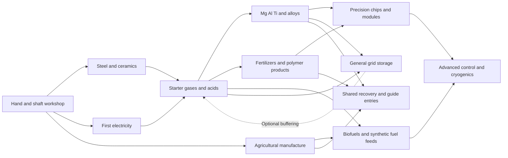

# Industrial factory implementation plan

Status: substantial planning draft requested by the owner on 10 October 2026. This plan turns the settled industrial direction and machine art into connected implementation packages. New construction bills, buffer sizes, operating rules, throughput profiles and delivery sequencing below are proposed defaults for review; existing owner selections remain authoritative. This is planning documentation, not implemented gameplay.

Owner: jimbozoomer-byte.
AI-assisted planning: OpenAI Codex, GPT-6 family.
Primary specialties: machinery, agriculture, chemical processing, metallurgy, precision manufacture and factory operations.
Target platform: the repository's existing Minecraft 26.3 Fabric platform and locked frameworks; no platform or dependency change.

Read this with the [machine art specification](industrial-machine-models-and-textures.md), [construction and operation plan](industrial-machine-construction-and-operation.md), [production lines and factory layouts](industrial-production-lines-and-factory-layouts.md), [selected chemistry decisions](industrial-chemistry-and-fuels-plan.md), [chemical catalog](industrial-chemical-catalog-and-routes.md), [starter gas and acid baseline](industrial-starter-gas-and-acid-factory.md) and [TODO](../TODO.md).

## The factory experience

A player builds a workshop that stays useful while expanding into larger industries. Hand shaping and fuel-heated ceramics start the first shafts, components and controls. Electricity enables substantial gas chemistry; ordinary acids unlock useful fertilizers, refining and process materials. Larger vessels and production lines make sustained supply easier. Precision equipment then creates better control modules, demanding materials and advanced storage.

Depth comes from useful things to make, competing workshop specialties, physical factory design and connected supplies. A farmer can sell oil, cloth, binder, alcohol or feed. A metallurgist can supply refractory tooling, plates, cast parts or alloys. A chemist can provide acid, purified reagents, fuels or polymer stock. None must personally finish every branch to make a useful contribution. Trade can satisfy material needs without an arbitrary research lock.

Every unbuilt machine form keeps the art brief's **2–6 blocks on each axis**, measured width × depth × height. The factory building can be larger. A six-block reactor should look and operate like a major installation; it need not demand a mountain of separate casing blocks or hundreds of ticking controllers.

## Decisions carried forward

| Settled direction | Implementation consequence |
| --- | --- |
| Substantial mechanical era with accessible first electricity | Preserve manual components and motor drive for shafts; no mandatory workshop replacement |
| Steel and electricity can develop alongside each other | Do not make advanced metallurgy a prerequisite for the first dynamo or powered workshop |
| Proper chemistry begins with steel electrical equipment | First gas/acid equipment uses steel, copper, ordinary ceramics and basic controls |
| Hydrogen/methane share the gas-burning generator | Fuel identity determines valid generation; cleaned biogas/ethanol stay in the lower-output Bio Generator |
| Gas pressure is automatic | Display machine work/heat and blocked outputs; omit compressors and player pressure settings |
| Catalysts, patterns and molds are reusable | Installed tooling is a capability, not routine wear or a consumable per batch |
| Small upgrades and larger physical versions both matter | Upgrade cards help an existing station; a larger form adds explicit capacity or process capability |
| Water conditioning is internal to demanding recipes | No new separately stored purified-water currency |
| Pollution is numeric and visible on a map device | No landscape discoloration or crop-health penalty; use existing marauder scheduler gates |
| Tanks retain gas when picked up | Move content once with its identity and amount; pipes reconnect after placement |
| Encyclopedia opens from inventory or keybind | Explain all technology/magic routes and quests without requiring a carried book |
| Belts need performance review at large scale | Keep the selected fallback of item pipes without visible item motion |
| First delivery is starter gas/acid, then metals | Digester, advanced wafers and giant storage do not gate first chemistry |

## Shared foundation before new content

The repository already has machine kinds, inventories, energy, kinetic networks, fluid recipes/storage, multiblock parts, upgrade calculations and client adapters. Extend these instead of introducing a separate chemistry power or transfer network. The current [FluidMachineSpec](../../src/main/java/io/github/jimbozoomer/jugcraft/chemistry/FluidMachineSpec.java) allows **six total input/output tanks**, while [FluidRecipe](../../src/main/java/io/github/jimbozoomer/jugcraft/chemistry/FluidRecipe.java) assigns inputs positionally and can name output tanks. The proposed profiles are designed around that limit; adding new protected working buffers still needs explicit implementation and migration.

A machine family should own recipes and capabilities; its physical form owns dimensions, sockets, modeled mechanisms and supported operating profile. Existing saved blocks retain their kinds and legacy profiles. An additional form can reuse those recipes when its capability matches. New dedicated controllers are justified by a distinct operation or physical arrangement, not by each new acid or ore.

Create a small reviewed form descriptor with an immutable logical layout, local port positions, allowed tools, recipe capability tags and envelope. Avoid a single universal processor that accepts every industry. Snapshot the active recipe and paid progress server-side; client animation only displays that state. Whole plants can combine independently useful shared stations rather than requiring a new monolithic backend for every diagram.

For a filled 6×6×6 envelope, at most 216 local positions are examined during a formation or integrity event. Use a validated occupancy mask: some positions are structural, some are reserved moving clearance, and some remain genuine access space. This number is a geometry bound, not a per-tick scan budget. Only a controller runs processing; visible parts route interaction and never perform independent duplicate work.

## Proposed delivery packages

The order below is an engineering sequence. It is not a compulsory player quest ladder, and unrelated content can be implemented independently once its shared foundation is ready.

| Package | Concrete delivery | Entry and useful result | Completion condition |
| --- | --- | --- | --- |
| 1 Shared machine foundation | Form descriptors, logical ports, protected tools, atomic recipe work, bounded client state and legacy migration | Supports the existing machine families and every following package | Legacy machines load; a test form places/rotates/breaks without duplication or world damage |
| 2 Starter steel chemistry | Separator, Infuser/contact tooling, Oxidizer, existing reactor absorption, gas cleanup, generator and portable handling | Earlier steel/basic controls produce first H2, HCl, methane and ordinary sulfuric acid | All startup supplies have earlier routes; full-output/restart/upgrade energy cases pass |
| 3 Useful workshops and bulk steel | Powered textile/press/mill stations, ceramic tooling, bulk press/coke/foundry forms | Useful cloth, oil, boards, parts and steady steel | Manual/electric alternatives preserve yields; carbon supply keeps up with tested demand |
| 4 Magnesium and mineral metals | Coastal concentration, shared wet refining, calcining, suitable cells and reduction retort | Magnesium, aluminum, titanium, chromium and two selected alloys | Chloride/lye/carbon/residue receipts and independently buildable first hardware are defined |
| 5 Fertilizers and polymer products | Phosphate/HF connections, useful fertilizers, molding/extrusion, ordinary polymer grades and specialty PTFE construction | Farms, builders and process-equipment consumers receive distinct products | Every new material has a producer and actual consumer; clean offcuts have lossful same-grade recovery |
| 6 Large renewable and synthetic fuel lines | Industrial fermentation/distillation, substantial digester, cleanup and cobalt synthetic-crude train | Renewable bio-power, compact methane storage and shared refined fuels | Whole fuel chains account for feedstock, electricity, captured gas and all recovery |
| 7 Advanced chip manufacture | High-purity silicon, precision cutting/finish, one resist, wet processing, lithography and assembly | One general advanced chip supplies function-specific modules | First wafer equipment does not need its own advanced chip; chemicals perform distinct steps |
| 8 General grid storage and cryogenic expansion | Lead-acid, LiPF6 formulation/cell assembly, paired flow modules, methane then hydrogen cooling | Factory buffering and later compatible rocket supplies | One energy ledger per bank; paired modules and phase conversions preserve contents |
| 9 Recovery encounters and guide integration | Shared recovery recipes, numeric pollution/map, threshold-based automatic marauders and route/quest content | Useful waste outlets and readable factory consequences | No positive recovery loops; scheduler gates and saved pollution survive restart |

Manual dismantling and source pollution accounting should be introduced alongside the earliest relevant packages. Package 9 completes their wider integration; it does not defer all recovery or measurement until the end. Ordinary lead-acid storage can also arrive with package 2 once lead and acid entry are verified. The package table groups major review scopes rather than forbidding those smaller deliveries.

## Connected factory map

The solid arrows show useful supply relationships. They are not a universal quest sequence; trade and earlier compatible routes can satisfy a material need. The dotted storage link is optional buffering, not a startup dependency.

## Proposed machine operating profiles

Use three process profiles as a consistent starting vocabulary. A larger model does not silently gain all three; each family declares supported profiles in the construction plan.

| Profile | Batch organization | Buffer proposal per declared tank | Proposed base efficiency |
| --- | --- | --- | --- |
| Entry | One independently checked batch | 2,000 mB | Existing recipe budget |
| Expanded | Two independent lanes using one controller | 8,000 mB | 90 percent of unmodified energy per output unit |
| Bulk | Four independent lanes using one controller | 16,000 mB | 80 percent of unmodified energy per output unit |

These sizes and percentages are draft defaults. Batch scaling is linear: two lanes consume two sets of inputs and produce two sets of outputs. A lane needs a reserved output destination; one full output cannot delete a byproduct or let another lane borrow an already spent input. Families with a single physical nest, such as lithography, can use faster sequential work rather than invent four overlapping tool heads.

More lanes raise total throughput and total working draw. Existing speed/efficiency cards keep their defined arithmetic during migration; profile savings combine only within audited recipe limits. The starter gas baseline proposes minimum electrolysis energy and total-recovery ceilings. Those ceilings still govern enlarged stations, generator improvements and future heat recovery, including integer rounding. Do not turn a nominal 20 percent bulk saving into four times the yield.

The Bio Generator's first proposed output is 64 JE/t on cleaned biogas and 96 JE/t on bioethanol, below the selected 128/256 JE/t H2/methane starter outputs. These are proposed values for testing, not additional owner selections. Burn duration and input receipts determine energy per tank; generator output rate alone is not a fuel-efficiency calculation.

## Construction and startup rules

A construction receipt lists outer components and shared material requirements. Expand Steel Tanks, gears, pipes and casings once when showing the raw-material cost. Do not charge both a finished component and all of its ingredients as separate purchases. A machine kit can place its bounded structure without requiring the player to craft every invisible occupied position.

At the first compatible tier, vessels and controls use earlier steel, copper, ceramics and basic circuitry. Advanced PTFE/stainless parts belong to specific later constructions; they do not become retroactive mandatory lining upgrades or prevent the first HF, magnesium or stainless operation. Initial advanced wafer stations use earlier basic controls and precision fixtures. Their produced advanced chip later improves them.

The first acid absorber receives a paid retained carrier charge from an existing simple recipe or trade. The first contact bed comes from an independent non-sulfuric preparation of specifically vanadium-bearing concentrate. Neither is included as a free product inside a newly placed machine. The first nickel/cobalt beds use separately obtainable stock and ordinary ceramic support. Construction cannot consume a catalyst that is already promised as installed content without accounting for it once.

Factory diagrams reserve access and future pipe routes. They do not approve rebuilding a player's terrain, moving placed stations automatically or forcing chunk loading. Placement preview should name the exact obstruction and orient the operating face predictably.

## Starter power commissioning

The existing [power record](machines-and-power.md) gives 32 JE/t for the Coal Generator and 64 JE/t for the Steam Generator. Their output-transfer limits are separate from generation. The existing Battery Box stores 400,000 JE and can output up to 256 JE/t according to [MachineKind](../../src/main/java/io/github/jimbozoomer/jugcraft/machine/MachineKind.java). Check actual cable paths and connection limits rather than treating every source output socket as extra generated power.

The proposed unmodified water batch needs 256 JE/t for 800 ticks, totaling 204,800 JE. One charged Battery Box has sufficient nominal capacity for that batch if the actual connection supplies the required rate and other consumers do not take that reserve. Charging just that amount with one continuously fueled 32 JE/t Coal Generator takes at least 6,400 ticks, or 5 minutes 20 seconds at 20 TPS, before competing loads/losses. This is ideal arithmetic, not measured survival pacing.

For continuous unmodified electrolysis, source generation must sustain at least 256 JE/t plus other active demand. Four current 64 JE/t Steam Generators meet the Separator-only nominal generation requirement when their fuel/water feeds and real transfer paths sustain it. A single 128 JE/t hydrogen generator cannot continuously run a 256 JE/t Separator, and recycling its hydrogen remains lossy even with buffering. A battery shifts work in time; it does not create net energy.

Commission one branch at a time: charge the reserve, produce a first H2/O2 batch, add separate acid or methane work, then expand generation when sustained demand justifies it. Pause lower-priority loads through local controls or explicit disconnected branches before first automation modules exist. The factory layout reserves power/tank service space but does not assume all pictured stations run together on one starter source.

## Factory information and controls

Every station provides the same basic information order: selected process, actual input stocks, required reusable tool, energy/work availability, reserved outputs and completion state. If work cannot start, name one actionable reason with the relevant slot or port: for example, “Lye tank full,” “Nickel bed required,” or “Methane output contains another gas.”

Use plain heat-capability labels when needed, rather than asking players to tune real pressure and temperature. A progress bar distinguishes waiting, warming, working and output blocking. Recipe cards show required work and base energy, with the effect of installed modules and any limit. A large housing should have a readable control point at ground level.

Normal repeat processing works without an automation chip. The first automation module adds local recipe priority and stock targets. Remote grid commands, global resource searches and unrestricted factory location maps remain later work. Sided transfers use logical ports with clear icons and constrained filters, not arbitrary access to protected tools or carrier acid.

The Encyclopedia explains the purpose of each line, its next useful product and alternative supply routes. Quests demonstrate milestones without turning every optional specialty into a gate. Machine entries share recipe/capability data with the actual game; planned diagrams remain labeled until those operations are implemented. Optional JEI/Jade can expose compatible recipes and state through their existing guarded integrations.

## Pollution and recovery defaults

Pollution belongs to producing areas, not the machine item. Processing emissions occur when a real paid operation releases them; generator emissions follow actual fuel consumption. Cables, idle equipment and stored finished products add nothing merely by existing. Removing machinery does not erase already recorded pollution.

Capture stores a defined output while room exists. The selected default for optional CO2 capture is to keep production running and vent uncaptured/excess CO2, with an optional stop-instead policy. Methanation water collects while possible and explicitly drains excess by default; lye instead retains and blocks when full. No rule implies silent acid or chlorine disposal.

Propose chunk-sized area records, updated through a bounded active-area queue. A scheduled step redistributes a fixed share to adjacent records and applies decline once using a saved timestamp. This remains a proposed area implementation; unloaded records need not load chunks. Guard against repeated-load catch-up and negative values. Calibrate rates and thresholds using logged workloads before finalizing numbers.

Automatic encounter eligibility comes from pollution bands and the existing marauder scheduler. Higher bands unlock stronger capped parties; they do **not** additionally shorten the chosen cooldown. Preserve warnings, grace, active-raid guards, peaceful/configuration gates and recovery windows. Lower pollution reduces eligible strength; it does not despawn a party already engaged. Camps and voluntary encounters remain separate.

Each recovery receipt records its exact feed, useful reclaimed material, losses and remaining residue. Clean polymer offcuts retain grade; mixed waste does not become universal specialist stock. Reused carrier liquid and electrolyte are not fuel, free starting charge or a refund of construction cost.

## Implementation boundaries and saved data

A form stores its descriptor version, orientation, controller identity, logical tanks/slots, installed tools/modules, active recipe and paid progress. Additional tank/slot layouts require explicit mappings from legacy indices to logical roles. Loading an old world must not move its output into a new input merely because a list expanded.

When a structure is interrupted, stop processing and retain owned contents under the controller's existing break/restore policy. Treat moving a complete filled tank differently from moving a whole factory: portable tanks retain their contents; large machinery is dismantled or handled only through an explicitly implemented transfer policy. Neither emits both filled item contents and the same loose fluid/tool stock.

Flow plants use one authoritative energy ledger and paired electrolyte inventory. Adjacent capacity modules are claimed by exactly one controller. Reattachment or removing a full pair cannot add energy; insufficient remaining capacity must follow a stated stop/detach policy. Do not duplicate storage in both module block entities and controller totals.

All recipe starts, module swaps, priority changes, output-policy changes and tank interactions validate distance, permission and actual server inventory. Requests are bounded and cannot supply authoritative resource totals. Unloaded machines produce nothing without a separately approved simulation.

## Verification and review milestones

Before a package is coded, its recipe sheet must name all inputs/outputs, fixed reusable tooling, work budget, pressure/heat abstraction, full-output policy, supported profile and independently reachable construction. Exact solution composition and cryogenic reference ratios need complete ledgers; missing data is an implementation blocker for that receipt, not a license to relabel material.

Verification should exercise the small cases that reveal failures: one partial recipe, one incompatible fluid, one full byproduct tank, two simultaneous transfers, a break at completion, restart while warming, reloading a recipe set and detaching a charged storage pair. Audit all speed/efficiency/profile combinations and smallest integer batches. Define mass/metal, gas reference, fluid-solution, crop/fertilizer, polymer-scrap and energy ledgers separately.

For large factories, propose three repeatable workloads: 16 mixed workshop stations, 64 active industrial stations with pipes/tanks, and a 256-station late-game stress fixture. Measure server work and client frame time separately against the same empty/control world. These counts are test fixtures, not claims of supported performance. Cap network traversal, processing work and visual updates; compare belt rendering with the selected invisible-item-pipe fallback.

Actual art verification checks every side and underside, supported lighting, all moving-frame bounds, multiple orientations and optional-renderer configurations using the locked framework stack. No rendered model or gameplay test is established by a prose brief.

## Check in after this planning pass

The proposed default is to build one proven shared machine foundation and a usable starter gas/acid slice first. Metals, fertilizer and ordinary polymer products then turn that chemistry into useful purchases; large biofuel plants, advanced chips, modular storage and cryogenics follow. Small specialty workshops remain productive throughout.

This pass supplies construction/operation profiles, 36 connected production-line cards and eight sample factory layouts in the companion records. Quantities that require mineral composition, solution chemistry or current-runtime compatibility are explicitly reserved for the implementation ledger rather than invented as certified results. Numerical defaults can be tuned without reopening the settled route choices.

The next owner review can focus on this delivery order, the small/expanded/bulk organization and the proposed construction investment of the giant plants. Individual recipes do not need another question round before contributors can prepare bounded implementation proposals.

## Provenance and delivery status

Existing directions come from the linked owner planning records. Machine size/appearance comes from the art specification; shared-system limits were checked in the repository sources. New gameplay behavior and numeric defaults are proposed here. Owner-library assets remain available under the existing authorization; no originals, runtime assets, registries, saves, world generation or dependency pins change.

This planning contribution is OpenAI Codex work in the GPT-6 family. Documentation and calculation checks are recorded with the publication; no build, multiplayer, survival pacing or performance result is claimed.
