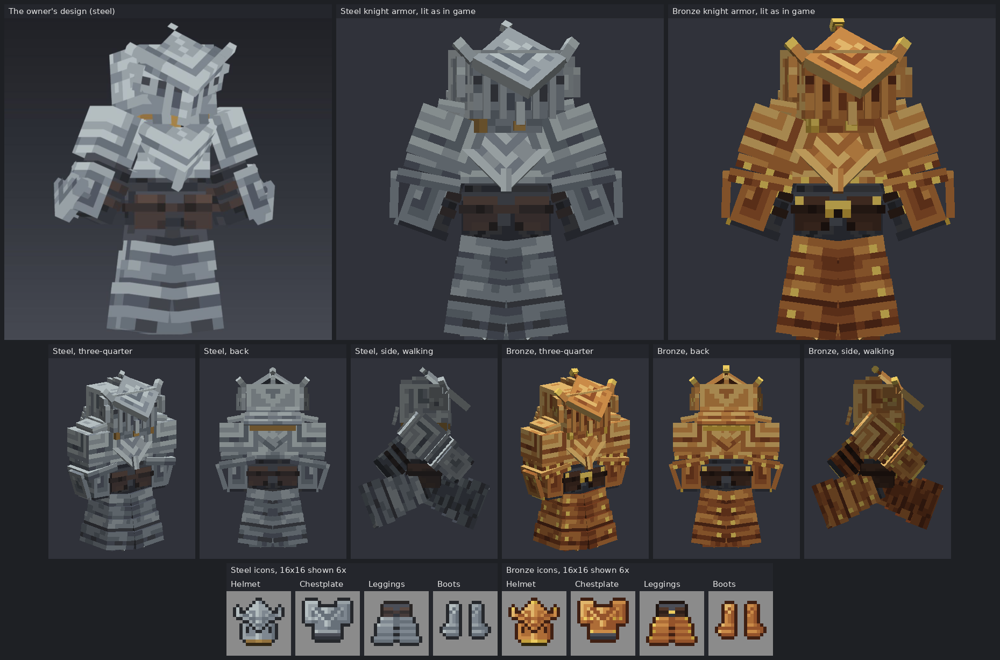

# Knight armor: 3D armor for bronze and steel

Status: implemented on `claude/knight-armor` (from `main` at ca938b54, stacked on `claude/armor-styles`), awaiting review. The Python generators and checks pass locally. **Not yet compiled, game-tested or played:** the Java compiles only in CI, which has not run on this branch yet.
Proposal issue: none. The owner asked in chat, in this order:
1. "The steel and bronze look HORRIFIC. Heres some armor I just designed, please make it so that the models can be different than vanilla armor so that you can capture all the parts of this, then make a bronze variant of it for the bronze."
2. "Make it so the models are more intricate and that the armor can be much bigger than just the default vanilla armor and can have many different parts coming off of it".

Their design is a front render of a player in steel knight armor (top left in the picture below).
Owner: jimbozoomer-byte (design: the owner; implementation: Claude Opus 5.5).
Target milestone and tier: looks only, for the bronze (workshop) and steel tier armor of [tools-and-armor.md](tools-and-armor.md). The 3D armor engine is for any later armor set too.
Primary specialty and supported player role: everyone who wears armor.

**Same items, new look.** `jugcraft:bronze_*` and `jugcraft:steel_*` armor keep their IDs, stats, recipes, tags and repair. Only how they look worn and in the inventory changes.

## Player experience
Bronze and steel armor are now worn as **3D knight armor**: real models built from boxes, much bigger than vanilla's armor shape, with many parts sticking out at any angle. They follow the body when it walks, swings, sneaks, rides or is posed on an armor stand.



*Top: the owner's design, then the steel and bronze knight armor in the same pose and at the same scale, lit as the game lights entities. Middle: each from three-quarter, behind and the side while walking. Bottom: the 16×16 inventory icons at six times. Rendered outside the game by `tools/armor_preview.py`, not in Minecraft.*

- **Steel** is the owner's design, part for part. Its colours are sampled from their render: light steel grey with mid and dark greys in broken, hammered-looking strips, brown leather, a dark slate under-layer and a gold collar.
- **Bronze** is the same armor made earlier, in the steam age:
  - warm copper-bronze, golden in the light and coppery red in shadow;
  - brass where the steel has gold (collar and clasp), and for the small fittings (the breastplate's side buckles, elbow-strap studs, horn tips and knuckle plates);
  - rows of small brass rivets where the steel has a few heavy bolts: on the cheek fins and cuffs, along the breastplate's hem and the pauldron lames, and a column down each side of the skirt;
  - a round brass knob on the crest's finial and a brass buckle on the belt, which the steel does not have;
  - darker, redder leather.
- **Size:** standing, the full set is about 24 pixels across at the flared cuffs (a bare player is 16, vanilla armor about 18). The finial rises about 4.5 pixels above the head, the skirt reaches the ground, and the crest's lower point juts almost 10 pixels in front of the neck.
- **Inventory icons:** all eight pieces have new 16×16 icons drawn from the same design and palettes: the crested helm, the chevron breastplate between its pauldrons, the belt over the skirt, and the greaves and sabatons. The bronze icons show the brass fittings.
- **Enchanted pieces shimmer** over the 3D plates as vanilla armor does (not yet seen in game).

### How the owner's design maps onto the model
Measurements are in model pixels (a block is 16). Everything is in `tools/knight_armor.py`.

| The owner's design | In the model |
| --- | --- |
| A helm larger than the head | A shell 11 × 8 × 8.5 (the head is 8 × 8 × 8), with a visor box in front and a brow plate above it, under the crest |
| A big tilted crest plate with chevrons | An 8-pixel square stood on its corner, 1.5 thick, pitched back 50 degrees. It is painted in nested chevrons round a mottled core, and its edges are lit as the plate's thickness. A finial stands on a pin above its top corner. |
| Side fins | A horn bar rising up and out from each side corner of the crest; cheek fins hinged at their back edge and splayed 15 degrees, with a step at the top |
| Nasal bar and eye slits | A nasal bar down to the collar's clasp, two grille ribs each side, and eye slits stepping down in a V, painted on the visor |
| A gold collar under the face | A gold ring round the neck behind a bevor plate, so the gold shows at the sides as drawn, and a gold clasp under the nasal bar. Ring and bevor reach 0.65 below the head, past the bottom of the skin's hat layer. |
| A forward-angled chevron plate over the upper chest | A second square on its corner, pitched 12 degrees so its point juts out over the waist, with a keel down the lower point. It sits on a mid-grey breastplate, so the light plate stands out as in the drawing. |
| Large layered pauldrons | A main plate over the shoulder, a cap tilted 10 degrees and two flaring lames below. They are painted in nested L's toward the armpit. |
| Vambraces with flared gauntlet cuffs | A vambrace open on the inner side over a strapped sleeve, a cuff hinged 18 degrees to flare toward the elbow, and a glove with a knuckle plate |
| A brown leather belt with plates, over a dark under-layer | An under-layer band, two leather plates in front and two behind, and a strap right round. The band runs 0.45 below the body and is closed underneath, so a sneaking player's tipped body does not show from behind. |
| A long skirt of horizontal plate bands | Four lames on each leg, each wider and further out than the last, rolled 8 degrees so their tops dip to a V at the centre line. The bottom lame reaches the ground. The roll swings each lame's inner side back into the leg, so a mail lining closes each leg's inner side 0.25 outside the pants layer, from inside the belt to the hem; it reaches past the centre line into the other leg's skirt, which keeps the V centred as drawn. |
| Light, mid and dark greys in broken strips | The `hammer` painter breaks each band of nested L's into staggered runs of one tone, with two or three texels a tone lighter or darker |

**What the drawing does not show** is drawn to match it: the back, the sides and the boots. The boots are hidden under the skirt in the drawing. They are greaves with a knee cop, and sabatons with three instep lames and a diamond toe cap. The faces seen only when a limb swings are steel, mail or leather, not black: the inside of the open vambrace, the underside of the fist, the skirt's inner sides, its mail lining (seen on the far leg when walking) and the mail breeches behind the skirt's centre slit. The hip band under the belt is closed on top and starts above the hip, so a leg swung back shows under-layer there, not the wearer.

**"More intricate" (the second request)** is answered in the drawing's own vocabulary of plates, lames, chevrons and leather, not with new motifs:
- on the helm, a crown comb and a three-lame neck guard;
- on each pauldron, an upright flange (haute-piece);
- on the breastplate, a lame round its hem, and a spine ridge and a V on the back;
- the glove's knuckle plate, and mail under the skirt and inside the vambrace.

Gold stays only at the collar, as drawn.

## The 3D armor system
**What it generalizes.** The exosuit already drew a few 3D boxes on the body: shoulder plates, skirt plates and the Ronin's hat (`tools/exosuit.py`, quads in `worn_models.json`, drawn by the client's `ExosuitLayer`). That system is now general, rather than a second one being added:
- **One client layer.** `client/WornModelLayer` replaces `ExosuitLayer`, at the same place in `JugcraftClient`. It is added to every renderer whose model is a `HumanoidModel`: players, zombies, skeletons, piglins and armor stands.
  - It reads `assets/jugcraft/worn_models.json` once per resource reload.
  - Every key that ends in a body part (`_head`, `_body`, `_right_arm`, `_left_arm`, `_right_leg`, `_left_leg`) is a worn model. The rest of the key is either an exosuit piece's old name (`vanguard_chestplate`) or a Jugcraft item ID (`steel_chestplate`).
  - A key that names no item is skipped with a warning, as is any entry that fails to load.
- **Drawing:** for each worn piece with entries, each body part's quads are drawn in that body part's space, so they follow it through every pose.
  - Armor sets draw as vanilla armor does (`armorCutoutNoCull`), with vanilla's armor glint over an enchanted piece.
  - They are not drawn on babies, whose body parts are a different size. Small armor stands should count as babies, as they did in 1.21; that is unchecked in 26.3.
  - On an armless armor stand, the pauldrons and vambraces still show, as vanilla shows a chestplate's sleeves there.
- **The exosuit draws exactly as before:** its own block textures and render types, from its own slot only, and still on babies.
- **`QuadModel`** keeps each quad group's texture and gains `submitAs`, which draws the same quads with a given render type. Its existing methods are unchanged.
- **No flat layer underneath.** `tools/gear.py` leaves a flat layer out of `equipment/<tier>.json` when every piece drawn with it has a 3D model:
  - the `humanoid` layer is left out when the helmet, chestplate and boots all have one;
  - the `humanoid_leggings` layer when the leggings have one.

  Bronze and steel now have every piece in 3D, so no layer is left and `gear.py` writes no `equipment/bronze.json` or `steel.json` at all. 26.3 cannot read an empty layer map: it logs "Map must have contents" at start-up, as it does for the costumes' empty assets ([more-halloween.md](more-halloween.md)). A missing asset is read as one with no layers, silently.
  - What puts a piece in the wearer's render state is the item's equippable component, whose asset ID (`jugcraft:bronze`, `jugcraft:steel`) is unchanged, not the asset file. The vanilla armor layer then finds no asset and draws nothing under the 3D pieces.

### The toolkit
| File | What it does |
| --- | --- |
| `tools/armor_models.py` | Shapes. A part is a box of any size, with a pivot, a rotation in degrees (any angle, about any axis, in vanilla's x-y-z order), extra turns, inflation, mirroring, faces to skip and a paint spec. It may hang on any of the six body parts. Helpers: `box`, `span`, `around` (a shell round a body part), `pair`, `mirror`, `mirror_all`, `turned`, `hinge` (tilt about one edge), `lames` (a flaring stack of plates), `diamond` (a square on its corner, pitched), `chevron` and `rivets`. It exports every face as a textured quad, lays out one atlas per set (one texel per model pixel), enforces the quad budget and checks for flicker and clipping (`problems`, `warnings`). |
| `tools/armor_paint.py` | Paints a set's atlas. Colours are named, never written into a painter: `light` to `void` for the metal, five leathers, four under-layer tones and two gold. So a variant is the same model with another palette (`STEEL`, `BRONZE`). Painters: `plate`, `chevron`, `lames`, `leather`, `strap`, `gold`, `under`, `rivets`, `hammer`, `marks`, `solid` and `edge`, set per face and layered in order. |
| `tools/knight_armor.py` | The knight armor: `model("steel")` and `model("bronze")`, registered as the sets `steel_knight` and `bronze_knight`. |
| `tools/armor_preview.py` | Renders worn armor on a grey mannequin from the exported quads, as the client draws them: bone poses, nearest-texel sampling, no culling, lit as entities are or unlit. Poses: stand, walk, sneak, the owner's render pose, and combinations such as `sneak+walk`. With `--wearer` the mannequin's skin is green and its outer layer (the hat 0.5 out, the jacket, sleeves and pants 0.25, as every player skin has) magenta, and it prints how much of the wearer shows through in each image. Images go to `build/armor_preview/` (git-ignored). |
| `tools/armor_smoke.py` | The toolkit's own test: a small test armor using every helper, rotation, mirror and cutout, checked quad by quad (winding, normals, UVs, mirror images, the paint landing on the right face). Nothing it builds is written into the mod. |
| `tools/armor_icons.py`, `tools/armor_icons/<piece>.txt` | The 16×16 icons: one hand-drawn map per piece, 16 rows of 16 symbols that say what each pixel is made of (plate tones, outline, trim, leather, under-layer, brass fittings). One map serves both metals, coloured from `STEEL` or `BRONZE`. The owner can edit the maps directly. |

`tools/generate_material_data.py` writes each registered set's quads into `worn_models.json` under `<item>_<body part>` keys. It refuses a key that is already taken. `tools/generate_textures.py` paints each set's atlas to `textures/entity/equipment/3d/<set>.png` (128 × 128 for each knight set), and `tools/gear_textures.py` writes the eight icons from `armor_icons`.

CI regenerates `worn_models.json` and fails on a difference, but it does not run `generate_textures.py`. So `tools/check_mod_data.py` (`check_worn_armor`) checks the textures: every texture a quad names exists, and each set's atlas exists, is the size its layout gives the quads' UVs, and is exactly what `armor_paint.py` paints. A set changed without rerunning `generate_textures.py` fails there.

### Commands
```
python3 tools/armor_models.py                           each set's parts, atlas and quads; problems (exit 1) and warnings
python3 tools/armor_preview.py --set steel_knight       4 views x 3 poses and a sheet
python3 tools/armor_preview.py --set bronze_knight --poses walk,sneak+walk --views front,right,left
python3 tools/armor_preview.py --set steel_knight --compare owner_design.png    beside a reference image
python3 tools/armor_preview.py --json vanguard_         entries already in worn_models.json (the exosuit)
python3 tools/armor_preview.py --set steel_knight --wearer --poses stand,walk,sneak    where the wearer shows through
python3 tools/armor_smoke.py --no-render                the toolkit's checks
python3 tools/generate_material_data.py                 worn_models.json, the equipment assets and the handbook
python3 tools/generate_textures.py                      the atlases and icons
python3 tools/check_mod_data.py
```
`armor_models.py` and `armor_smoke.py` do not run in CI yet; run them by hand after changing a set. A set over its quad caps already stops `generate_material_data.py` with an error.

### Giving another armor set a 3D model
1. **Write a module** in `tools/`, like `knight_armor.py`, with a `SETS` list of `armor_models.ArmorSet(name, palette, pieces)`. `pieces` maps an existing item's ID path (`steel_helmet`) to `{body part: [parts]}`, and any piece may put parts on any body part. The item must be equippable in its slot with an equipment asset ID, as every armor item is; that is what puts it in the wearer's render state. The asset file itself is only needed for flat layers.
2. **Paint it** with `armor_paint.P(...)` specs by face, in a palette with `armor_paint`'s colour names. A variant reuses the model with another palette.
3. **Register it:** add the module's name to `armor_models.SET_MODULES`.
4. **Check and look:** run `python3 tools/armor_models.py`, which should show no problems, and `python3 tools/armor_preview.py --set <name>`.
5. **Generate:** `python3 tools/generate_material_data.py` writes the quads, and `python3 tools/generate_textures.py` paints the atlas.
   - For bronze and steel, `gear.py` also drops the flat layers its pieces no longer need, and the whole asset file once none is left.
   - Another item's equipment asset needs the same done by its own generator, or its flat layer draws under the 3D one.
6. **No Java change is needed:** `WornModelLayer` draws any `<item>_<body part>` key that names a Jugcraft item.

**Rules the checker holds a set to** (`armor_models.problems`; the reasons are in the module). Every rule covers faces at any angle, not only those in the axis planes:
- **Flicker:** no two parallel faces of a set on one body part may lie in one plane within 0.1 pixel, overlapping and facing the same way, unless they show the same texels. That is five times the 0.02 used for block models, so flush faces stay apart in the depth buffer from further away.
- **Skin:** no face over a body part may lie within 0.15 pixel of the skin or its outer layer, nor cross them: 0 and 0.5 pixel out on the head (the hat), 0 and 0.25 elsewhere (jacket, sleeves, pants). A tilted plate is measured over the whole of its part above the body part, so one whose far side dips into the leg is caught. A face is let off only where another part's face hides it, further out and itself clear of the layers (the skirt lames' inner sides behind the mail lining, the crest's edges inside the helm).
- **Mixed sets:** a piece may not lie on, or cross, the shell where another slot's vanilla armor draws, so knight leggings worn with an iron chestplate do not flicker.
- **Two body parts:** standing, no front or back faces of two body parts may share a plane (nor any parallel faces of the body and the legs, which never sway apart). The two legs' boxes overlap 0.2 pixel at the centre line, so a split skirt must not meet itself there.
- **Closed:** a face is left out only where another part of the same piece on the same body part covers it. An opening the wearer's body fills is still a hole on an armor stand's thin limbs. `tools/art_check.py` (rule H1, run by `check_mod_data.py`) draws each `worn_models.json` entry alone from 12 views and refuses one whose see-through share is over 0.5%.
- **What the checker cannot see** is a gap: a place where nothing covers the wearer at all. `armor_preview.py --wearer` shows those (the neck under the collar, the body under the belt when sneaking, the far leg's inner side when walking were all found that way).
- **A skirt hangs from the legs, not the body.** A body-hung skirt swings out in front of the legs when sneaking, and walking legs poke through it.
- **Reach** (warned, not refused): parts more than 12 pixels to either side, 6 above the head or 1 below the feet may pop out at the edge of the screen or sink into the floor.

### Quad budget
Every box is 6 quads, fewer when faces are skipped. Each quad is drawn every frame for each wearer, twice for an enchanted piece (once more for the glint).

| | Cap | Steel knight | Bronze knight |
| --- | --- | --- | --- |
| One worn entry (one piece on one body part) | 200 | at most 134 | at most 140 |
| Helmet | 220 | 134 | 140 |
| Chestplate (body and both arms) | 320 | 174 | 174 |
| Leggings (belt and both legs) | 260 | 98 | 103 |
| Boots | 100 | 78 | 78 |
| **Full set** | **900** (aim for 600) | **484** | **495** |

For scale, the exosuit's 3D parts are 138 quads (Vanguard) and 132 (Ronin), and the rocket pack 192. The steel knight is 91 boxes painted on one 128 × 128 texture. The chevrons, eye slits and hammered strips are paint, not boxes.

## Connections
- None changed: no recipes, numbers, IDs, tags, components, advancements or server code.
- Existing input producer: bronze and steel, as before ([tools-and-armor.md](tools-and-armor.md)). Output consumer: the player, as before.
- Technology and magic connections: none. This is infrastructure (the 3D armor engine) and cosmetics, so resource links do not apply.
- **The old looks.** The stylized looks first drawn for bronze and steel armor on 2 October 2026 (bronze steampunk, steel kaiserpunk, `tools/armor_styles.py`) are no longer worn by bronze or steel armor. The owner asked to keep them as sets of their own, Steampunk Armor and Kaiser Armor; that is a separate pull request (`claude/armor-styles`). This one does not change `tools/armor_styles.py`.

## Balance and automation
Not applicable: art and client rendering only. Defense, toughness, durability, enchantability and repair are unchanged (the table is in [tools-and-armor.md](tools-and-armor.md#balance-and-automation)).

## Multiplayer and persistence
- **Save compatibility:** nothing saved changes. Armor already worn, stored or on armor stands keeps its ID and components and just looks new. No migration or backup is needed. Reverting this PR brings the flat look back, and nothing saved refers to the 3D models.
- **The equipment asset IDs `jugcraft:bronze` and `jugcraft:steel` are kept** on the items' equippable components; only their files, which had no layers left, are gone. Nothing saved names the files.
- **Server authority:** unchanged. The 3D models are drawn on each client from the equipment the server already sends. Nothing new is sent, saved or trusted from a client.
- **Disabling:** there is no switch. The `tin` and `machines` feature switches gate the recipes as before. If `worn_models.json` is missing, the layer logs a warning and draws nothing, and since the flat layers are gone, bronze and steel armor would then be invisible when worn. It would not be lost.
- **Performance:**
  - The file is parsed once per resource reload.
  - Each frame, each wearer costs four map lookups, then one submission per worn body part: 484 quads (1,936 vertices) for a full steel set and 495 for bronze, twice that when every piece is enchanted.
  - There is no per-tick work.

## Dependencies and assets
- No new dependencies, mixins or network code.
- **Original art:** the design is the owner's, and every model, texture and icon here is generated by code from it. Nothing is copied or traced from any mod or from vanilla.
  - The owner's design render is in the picture above, beside ours.
  - Its colours were sampled into `armor_paint.STEEL`.
  - `armor_paint.BRONZE` is a hue-shifted copper-bronze ramp between `tools/arms_pixel.py`'s bronze and the owner's approved bronze ramp of the material sets.
- **New files:**
  - `tools/armor_models.py`, `armor_paint.py`, `armor_preview.py`, `armor_smoke.py`, `knight_armor.py`, `armor_icons.py` and `tools/armor_icons/*.txt`;
  - `client/WornModelLayer.java`;
  - `textures/entity/equipment/3d/steel_knight.png` and `bronze_knight.png`;
  - `src/gametest/.../KnightArmorClientGameTests.java`, registered in the test mod's `fabric.mod.json` after `ArmsClientGameTests`. It is not at the end of the list, which keeps it clear of the Steampunk and Kaiser Armor branch's append there.
- **Removed:** `client/ExosuitLayer.java`, and `equipment/bronze.json` and `steel.json` (no flat layer was left in them).
- **Changed:**
  - `QuadModel.java`, and `JugcraftClient.java` (one line);
  - the comments and docs that named `ExosuitLayer` (`tools/exosuit.py`, `tools/exosuit_art.py`, [TECH_TREE.md](../TECH_TREE.md));
  - `tools/gear.py` (the flat-layer rule), `generate_material_data.py` and `generate_textures.py` (one call each), and `gear_textures.py` (the bronze and steel icon lines);
  - `tools/check_mod_data.py` (`check_worn_armor`, one new function and its call);
  - `tools/handbook.py` (the two armor sentences of the Bronze and Steel Gear page) and the generated `handbook/en_us.json`;
  - `worn_models.json` gains 18 entries; none is removed or changed;
  - the eight icons.
- **Still generated but unused:** the old flat worn layers, `textures/entity/equipment/humanoid{,_leggings}/{bronze,steel}.png`. `tools/gear_textures.py` still draws them and `check_mod_data` still requires them, but no equipment asset names them now.

## Verification
**Run locally, on this branch, before any commit** (all of it run again after the review fixes):
- `python3 tools/generate_material_data.py` (exit 0), then `generate_textures.py`, then `generate_material_data.py` again: the second runs changed no file under `src/main/resources`. `worn_models.json`'s exosuit and rocket pack entries are unchanged.
- `python3 tools/generate_textures.py` (exit 0): among the textures, only the eight bronze and steel armor icons changed, and the two atlases are new.
- `python3 tools/check_mod_data.py`: PASS (1437 material IDs, data files and recipe audit), with the new `check_worn_armor`. In a scratch copy it failed, as it should, with the steel atlas removed, with one texel of it changed, and with a paint in `knight_armor.py` changed and the atlases not regenerated.
- `python3 scripts/check_repository.py`: PASS.
- `python3 tools/armor_smoke.py --no-render`: 59 checks, all PASS. The new ones: the checker finds turned faces in one plane, a rolled plate dipping into the leg and a face on the hat layer; it leaves the body's 0.5 alone; it accepts a face that another plate hides; and it finds the smoke armor's unstaggered chevron bars, and nothing else there.
- `python3 tools/armor_models.py` (exit 0): no problems or warnings for either set. Each set's `worn_models.json` entries and atlas match its module exactly. Run on the geometry from before the review fixes, the same checker reports the skirt lames' inner sides crossing the skin and the lames' outer faces 0.09 pixel apart, which the old one let through.
- **Wearer audit** (`armor_preview.py`'s wearer mannequin; a scratch script for the totals): how much of the wearer's skin and outer layer shows, in model pixels squared, over 7 poses (standing, walking at three points of the stride, sneaking, sneak-walking, the owner's pose) and 9 views each.
  - Before the review fixes, steel: 837. Most of it was the far leg's pants through the skirt's inner side when walking (up to 48 from one side), then the hat layer under the collar and the body under the belt when sneaking.
  - After, steel and bronze: 5.3 each, all of it from a camera 10 degrees below looking up into the collar, where the neck is.
  - Walking and sprinting cycles (8 points of the stride, walking and sneak-walking, 9 views; 288 images a set): 2.9 in all, single-pixel cracks along seams.
- **Renders** with `tools/armor_preview.py`, made while building the armor (not part of the repository):
  - both sets in 5 views (front, back, both sides, three-quarter) and 5 poses (stand, walk, sneak, the owner's pose, sneak-walk);
  - walk cycles at walking and sprinting swing;
  - close-ups beside the owner's design; and the picture above.
- **A clipping audit** (a scratch script, before the review fixes) measured how deep parts pass into each other or the body. It posed both sets standing, in the owner's pose, sneaking, walking and sprinting at four points of the stride, sneak-walking, riding, attacking, drawing a bow and looking up, down and aside.
  - The deepest overlaps come only when sneak-walking or riding: up to about 4 pixels, where the top skirt lame swings into the belt.
  - We expect the lames and belt to hide this, but that has not been seen in game.

**In CI:** passed on `d6254a50e` (6 October 2026, before the merge with main below): the repository and mod jobs and all three client shards.
- `./gradlew build` compiled the new client code, so these 26.3 names are right:
  - `RenderTypes.armorCutoutNoCull` and `armorCutoutNoCullGlint` taking a texture;
  - `ArmorStandRenderState` being a `HumanoidRenderState`.
- The client game test's existing shots `jugcraft_steel_armor_worn` (front), `jugcraft_bronze_armor_worn` (front) and `jugcraft_bronze_armor_back` will show the knight armor in game for the first time.
- The new client game test `KnightArmorClientGameTests` (CI job `client`, shard 0) does the following:
  - **Checks:**
    - The client has read a worn model for every body part that `worn_models.json` gives each knight and exosuit piece (`WornModelLayer.bones`), and every knight piece has at least one.
    - The server checks that each wearer in the row wears its four pieces, and that only the enchanted set glints.
    - The player is sneaking for the sneaking shot.
    - All eight item frames are on the wall.
  - **Screenshots:**
    - A row by day, left to right: vanilla iron, steel and bronze on armor stands with arms, steel with Protection IV on every piece, and steel on a zombie. The row is turned to face the camera, then three-quarter (its right side), side (its left) and back, so there are four shots, `jugcraft_knight_armor_{front,three_quarter,side,back}`.
    - At each of those four views, steel and bronze close up (`jugcraft_knight_armor_pair_*`).
    - The player in steel from the front, standing and then sneaking with the real sneak key (`jugcraft_knight_armor_player`, `..._player_sneaking`), and sneaking from behind (`..._player_sneaking_back`), where the belt now closes the tipped body's underside.
    - The eight icons in item frames (`jugcraft_knight_armor_icons`).
  - The HUD is hidden for every shot, and put back as the earlier test left it.
- **The screenshots from that run were looked at:** the knight row from four sides with its glint and the zombie, the close-ups, the player standing and sneaking, the icons, the three older armor shots and the `jugcraft_armor_sets_*` row. The closed faces (below) came after it and have not been seen in game.

**Not run:** the game client by hand; babies and small armor stands wearing it; a player with a cape; two players on a dedicated server; any play.

### Stacked on `claude/armor-styles`
This branch merges `claude/armor-styles` ([#215](https://github.com/jimbozoomer-byte/jugcraft/pull/215), Steampunk and Kaiser Armor), whose PR it is stacked on. The merge, done on 6 October 2026:
- **`tools/check_mod_data.py` `check_armor_styles()`:**
  - It now asks for an equipment asset drawing the flat layers only of a set that has some piece with no 3D model. Steampunk and Kaiser do; bronze and steel do not, and having one would be an error.
  - The 64 × 32 worn-texture check still covers bronze and steel, since `gear_textures.py` still writes those layers.
- **`tools/gear.py`:** the equipment loop runs over `GEAR_TIERS` and `ARMOR_STYLES` with this branch's `worn` rule, so bronze and steel get no asset file.
- **`tools/gear_textures.py`:** bronze and steel's icons are this branch's (`armor_icons.py`). Their unused flat layers are drawn by armor-styles' `METAL_ARMOR_LOOK` and match the base branch's pixels exactly.
- **`tools/handbook.py`:** this branch's armor sentences, plus a line on Steampunk and Kaiser armor. The Steampunk and Kaiser page no longer says bronze and steel share their look.
- **Docs and tests:** the stale "for now bronze and steel wear these looks" lines are updated, in:
  - `ART_DIRECTION.md`, `TECH_TREE.md` and `WHAT_EXISTS.md`;
  - `steampunk-and-kaiser-armor.md` and `tools-and-armor.md`;
  - the `ArmorSetsClientGameTests` javadoc.
- **After the merge:** `generate_material_data.py` and `generate_textures.py` ran clean, `check_mod_data.py` passed (1447 IDs) and `armor_smoke.py` passed.

### Merged with main (7 October 2026)
#215 landed in main squashed, with the other session's later fixes, so this branch merged main again (`dc2e52962`):
- **Conflicts** kept this branch's side where the two meet: the 3D-aware equipment loop (`gear.py`) and equipment check (`check_mod_data.py`), the knight icons (`gear_textures.py`), the knight sentences (`handbook.py`) and the `ArmorSetsClientGameTests` javadoc. The test lists, the changelog and the other docs take main's new entries as well. The handbook JSON was regenerated.
- **Main's new art check** (`tools/art_check.py`, from the see-through and flicker fixes) draws each `worn_models.json` entry alone. Its rule H1 refused the knight helmet (3.2% see-through), leggings (5.8% a leg) and boots (24% a leg): openings left for the wearer's body, through which the sky showed from below, between the legs and on armor stands.
- **Closed, in `knight_armor.py`:**
  - the collar's underside;
  - the hip band's side at the centre line, and the lining's top, which now starts 0.15 pixel lower so it is not in the other hip's plane;
  - the skirt hem's foot;
  - the greaves' tops and inner sides;
  - the sabatons' inner sides.

  That is 13 quads a set (steel 484, bronze 495). The atlases are unchanged, since every face's region was already painted, and the armor looks the same from outside.
- **Main again,** after the material sets (#218, `8d604814e`) and after thallite slice 1 and the wood repaint (#221, #195): only the changelog conflicted each time, and the generators changed nothing.
- **After:** `generate_material_data.py` and `generate_textures.py` ran clean; `check_mod_data.py` passed (1487 IDs, the art check included); `check_repository.py`, `armor_models.py` (no problems or warnings) and `armor_smoke.py --no-render` passed. The wearer audit was not re-run.

## World and event applicability
Not applicable: looks only. Mobs that wear bronze or steel armor (given it, or picking it up) show the knight armor too.

## Rollout and open questions
**Known limits,** expected from how the layer works; none has been seen in game yet:
- **From below,** the collar's closed underside shows where the neck did (closed on 7 October 2026; not yet seen in game).
- **Trims** can still be applied and are kept on the item, but they do not show on the 3D models.
- **Babies** wear no visible bronze or steel armor. As far as we can tell they had none before either, because Jugcraft's equipment assets have no baby layer (vanilla's gained one in 26.3). Small armor stands should be the same.
- **Odd wearers:** a zombie villager's taller head clips the helm, a skeleton's thin limbs leave the arm and leg plates floating, and a piglin's ears poke through.
- **First person:** no 3D parts show, as with vanilla armor. A tall crest may be cut off in the inventory's player preview.
- **Screen edge:** parts far outside the body may pop out there.
- **Capes:** with no flat chest layer, a cape may no longer be pushed out over the back plates (1.21-era behaviour, unchecked in 26.3).
- **Head-hiding mods:** a mod that hides the head (for a first-person body, say) also hides the helm.

**Still different from the owner's drawing:**
- the skirt has less contrast (the darkest tone covers about half as much);
- the forearms show the vambrace's mid-grey frame rather than the drawing's flared V cuff;
- the owner's render is a perspective shot from a low camera, so the head and pauldron tops read a little differently.

The design is the owner's to judge, and everything is easy to change in `tools/knight_armor.py` (shapes) and `armor_paint.py` (palettes). If the owner built the design in a modelling program, its file would give exact box sizes and angles.

**Before release:**
- the CI build and screenshots;
- a look at the glint, an armor stand and a crouching player in game.

**Open:**
- whether to stop generating the unused flat layers, which would need `check_mod_data` changed;
- whether other armor (vanilla-shaped Jugcraft sets, the exosuit's flat layers) should get 3D models in the same way.
