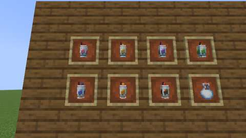

# Milkshakes: seven glasses from the owner's drawing

Status: implemented in source; **not yet played**. The Build workflow compiles it; see Verification for what has actually run.
Proposal issue: none; requested directly by the owner on 8 October 2026, who shared a page of milkshakes they drew ("CAKES & BAKES - 3D MILKSHAKE"; the page: [art/owner-library/drawings/milkshakes.png](../../art/owner-library/drawings/milkshakes.png)) with their [cakes](cakes.md) and [pies and tarts](pies-and-tarts.md). The [fruit crops](fruit-crops.md) they need came first, as the owner chose. Part of the [kitchen and cooking expansion](../branches/AGRICULTURE.md#the-kitchen-and-cooking-expansion-planned).
Owner: @jimbozoomer-byte
Target milestone and tier: Milestone 3 (first homestead); Discovery tier. No station: crafted by hand.
Primary specialty and supported player role: cooking; supports farmers (the fruit crops, apples, pumpkins, cocoa, sweet berries, milk) and decorators (the glasses are made to be set out)

## Player experience
Make the owner's milkshakes and set them out:

- **Seven milkshakes:** Strawberry, Banana, Plum, Apple, Blueberry, Pumpkin and Chocolate, each in the owner's sundae glass: a foot of four glass bars, the glass with its corner posts and the shake showing between them, a band of glass round its rim, a heap of cream, the fruit on top (a strawberry, a piece of banana, a plum, an apple, a blueberry, a piece of pumpkin, and the chocolate milkshake's cherry) and a straw leaning back through the cream.
- **Made by hand:** a **Milk Bottle**, a snowball, a sugar and the milkshake's own flavour, anywhere in a crafting grid:

| Milkshake | Its flavour |
| --- | --- |
| Strawberry Milkshake | two strawberries |
| Banana Milkshake | a banana |
| Plum Milkshake | a plum |
| Apple Milkshake | an apple |
| Blueberry Milkshake | two blueberries |
| Pumpkin Milkshake | a pumpkin |
| Chocolate Milkshake | cocoa beans and sweet berries (the cherry) |

- **Drunk** as the menu's drinks are, even on a full stomach: five food and **Haste for 30 seconds** (a sugar rush), leaving the glass bottle the milk came in. They stack to 16.
- **Set down** as the menu's dishes are: a sneaking player sets one down on a block, facing them, as the owner's 3D glass; an empty hand takes it back. In the inventory, in hand and in an item frame, too, a milkshake is its glass, shown nearly a slot's size.

| **The seven,** set down on a counter, from the left: Strawberry, Banana, Plum, Apple, Blueberry, Pumpkin and Chocolate | **As drawn:** the strawberry and banana milkshakes from above their front right, as the page draws them |
| --- | --- |
|  |  |
| **The items:** each milkshake's glass in an item frame, in the page's order, and the Milk Bottle they start from | |
|  | |

*In-game screenshots from CI's client game test (`MilkshakeClientGameTests`, software rendering, small previews).*

## Connections
- Existing input producer: the Milk Bottle ([the menu](the-menu.md): a bucket of milk fills four glass bottles), snowballs, sugar, the [fruit crops'](fruit-crops.md) strawberries, blueberries, plums and bananas, apples, pumpkins, cocoa beans and sweet berries.
- Existing output consumer: drinks (`c:foods`); set down, a decoration alongside the menu's dishes and drinks.
- Technology connection: data recipes, ready for the engineered kitchen (slice 10) to blend.
- Magic connection: none.
- Reachable entry path: everything is vanilla or grown at Discovery tier; no circular unlock.
- Required vs optional: all optional, food and decoration.
- How this stays useful without other branches: a cook needs only a cow, snow, sugar cane and a fruit.

## Balance and automation
Units are hunger points (docs/BALANCE.md); the numbers are in `tools/milkshakes.py`.

- Every milkshake gives **5 food (0.6 saturation)** and 30 seconds of Haste I, and is drunk even when full, as every drink of the menu is.
- The menu's rule holds: a dish gives at most 3 hunger over its ingredients, each counted as the most it could give. The flavours give 4 (two strawberries, a banana, a plum, an apple, two blueberries), 8 (a pumpkin, as its four slices) or 2 (the chocolate's sweet berries; cocoa is not food); the milk, snowball and sugar give none. `tools/check_mod_data.py` checks it.
- **No loops:** nothing turns a milkshake back into what made it, and drinking one gives back only the glass bottle the milk was in.
- Haste is short and weaker than a beacon's or a potion's; no other drink gives it.

## Multiplayer and persistence
- All changes happen on the server: drinking is vanilla's consumable item, and setting down and taking back are the menu's (`PlacedDishBlock`), with vanilla's reach check and the town's protection.
- A milkshake set down is a block with its facing; nothing else is stored.
- Every ID is new; nothing existing is renamed or migrated. The milkshakes join `MenuDishes` after the orchards' juices.
- Disabling `agriculture` removes the recipes (load conditions) but keeps the registrations.

## Dependencies and assets
No new dependency.

**Read off the owner's drawing.** The owner's page is kept as [art/owner-library/drawings/milkshakes.png](../../art/owner-library/drawings/milkshakes.png) (an image viewer's two arrow buttons and the owner's red scribble painted over with the page's own grey; see that folder's README). Every glass on it is the same shape (`tools/milkshakes.py`, in texels: six wide, its band six and a half, fifteen and three quarters tall to the top of the straw), fitted to the drawing; for each milkshake a projection fitted once to its cap and fruit puts every face onto the page, where `tools/milkshake_art.py` reads it a quarter texel at a time and then, finding the drawing's own texel grid on each face, as its texels (each the median of what the drawing shows of it), lit back up (the page shades the sides as Minecraft does). What the drawing hides is filled from the same place turned or mirrored, or the nearest texel shown. The glass, the cream, the base, the foot and the straw are read off the strawberry milkshake, which the page draws large; each milkshake's own shake and fruit off its own drawing. No Mojang texture is read.

As an item the glass is shown as the flora's small 3D plants are (`tools/milkshake_data.py` DISPLAY: nine tenths of a slot, eight tenths of an item frame), since a full block's display would show the narrow glass at half that. Each milkshake wears one 64 × 64 texture (four pixels to a texel, so the glass's quarter texels are whole pixels; `docs/ART_DIRECTION.md` allows a packed model texture this size where the art needs the detail). The model is the drawing's own coordinates: a set-down dish faces whoever set it down with its south side, so a milkshake set down looks as drawn, its straw at the back right. As the page draws it, the glass's base stands a texel clear of its foot's bars. If the owner draws any of this again, their files can replace these under the same IDs.

## Verification
CI (8 October 2026, GitHub Actions, the pins in [PLATFORM.md](../PLATFORM.md)):

| Commit | What ran | Result |
| --- | --- | --- |
| `dc9b751` | Build, data audit, game tests, and every client game test class (111: the change adds to the owner's library, a file the selector counts as shared) | Compiled; data audit pass, 1900 IDs; **all 1172 required game tests passed**, the milkshakes' three among them; **every client class passed**, `MilkshakeClientGameTests` among them. The screenshots above are from this run |
| `6a003e5`, `fd16d09` | The same, before the glass's item display and the client test's cameras were fixed | `fd16d09`: the same results (`6a003e5`'s run was cancelled by the next push) |

Run locally (8 October 2026), on top of the pies and tarts (#266):

| Check | Result |
| --- | --- |
| `python3 scripts/check_repository.py` | Pass |
| `python3 tools/check_mod_data.py`: also checks the milkshakes' balance with the menu's (at most 3 over their ingredients), that each is a drink set down as the glass, that its model is `tools/milkshake_data.py`'s with the straw leaning as `tools/milkshakes.py` says (by a turn the model format allows), its 64 × 64 opaque texture, its item (its 3D glass, shown as `tools/milkshake_data.py` DISPLAY says, no flat model), its words as an item and set down, its recipe, `PlacedDishBlock`'s `MILKSHAKE` outline, that every part fits the block and the outline, that the texture layout lies on whole pixels, and the owner's page. I checked it fails on a wrong outline | Pass, 1900 IDs |
| `python3 tools/owner_art.py --check` | Pass |
| `python3 tools/generate_material_data.py`, then `git status` | Writes this slice's data; it also writes `data/jugcraft/spell_assignments/hades_scythe.json`, which `main` does not have and this branch leaves out |
| `python3 tools/generate_textures.py` | Writes this slice's textures only |
| `./gradlew build`, game tests and client game tests | Not run locally (the Fabric Maven is out of reach here); run by CI |

Previews (scratch tooling, not committed): each generated model, rendered with its milkshake's fitted camera, next to the drawing.

The new game tests (`MilkshakeGameTests`):
1. a Milk Bottle, a snowball, a sugar and each flavour craft the milkshake;
2. every milkshake is a drink of five food drunk even when full, stacking to 16, and gives Haste for half a minute, leaving the glass bottle;
3. every milkshake sets down as the milkshake glass; a sneaking player sets one down facing them, standing as tall as its straw and narrower than a block; an empty hand takes it back.

`MenuGameTests.dishesSetDownAndTakenBack` also sets down every dish of `MenuDishes`, the milkshakes among them, and `MenuClientGameTests` sets them on its table.

The client game test (`MilkshakeClientGameTests`, CI job `client`) hides the HUD and hand, sets the seven out on a counter facing the camera in the page's order, the strawberry and banana milkshakes close up at the angle the owner drew them from, and their items (their glasses) in item frames, two rows of four with the Milk Bottle, and takes three screenshots.

Not done: play in a real client and a two-client dedicated-server session.

## World and event applicability
Food and decoration, for any time of year.

## Rollout and open questions
- How a milkshake is made (by hand, from a Milk Bottle) and what it does (five food, Haste) are Jugcraft's choices, as the page does not say; the owner can change them. The engineered kitchen (slice 10) may add a blender.
- The page draws the chocolate milkshake's topping red: it is a cherry, made with sweet berries.
