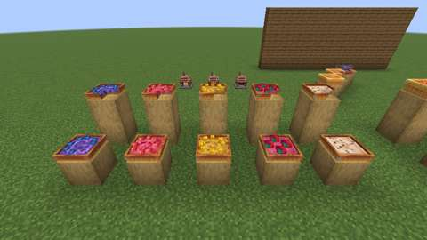
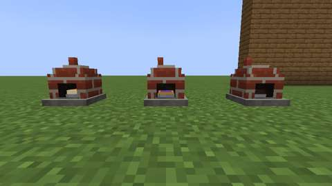
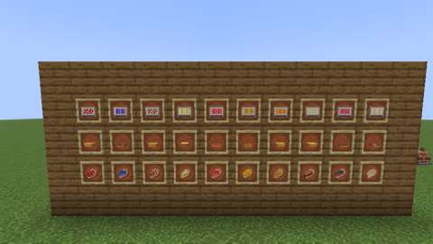

# Pies and tarts: ten bakes from the owner's drawing

Status: implemented in source; **not yet played**. The Build workflow compiles it; see Verification for what has actually run.
Proposal issue: none; requested directly by the owner on 8 October 2026, who shared a page of pies and tarts they drew ("CAKES & BAKES - 3D PIES & TARTS"; the page: [art/owner-library/drawings/pies_and_tarts.png](../../art/owner-library/drawings/pies_and_tarts.png)), after their [cakes](cakes.md) and the [fruit crops](fruit-crops.md) these need. Asked about the page, the owner settled it: the golden tart (its label reads "PORK PIE", as the tall pie's does) is the **Lemon Tart** and the tall closed pie is the **Pork Pie**; the pumpkin pie is a **separate oven pie** (vanilla's pumpkin pie keeps being set down in the owner's art, [feasts](feasts-and-food-displays.md)); and the pies Jugcraft already has stay **as they are**. Baked in the Hearth Oven as the pies and cakes are. Part of the [kitchen and cooking expansion](../branches/AGRICULTURE.md#the-kitchen-and-cooking-expansion-planned).
Owner: @jimbozoomer-byte
Target milestone and tier: Milestone 3 (first homestead); Discovery tier. Nothing needs a station but the Hearth Oven the pies already use.
Primary specialty and supported player role: cooking; supports farmers (the fruit crops, sweet berries, pumpkins, wheat, eggs, milk), herders (pork) and decorators (the bakes are made to be set out)

## Player experience
Bake the owner's pies and tarts and set them out:

- **Five pies:** Strawberry Pie, Plum Pie, Banoffee Pie, Whipped Pumpkin Pie and Pork Pie, each as the owner drew it: the strawberry and plum pies latticed over their fruit, the banoffee and pumpkin pies with a square of cream on top, the pork pie closed under a golden lid.
- **Five tarts:** Blueberry Tart, Sweet Berry Tart, Lemon Tart, Strawberry Tart and Coffee Tart, each with the drawing's toppings: blueberries, sweet berries and lemon pieces round the rim, four strawberries, and the coffee tart's speckled cream.
- **Baking:** Pastry Dough with a sugar (none in the pork pie) and the bake's own ingredients makes its raw pie or tart. The Hearth Oven bakes it as it bakes a pie, drawn inside as a square tin with its crust standing round the filling; left in too long it comes out a **Burnt Pie**.

| Bake | Its own ingredients |
| --- | --- |
| Strawberry Pie | two strawberries |
| Plum Pie | two plums |
| Banoffee Pie | two bananas and a bucket of milk |
| Whipped Pumpkin Pie | a pumpkin and an egg |
| Pork Pie | two raw porkchops (and no sugar) |
| Blueberry Tart | two blueberries |
| Sweet Berry Tart | two sweet berries |
| Lemon Tart | a lemon and an egg |
| Strawberry Tart | two strawberries and a bucket of milk |
| Coffee Tart | Coffee Beans and a bucket of milk |

- **Set down whole,** a block wide, its front to whoever set it down: a pie seven texels tall (a crust lid over a body a texel narrower all round), a tart four (a base a texel narrower, under a wall whose rim stands a texel above the filling). A hungry player eats a quarter of it; a knife cuts a quarter off as a **slice** to take away. The front right quarter goes first, as the page shows the strawberry pie and the blueberry tart cut, then the front left, the back left and the back right; the last quarter takes the bake. Only a whole bake can be picked up again.
- **Inside:** the strawberry pie's and the blueberry tart's insides are the page's own cuts; the other pies and tarts, which the owner drew whole, show the same inside in their own filling's colours (the pork pie's is meat).

| **The pies,** whole in front and cut behind, from the left: Strawberry, Plum, Banoffee, Whipped Pumpkin and Pork | **The tarts,** whole in front and cut behind, from the left: Blueberry, Sweet Berry, Lemon, Strawberry and Coffee |
| --- | --- |
|  |  |
| **As drawn:** the strawberry pie and the blueberry tart, whole and cut, from above their front right as the page draws them | **Baking:** three Hearth Ovens seen into, from the left a whipped pumpkin pie raw, a blueberry tart baked and a plum pie burnt |
|  |  |
| **The items:** the raw bakes, the bakes and the slices, in the page's order | |
|  | |

*In-game screenshots from CI's client game test (`PieTartClientGameTests`, software rendering, small previews; the dark slot at the far left of the drawn view is the dip the camera stands in to look into the ovens).*

## Connections
- Existing input producer: Pastry Dough (wheat and an egg) and sugar; strawberries, blueberries, plums, bananas and Coffee Beans (the [fruit crops](fruit-crops.md)), lemons (the [orchards](orchards.md)), sweet berries, pumpkins, eggs, milk and porkchops; the Hearth Oven and its fuel.
- Existing output consumer: the slices are foods (`c:foods`, `c:foods/pie`); the bakes set out on the feasts' tables, as the pies and cakes do.
- Technology connection: the raw bakes are data recipes, ready for the engineered kitchen (slice 10) to mix.
- Magic connection: none.
- Reachable entry path: everything a bake needs is vanilla or grown and made at Discovery tier (the Hearth Oven; the fruit from seeds in short grass, wild plants and trees); no circular unlock.
- Required vs optional: all optional, food and decoration.
- How this stays useful without other branches: a cook needs only a farm and an oven.

## Balance and automation
Units are hunger points (docs/BALANCE.md); the numbers are in `tools/pies_and_tarts.py`.

| Bake | A quarter gives (saturation modifier) | Whole |
| --- | --- | --- |
| Strawberry, Plum, Banoffee and Whipped Pumpkin Pies | 4 (0.6), as the other pies' slices | 16 |
| Pork Pie | 5 (0.8), for its meat | 20 |
| Blueberry, Sweet Berry, Lemon, Strawberry and Coffee Tarts | 3 (0.6), a shallower bake | 12 |
| Burnt Pie | 1 (0.1), and one time in three Hunger | 4 |

- A pie takes what Jugcraft's other pies take (Pastry Dough, a sugar and two ingredients) and gives what they give. A tart takes the same and gives less, for being shallower: it is the look a cook bakes it for. The pork pie gives 20 from two porkchops (16 cooked on their own) and the pastry.
- **No loops:** nothing turns a bake or slice back into its ingredients. `tools/check_mod_data.py` follows every agriculture recipe and fails on a loop.
- **Baking time** is the pies' (`HearthOvenBlockEntity`: 600 points, a point a tick at 50 degrees or more, two at full heat; burnt at 1,200).

## Multiplayer and persistence
- All changes happen on the server; eating and cutting are block uses as a pie's are, so vanilla's reach check and the town's protection apply.
- Persistence: a bake's facing and the quarters eaten are block state; a Hearth Oven saves a pie or tart as it saves any pie (by its place in `PieFilling`). The pies and tarts are added at the end of `PieFilling`, after the cakes, so a saved oven keeps what it held.
- Every ID is new; nothing existing is renamed or migrated. The bakes are `CakeBlock`s at their own height (the cakes' block, which now takes a height; the cakes keep theirs, nine texels).
- Disabling `agriculture` removes the recipes (load conditions) but keeps the registrations, so saved bakes, slices and raw bakes survive.

## Dependencies and assets
No new dependency.

**Rebuilt from the owner's drawing.** The owner's page is kept as [art/owner-library/drawings/pies_and_tarts.png](../../art/owner-library/drawings/pies_and_tarts.png) (an image viewer's arrow and the owner's red scribble painted over with the page's own grey; see that folder's README). It draws every pie alike and every tart alike, so the shapes are two (`tools/pies_and_tarts.py` PIE and TART), and `tools/pie_tart_art.py` reads every texture off it as `tools/cake_art.py` reads the cakes': for each bake, a projection fitted once to its outline puts every texel of the faces the drawing shows onto the page, where it is read (the median of a small grid in the texel's middle) and the sides are lit back up (the page shades them as Minecraft does, the south face to 0.8 and the east to 0.6). The strawberry pie and the blueberry tart, drawn large, are a little squatter than the small ones (and than the models, which follow those), so their sides and cuts are read through a projection fitted to their own outline, each row at its height in proportion. What the drawing hides (behind a topping or a tart's front rim, or the quarter the page cuts away) is filled from the same place mirrored. The toppings were fitted to the drawing the same way and are boxes in `tools/pies_and_tarts.py`. No Mojang texture is read.

From the owner's own library: each slice's icon is one of their pie slices (`farming and food textures/apple_pie_slice.png` for the latticed strawberry and plum pies, `pumpkin_pie_slice.png` for the other pies, `sweet_berry_cheesecake_slice.png` for the tarts) recoloured in the bake's own colours. Jugcraft's own: the raw bakes' icons (a square tin of pastry round the raw filling). The Burnt Pie is the existing one.

The models face north, the drawing turned half round (`tools/cakes.py` turn), so the quarter the page cuts away is the model's front right. Each quarter is its own boxes, with the bake's inside on its cut faces; the toppings stand on the quarters they lie on and are cut with them (`tools/pie_tart_data.py`). If the owner draws any of this again, their files can replace these under the same IDs.

## Verification
CI (8 October 2026, GitHub Actions, the pins in [PLATFORM.md](../PLATFORM.md)):

| Commit | What ran | Result |
| --- | --- | --- |
| `e7f7156` | Build, data audit, game tests, and every client game test class (110: the change adds to the owner's library, a file the selector counts as shared) | Compiled; data audit pass, 1893 IDs; **all 1169 required game tests passed**, the pies' and tarts' among them; **every client class passed**, `PieTartClientGameTests` among them. The screenshots above are from this run |
| `e94c3e8`, `7d32534` | The same, before the client test hid the HUD and hand | The same results |

Run locally (8 October 2026), on top of `main` at `b533201` (the October 8 integration):

| Check | Result |
| --- | --- |
| `python3 scripts/check_repository.py` | Pass |
| `python3 tools/check_mod_data.py`: also checks the pies and tarts in `PieFilling` against `tools/pies_and_tarts.py` (ID, slice food, colour and height, in order, after the cakes), `CakeBlock`'s height constructor and the registration, every bake's models for each slice gone, its blockstate for each slice and facing, textures, words and loot (only while whole), that each topping stands on the bake's top within its crust, the raw bakes' and slices' words and textures, the recipes and the owner's page. I checked it fails on a wrong colour | Pass, 1893 IDs |
| `python3 tools/owner_art.py --check` | Pass |
| `python3 tools/generate_material_data.py`, then `git status` | Writes this slice's data; it also writes `data/jugcraft/spell_assignments/hades_scythe.json`, which `main` does not have and this branch leaves out |
| `python3 tools/generate_textures.py` | Writes this slice's textures only |
| `./gradlew build`, game tests and client game tests | Not run locally (the Fabric Maven is out of reach here); run by CI |

The new game tests (`PieTartGameTests`):
1. every raw pie and tart goes into the Hearth Oven as its own, every bake is a `CakeBlock` of its height (seven for a pie, four for a tart) and burns into a Burnt Pie; at full heat a strawberry pie bakes and comes out a strawberry pie, and a lemon tart left in comes out a Burnt Pie, not a Burnt Cake;
2. set down by a player looking north, a pie and a tart face south, towards them;
3. whichever way the strawberry pie or the blueberry tart faces, each slice takes the next quarter in order, the front right first, at the bake's own height, and a whole one fills its block's footprint;
4. a hungry player eats a quarter of the pork pie (five food), a knife cuts a slice to take away, the pie keeps its facing, and the last quarter takes the pie; only a whole tart drops itself;
5. there are ten; every raw bake's recipe loads, every slice is a food and a pie giving its filling's hunger, and no raw bake is eaten as it is.

`PieGameTests.pieDataLoads` also loads every raw bake's recipe, every `PieFilling` being checked there. `PieClientGameTests` now keeps to the round pies.

The client game test (`PieTartClientGameTests`, CI job `client`) hides the HUD and hand, sets the five pies and the five tarts out on two displays in the page's order, whole below and cut above, the strawberry pie and the blueberry tart whole and cut at the angle the owner drew them from, three Hearth Ovens with a bake inside (raw, baked, burnt) seen from eye level with their mouths, and a wall of the items in item frames (raw, baked, sliced), and takes five screenshots.

Not done: play in a real client and a two-client dedicated-server session.

## World and event applicability
Food and decoration, for any time of year. The Whipped Pumpkin Pie is not seasonal.

## Rollout and open questions
- The owner's milkshakes (their other page) come next.
- The page labels the golden tart "PORK PIE"; the owner named it the Lemon Tart. The pumpkin pie is named the **Whipped Pumpkin Pie**, after the cream on its top, as "Pumpkin Pie" is vanilla's; the owner can rename it.
- Pies and tarts do not sit on the feasts' platters or the Pantry Shelf; they stand on a table as a block.
