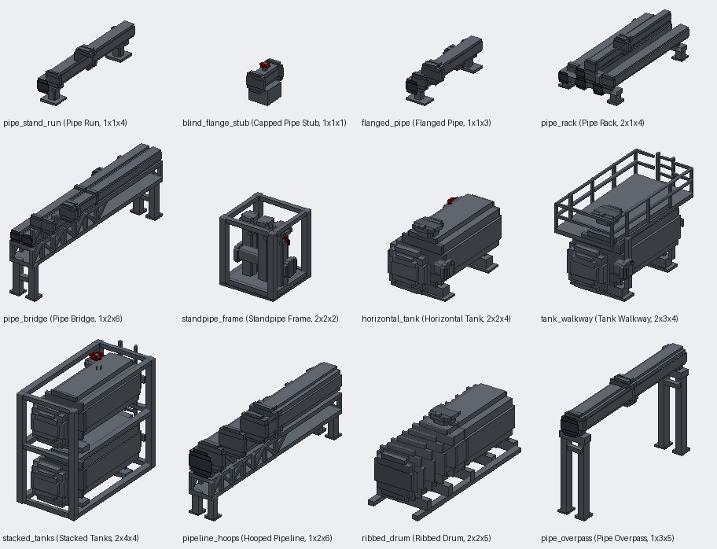

# Pipeworks: industrial pipe and tank props

Status: implemented in source; `check_mod_data.py` and `check_repository.py` pass locally; the Gradle build and game tests wait for CI (no Java 25 on the owner's PC). Not yet played by hand.
Proposal issue: none. The owner asked for it directly on 8 October 2026, with a render of their own set of grey-box industrial models ("I want you to remake these models I made ... so they are usable in my Jugcraft mod"), and asked for Blockbench to be part of the work.
Owner: @jimbozoomer-byte
Target milestone and tier: steel tier (steel plates, steel fluid pipes and steel I-beams).
Primary specialty and supported player role: building and decoration. The props dress a refinery, a tank farm or a factory yard in the look of the Dieselworks building set.

## Player experience
Twelve props, each placed from one item and filling several blocks, in the clean blue-grey Dieselworks steel: round pipes and tanks built from stepped prisms, bolted flanges, riveted straps and hoops, pedestal stands and saddles, lattice girders with real diagonals, tread-plate decks with handrails and ladders, red handwheels and gauges. Placing the item builds the whole prop if its blocks are free; it faces the player and reaches to their right, up and away from the block they aimed at. Breaking any block removes all of it and drops the one item. Its hitboxes follow the pipes and tanks, so you walk under a bridge and stand on a walkway.

| Prop | Size (wide x tall x long) | What it is |
| --- | --- | --- |
| Pipe Run | 1 x 1 x 4 | A pipe on two pedestal stands, strapped down, a flanged joint midway; open ends line up end to end |
| Capped Pipe Stub | 1 x 1 x 1 | A short pipe on a riveted plinth, blanked with a bolted flange at each end, a valve on top |
| Flanged Pipe | 1 x 1 x 3 | A pipe on two low brackets, flanged joints at the block seams, open ends |
| Pipe Rack | 2 x 1 x 4 | Three lines side by side on two cradle stands and a fourth on a tier above |
| Pipe Bridge | 1 x 2 x 6 | A lattice girder on four legs carrying two lines |
| Standpipe Frame | 2 x 2 x 2 | Three capped risers with handwheels and gauges on a header, in a steel frame on a tread-plate floor |
| Horizontal Tank | 2 x 2 x 4 | A tank with dished heads on riveted saddles: a valved nozzle, a manway, a side outlet, a gauge |
| Tank Walkway | 2 x 3 x 4 | The tank under a tread-plate walkway with handrails, a ladder up its front; the nozzle comes through the deck |
| Stacked Tanks | 2 x 4 x 4 | Two tanks in a steel frame, one over the other, a drain between them, a ladder up the front |
| Hooped Pipeline | 1 x 2 x 6 | A big pipe in riveted hoops on a lattice girder, a flanged joint midway |
| Ribbed Drum | 2 x 2 x 5 | A long ribbed drum with bolted ends on cradles over two sills, a manway on top |
| Pipe Overpass | 1 x 3 x 5 | A big pipe carried high on two portal frames, hooped where it rests on the beams |

Each item's tooltip gives the size. The items draw the whole prop scaled into the slot.

## Connections
- Existing input producer: steel plates (the metal press), steel fluid pipes and steel I-beams (Dieselworks).
- Existing output consumer: building only. The pipes carry nothing; a working line is the fluid pipes.
- Technology connection: none beyond the recipes (the `machines` feature switch, like Dieselworks). Magic connection: none.
- Reachable entry path: steel, which every recipe here needs, is reachable through the steel foundry.
- Required vs optional: optional decoration.

## Balance and automation
One recipe makes one prop from plates, pipes and beams; nothing turns a prop back into metal, so there is no loop. No block entity, nothing ticks, no light.

## Multiplayer and persistence
Placement and removal run on the server (`PipeworksBlock`), the way the haunted archway's do: every block of a prop is the prop's block with its `part` (0 is the master, which alone drops it) and `facing`; placing checks every block is free; breaking any block breaks the master, which removes the rest without drops; in creative nothing drops. A prop is not turned or mirrored by structures (one block turned alone would tear it apart) and blocks pistons. New IDs: the twelve blocks and items in the table (`pipe_stand_run`, `blind_flange_stub`, `flanged_pipe`, `pipe_rack`, `pipe_bridge`, `standpipe_frame`, `horizontal_tank`, `tank_walkway`, `stacked_tanks`, `pipeline_hoops`, `ribbed_drum`, `pipe_overpass`) and their recipes and loot tables. Nothing else is saved.

## Dependencies and assets
No dependencies. Everything is original and drawn by code:
- Models: `tools/pipeworks_models.py`, one model a prop in structure space, built from the steampunk helpers (stepped round prisms, handwheels, gauges) and cut into one model a block by `model_writer.split_model`, so no two faces share a plane inside or across the parts (`art_check` X1 and X2 check every prop's parts drawn together).
- Textures: `tools/pipeworks.py` draws `pw_steel` (even brushed steel, no edge seam, for every tube), `pw_bore` (the dark mouth of an open pipe), `pw_flange` (bolt heads on a four-pixel lattice) and `pw_tread` (tread plate) in the Dieselworks steel palette; the frames, straps and feet reuse `dw_steel_plate`, `dw_steel_plate_riveted` and `dw_steel_band`, the handwheels `dr_red` and the gauges `sp_gauge`.
- Blockbench: `tools/pipeworks.py` also writes each prop's whole model as a Blockbench project, `art/pipeworks/<id>.bbmodel` (the free format, textures embedded), for review and editing in Blockbench; the projects were opened in Blockbench 5.2.1 on the owner's PC. The Python model stays the source: a change made in Blockbench is carried back into `tools/pipeworks_models.py` so the parts can be regenerated.
- Previews: `tools/pipeworks_preview.py` renders a sheet of all twelve (back faces culled, far to near) for offline review.
- The owner's render was the reference for the set's shapes; nothing was traced from it, and the owner library has no pipe or tank models to reuse.

## Verification
- Done locally (8 October 2026): `python tools/check_mod_data.py` (1875 IDs, the data and recipe audit, `art_check` over the parts drawn together) and `python scripts/check_repository.py` pass; `python tools/pipeworks.py` slices every prop (118 elements at most, the Tank Walkway) and every block of every prop has geometry except the four blocks over the Pipe Bridge's open span and the six over the Pipe Overpass's, which are air inside the prop; the offline preview sheet was reviewed; the Blockbench projects open.
- Not run locally: `./gradlew build` needs a Java 25 toolchain and this PC has only Java 21 (Gradle stopped at `compileKotlin` before compiling anything), so the Java here is unverified until CI's Build workflow runs.
- Planned in CI: game tests `PipeworksGameTests.theTankStandsAsOne` (a Horizontal Tank fills its sixteen blocks facing the player with a shape in every block, won't go where a block is in its way, uses one item, and breaking a far corner removes it all and drops it once) and `everyPropFillsItsSize` (every prop fills exactly its size); the client screenshot `jugcraft_pipeworks`, a yard of all twelve on a weathered steel plate floor.
- Not done: a survival play-test; seeing the props in the game.

## World and event applicability
Not applicable: the props are crafted and placed by players only.

## Rollout and open questions
- The owner's render has a few more variants (a second stacked pair, a longer pipe culvert); more sizes or lengths can follow if wanted, and a prop that carries fluid is a separate feature.
- The hitboxes are coarse boxes round the pipes and tanks, not the ladders and railings.
