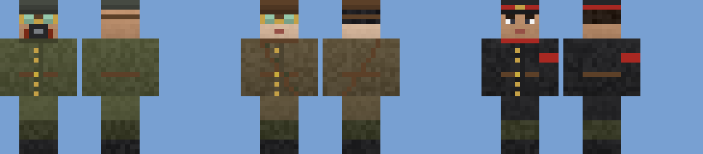

# The raider faction (batch 57)

Status: implemented (pending CI and review)
Proposal issue: none. On 4 October 2026 the owner asked to "do those 1-6... each very carefully and detailed... one at a time with lots of depth". This is idea 3: a dieselpunk raider faction that raids bases, with walkers, blimps and infantry, and can be switched off. It builds on fire control (batch 56) and fortifications (batch 55), which are not merged yet.
Owner: jimbozoomer-byte
Target milestone and tier: steel tier onwards. Raids wait until a player has played for three days.
Primary specialty and supported player role: base defence, and a reason to build the guns, towers and fire control of batches 51–56

## Player experience
Five kinds of raider. All are hostile mobs: sentry guns (batch 56) and town guards fight them.

| Raider | Health / damage / armour | What it does |
| --- | --- | --- |
| **Raider Grunt** | 24 / 5 / 4 | Charges in with a cleaver (an iron axe). Olive greatcoat, steel helmet, goggles and a respirator. |
| **Raider Grenadier** | 20 / 3 / 2 | Lobs small grenades from up to 18 blocks, every 3.5 seconds. Closer than 6 blocks it clubs instead. Brown coat, leather helmet, a bandolier of grenades. |
| **Raider Officer** | 32 / 6 / 6 | **Rallies** every raider within 12 blocks every 2 seconds (Speed and Strength). **When an officer falls, the raiders round them lose heart**: Weakness II and Slowness for 10 seconds, and the rally's Strength is gone. Black coat, red-banded peaked cap, red armband. |
| **Raider Walker** | 120 / 14 / 14 | A raider-built Diesel Walker in olive and black plate. It wades in and punches, throwing what it hits. Its shoulder launcher fires grenades at anything 8 to 24 blocks off, every 5 seconds. It ignores knockback and climbs a block and a half. It has no working drill: **raiders never break blocks**. |
| **Raider Blimp** | 50 / – / 2 | A small airship, the zeppelin's shape at 55% in charcoal canvas with a red band. It cruises 16 blocks over whoever it hunts (never lower than 8 over the ground under it). When within 3 blocks of overhead it drops a bomb every 2.5 seconds. Flak (batch 51) and arrows bring it down. Dying, it noses over. |

### Grenades and bombs
- Every grenade and bomb is a damage-only blast (`weapons/Blast`): **it never breaks, moves or burns a block**.
- Each is smaller than a player's grenade (radius 4, 16 damage):
  - grenade: radius 2.5, 6 damage
  - bomb: radius 3.5, 10 damage
- They spare raiders, and pass through them rather than bursting on them. Raiders cannot kill each other for loot.

### Raids
- **When:**
  - In the Overworld, the server checks every minute.
  - It needs raids switched on, mobs spawning, a difficulty other than peaceful, and no raid already under way.
  - A player is raided only after **3 days of play** (`raiders.grace_days`).
  - The world is raided at most once every **3 days** (`raiders.interval_days`), and then on a fifth of the checks.
  - Creative and spectator players are never raided.
- **Where:** the raid makes for the player's base (where they stood) or, if they are within 128 blocks of the walled town, the town.
  - The party gathers 48 to 64 blocks away, on dry open ground outside the town, in a loaded chunk.
  - Everyone within 160 blocks hears the raid horn and is told which way it comes from ("Raiders are coming! Their engines rumble to the east.").
- **The march:**
  - Raiders march on the objective in legs of 16 blocks.
  - On the way they fight players and the town's folk, and anything that hurts them. A raider hurt by another raider does not turn on it.
  - At the objective they mill about looking for a fight.
- **The bar:** a red "Raid (level N)" bar shows everyone within 160 blocks of the objective how much of the party is left.
- **Winning:**
  - When every raider has fallen, the raid is beaten off.
  - The world's raid level goes up by one, to at most 5.
- **Withdrawing:**
  - A raid that has lasted 10 minutes, or has had nobody within 160 blocks of its objective for 2 minutes, withdraws.
  - Its raiders leave in a puff of smoke: at once if loaded, otherwise the next time they are.

| Raid level | Grunts | Grenadiers | Officers | Blimps | Walkers |
| --- | --- | --- | --- | --- | --- |
| 1 | 3 | 1 | 1 | 0 | 0 |
| 2 | 4 | 1 | 1 | 1 | 0 |
| 3 | 5 | 2 | 1 | 1 | 1 |
| 4 | 6 | 2 | 1 | 1 | 1 |
| 5 | 7 | 3 | 1 | 2 | 1 |

### Switching it off
- In `config/jugcraft.properties`:
  - `raiders.enabled=false` (the feature switch) or `raiders.raids=off` stops raids.
  - `raiders.walkers=off` and `raiders.blimps=off` leave those out of raids.
  - `raiders.grace_days` and `raiders.interval_days` set the timings, in game days.
- Raiders already in the world stay until their raid ends.
- Raiders can still be summoned with `/summon` (for example `jugcraft:raider_walker`). A summoned raider belongs to no raid and despawns like any hostile mob.

### Loot
Loot is small, since a raid comes at most every few days and costs a fight.

| Raider | Drops |
| --- | --- |
| Grunt | 0–3 iron nuggets |
| Grenadier | 0–2 gunpowder |
| Officer | the **Raider Insignia** (a trophy; only to a player's kill) and 0–1 iron ingot |
| Walker | 2–4 steel plates and 1–2 steel gears |
| Blimp | 1–3 rubber and 2–5 string |

Their weapons never drop.

## Connections
- Input producers: none. Raiders come from raids.
- Output consumers:
  - steel plates and gears for machines
  - rubber and string
  - gunpowder for shells and grenades
- Defences that work against them:
  - every crewed gun and the tower guns (batches 51 and 54)
  - fire control's sentry mode (batch 56), which treats raiders as hostile mobs
  - flak against blimps
  - fortifications (batch 55): raiders cannot break walls or blast doors, so they must find a way round
  - the town's guards

## Balance and automation
- **No block damage of any kind.** No drill, no griefing, and every blast is damage only.
- **No positive-gain loop.**
  - Raids come at most once every few days per world, and only for a player with three days of play.
  - Raiders do not respawn.
  - Their blasts spare each other, so they cannot be made to kill each other for loot.
  - The insignia drops only to a player's kill.
- **Escalation is capped at level 5:** 15 raiders at most, two of them blimps.
- **Peaceful** removes raiders, and no raids start in it.

## Multiplayer and persistence
- **Server only:**
  - Raids live in the Overworld's saved data (`jugcraft:raids`): each raid's objective, level, start, size and who is left, plus the world's raid level and when the last raid began.
  - Each raider saves its raid and objective.
  - The bar is rebuilt after a restart.
- **Who sees what:**
  - The bar goes to every player near the objective.
  - Messages go to everyone near when a raid starts, ends or withdraws.
- **Unloaded chunks:** a raider in an unloaded chunk still counts toward its raid. If the raid withdraws while the raider is unloaded, it leaves when next loaded.
- Not verified with two players or on a dedicated server.

## Dependencies and assets
- No dependencies. All art is original, made by `tools/raiders.py`:
  - **Uniforms:** three 64 × 64 skins in the player layout, drawn with the townsfolk's skin helpers.
  - **Paint:** raider olive paint, dark plate, charcoal canvas (plain, red-banded and red nose) and the insignia, in the clean style.
  - **Walker and blimp models:** the Diesel Walker's and the Zeppelin's shapes repainted, the blimp scaled to 55%, exported to `assets/jugcraft/raider_quads.json`.
- Sounds are vanilla: the pillager's voice, the raid horn, the iron golem's steps.
- Code:
  - `raiders/JugcraftRaiders`, `RaiderInfantry`, `RaiderWalker`, `RaiderBlimp`, `RaiderBomb`, `RaiderRaids`, `MarchGoal`, `RaidMember` and `Raider`.
  - Client: `RaiderRenderer`/`RaiderModel` (the townsfolk's body), `RaiderWalkerRenderer` and `RaiderBlimpRenderer`.
  - `weapons/Blast` gains a version that spares some targets.
  - `JugcraftConfig` gains the `raiders` feature and its options.

## Verification
- Planned in CI:
  - `raidersAreHostileAndSpareEachOther`: grunt, walker and blimp are hostile mobs and raiders. A raider-sparing blast hurts a pig and spares a grunt beside it.
  - `raidIsWonWhenEveryRaiderFalls`:
    - A level 1 raid brings three grunts, a grenadier and an officer, each knowing its raid and objective.
    - With every one killed, the raid ends and the raid level goes up.
  - `raidersWithdrawWithTheirRaid`: a withdrawn raid takes its raiders with it, and a raider whose raid no longer exists leaves at its next check.
  - `officerRalliesAndTheirFallRoutsTheRest`: an officer gives a grunt Speed and Strength. The officer's death leaves the grunt with Weakness and without Strength.
  - `grenadierLobsGrenades`: a grenadier throws at a player in range.
  - `blimpCruisesOverItsQuarry`: a blimp climbs toward its cruising height over a player.
  - The client screenshot `jugcraft_raiders`: three infantry, a walker and a blimp.
- Done locally:
  - `check_mod_data.py` passes. It checks every kind's stats and size, the weapons' and raids' numbers, the party table, the options, and the generated skins, paint and quads.
  - `check_repository.py` passes.
  - I reviewed the uniforms as front and back views.
  - Gradle cannot resolve the Loom snapshot offline here, so the compile, tests and screenshot run in CI.
- Not done:
  - a full raid played through in a client
  - a two-player server
  - raids across a restart
  - pathfinding over rough terrain at scale

## World and event applicability
- Raids are a world event in the Overworld only.
- They never start in peaceful, while mobs don't spawn, or with the feature off.

## Rollout and open questions
- **Next is idea 4, the armoured train.**
- Possible later additions:
  - raider camps to find and clear
  - siege ladders (so walls slow raiders rather than stop them)
  - a horn item that calls a raid on purpose
  - a raid advancement
