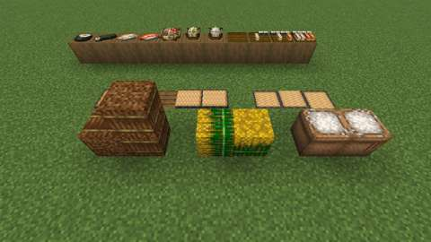
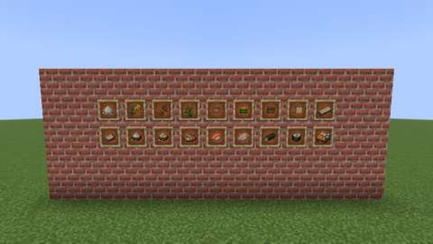

# Rice and wet farming: paddies, wild rice, straw, tatami and rice dishes

Status: implemented in source; **not yet played**. The Build workflow compiles it; see Verification for what has actually run.
Proposal issue: none; requested directly by the owner on 7 October 2026 ("lots more crops, plants, food, cooking devices, preparation systems ... lots and lots of the food to be very decorative and displayable"). This is slice 4 of the ten-slice plan in [branches/AGRICULTURE.md](../branches/AGRICULTURE.md#the-kitchen-and-cooking-expansion-planned), and slice 7 of the crop roster there; the owner asked for it next ("Lets begin with rice").
Owner: @jimbozoomer-byte
Target milestone and tier: Milestone 3 (first homestead); Discovery tier. Rice drops from grass and grows wild in swamps and rivers; a paddy needs only still water over bog soil. The Cooking Pot and the Cutting Board (slice 1) are the only stations.
Primary specialty and supported player role: farming and cooking; supports builders (tatami rooms, storehouses, set tables) and traders (rice and straw stored nine to a block)

## Player experience
Flood a field, grow rice in it, and cook and lay out what it gives:

- **Rice,** its own seed, in the owner's own art. Plant it into **still water one block deep over bog soil** (dirt, grass, mud, sand, clay or gravel: the cranberry bog's soil), with open air above the water. Not in deep water, not on dry land.
- **The paddy.** The plant grows in eight stages: four in the water, then the stalks rise into the air and the panicles grow on them, two blocks tall. **Use a ripe plant** (or a sickle) to pick **2-3 Rice Panicles**; the stalks stay standing and grow new ones. The plant holds its water: break it and the paddy stays flooded. Bone meal works as on any crop.
- **The water is the farmland.** Flooded bog soil counts as moist farmland, under the plant and around it, so a plant in a flooded field grows as fast as one in a watered field (two and a half times as fast as one in a lone flooded cell).
- **Wild Rice** grows in swamp and river shallows, two blocks tall with its foot in the water. Break it for 1-2 rice, or with shears for the plant itself, which plants again in shallow water. Rice also drops from short grass, like Jugcraft's other seeds.
- **Panicles into rice and straw.** On the Cutting Board a knife cuts a panicle into **2 rice and a Straw**; by hand (crafting) a panicle gives 1 rice.
- **Storage blocks:** nine rice in a **Bag of Rice** (the owner's sack, its tied side to you), nine panicles in a **Rice Bale** and nine straw in a **Straw Bale**. Each crafts back into its nine. The bales lie on their sides as hay bales do and soften a fall the same way.
- **Tatami,** woven from four straw: a full block for floors. Set one against the side of a tatami that has no partner and the two pair into one two-block mat (the owner's even and odd halves); sneak to set one down alone. A tatami whose partner goes stands alone again. A tatami crafts into a **Full Tatami Mat**, laid as a bed is (its foot where you use it, its head ahead of you), a pixel thick on any block; that crafts into two **Half Tatami Mats**.
- **Seven rice dishes,** each in the owner's icon, and each **set down** as the menu's are (sneak and use it on a block; an empty hand takes it back): **Cooked Rice** and **Fried Rice** heaped in the owner's bowl, **Mushroom Rice** on their plate, and the **Salmon Roll**, **Cod Roll**, **Kelp Roll** and **Kelp Roll Slice** lying flat.
- **The Rice Roll Medley:** a platter of rolls, crafted from a platter, a kelp roll and two each of the salmon and cod rolls, and set down whole. Each use takes the next roll into your inventory (four kelp roll slices, two cod and two salmon rolls, exactly what went in); once it is bare, a use clears it and gives the platter back. A comparator reads the rolls left. Broken whole, it drops itself; once served from, it drops its platter.

| **The paddy:** rice at every stage in front, a ripe row behind, wild rice on the left | **The storehouse and the tatami room:** the bales and the Bag of Rice, a tatami floor and the mats |
| --- | --- |
|  |  |
| **The table:** the rice dishes set down, and the medley bare, part served and whole | **The wall:** the slice's items in item frames |
|  |  |

*In-game screenshots from CI's client game test (`RiceClientGameTests`, software rendering, small previews).*

## Connections
- Existing input producer: short grass (rice), swamp and river biomes (wild rice), water and bog soil; vanilla eggs, carrots, mushrooms, dried kelp and fish; Jugcraft's onion (Kitchen Garden), the Cutting Board's fish slices and the Platter (slice 2).
- Existing output consumer: food for every player (every dish carries `c:foods`); rice carries `c:seeds/rice`, `c:crops/rice` and `minecraft:chicken_food` (chickens follow and breed with it). Rice, panicles and straw compost. The storage blocks, tatami and mats are building blocks.
- Technology connection: the Hydroponic Bay grows rice (2 panicles and 1-2 rice per grain, as it grows every tall crop from its seed); every recipe is data (Cooking Pot JSON, crafting, cutting), so the engineered kitchen (slice 10) can make them by machine later.
- Magic connection: none.
- Reachable entry path: rice drops from short grass and grows wild; a pond's edge or a dug pool over dirt is a paddy. The Cutting Board is planks and a stick (cut on it with any knife, flint the cheapest), and the Cooking Pot needs iron and a campfire; neither needs rice. No circular unlock.
- Required vs optional: all optional, extra food, building blocks and decoration.
- How this stays useful without other branches: a crop for wet ground, straw for floors, and food to cook and show.

## Balance and automation
- **A grain counts as the bread vanilla bakes from it:** three wheat make a loaf of 5, so a wheat or a rice counts 5/3 hunger (`tools/check_mod_data.py` `GRAIN`). Otherwise the menu's rule applies (`tools/menu.py` `COOK_BONUS`): **a dish gives at most 3 hunger more than its ingredients,** each counted as the most it would give: itself, what a furnace makes of it (an egg as a fried egg, a fish slice cooked) or what a board cuts it into. Saturation is hunger × modifier × 2, as in Minecraft.

  | Dish | Made in | Ingredients (hunger counted) | Makes | Hunger / modifier each | Total hunger |
  | --- | --- | --- | --- | --- | --- |
  | Cooked Rice | Cooking Pot | bowl, 2 rice (3.3) | 1 | 6 / 0.5 | 6 |
  | Fried Rice | Cooking Pot | bowl, 2 rice, egg, carrot, onion (9.3) | 1 | 10 / 0.7 | 10 |
  | Mushroom Rice | Cooking Pot | bowl, 2 rice, brown and red mushroom, carrot (6.3) | 1 | 9 / 0.6 | 9 |
  | Salmon Roll | crafting | rice, 2 salmon slices (7.7) | 2 | 5 / 0.6 | 10 |
  | Cod Roll | crafting | rice, 2 cod slices (5.7) | 2 | 4 / 0.6 | 8 |
  | Kelp Roll | crafting | 3 dried kelp, 2 rice, carrot (9.3) | 1 | 12 / 0.6 | 12 |
  | Kelp Roll Slice | Cutting Board | kelp roll (12) | 4 | 3 / 0.6 | 12 |

  A kelp roll's four slices give exactly the roll (12 hunger, 14.4 saturation), so cutting is never a gain. The bowl comes back from the bowl dishes as from any stew.
- **The paddy.** Rice grows at 1.25 times a vanilla crop's time scale (as the sunflower, tomato and pepper do), on its growth speed: 1, plus 3 for flooded bog soil under the plant and 0.75 for each of the eight around it; the legume and Harvest Moon bonuses apply as on farmland. A ripe plant gives 2-3 panicles and is set back to its stalks (stage 4), so it keeps its height; breaking a plant gives 1 rice (and its panicles if ripe).
- **Panicles.** Cut: 2 rice and a straw. By hand: 1 rice. Planting rice, picking panicles and cutting them multiplies rice as any crop multiplies its seed.
- **Storage.** Each block packs exactly nine and unpacks exactly nine; the recipe-loop check leaves out these unpacking recipes (`tools/rice.py` `UNPACKING`), which only give back what went in.
- **The medley** holds and serves exactly the rolls it is made of (the kelp roll as its four slices), and gives the platter back.
- **No loops.** `tools/check_mod_data.py` follows every agriculture recipe (crafting, pot, furnace, board) and fails if any leads back to where it started, storage unpacking aside.
- **Automation.** The Hydroponic Bay, as above. A comparator reads the medley. No new block entity.

## Multiplayer and persistence
- All changes happen on the server; the client only predicts. Planting, picking, breaking, pairing tatami, laying mats and taking rolls are normal block uses and breaks, so vanilla's reach check and the town's protection apply. Setting rice dishes down uses the menu's event (sneaking, `mayUseItemAt`, one item used).
- Persistence: everything is block state (age and section, half, facing, paired, part, rolls left); nothing else is saved. A paddy plant and wild rice report their water as their fluid, so it stays when they go. Chunk unload and restart keep all of it.
- The rice dishes that set down share their food's ID (`jugcraft:cooked_rice` is both an item and a block), as the menu's do. Nothing existing is renamed or migrated. `TallCrop` gained a `paddy` flag (false for every earlier crop), and breaking a tall crop now leaves whatever water its bottom held (always air for the earlier crops).
- Disabling `agriculture` removes the recipes (load conditions) but keeps the registrations, so saved blocks and items survive. Wild rice's world generation is under the same switch.

## World generation
Wild rice (`jugcraft:patch_wild_rice`): in biomes tagged `c:is_swamp` or `c:is_river`, a 1 in 4 chunk chance of 24 tries within 6 blocks, each placed only on water one block deep (open air above) over bog soil, at the ocean-floor height. The cranberry bog's placement, in more places.

## Dependencies and assets
No new dependency.

**The owner's own textures,** used as drawn (the owner, 7 October 2026: "I made all of the textures in there myself its all mine"). `tools/owner_art.py` copies each file byte-for-byte from `art/owner-library/originals/Blocks/farming and food textures/`, runs last in `tools/generate_textures.py`, and `tools/check_mod_data.py` fails if a runtime copy differs from its source. Imported here: 48 textures (`tools/rice.py` `TEXTURES`).

| Runtime texture (`assets/jugcraft/textures/`) | Library file (`farming and food textures/`) | Change |
| --- | --- | --- |
| `block/rice_stage0`-`3`, `block/rice_supporting`, `block/rice_panicles_stage0`-`3` | the same names | none |
| `block/wild_rice_bottom`, `block/wild_rice_top` | the same names | none |
| `block/rice_bag_{top,side,side_tied,bottom}`, `block/rice_bale_{top,side,bottom}`, `block/straw_bale_{end,side}` | the same names | none |
| `block/tatami`, `block/tatami_{even,odd}`, `block/tatami_mat_{even,odd,half,side}` | the same names | none |
| `block/rice_roll_medley`, `item/rice_roll_medley` | `rice_roll_medley`, `rice_roll_medley_block` | the icon renamed |
| `item/{rice,rice_panicle,straw,full_tatami_mat,half_tatami_mat}` | the same names | none |
| `item/<dish>` and `block/menu/<dish>` for the seven dishes | the dish's icon | none; the dish's model wears its own icon |

**The models** (`tools/rice_data.py`, `tools/menu_data.py`): the paddy plant uses Jugcraft's crop model on each section; wild rice is a cross on each half; the bag turns its tied side to the player; the bales stand or lie; a paired tatami shows the owner's even and odd halves turned to its partner; the mats are a pixel thick; the medley is the platter with its eight rolls (kelp slices standing, the nigiri lying), each taken in turn. The dishes use the menu's bowl, plate and flat templates. They pass the art check (`tools/art_check.py`: no holes, no faces left open).

## Verification
CI (7 October 2026, GitHub Actions, the pins in [PLATFORM.md](../PLATFORM.md)):

| Commit | What ran | Result |
| --- | --- | --- |
| `95a32d3` | Build | **Failed to compile:** 26.3 has no `Blocks.WHITE_WOOL` to copy and calls the push reaction `POPPED`, not `DESTROY` |
| `e611777` | Build, data audit, game tests, optional integrations absent, client game tests, repository check | All pass; but the client screenshot showed an empty paddy: the test planted the rice into water that had been solid grass a tick before, where the light had not yet reached, and a crop needs light 8 to stay |
| `bef291a` | The same, with the test flooding the paddy, waiting 20 ticks, then planting | **All pass:** all 931 required game tests (`RiceGameTests` among them) and every client class (`RiceClientGameTests` among them). Two client shards first stopped at the 30-minute limit inside `apt-get update`, before any test ran; their one re-run passed. The screenshots above are from this commit. |

Run locally (7 October 2026):

| Check | Result |
| --- | --- |
| `python3 scripts/check_repository.py` | Pass |
| `python3 tools/check_mod_data.py`: also checks `TallCrop.RICE` (with its paddy flag) against `tools/rice.py`, that rice is a bog seed, wild rice's biomes, every rice dish's balance (with the grain rule) and set-down model, the board's rice cuts, each storage block packing and unpacking nine, every block's class, item, blockstate, loot and words, the tatami's and mats' states, the medley's pieces against `RollMedleyBlock` and its recipe, and the owner's textures | Pass, 1679 IDs |
| `python3 tools/owner_art.py --check` | Pass |
| `python3 tools/generate_material_data.py`, then `git status` | Writes this slice's data only |
| `python3 tools/generate_textures.py` | Writes this slice's textures; it also rewrites 24 unrelated Styx textures differently from what is committed (drift that predates this slice), and those files are left as committed |
| `./gradlew build`, game tests and client game tests | Not run locally (the Fabric Maven is out of reach here); run by CI |

The 11 new game tests (`RiceGameTests`):
1. rice plants into shallow water over mud, not deep water nor dry mud, as a paddy crop holding its water, using one grain; broken, it leaves the water;
2. a plant flooded all round grows 2.5 times as fast as one in a lone cell; random ticks ripen it two blocks tall, its bottom wet and its top dry;
3. picking a ripe plant drops 2-3 panicles and leaves it two blocks tall at stage 4; breaking its top gives rice and leaves the water;
4. wild rice planted two blocks tall in its water; its foot's loot is 1-2 rice and its top's nothing; shears on the top take the plant, a bare hand 1-2 rice, and both leave the water;
5. on the Cutting Board a knife cuts a panicle into two rice and a straw, and a kelp roll into four slices;
6. the Cooking Pot finds Cooked, Fried and Mushroom Rice from their ingredients;
7. every crafting, cutting, pot and hydroponic recipe of the slice loads, and the bales are hay bales;
8. a tatami set against a lone one pairs, each facing the other; sneaking sets one alone; its partner gone, a tatami stands alone;
9. a Full Tatami Mat lies two blocks long ahead of the player, foot and head, and breaking either half takes both and drops one mat;
10. the medley reads 15 whole and drops itself; eight uses give four kelp roll slices, two cod and two salmon rolls and read 0; a ninth clears it for the platter;
11. every rice dish sets down as itself, and a sneaking player sets a Kelp Roll Slice down facing them.

`AgricultureGameTests.grassDropsJugcraftSeeds` now counts rice among the grass seeds.

The client game test (`RiceClientGameTests`, CI job `client`) builds a paddy with rice at every age and a ripe row, wild rice, the storage blocks standing and lying, a tatami floor with mats, the medley at four stages and every rice dish set down, and a wall of the slice's items, and takes five screenshots.

Not done: play in a real client and a two-client dedicated-server session.

## World and event applicability
Farming, food and building only: wild rice in swamps and rivers, no creatures, dimensions or loot tables beyond each block's own drop. Nothing is seasonal.

## Rollout and open questions
- The crop roster's slice 7 also names taro and water chestnut. The owner's library has no art for either, so they are left out; they can join as paddy crops (`TallCrop` with `paddy`) once drawn.
- The medley's rolls and the dishes' shapes are fitted by eye to the owner's art; the owner may want to adjust them.
