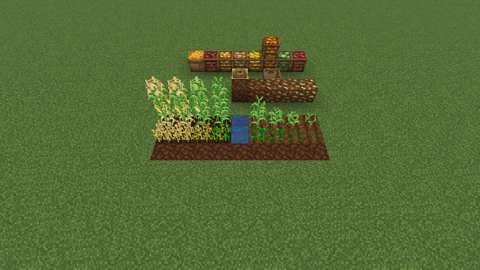
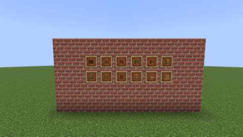

# Soil, compost and storage: rich soil, organic compost, produce crates and baskets

Status: implemented in source; **not yet played**. The Build workflow compiles it; see Verification for what has actually run.
Proposal issue: none; requested directly by the owner on 7 October 2026 ("lots more crops, plants, food, cooking devices, preparation systems ... lots and lots of the food to be very decorative and displayable"). This is slice 5 of the ten-slice plan in [branches/AGRICULTURE.md](../branches/AGRICULTURE.md#the-kitchen-and-cooking-expansion-planned). Shown the two overlaps with what Jugcraft had, the owner chose: "make the baskets be storage blocks and crates be seperate aswell".
Owner: @jimbozoomer-byte
Target milestone and tier: Milestone 3 (first homestead); Discovery tier. Every recipe uses dirt, wood, bamboo, bone meal, rotten flesh, the farm's crops and the rice slice's straw; no station is needed.
Primary specialty and supported player role: farming; supports builders (storehouses, market stalls, cellars) and traders (produce stored nine to a block)

## Player experience
Make better soil for the farm, and store what it grows:

- **Organic Compost:** dirt, four straw, two bone meal and two rotten flesh. Set it down and it rots through the owner's four stages into **Rich Soil**. Each random tick turns it a stage half the time, or every time while water touches it. A comparator reads how far it has gone.
- **Rich Soil** counts as dirt: saplings, flowers and bushes grow on it, and rice planted in water over it. **Whatever grows on it gets an extra random tick for each of the soil's own**, so it grows about twice as fast.
- **Rich Soil Farmland:** use a hoe on Rich Soil (with air above). Crops plant on it as on farmland, and it keeps moist within four blocks of water, or in the rain, as farmland does. The plant on it gets the same extra random tick. It is **never trampled**. Dry with nothing growing on it, or with a solid block set on it (a crop that keeps farmland, as Jugcraft's tall corn, does not count), it turns back into Rich Soil, not dirt; broken, it drops Rich Soil.
- **Produce crates,** in the owner's crate art: Beetroot, Cabbage, Carrot, Corn, Onion, Potato and Tomato Crates, nine of their crop each, crafted back into the nine. They stand beside the Halloween Pumpkin Crate, which is unchanged.
- **The Bag of Corn Kernels:** nine kernels in the owner's sack (the Bag of Rice's sides, with the owner's kernel bag top), turned to the player who sets it down.
- **Wooden and Bamboo Baskets,** the owner's woven baskets as storage blocks of their own (the Foraging Basket is unchanged). Use one to open its nine slots (a 3 by 3 screen). It is open at the top, so items dropped into it are taken in, a stack every few ticks. Hoppers reach it as any container, a comparator reads how full it is, and broken, it spills what it holds.

| **The garden:** Rich Soil behind, rich farmland with wheat in front and corn behind, dry on the right and moist by the water on the left; the compost heap at its four stages | **The storehouse:** the seven produce crates and the Bag of Corn Kernels, and the bamboo and wooden baskets open at the top |
| --- | --- |
|  |  |
| **From above** | **The wall:** the slice's items in item frames |
|  |  |

*In-game screenshots from CI's client game test (`SoilClientGameTests`, software rendering, small previews).*

## Connections
- Existing input producer: dirt, bone meal (skeletons, the composter), rotten flesh (zombies), straw (the rice slice: a Cutting Board cuts a panicle into two rice and a straw), planks and sticks, bamboo; the farm's crops for the crates.
- Existing output consumer: Rich Soil and its farmland serve every crop, sapling and bush, vanilla's and Jugcraft's (the corn, the paddy rice in water over Rich Soil). The crates and bags store the farm's produce for building, trading and shipping; the baskets take a farm's drops.
- Technology connection: the baskets are containers that hoppers and pipes fill and empty, and read on a comparator; the compost reads on a comparator. Every recipe is data, ready for the engineered kitchen (slice 10).
- Magic connection: none.
- Reachable entry path: dirt, bone meal and rotten flesh come from the first nights; straw from rice, which drops from grass. Wood and bamboo baskets need no station. No circular unlock: Rich Soil comes only from compost, and compost needs nothing grown on Rich Soil.
- Required vs optional: all optional, a faster farm and storage.
- How this stays useful without other branches: it speeds and stores any farm.

## Balance and automation
- **Growth.** Rich Soil and its farmland give the plant on them one extra random tick (`tools/soil.py` `BOOST`) for each of their own random ticks, only a plant (`VegetationBlock`) that ticks by itself. The extra tick is the plant's own: its light, chance and other bonuses apply as usual, so the soil about doubles its pace and never grows what would not grow.
- **The cost.** One Organic Compost (dirt, 4 straw, 2 bone meal, 2 rotten flesh) makes one Rich Soil; tilling it costs a hoe use. It takes about eight random ticks dry (about nine minutes at the default rate) and four wet.
- **Storage** packs exactly nine and unpacks exactly nine. The recipe-loop check leaves out only the unpacking recipes (`tools/agriculture.py` `UNPACKING`: the rice slice's and these); every other recipe is still followed.
- **Baskets** take in at most one item entity every 4 ticks, from inside their own block only; bounded work.
- **No loops.** `tools/check_mod_data.py` follows every agriculture recipe and fails if any leads back to where it started, storage unpacking aside.

## Multiplayer and persistence
- All changes happen on the server; the client only predicts. Tilling, opening a basket and setting blocks down are normal block uses, so vanilla's reach check and the town's protection apply. A basket only takes items already inside its own block.
- Persistence: the soil's moisture and the compost's stage are block state; a basket's nine stacks are saved in its block entity (`jugcraft:basket`). Chunk unload and restart keep them.
- Every ID is new; nothing existing is renamed or migrated. The Bag of Corn Kernels reuses the Bag of Rice's block class.
- Disabling `agriculture` removes the recipes (load conditions) but keeps the registrations, so saved blocks, items and basket contents survive.

## Dependencies and assets
No new dependency.

**The owner's own textures,** used as drawn (the owner, 7 October 2026: "I made all of the textures in there myself its all mine"). `tools/owner_art.py` copies each file byte-for-byte from `art/owner-library/originals/Blocks/farming and food textures/`, runs last in `tools/generate_textures.py`, and `tools/check_mod_data.py` fails if a runtime copy differs from its source. Imported here: 30 textures (`tools/soil.py` `TEXTURES`).

| Runtime texture (`assets/jugcraft/textures/block/`) | Library file (`farming and food textures/`) | Change |
| --- | --- | --- |
| `rich_soil`, `rich_soil_farmland`, `rich_soil_farmland_moist`, `rich_soil_farmland_moist_side` | the same names | none |
| `organic_compost_stage0`-`3` | the same names | none |
| `<crop>_crate_side`, `<crop>_crate_top` for the seven crops, `crate_bottom` | the same names | none |
| `corn_kernel_bag_top` | `corn_kernal_bag_top` | renamed (spelling) |
| `wooden_basket_{side,top,bottom}`, `bamboo_basket_{side,top,bottom}` | the same names | none |

The owner's `*_basket_handle` textures (a frame) are not used yet: the baskets' models need no handle face.

**The models** (`tools/soil_data.py`): Rich Soil and the compost stages are full blocks; the farmland is a 15-pixel slab, its moist form with the owner's moist side; each crate shows its crop on top and sides over the shared bottom; the kernel bag is the Bag of Rice's sack. A basket is a woven floor and four walls a pixel thick, open at the top with the owner's rim on the walls, the hand holes going through. They pass the art check (`tools/art_check.py`).

## Verification
CI (7 October 2026, GitHub Actions, the pins in [PLATFORM.md](../PLATFORM.md)):

| Commit | What ran | Result |
| --- | --- | --- |
| `753a4cc` | Build | **Failed to compile:** 26.3 keeps `SoundEvents.HOE_TILL` as a registry holder (`.value()` plays it) |
| `6a87df4` | Build, data audit, game tests, optional integrations absent, client game tests, repository check | All pass, vanilla wheat planting on Rich Soil Farmland among them; but the client screenshot showed the ripe corn gone: corn two blocks tall stands solid, and the farmland, asking only whether the block on it was solid, turned back into Rich Soil and broke it |
| `e15947a` | The same, with the farmland keeping a block in `minecraft:maintains_farmland` on it (as vanilla farmland keeps the corn) and a test for it | **All pass:** all 940 required game tests (`SoilGameTests` among them) and the chosen client classes (`SoilClientGameTests` among them). The screenshots above are from this commit. |

Run locally (7 October 2026):

| Check | Result |
| --- | --- |
| `python3 scripts/check_repository.py` | Pass |
| `python3 tools/check_mod_data.py`: also checks Java's numbers (`BOOST`, `WATER_REACH`, the compost's stages and chance, the basket's slots and pickup interval) against `tools/soil.py`, every block's class, item (none for the farmland), blockstate, loot and words, each crate and bag packing and unpacking nine, the tags (Rich Soil in `minecraft:dirt`, its farmland in `minecraft:supports_crops` and `minecraft:grows_crops`, the tools that mine them), that the farmland drops Rich Soil, and the owner's textures | Pass, 1692 IDs |
| `python3 tools/owner_art.py --check` | Pass |
| `python3 tools/generate_material_data.py`, then `git status` | Writes this slice's data only |
| `python3 tools/generate_textures.py` | Writes this slice's textures; it also rewrites the same 24 unrelated Styx textures as before, left as committed |
| `./gradlew build`, game tests and client game tests | Not run locally (the Fabric Maven is out of reach here); run by CI |

The 9 new game tests (`SoilGameTests`):
1. a hoe tills Rich Soil into dry Rich Soil Farmland and wears a use; covered, it stays Rich Soil;
2. vanilla wheat seeds and Jugcraft's corn kernels plant on Rich Soil Farmland;
3. random ticks of the soil alone ripen wheat on moist rich farmland and a sweet berry bush on Rich Soil;
4. water moistens the farmland; away from it, it dries a step, then turns back into Rich Soil; a block set on it presses it back too;
5. corn grown three blocks tall on it (a solid wall) leaves it farmland, as on farmland;
6. wet Organic Compost turns a stage each random tick and then is Rich Soil, reading 4 on a comparator when fresh; dry, it gets there too;
7. every crate, bag, compost and basket recipe and every unpacking loads;
8. a basket takes in five carrots dropped into it, reads on a comparator, opens a 3 by 3 screen, and spills them when broken;
9. the Bag of Corn Kernels faces the player who sets it down.

The client game test (`SoilClientGameTests`, CI job `client`) builds a bed of Rich Soil, dry and moist rich farmland growing wheat and corn, the compost at each stage, the crates, the kernel bag and both baskets, and a wall of the slice's items, and takes four screenshots.

Not done: play in a real client and a two-client dedicated-server session.

## World and event applicability
Farming and storage only: no world generation, creatures or dimensions. Nothing is seasonal.

## Rollout and open questions
- The owner's basket handle texture waits for a use (a carried basket, or a handle model if the owner wants one).
- A basket could later face sideways or downwards to pour into what it faces, as a hopper; for now it takes in only from its open top.
