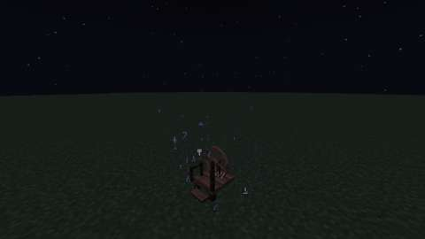
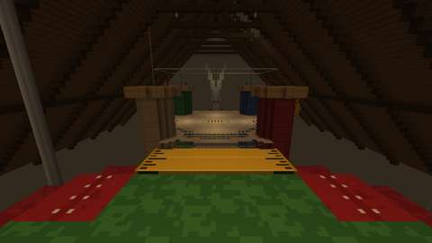
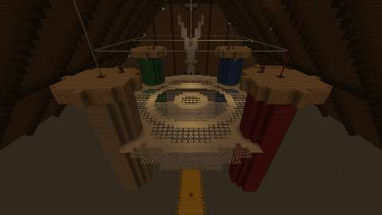
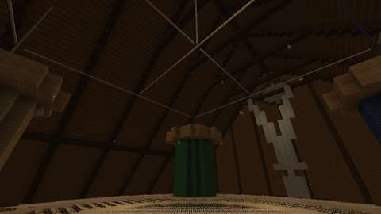
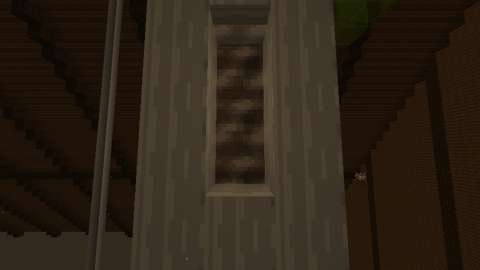
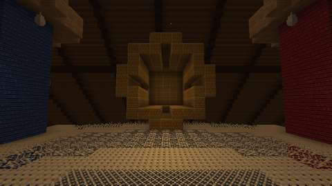
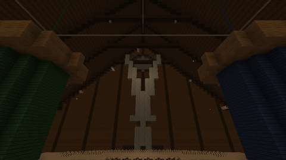
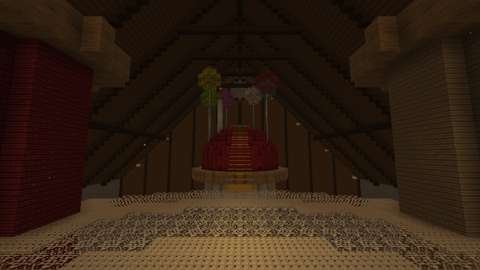

# The Spindle Loft, and the Cursed Spindle

Status: implemented in source; CI builds it and its game tests and client game test pass (below). Part 1 of boss 2 in the [Witching Season plan](witching-season.md#boss-2-madame-tatterlace-in-the-spindle-loft): the Spindle Loft, a second lair on the shared framework ([hollow-acre.md](hollow-acre.md)), and the ritual that opens it. Madame Tatterlace and her loot are part 2, in their own pull request. It has not been played by hand, and the two-client dedicated-server playtest the plan asks for is still to do.
Proposal issue: none. The owner approved the Witching Season plan on 4 October 2026, and on 10 October 2026 asked: "Do the bosses".

Target milestone and tier: Specialization tier (dungeon expeditions), as the plan sets it. The ritual takes Discovery-tier things: a Spinning Wheel, gold, an amethyst shard, spider eyes, string and a stick.
Primary specialty and supported player role: adventuring, with knitting (the wheel) feeding the ritual.

## Player experience

### A prick of the finger

1. Craft a **Cursed Spindle**: two gold ingots, an amethyst shard, two spider eyes, three string and a stick (the pattern is spider eye, string, spider eye over gold, amethyst, gold over string, stick, string).
2. At night, in the Overworld, use it on a **Spinning Wheel**, the one from knitting.
3. The wheel spins wild and its thread winds round you. You prick your finger, fall asleep and wake on the pincushion in the loft, blind for two seconds. The spindle is used up.
4. For 60 seconds (`lairs.gate_seconds`) the wheel keeps spinning, three times as fast as a treadle drives it, with glyphs swirling into it and an amethyst chime. Anyone who uses it with an empty hand follows you in, while the party has room (`lairs.party_size`). Nobody is taken in by standing near it.
5. When something is missing, the spindle says what and nothing is used up:
   - by day: "It is too early for sleep";
   - outside the Overworld;
   - out of season, when `lairs.off_season` is off and the Halloween event is not on;
   - on a wheel that is already spinning: use it with an empty hand to follow;
   - when every instance of the loft is taken.
6. Any other use of the wheel works it as ever: wool, the treadle, unravelling knitwear.

When the instance closes, the gate shuts at once. The wheel calms then if its chunk is loaded, or else as soon as its chunk is loaded again; at the latest it stops when its time is up.

### The Spindle Loft

The attic of a colossal sewing room, seen at a spider's size: 81 blocks across, 64 high and 100 long, under a steep roof of spruce on dark oak rafters. Nothing stands on a floor. The floorboards are far below in the dark, and the mist throws back anyone who falls before they reach them.

- **The pincushion:** a giant red tomato pincushion, seamed into eight segments and capped with a five-pointed green felt leaf. It sits on the top of a spool of white thread that rises out of the dark. Six pins taller than a house stand in it, each with a glass head. You wake on its leaf, facing north.
- **The way home:** beside the arrival, a needle is pushed deep into the cushion, its flat eye facing you. Grey Mist fills the eye: use it at any time, in or out of a fight, to go back to exactly where you stood.
- **The measuring tape:** a yellow tailor's tape, ticked along both edges with a red mark every fourth block. It is stretched from the cushion's top down to the doily's edge, half a block lower each block, so you walk down it (and back up it) without jumping.
- **The doily**, the arena: a circle of lace 41 blocks across. It lies between four giant thread spools, green, blue, beige and red, whose barrels pierce its rim. Its rings are lace of four patterns, from the centre out: a flower medallion, a close band, open mesh, a band, a ring of flowers, a band, mesh, and the scalloped edge of tatted rings. The dense band also rings each spool's barrel. The lace is see-through and you stand on it.
- **Beside it:** a brass thimble lies on its side across the doily's east edge, open to the arena, big enough to walk into. The open blades of a pair of shears rise out of the dark beyond its north edge, crossed at a brass pivot.
- **Overhead:**
  - each spool's own thread runs up from its axle to the roof;
  - a white square of silk joins the spools above their tops, crossed over the doily's centre and hung from the ridge;
  - a grimy skylight is set in the east slope;
  - round vents of the same glass are high in both gables.
- **The light:** hidden light blocks, brightest on the doily, dimmer up the tape and round the cushion. Dust drifts in the air.
- **The Spider's Larder hangs about it:**
  - silk cocoons under the spools' flanges and the collar ties;
  - egg sacs on the spools' barrels;
  - a silk spool stack on each spool's top;
  - cobwebs in the roof.

Everything else is the shared framework ([hollow-acre.md](hollow-acre.md#lairs-the-shared-rules)): an instance per ritual, at most eight; at most four players; nothing can be built or broken; the mist's toll at the edges; Grave Goods on death; closing after 30 seconds empty.

## Changes from the plan

- **The pincushion stands on a spool.** The plan left its footing open. A white spool rising out of the dark keeps everything in the loft hung over darkness, as the doily is.
- **The way home is the needle's eye.** The plan asked for an exit fixture at the arrival "(a gate, a spool)". Grey Mist in the eye of a needle beside the arrival reads as the way out of a dream.
- **The tape slopes.** The plan has the tape lead from the pincushion to the arena. It falls half a block a block, as plates at the bottom or the middle of their blocks, so it can be walked both ways without jumping.
- **Where the thimble and shears are:** the thimble lies across the doily's east edge, open to the arena, and the shears rise out of the dark beyond its north edge. The plan only puts them "beside it".
- **Waking blind.** You wake blind for two seconds (`tools/lairs.py` SPINDLE), as from sleep.
- **The wheel is the gate.** No gate entity is needed: the wheel is the gate while it spins, and the instance remembers where it is.
- **Lairs without a moon.** The framework now takes a lair with no moon (the loft is indoors), runs a lair's hooks as an instance closes (the wheel calms), and says a lair's own words on coming in ("You step through the mist into the Hollow Acre"; "You prick your finger, fall asleep and wake in the Spindle Loft").
- **Gossamer Silk** in the next spindle (two gold nuggets in place of one gold ingot) comes with Tatterlace's loot in part 2 ([tatterlace.md](tatterlace.md)).

## Connections

- **Inputs:**
  - the Spinning Wheel from knitting (the altar);
  - gold and an amethyst shard;
  - spider eyes and string, from spiders;
  - a stick.
- **Outputs:** the way into the Spindle Loft, where Madame Tatterlace waits (part 2, [tatterlace.md](tatterlace.md)).
- **The furnishings:** the loft is furnished from Jugcraft's own Spider's Larder (batch 19): silk cocoons, egg sac clusters and silk spool stacks.

## Balance and automation

- **The ritual's cost:** every opening uses up a Cursed Spindle. The wheel stays. There is no cooldown: the spindle is the limit, as the plan sets it.
- **No loop:** nothing comes out of the loft in part 1. Its lair-only blocks drop nothing and have no items.
- **No automation:** only a player's own use of the spindle opens the loft, and only a player's own use of the wheel takes them in. A redstone pulse still only works the treadle.

## Multiplayer and persistence

- **Server authority:** the server decides everything. Clients only send the use: the rite, the gate, the refusals and the entry all happen on the server.
- **What is saved:**
  - the wheel's wild spin is told to clients but never saved, since a restart shuts the gate with the instance;
  - the instance remembers its wheel only while the server runs;
  - a player's visit and Grave Goods are saved with the player, as for every lair.
- **Chunks:** no chunk is force-loaded. The gate's glyphs and chime show only where the wheel's chunk is loaded, at most once a fifth of a second for each open instance (at most `lairs.instances`). A wheel whose loft closed while its chunk was unloaded is remembered until its chunk is loaded or its time is up, at most 32 wheels at once, and checked as often.
- **Griefing:** nobody is pulled in. A second spindle on a spinning wheel is refused and kept. Nothing in the loft can be changed.
- **Still to do:** the two-client dedicated-server playtest.

## Dependencies and assets

No new dependency. Everything is drawn by code:
- the loft is laid out by `tools/spindle_loft.py`, on `tools/lair_layout.py`, which it now shares with `tools/hollow_acre.py`. The Hollow Acre's template is unchanged byte for byte. The loft's template has 20,016 blocks: unseen blocks inside the spools and the cushion are left out;
- its twelve lair-only blocks' textures are painted by `tools/spindle_loft_textures.py`, in the manner of the vanilla blocks (`tools/block_style.py`): the lace patterns are cut out, and the skylight is see-through;
- the Cursed Spindle's icon is a 16×16 map, `tools/item_icons/cursed_spindle.txt`, drawn by [ITEM_ICONS.md](../ITEM_ICONS.md) and checked by `tools/check_icon_maps.py`;
- the dimension files are written by `tools/lair_data.py` from each lair's line in `tools/lairs.py`.

No Mojang texture is read, traced or copied.

New IDs (all under `jugcraft`):
- the dimension, dimension type and biome `spindle_loft`;
- the structure `lair/spindle_loft`;
- the lair-only blocks `doily_lace`, `spool_wood`, `spool_thread`, `pincushion`, `pincushion_seam`, `pincushion_leaf`, `needle_steel`, `pin_shaft`, `measuring_tape`, `thimble_metal`, `taut_thread` and `grimy_skylight`;
- the item `cursed_spindle`.

Nothing is renamed but one language key: `message.jugcraft.lair.enter` became one key for each lair.

## Verification

*The client game test's pictures (CI, commit `7047a5c`): the wheel spinning wild at midnight, then in the loft the arrival, the doily from above, a spool and its threads, the needle's eye, the thimble, the shears and the cushion. The test client renders at 480x270.*

CI (10 October 2026, GitHub Actions, the pins in [PLATFORM.md](../PLATFORM.md)):

| Commit | What ran | Result |
| --- | --- | --- |
| `a81da12` | Build, data audit, game tests, client game tests | **Did not compile:** 26.3's `BlockBehaviour.Properties.isViewBlocking` takes no lambda of that form |
| `478a022` | The same, without that override (the see-through blocks need none) | The mod compiled; **the game tests did not:** 26.3 has no `Items.WHITE_WOOL` |
| `6be442d` | The same, looking white wool up by its ID | All 1182 required game tests pass. **`SpindleLoftClientGameTests` failed at its last step:** the wheel still spun wild after the loft closed. Its chunk had unloaded while the player was inside, so the close hook passed it by |
| `7047a5c` | Such a wheel calms once its chunk is loaded again; the test waits for that | **All pass:** all 1182 required game tests and `SpindleLoftClientGameTests`. The pictures above are from this commit |

Run locally:

| Check | Result |
| --- | --- |
| `python3 scripts/check_repository.py` | Pass |
| `python3 tools/check_mod_data.py`: now also checks `Lair.SPINDLE_LOFT` against `tools/spindle_loft.py` (size, arrival, centre, bounds, floor, no moon), `SpindleRite.WAKING_TICKS`, the lace patterns and thread colours against `tools/lairs.py`, the Cursed Spindle's registration, and each lair's words for coming in. Four deliberate changes to the Java, one at a time, each failed it | Pass, 1889 IDs |
| `python3 tools/check_icon_maps.py tools/item_icons/cursed_spindle.txt` | Pass |
| `python3 tools/generate_material_data.py` and `tools/generate_textures.py`, then `git status` | Write this part's data and textures only |
| `./gradlew build`, game tests and client game tests | Not run locally (the Fabric Maven is out of reach here); run by CI |

The game tests (`SpindleLoftGameTests`) show what a game-test server can:
1. the loft's dimension type and biome load from their files;
2. its template loads in the running game, at the size `Lair.SPINDLE_LOFT` gives, with all twelve of its own blocks and the Grey Mist, and the game's data version;
3. the spindle's checks: not by day, but at night; a wheel nobody used is no gate;
4. the rite done in full when no instance can open: the loft is full, the spindle is kept, nobody moves or sleeps, and the wheel does not spin wild;
5. a wheel that is no gate is the wheel it was: an empty hand and wool are its own;
6. a wild wheel spins three times as fast for its time, then turns on from where it stopped, and a second spell never turns it back.

The client game test (`SpindleLoftClientGameTests`, CI job `client`) runs the ritual from end to end in a real world, with its one player in survival:
1. the spindle used on the wheel at midnight opens an instance in the loft's own dimension. It places the loft (the leaf under the arrival, the needle's eye, the doily, a spool, the tape), uses up the spindle, makes the wheel the gate, spinning wild, and wakes the player on the pincushion, blind and unable to build;
2. the needle's eye can be used, and a block cannot be placed on the doily; falling through the doily throws the player back to the pincushion for the mist's toll;
3. leaving takes the player back to where they stood. A second spindle on the spinning wheel is refused and kept, and an empty hand on the wheel takes the player back into the same loft;
4. when the instance closes, the player goes home and the gate shuts at once. The wheel calms within a second, though its chunk may have unloaded while the player was away, and an empty hand works it again.

Then it takes eight pictures: the wheel spinning wild at midnight, and in the loft the view from the pincushion, the doily from above, the spools and threads, the needle's eye, the thimble, the shears and the cushion from the doily.

Not run: the two-client dedicated-server playtest the plan asks for, and play by hand.

## World and event applicability

The Spindle Loft is its own dimension, so nothing here changes the Overworld. The wheel only spins for a while, and the spindle is used up. The rite works on any night by default (`lairs.off_season`). Ending the Halloween event never removes a lair, a player inside one or anything earned.

## Rollout and open questions

The plan's open questions keep their defaults:
- the rite all year at night;
- Grave Goods on death;
- four players and eight instances.

Part 2, Madame Tatterlace ([tatterlace.md](tatterlace.md)), adds the fight on the doily (her unravelling floor uses the lace and the safe ring round each spool), her loot, and Gossamer Silk in the spindle.
