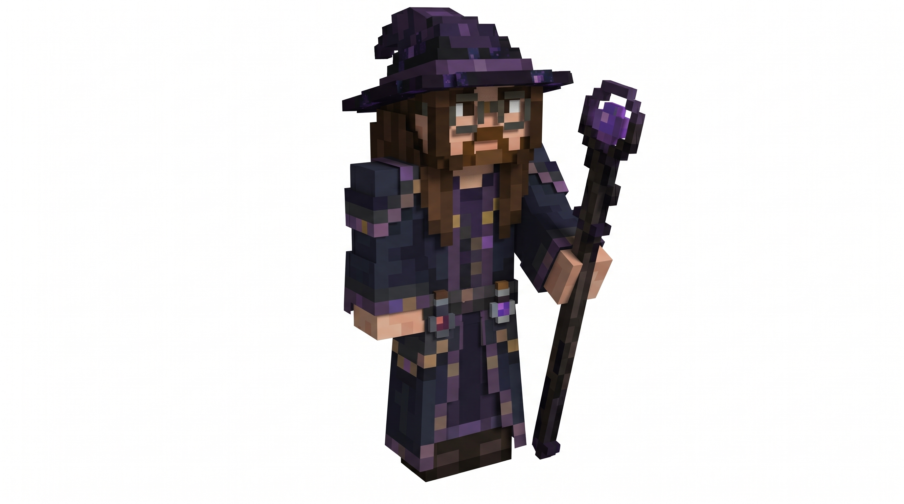

# Styxhexenhammer and the Nightglass Conservatory

Status: **design proposal; no gameplay implementation in this PR**.
Proposal: owner request of 5 October 2026, with the character image below.
Owner: @jimbozoomer-byte.
Tier: Discovery, with later optional connections to magical and technological agriculture.
Role: a resident dark wizard, herbalist, and keeper of an unusual living flower collection.

## The concept

Styxhexenhammer lives in the **Nightglass Conservatory**, a wizard tower joined directly to a greenhouse. He studies the stars, cultivates unfamiliar flowers, and practices magic in devotion to **Stolas of the Ars Goetia**. He is reserved, observant, and dryly humorous, but welcoming to curious gardeners. His workbench is meticulous; the plants have gradually taken over the rest of the house.

The player follows a warm light through the trees, finds violet flowers under greenhouse glass, and meets their keeper. They can talk to him, learn the names of his collection, take a starter cutting, and grow a matching garden at home. Seeing him tend, study, and return to the tower makes the place feel lived in.

This is a fictional Jugcraft character based on the supplied visual reference. His dialogue and biography belong to this game character.

The historical inspiration is Stolas's association with astronomy, herbs, and precious stones in entry 36 of [The Lesser Key of Solomon](https://www.gutenberg.org/cache/epub/72679/pg72679-images.html). Use original star charts, raven motifs, mineral specimens, and an in-world devotional shrine. The source describes a raven form; no unrelated contemporary adaptation supplies the character design.

## Visual specification: the reference is the acceptance target

The owner's direction is **"Make sure he looks JUST LIKE THIS IMAGE."** Preserve the visible silhouette, face, clothing, palette, accessories, and proportions. Implementation needs a dedicated model and texture; a stock NPC skin alone cannot reproduce the projecting parts.

| Part | Required appearance |
| --- | --- |
| Hat | Oversized, uneven broad brim; tall tapering crown bent over at the tip; nearly black aubergine with several stepped purple bands and lighter violet patches. Preserve the asymmetry. |
| Face | Warm light skin, pale eyes, thick rectangular charcoal glasses, brown eyebrows, a modest projecting nose, brown moustache and short beard around mouth and chin. Keep the glasses readable without covering the eyes. |
| Hair | Long medium/dark brown hair, with layered side and back volume and two uneven locks hanging down the chest. Model the visible stepped outline. |
| Upper robe | Deep blue-charcoal shoulders and sleeves; raised shoulder pieces; muted violet cuffs and edging; purple center panel with sparse antique-gold accents. |
| Lower robe | Ankle-length dark layered robe, with a long violet-trimmed opening and small gold patches; dark brown boots visible beneath it. Split the model for walking while preserving the standing silhouette. |
| Belt | Dark belt with visible fittings and two hanging glass vials, one muted red and one violet, in chunky dark/silver holders. These are permanent visual accessories initially. |
| Staff | Long dark brown/black shaft, irregular violet bindings, and an open angular dark-purple frame enclosing a faceted violet crystal. Held on the image's right, in the character's left hand. Preserve the open gap around the crystal. |
| Finish | Crisp Minecraft-scale steps and deliberate color patches. Subtle violet crystal emission; enough daylight contrast to see the navy robe and brown hair. |

Model the hat, glasses, locks, beard relief, shoulder pieces, belt vials, and staff with real depth. A custom humanoid model should retain head tracking and restrained walking/arm animation. Keep the reference outfit throughout his routine and across seasons. Do not equip automatic town Halloween headgear on this NPC.

The image shows one three-quarter view. Match that view first; unseen rear details are an extension of the visible design and must be labeled as interpretation during review. In-game lighting will vary. **Do not claim an exact match without rendered comparison images.**

Visual acceptance requires a matching three-quarter screenshot beside the reference, plus front, profile, back, daylight, nighttime, and walking views. Inspect glasses, hair separation, robe clipping, vial placement, and staff grip at both conversation distance and normal gameplay distance. The owner's visual review remains an explicit release criterion.

## His home

The Nightglass Conservatory is one connected, fully walkable building. Proposed footprint: about **27 x 21 blocks**, with a **9 x 9 tower about 25 blocks tall** and an attached **15 x 11 greenhouse**. Final dimensions may change to keep stairs, doors, and NPC paths usable.

| Space | Contents and purpose |
| --- | --- |
| Entrance and ground-floor study | Sheltered porch, coat hooks, sitting corner, herb notebook, specimen drawers, and a clear route into the greenhouse. The first meeting happens here. |
| Greenhouse | Pitched clear/violet-glass roof, dark timber framing with copper details, eight labeled flower beds, potting bench, water trough, and hanging baskets. Leave a two-block walking aisle and unobstructed headroom. |
| Tower middle floor | Library, drying racks, jars, mineral collection, writing desk, bed alcove, and a small shrine devoted to Stolas. |
| Tower top | Roof observatory with a star chart, a modest telescope-like decorative instrument, and space for his evening ritual. A lit stair connects every floor. |
| Exterior garden | Low stone wall, mossy steps, climbing plants, a small compost corner, a bench, and a rain barrel. |

Use dark stone, warm timber, copper, purple glass, and amber lamps. Greenhouse beds should show green leaves and distinct flower colors rather than become a uniform purple mass. Reuse Jugcraft's existing graveyard foliage and implemented workshop props when suitable; do not make a second registry entry for an existing prop. Keep the structure independent of still-open decoration or framework PRs.

Provide the full building as a reusable, inspectable structure asset. Stage placement in bounded work units, safely handle unloaded neighboring chunks, and use the pumpkin placement fix already on main. Avoid placing decorative blocks with unintended gameplay side effects.

## Flowers: first collection

These are new fantasy cultivars. The initial scope is living decoration: placement, growth, harvesting/replanting, inventory names, and small potted forms where the shape permits. **No potion effects, processing recipes, spell costs, or stat bonuses are assigned yet.**

| Name / stable proposed ID | Shape and palette | Height |
| --- | --- | --- |
| Stolas Starflower / `stolas_starflower` | Five-pointed ivory petals around a violet center, on slender dark stems; several blooms face slightly different directions. | Small |
| Witchglass Orchid / `witchglass_orchid` | Angular translucent-looking lavender petals around a dark throat, broad blue-green leaves and exposed curled roots. | Small |
| Ravenquill Lupine / `ravenquill_lupine` | A tall, tapered spike of near-black indigo florets with silver tips, above a fan of leaves. | Two blocks |
| Amethyst Mourningbell / `amethyst_mourningbell` | Three arching stems bearing faceted violet bells, with desaturated silver-green leaves. | Small |
| Eclipse Camellia / `eclipse_camellia` | Rounded dark burgundy flowers with tightly layered petals and a pale gold center, on a compact glossy-leaved shrub. | Small |
| Astral Verbena / `astral_verbena` | Airy branching stems carrying loose clusters of tiny pale blue stars; a light, open silhouette. | Small |
| Inkvein Helleborine / `inkvein_helleborine` | Cream-green cup flowers streaked with ink-purple veins and broad pointed leaves. | Small |
| Violet Lanternbloom / `violet_lanternbloom` | Hanging plum-colored husks surrounding warm violet centers; fine stems and small heart-shaped leaves. | Small |

Use existing sculpted-flora tooling for the plants. Keep silhouettes recognizable in a mixed bed; do not recolor one mesh eight times. Any luminous detail is initially an appearance choice, not a gameplay effect or ingredient promise.

Proposed cultivation uses one block/item identity per cultivar with a small growth state, preserving that identity for future uses. A planted cutting matures under ordinary gardening conditions; harvesting returns the plant for replanting. Controlled propagation can produce one extra cutting from a mature plant using existing bone meal behavior. No extra seed, essence, or currency registry is needed for this first collection.

The greenhouse keeps a permanent display of each cultivar. The visitor obtains a starter collection through a server-recorded, once-per-player interaction with Styxhexenhammer. Player gardens supply later cuttings, allowing solo propagation and player-to-player trade without repeatedly stripping the landmark. No shop buys these flowers for Jugs in the first slice, so free cuttings cannot create a credit loop.

## Character routine and interaction

- **Morning:** visits greenhouse work spots, checks the beds, and performs a short tending animation.
- **Afternoon:** alternates between his potting bench and library; occasionally inspects a vial or notebook.
- **Evening:** climbs to the observatory, raises the staff, and performs a restrained violet-particle ritual near the Stolas shrine/star chart.
- **Night:** returns to the tower interior. Routine movement stops when his chunks are unloaded.
- **Visitors:** looks toward the speaker and offers short, original dialogue. Interactions can explain his flowers and offer the starter collection. All dialogue must remain usable by multiple players.

Example lines:

> "Stolas teaches the stars. The greenhouse teaches patience. I find I need more of the second."

> "The orchids are thriving. Their names are proving more troublesome."

> "Take a cutting. Bring back a garden."

His first magic is atmospheric: staff glow, a brief ritual, and a small hovering mote over a specimen. Do not introduce a new spell resource system for these effects. Gardening animations do not create valuable drops or harvest nearby player farms. He is a persistent, friendly landmark resident using the town's established NPC survivability policy; a future combat/quest design can expand his abilities separately.

## Placement and persistence

Propose **one named resident and one conservatory per Overworld**, identified by saved home position and resident UUID. Avoid random duplicate Styxhexenhammers in repeated structures.

- New-world placement seeks dry, gentle ground in temperate woodland or a meadow edge, initially targeting roughly 800-1,600 blocks from world spawn. This is a discovery destination; the spawn town remains the first landmark.
- Use a fixed candidate budget and clear fallback: if no suitable location is found, keep the world playable and offer operator placement. Never search indefinitely or generate a broad area just to choose a site.
- Keep a separation margin from the town, spawn village, protected builds, and other landmark footprints. Do not flatten mountains or build underwater merely to satisfy distance.
- Existing saves receive the content through explicit operator placement in a reviewed empty area, avoiding automatic overwrites of established builds. A prototype placement command must preview its footprint and reject protected/occupied sites.
- Natural location selection should follow after the command-placed building, NPC, and persistence have passed testing. The first draft implementation may expose only the explicit placement path, clearly labeled.
- Persist versioned home data, resident UUID, routine destination, and each player's starter-collection claim. Resume a routine safely after reload.
- Never infer that a resident is missing solely because its chunk is unloaded. Replacement rules must avoid duplicate entities and preserve identity/claims.
- Feature disable stops new generation/acquisition; existing NPC, plants, items, and building registrations remain valid. Earned flowers and placed structures persist through every season.

## Connections, balance, and bounded work

**Initial inputs:** exploration, garden soil, ordinary light/water arrangements where existing plant rules require them, and bone meal for propagation. **Initial outputs:** named decorative plants for player gardens, greenhouse builds, and player trade. This supports agriculture and cozy building immediately, without requiring a machine or a magic school.

**Later optional connections:** technological greenhouse control, soil measurement, automated collection, spell ingredients, botanical research, mineral-attuned cultivation, and other magical workshops. These are extension directions only. Keep the flower IDs stable and reserve shared tags such as `jugcraft:styx_flowers`; later contributors must use existing energy, fluid, material, and spell conventions rather than duplicate frameworks.

The collection is not a prerequisite for core advancement. No seasonal-only acquisition, boss requirement, new ore, new currency, or new dimension is introduced here. Real-world medicinal effects are outside this fictional plant design.

Use server-owned interaction checks for distance, player identity, claim state, and inventory capacity. Grant the starter collection transactionally; a full inventory must not consume the claim or discard flowers. Bound particle output, target searches, and path recalculation. One loaded NPC and a fixed list of home work spots should replace any scanning of every plant or player each tick. No forced chunk loading.

## Implementation plan

1. **Appearance prototype:** custom entity/model, deterministic original texture source, reference comparison screenshots, persistent name and restrained idle/walk animation. Review likeness before expanding behavior.
2. **Conservatory and collection:** reusable building asset, eight distinct plant models, garden blocks/items, growth and replanting, Creative access, and safe operator placement with the NPC at home.
3. **Resident behavior:** bounded daily routine, atmospheric magic, original dialogue, and safe per-player starter collection, with saved state and unload/reload tests.
4. **World discovery:** bounded location selection, overlap checks, one-home persistence, new-world tests, and existing-save opt-in placement. Record any deferred stage accurately in the implementation PR.

Use the Minecraft/Fabric/Java versions actually pinned on main at implementation time. No version bump or new runtime dependency is needed for this proposal. Reuse entity/rendering patterns from `Townsfolk` and its client model while keeping Styxhexenhammer's special model and behavior in a dedicated package; do not alter every town resident to add his appearance. Consult `TownPlanner`/`TownBuilder` for bounded landmark placement and the existing flora generators for plants.

## Assets and provenance

- The owner supplied [the character reference](../images/styxhexenhammer-reference.jpg) in this request and explicitly asked for the model to match it. The unmodified uploaded JPEG is included as a design reference, not an in-game texture. See [its provenance note](../images/styxhexenhammer-reference.md).
- Implementation creates original editable geometry and generated textures according to this approved reference direction. Record generators, palettes, and any artist-created source files alongside the final assets.
- The Stolas background reference is the public-domain grimoire linked above. The proposed building, flower designs, names, dialogue, animations, and gameplay behavior are Jugcraft design work.
- Actual assistance for this proposal: Codex. No claim that Claude Opus produced or reviewed it.

## Verification and acceptance

This PR has **no playable NPC, model, flowers, or structure yet**. The checklist below describes tests required for implementation, not completed results.

- **Visual:** compare the model to the supplied image at the same angle; capture front/side/back, day/night, walking, talking, and staff-raising views; fix clipping and z-fighting. Obtain owner review of likeness.
- **Data/build:** repository links, generated-resource reproducibility, registry/data audit, pinned-platform build, and dedicated-server startup with no client-only class loading.
- **Gardening:** all eight cultivars survive save/reload; growth and propagation preserve item accounting; tall-plant halves break correctly; potting works where supported; automation does not bypass server validation.
- **NPC/home:** one resident after repeated load/unload/restart; valid paths through stairs and greenhouse aisles; sensible fallback when a work spot is obstructed; no chunk loading caused by routine behavior.
- **Placement:** each supported rotation, sloped ground, wet/invalid candidates, rejected overlap, existing-world opt-in, placement interruption/restart, and decorative blocks at unloaded chunk edges.
- **Two-player server:** simultaneous conversations and starter claims; full inventories; reconnect during a grant; independent eligibility; no duplicate grants or dropped inventories.
- **Performance:** measured tick and render behavior with a loaded greenhouse, bounded particle counts, and no work while unloaded. Report actual numbers only after measurement.
- **Season/upgrade:** year-round plants and resident; no lost items/builds after season change, config disable, or restart; stable IDs and saved-data schema.

Open design choices for later review: exact flower growth timings, final structure measurements, dialogue presentation, discovery hints, and any future flower recipes. Those do not block the appearance prototype. Visual fidelity to the attached character remains the highest-priority art requirement.
