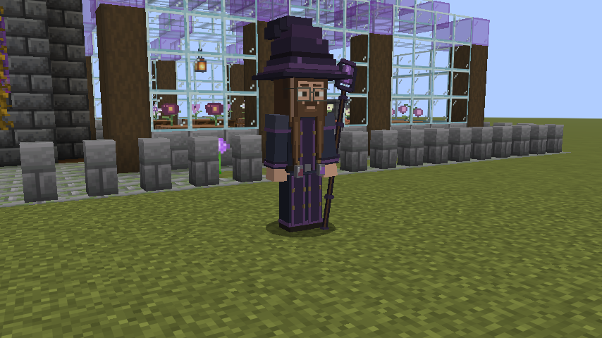
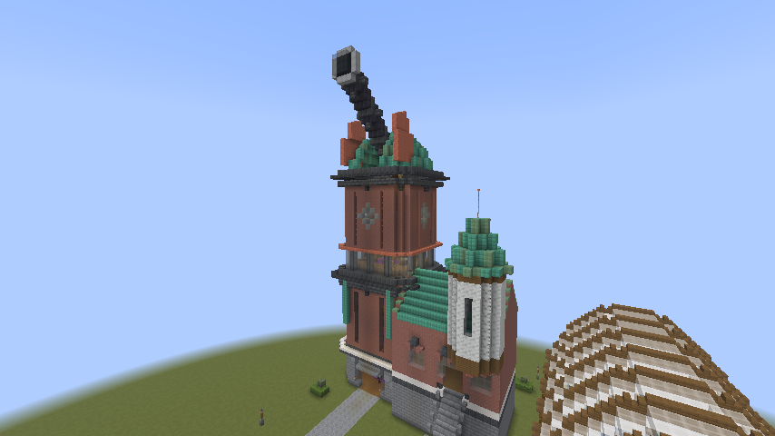
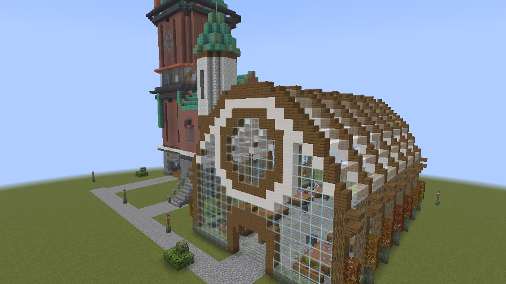
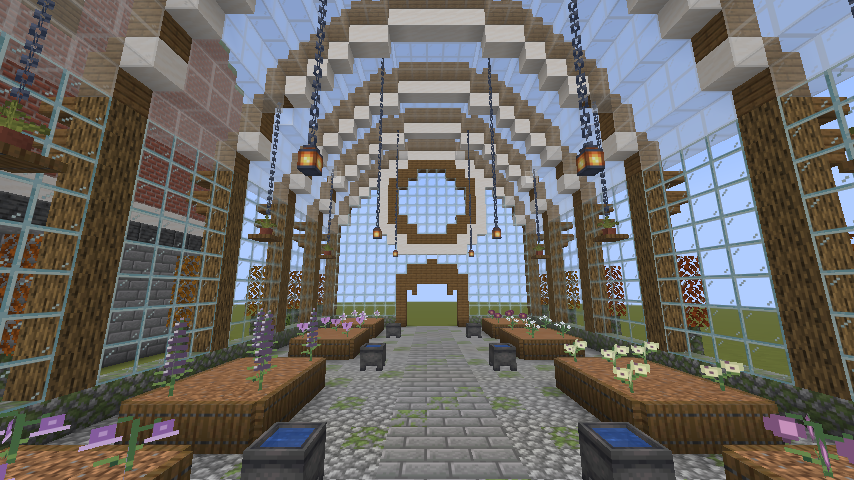
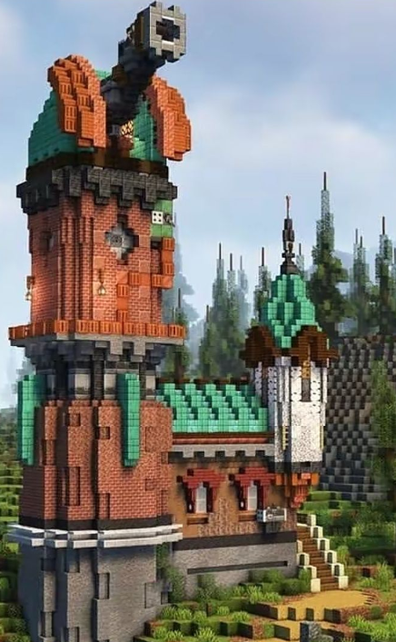
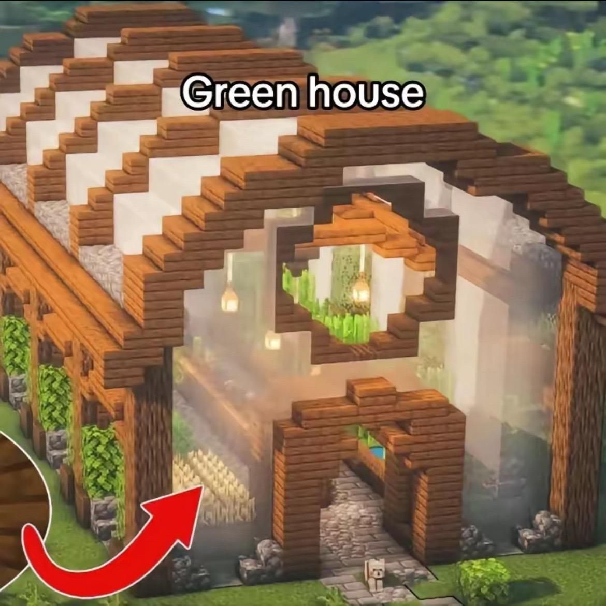

# Styxhexenhammer and the Nightglass Observatory

Status: **playable operator-placed prototype; owner visual review pending**.
Proposal: owner request of 5 October 2026, with the character image below.
Owner: @jimbozoomer-byte.
Tier: Discovery, with later optional connections to magical and technological agriculture.
Role: a resident dark wizard, herbalist, and keeper of an unusual living flower collection.

## Try this prototype

Use Minecraft 26.3, Fabric Loader 0.19.3 and Fabric API 0.161.0+26.3, with this branch's built Jugcraft JAR. No added runtime dependency. Start with a backed-up test world.

1. With operator permissions, stand at the center of a clear, level **67 x 49** grass/dirt area with **63 blocks** of headroom. The building faces south. Only the Overworld is supported.
2. Run `/jugcraft styx preview`. This prints the footprint corners and checks the loaded area for obstacles, block entities and the protected town. It does not clear terrain.
3. Within 60 seconds run `/jugcraft styx place`. It rechecks the site, places at most 128 blueprint entries per tick, and creates Styxhexenhammer when complete. `/jugcraft styx` reports the saved location and progress.
4. Speak to him with **eight empty main-inventory slots** to receive one of each flower. Each player can claim once per world. A full inventory leaves the claim available.
5. Plant the cuttings on ordinary plantable soil. Seven small flowers have three growth stages; sufficient light allows random growth, and bone meal advances a stage or propagates a mature plant. Ravenquill Lupine uses vanilla tall-flower placement and bone-meal propagation. Seven small cultivars can be potted. All eight are also in the Natural Blocks Creative tab.

The prototype includes a dedicated cuboid character model, original palette texture, eight vanilla-style flower sprites, original dialogue and a four-phase daily routine. The current **67 x 63 x 49 (width, height, depth)** layout reconstructs the two buildings supplied by the owner on 6 October: a tall brick observatory with a projecting telescope and a separate timber-and-glass greenhouse. Styx starts inside the ground-floor study, walks to the greenhouse and library, and climbs five stair flights to his evening observing spot.

These are reconstructions from screenshots, not schematic imports. The visible architecture follows the owner's references; unseen rooms, rear elevations, stairs and the shared garden are adaptations. The reference images use different lighting from the unmodified client screenshots. See [building reference provenance](../images/styx-buildings-reference.md).

Placement is limited to one conservatory per world and only works in loaded chunks. A saved cursor resumes interrupted construction. A new obstruction pauses construction rather than replacing it; remove that obstruction and keep the home loaded to continue. There is no automatic terrain clearing, rotation, relocation, reset, or natural discovery yet. The building and flower beds use normal breakable blocks, without new land-claim protection. Routine destinations derive from the saved home and world time, and can stall if players obstruct routes. The persistent resident is protected from ordinary damage; operator `/kill` can still remove him, and there is intentionally no automatic replacement from a missing/unloaded entity lookup.

**Existing prototype worlds:** original layout 1 (27 x 28 x 21) and the previous copper observatory layout 2 (49 x 35 x 39) retain their exact block states, construction order and resident destinations. Saves without a layout field load as layout 1; new placements use layout 3. Completed homes are not overwritten, and interrupted builds use their original blueprint. Use a fresh test world for the owner-reference buildings; there is no in-place rebuild command.

**Future work:** natural woodland discovery, gardening gestures, interactive astronomy, feature-disable controls, replacement/recovery tools, flower recipes and magic. The telescope and dome are architectural decoration in this version. Stolas and all 72 Ars Goetia spirits' summoning and pacts are tracked in the [roadmap TODO](../ROADMAP.md#owner-requested-todo-ars-goetia-summoning-and-pacts); they are not active mechanics in this prototype.

## The concept

Styxhexenhammer lives in the **Nightglass Observatory and Conservatory**, an astronomical observatory and greenhouse connected by a garden path. He studies the stars, cultivates unfamiliar flowers, and practices magic in devotion to **Stolas of the Ars Goetia**. He is reserved, observant, and dryly humorous, but welcoming to curious gardeners. His workbench is meticulous; the plants have gradually taken over the rest of the house.

The player follows a warm light through the trees, finds violet flowers under greenhouse glass, and meets their keeper. They can talk to him, learn the names of his collection, take a starter cutting, and grow a matching garden at home. Seeing him tend, study, and return to the tower makes the place feel lived in.

This is a fictional Jugcraft character based on the supplied visual reference. His dialogue and biography belong to this game character.

The historical inspiration is Stolas's association with astronomy, herbs, and precious stones in entry 36 of [The Lesser Key of Solomon](https://www.gutenberg.org/cache/epub/72679/pg72679-images.html). Use original star charts, raven motifs, mineral specimens, and an in-world devotional shrine. The source describes a raven form; no unrelated contemporary adaptation supplies the character design.

## Visual specification: the reference is the acceptance target

The owner's direction is **"Make sure he looks JUST LIKE THIS IMAGE."** Preserve the visible silhouette, face, clothing, palette, accessories, and proportions. Implementation needs a dedicated model and texture; a stock NPC skin alone cannot reproduce the projecting parts.

| Part | Required appearance |
| --- | --- |
| Hat | Oversized, uneven broad brim; tall tapering crown bent over at the tip; nearly black aubergine with several stepped purple bands and lighter violet patches. Preserve the asymmetry. |
| Face | Standard player-sized head with a flat pixel-art face texture. Short eyes at the usual Minecraft proportions; brown brows, moustache and beard painted into the skin. Thin charcoal glasses project slightly from the face with open lenses and side arms. No projecting eyes, nose or mouth. The hat brim sits directly into the hairline. This follows the owner's latest reference correction. |
| Hair | Long medium/dark brown hair, with layered side and back volume and two uneven locks hanging down the chest. Model the visible stepped outline. |
| Upper robe | Deep blue-charcoal shoulders and sleeves; raised shoulder pieces; muted violet cuffs and edging; purple center panel with sparse antique-gold accents. |
| Lower robe | Ankle-length dark layered robe, with a long violet-trimmed opening and small gold patches; dark brown boots visible beneath it. Split the model for walking while preserving the standing silhouette. |
| Belt | Dark belt with visible fittings and two hanging glass vials, one muted red and one violet, in chunky dark/silver holders. These are permanent visual accessories initially. |
| Staff | Long dark brown/black shaft, irregular violet bindings, and an open angular dark-purple frame enclosing a faceted violet crystal. Held on the image's right, in the character's left hand. Preserve the open gap around the crystal. |
| Finish | Crisp Minecraft-scale steps and deliberate color patches. Subtle violet crystal emission; enough daylight contrast to see the navy robe and brown hair. |

Model the hat, hair locks, shoulder pieces, belt vials, and staff with real depth. Keep eyes, nose, mouth and beard on the flat player-style skin; the thin glasses are separate geometry. A custom humanoid model should retain head tracking and restrained walking/arm animation. Keep the reference outfit throughout his routine and across seasons. Do not equip automatic town Halloween headgear on this NPC.

The image shows one three-quarter view. Match that view first; unseen rear details are an extension of the visible design and must be labeled as interpretation during review. In-game lighting will vary. **Do not claim an exact match without rendered comparison images.**

Visual acceptance requires a matching three-quarter screenshot beside the reference, plus front, profile, back, daylight, nighttime, and walking views. Inspect glasses, hair separation, robe clipping, vial placement, and staff grip at both conversation distance and normal gameplay distance. The owner's visual review remains an explicit release criterion.

### In-game prototype, 5-6 October 2026

The cuboid model follows the reference's bent purple hat, glasses, long brown hair, dark robe, belt vials and left-hand crystal staff. These are real screenshots from the isolated client test. They are review evidence, not a claim of exact likeness. The face was revised to a flat player-style skin with short eyes, thin separate glasses and a properly seated hat after owner feedback; the flowers were revised to vanilla crossed pixel sprites. Exact likeness still requires the owner's review. The character comparison views retain an earlier building in their background; the character model is unchanged by the owner-reference building revision.

[Face and glasses close-up](../images/styxhexenhammer-face-closeup.png) · [Front](../images/styxhexenhammer-front.png) · [Profile](../images/styxhexenhammer-profile.png) · [Back, interpreted from the reference](../images/styxhexenhammer-back.png) · [Night](../images/styxhexenhammer-night.png)

[Brick observatory and turret](../images/styx-observatory-dome.png) · [Projecting telescope](../images/styx-observatory-telescope.png) · [Library](../images/styx-observatory-library.png) · [Greenhouse facade](../images/styx-greenhouse-facade.png) · [Flower beds](../images/styx-greenhouse-flowers.png) · [Observatory at night](../images/styx-observatory-night.png) · [Styx inside his study](../images/styx-at-home.png)

## His home

The owner replaced the earlier architectural design with these two references:

The implemented site is **67 x 49 blocks**, with **63 blocks of reserved height**. Both entrances face south. A low garden path connects the observatory and greenhouse.

| Space | Implemented architecture and use |
| --- | --- |
| Observatory exterior | Tall octagonal red-brick shaft on a gray foundation; pale foundation belt, narrow recessed windows, projecting dark cornices, copper downpipes and a glazed middle band. Diamond-framed windows decorate the upper brick drum. |
| Dome and instrument | Green aged-copper dome with a south-facing opening and orange copper shutters. A large dark telescope rises diagonally through the opening, ending in a pale lens rim visible from the ground. The instrument and shutters are decorative. |
| Tower interiors | Ground-floor receiving study; library with a small Stolas shrine; sleeping room and upper study rooms. Five alternating, two-wide stair flights reach the observing chamber at floor +40. Furniture stays clear of the routes. |
| Side hall and turret | Brick annex with an aged-copper pitched roof, framed windows and an external staircase. A contrasting birch/calcite turret sits on corbels and carries a pointed copper cap and thin finial. |
| Greenhouse | Warm timber columns and repeated stepped roof ribs, white bands, glass bays, circular timber gable windows and shaped entrances. Leafy stone-footed supports run along the exterior. |
| Greenhouse interior | Eight bordered flower beds, five specimens of each cultivar, clear central and side aisles, suspended lamps and baskets, water cauldrons, seed barrels and potting supplies. |
| Connecting grounds | Low stone paths, small hedges and lantern posts leave the two reference silhouettes visible. |

All architectural blocks are vanilla blocks. The second reference's title and arrow are excluded. No shader, custom architecture texture or third-party building asset is required. Shared flower IDs, inventory gifts and plant behavior are unchanged.

Provide the full building as a reusable, inspectable structure asset. Stage placement in bounded work units and safely handle unloaded neighboring chunks. Frozen legacy assets must retain their construction order so existing saved placement cursors remain valid.

## Flowers: first collection

These are new fantasy cultivars. The initial scope is living decoration: placement, growth, harvesting/replanting, inventory names, and small potted forms where the shape permits. **No potion effects, processing recipes, spell costs, or stat bonuses are assigned yet.**

| Name / stable proposed ID | Shape and palette | Height |
| --- | --- | --- |
| Stolas Starflower / `stolas_starflower` | Five-pointed ivory petals around a violet center, on slender dark stems; several blooms face slightly different directions. | Small |
| Witchglass Orchid / `witchglass_orchid` | Angular translucent-looking lavender petals around a dark throat, broad blue-green leaves and exposed curled roots. | Small |
| Ravenquill Lupine / `ravenquill_lupine` | A tall, tapered spike of near-black indigo florets with silver tips, above a fan of leaves. | Two blocks |
| Amethyst Mourningbell / `amethyst_mourningbell` | Three arching stems bearing faceted violet bells, with desaturated silver-green leaves. | Small |
| Eclipse Camellia / `eclipse_camellia` | Rounded dark burgundy flowers with tightly layered petals and a pale gold center, on a compact glossy-leaved shrub. | Small |
| Astral Verbena / `astral_verbena` | Airy branching stems carrying loose clusters of tiny pale blue stars; a light, open silhouette. | Small |
| Inkvein Helleborine / `inkvein_helleborine` | Cream-green cup flowers streaked with ink-purple veins and broad pointed leaves. | Small |
| Violet Lanternbloom / `violet_lanternbloom` | Hanging plum-colored husks surrounding warm violet centers; fine stems and small heart-shaped leaves. | Small |

Use Minecraft-style 16 x 16 pixel-art flower textures on vanilla crossed planes, flat inventory sprites and vanilla flower-pot cross models. The tall lupine has a separate 16 x 16 sprite for each half. Keep all eight silhouettes recognizable; do not sculpt miniature 3D petals, stems and leaves. This follows the owner's art correction. Any luminous detail is initially an appearance choice, not a gameplay effect or ingredient promise.

Proposed cultivation uses one block/item identity per cultivar with a small growth state, preserving that identity for future uses. A planted cutting matures under ordinary gardening conditions; harvesting returns the plant for replanting. Controlled propagation can produce one extra cutting from a mature plant using existing bone meal behavior. No extra seed, essence, or currency registry is needed for this first collection.

The greenhouse starts with a display of each cultivar; this prototype does not protect beds from harvesting. The visitor obtains a starter collection through a server-recorded, once-per-player interaction with Styxhexenhammer. Player gardens supply later cuttings, allowing solo propagation and player-to-player trade without repeatedly stripping the landmark. No shop buys these flowers for Jugs in the first slice, so free cuttings cannot create a credit loop.

## Character routine and interaction (design target)

- **Morning:** visits greenhouse work spots, checks the beds, and performs a short tending animation.
- **Afternoon:** alternates between his potting bench and library; occasionally inspects a vial or notebook.
- **Evening:** climbs to the observatory, raises the staff, and performs a restrained violet-particle ritual near the Stolas shrine/star chart.
- **Night:** returns to the tower interior. Routine movement stops when his chunks are unloaded.
- **Visitors:** looks toward the speaker and offers short, original dialogue. Interactions can explain his flowers and offer the starter collection. All dialogue must remain usable by multiple players.

Example lines:

> "Stolas teaches the stars. The greenhouse teaches patience. I find I need more of the second."

> "The orchids are thriving. Their names are proving more troublesome."

> "Take a cutting. Bring back a garden."

His first magic is atmospheric: staff glow, a brief ritual, and a small hovering mote over a specimen. Do not introduce a new spell resource system for these effects. Gardening animations do not create valuable drops or harvest nearby player farms. He is a persistent, friendly landmark resident using the town's established NPC survivability policy; a future combat/quest design can expand his abilities separately.

## Placement and persistence (long-term target)

Propose **one named resident and one conservatory per Overworld**, identified by saved home position and resident UUID. Avoid random duplicate Styxhexenhammers in repeated structures.

- New-world placement seeks dry, gentle ground in temperate woodland or a meadow edge, initially targeting roughly 800-1,600 blocks from world spawn. This is a discovery destination; the spawn town remains the first landmark.
- Use a fixed candidate budget and clear fallback: if no suitable location is found, keep the world playable and offer operator placement. Never search indefinitely or generate a broad area just to choose a site.
- Keep a separation margin from the town, spawn village, protected builds, and other landmark footprints. Do not flatten mountains or build underwater merely to satisfy distance.
- Existing saves receive the content through explicit operator placement in a reviewed empty area, avoiding automatic overwrites of established builds. A prototype placement command must preview its footprint and reject protected/occupied sites.
- Natural location selection should follow after the command-placed building, NPC, and persistence have passed testing. The first draft implementation may expose only the explicit placement path, clearly labeled.
- Persist versioned home data, resident UUID, routine destination, and each player's starter-collection claim. Resume a routine safely after reload.
- Never infer that a resident is missing solely because its chunk is unloaded. Replacement rules must avoid duplicate entities and preserve identity/claims.
- Feature disable stops new generation/acquisition; existing NPC, plants, items, and building registrations remain valid. Earned flowers and placed structures persist through every season.

## Connections, balance, and bounded work

**Initial inputs:** exploration, garden soil, ordinary light/water arrangements where existing plant rules require them, and bone meal for propagation. **Initial outputs:** named decorative plants for player gardens, greenhouse builds, and player trade. This supports agriculture and cozy building immediately, without requiring a machine or a magic school.

**Later optional connections:** technological greenhouse control, soil measurement, automated collection, spell ingredients, botanical research, mineral-attuned cultivation, and other magical workshops. These are extension directions only. Keep the flower IDs stable and reserve shared tags such as `jugcraft:styx_flowers`; later contributors must use existing energy, fluid, material, and spell conventions rather than duplicate frameworks.

The collection is not a prerequisite for core advancement. No seasonal-only acquisition, boss requirement, new ore, new currency, or new dimension is introduced here. Real-world medicinal effects are outside this fictional plant design.

Use server-owned interaction checks for distance, player identity, claim state, and inventory capacity. Grant the starter collection transactionally; a full inventory must not consume the claim or discard flowers. Bound particle output, target searches, and path recalculation. One loaded NPC and a fixed list of home work spots should replace any scanning of every plant or player each tick. No forced chunk loading.

## Implementation plan

1. **Appearance prototype:** custom entity/model, deterministic original texture source, reference comparison screenshots, persistent name and restrained idle/walk animation. Review likeness before expanding behavior.
2. **Conservatory and collection:** reusable building asset, eight distinct plant models, garden blocks/items, growth and replanting, Creative access, and safe operator placement with the NPC at home.
3. **Resident behavior:** bounded daily routine, atmospheric magic, original dialogue, and safe per-player starter collection, with saved state and unload/reload tests.
4. **World discovery:** bounded location selection, overlap checks, one-home persistence, new-world tests, and existing-save opt-in placement. Record any deferred stage accurately in the implementation PR.

Use the Minecraft/Fabric/Java versions actually pinned on main at implementation time. No version bump or new runtime dependency is needed for this proposal. Reuse entity/rendering patterns from `Townsfolk` and its client model while keeping Styxhexenhammer's special model and behavior in a dedicated package; do not alter every town resident to add his appearance. Consult `TownPlanner`/`TownBuilder` for bounded landmark placement and the existing flora generators for plants.

## Assets and provenance

- The owner supplied [the character reference](../images/styxhexenhammer-reference.jpg) in this request and explicitly asked for the model to match it. The unmodified uploaded JPEG is included as a design reference, not an in-game texture. See [its provenance note](../images/styxhexenhammer-reference.md).
- Implementation creates original editable geometry and generated textures according to this approved reference direction. Record generators, palettes, and any artist-created source files alongside the final assets.
- The Stolas background reference is the public-domain grimoire linked above. The current buildings reconstruct the owner-supplied screenshots with adapted interiors; flower designs, names, dialogue, animations and gameplay behavior are Jugcraft design work.
- Actual assistance for the design, implementation and testing: Codex. No claim that Claude Opus produced or reviewed it.

## Verification and acceptance

Validation on Windows with Java 25.0.4.1, Minecraft 26.3, Fabric Loader 0.19.3, Fabric API 0.161.0+26.3 and resolved Loom 1.17.21:

- `python scripts/check_repository.py`: passed.
- `python tools/check_mod_data.py`: passed (1,452 material IDs and data/recipe audit).
- Generator comparison: all 89 Styx JSON files match their editable sources, including the 12,330-entry owner-reference layout and the frozen 2,270-entry and 6,751-entry legacy blueprints. Both legacy blueprints match their previous commits exactly, including every placement index. Character/flower texture pixels were checked in the earlier character revision and are unchanged by this architecture update. The full JSON generator was also run during development; unrelated Windows floating-point/PNG serialization differences were excluded from this PR.
- `gradlew runClientGameTest jar --offline --no-daemon -PclientTestShard=80 -PclientTestShards=81`: isolated Styx client test, covering real operator preview/place commands, complete building placement, entity rendering and all four daily destinations, including all five stair flights. Nine actual screenshots are linked above. The shard indices select this class in this commit's 81-entry test list.
- Owner-reference revision validation, 6 October 2026: `gradlew build --offline --no-daemon` ran in a fresh automated test world; **824 of 825 required server tests passed**, including all six Styx tests. `jugcraft_game_tests_triple_battery_fires_asalvo` failed (expected two Heavy Shells remaining, observed five). This failure also occurred intermittently before this revision; the preceding layout-2 run passed all 825. No artillery code or test has been changed or suppressed, and the current full build is not green. The isolated client walkthrough and JAR task passed on the final building resources.
- Styx server coverage: distance and atomic per-player gifts, full inventory/no duplicate grants, growth and harvested identity, tall-flower half loot and pot contents, versioned SavedData codec round-trip including an old save without a layout field, complete blueprint contents for all three layouts, and rejection of unloaded footprints without loading them.

The remaining acceptance checklist includes broader release checks; unlisted tests must not be assumed to have passed.

- Source assets: `tools/styx.py` (character and flower geometry, player-face pixels, flower sprites and data), `tools/styx_structure.py` / `tools/styx_structure_v3.py` (current buildings), and `tools/styx_structure_v1.py` / `tools/styx_structure_v2.py` (frozen legacy homes). `python tools/generate_material_data.py` regenerates the JSON; `python tools/styx.py` regenerates these textures, and the general texture entry point includes them too. Keep the legacy blueprint and its ordering frozen so saved placement cursors remain valid.
- Server test class: `StyxGameTests`; client test class: `StyxClientGameTests`. The client creates its own disposable world and never modifies a player save.
- Actual two-client dedicated-server play, crash/reconnect during a claim, full chunk unload/reload and long-term performance measurements remain unverified. The SavedData codec round-trip is not a substitute for those tests.
- Exact likeness has not been signed off by the owner. The supplied image remains the acceptance reference; the unseen rear is an original interpretation.

- **Visual:** compare the model to the supplied image at the same angle; capture front/side/back, day/night, walking, talking, and staff-raising views; fix clipping and z-fighting. Obtain owner review of likeness.
- **Data/build:** repository links, generated-resource reproducibility, registry/data audit, pinned-platform build, and dedicated-server startup with no client-only class loading.
- **Gardening:** all eight cultivars survive save/reload; growth and propagation preserve item accounting; tall-plant halves break correctly; potting works where supported; automation does not bypass server validation.
- **NPC/home:** one resident after repeated load/unload/restart; valid paths through stairs and greenhouse aisles; sensible fallback when a work spot is obstructed; no chunk loading caused by routine behavior.
- **Placement:** each supported rotation, sloped ground, wet/invalid candidates, rejected overlap, existing-world opt-in, placement interruption/restart, and decorative blocks at unloaded chunk edges.
- **Two-player server:** simultaneous conversations and starter claims; full inventories; reconnect during a grant; independent eligibility; no duplicate grants or dropped inventories.
- **Performance:** measured tick and render behavior with a loaded greenhouse, bounded particle counts, and no work while unloaded. Report actual numbers only after measurement.
- **Season/upgrade:** year-round plants and resident; no lost items/builds after season change, config disable, or restart; stable IDs and saved-data schema.

Open design choices for later review: growth balancing, further building detail, dialogue presentation, discovery hints, and future flower recipes. Those do not block the appearance prototype. Visual fidelity to the attached character remains the highest-priority art requirement.
