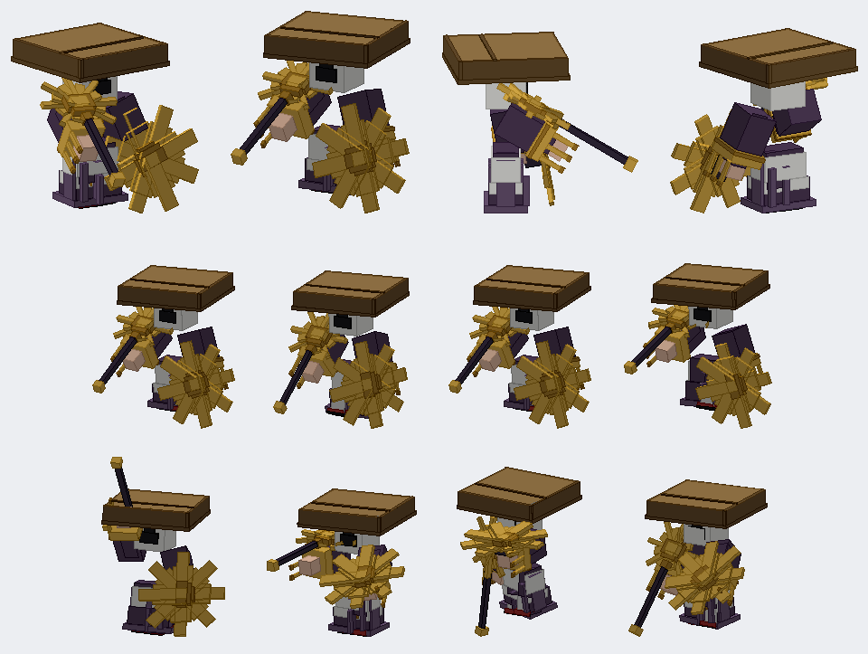

# The Sun Monk (boss model)

Status: a model and its animation clips, in the repository as a Blockbench project. Not in the game: by the owner's choice there is no entity, renderer or data yet ("it will be a boss on the jugcraft server", 10 October 2026: the model first).
Proposal issue: none. On 10 October 2026 the owner sent a picture of a Minecraft-style boss and asked for it modelled "exactly the same as the image in blockbench".
Owner: @jimbozoomer-byte
Target milestone and tier: none yet; a server boss.
Primary specialty and supported player role: combat, when it is made playable.

## What it is

At Minecraft player proportions (an 8-pixel head, a 12-pixel body, arms and legs), a figure of groups at their joints, after the owner's picture:
- a white hood over the head with a black face slot, its cape falling over the shoulders;
- a great square plank hat, three heads wide, with a dark rim, dark bands across its top and a slight twist;
- a dark purple robe: a torso with a lighter collar and front seam, a gold sash with a knot and hanging ends, and a flared skirt in three tiers with lighter folds standing proud all round and a split hem in front;
- wide sleeves with gold cuffs, a dark band and three hanging tassels, and bare hands;
- white socks in red sandals with a strap and dark sole;
- in the right hand, a dark staff with a gold ferrule and a golden sunburst head (a disc, eight long rays and eight short between them), held down in front of the fist;
- in the left hand, a great golden eight-point throwing star, flat, with a dark hub and a bright boss, held upright in front of the fist with the arm out to the side.

All in `tools/sun_monk.py`, which writes `art/sun_monk/sun_monk.bbmodel` with the textures embedded (`sm_*`, drawn flat and clean by the same file, the planks with board seams and nail marks).

### The animation clips
Sampled from curves in the same file, relative to the held rest pose:
- **idle** (2 s, loops): a hover-bob, the head turning, the sleeves and skirt swaying, the star turning slowly in the hand.
- **walk** (1 s, loops): a gliding shuffle with short steps and a slight lean, the skirt, sleeves and tassels swinging, the star turning.
- **attack** (1.5 s, once): the staff swept up overhead and down with the body turning into it, while the star spins up and is thrust out at the end; then back to rest.

## Connections, balance, multiplayer
Not applicable: nothing is in the game. When the owner wants it fought, a boss entity with a quad renderer drawing these curves, its attacks and its drops are the next piece of work.

## Dependencies and assets
No dependencies. The model and textures are Jugcraft's own, made from the owner's picture (their own work, shared for this). `tools/blockbench_export.py` writes the project and `tools/box_preview.py` renders the previews.

## Verification
- Done locally (10 October 2026): the project is written; offline renders of four views and eight animation frames were reviewed against the picture; the staff and star are modelled in front of the fists so they stand clear of the robe and sleeves.
- Not applicable: the Gradle build and game tests.

## Rollout and open questions
- The star spins about its own centre in the hand; a thrown star would be a separate entity.
- The hat's twist is 8 degrees; the picture's is a little more.
