# Madame Tatterlace

Status: implemented in source. CI builds it, and its game tests and client game test pass (below). This is part 2 of boss 2 in the [Witching Season plan](witching-season.md#boss-2-madame-tatterlace-in-the-spindle-loft): the boss of the Spindle Loft, her brood and her things, and her loot. It is built on part 1, the loft and the Cursed Spindle that opens it ([spindle-loft.md](spindle-loft.md)), and on boss 1's lair framework ([hollow-acre.md](hollow-acre.md)). It has not been played by hand, and the two-client dedicated-server playtest the plan asks for is still to do.
Proposal issue: none. The owner approved the Witching Season plan on 4 October 2026, and on 10 October 2026 asked: "Do the bosses".
Owner: @jimbozoomer-byte

Target milestone and tier: Specialization tier (dungeon expeditions), as the plan sets it. She is reached only through the Cursed Spindle, which takes Discovery-tier things. Nothing a tier needs comes only from her.
Primary specialty and supported player role: adventuring. Her loot also serves the ritual's makers (Gossamer Silk in the next spindle) and costume wearers (trick-or-treating and the costume contest).

## Player experience

### She waits

Madame Tatterlace sits on the white silk over the doily of every Spindle Loft, placed with the loft, fifteen blocks above the lace, sewing. She is a great spider seamstress, three blocks across:
- a black body fringed in red, her abdomen raised behind her with a stock of gold thimbles on its back;
- a tall headdress of red and gold with a purple gem at her brow, and eight red eyes;
- gold cuffs at every knee;
- her palps hold a lace doily before her face, and her right foreleg carries a long needle.

Waiting, she takes no harm. She comes down when a player who can fight her (anyone not in creative or spectator mode) steps onto the doily, or strikes her. Then:
- "Madame Tatterlace lowers herself onto the doily: "Hold still, dear, while I take your measurements."", and her bar shows;
- she lowers herself on her thread onto the middle of the doily over 2 seconds, and nothing can hurt her meanwhile;
- her health is set for the party: 360, half as much again for each player after the first within 38 blocks of the doily's centre, at most two and a half times (900 for four or more).

She has armour 8 and cannot be knocked back. She takes no fall damage, is immune to poison and fire, and no web holds her: she walks on her own lace and threads, and nothing pulls her down. She cannot ride, be leashed or be pushed. On the lace she scuttles at a quarter-block a tick and stops two blocks short of her foe. If she is ever more than 30 blocks from the doily's centre, or fallen below its lace, she climbs back up her thread to its middle.

### Her rule: the floor is her work

She can unravel the doily under you. A segment frays for 2 seconds (loosening threads and a ripping sound), then drops away into the dark, and is **knitted back 12 seconds later**, each cell in its own pattern. A segment is a ring of lace 3 blocks wide at her foe's distance from the centre, or a 60° wedge of the doily towards her foe (past the centre's flower). Fall through and the mist throws you back to the pincushion for its toll, as at the loft's edges.

She never unravels the dense band of lace round a spool's barrel, nor the tape's foot where the way down meets the doily, so there is always somewhere safe to stand and a way back onto the lace. At most two segments are down at once.

### Phase 1, the Fitting (full to half health)

Every attack has a wind-up you can read, a strike and a recovery. She waits at least a second between attacks.

| Attack | Read it by | What it does |
| --- | --- | --- |
| Needlepoint | She rears, her needle drawn back (0.5 s) | Two quick stabs a quarter-second apart, in front of her (80°, 3.5 blocks past her body): 8 damage each. Up close, it is her most frequent attack |
| Thimble Toss | She plucks a gold thimble from her back (0.5 s) | It arcs to where her foe stood and bounces twice on the lace, ringing: 6 damage to each player it hits, once each bounce. Where the lace is gone it falls away |
| Binding Thread | She aims her spinnerets and a thread glints (0.6 s) | A thread shoots out. If it hits, you are tethered for 3 seconds: stray more than 4 blocks from where it holds and it pulls you back, and the point it holds is reeled toward her a block a second. **Strike the thread**, or sprint-jump against it, to snap it |
| Lace Snare | She flicks the doily in her palps (0.5 s) | A spinning net of lace arcs to where her foe stood and lies there as a 3 × 3 snare for 6 seconds: Slowness IV and no jumping while you stand in it. Your jump comes back half a second after no snare holds you |
| Spool Roll | She braces (0.8 s) | She kicks a spool of her red thread rolling across the doily in a straight line at her foe: 10 damage and a heavy knockback to each player within 1.5 blocks of its path, once each. It unwinds a trail of thread, falls where the lace is gone, and is gone after 5 seconds |

### Taking In the Seams (at half health)

"Taking In the Seams: she climbs into the threads, and the light dims". Over 3 seconds she climbs up into the white silk overhead, and nothing can hurt her meanwhile. Every player near gets Darkness for 3 seconds. She spits a ring of **six egg sacs** round the doily, on the lace 17.5 blocks from its centre, clear of the spools, the thimble and the tape's foot. The fight changes.

### Phase 2, the Final Fitting (half health to a fifth)

She hangs in the threads, her feet 9 blocks above the lace, and moves along the silk over her foe. She uses only these:

| Attack | Read it by | What it does |
| --- | --- | --- |
| Pin Rain | Twelve pin shadows smoke on the lace round her foe, within 2.5 blocks (1 s) | The pins fall one by one over half a second: 4 damage to a player within a block of where one lands |
| Unravel | Threads fray along a ring or a wedge of the doily (2 s) | That part of the floor drops away for 12 s (above) |
| Drop Strike | Her shadow swells on the lace under her foe as she moves over them (0.8 s) | She drops from the threads onto them: 14 damage to everyone within 3 blocks. She then lies open on the lace for 3 seconds before she climbs back up. Hanging, she drops more often than she does anything else |
| Brood | She calls (1 s), and the egg sacs swell | Up to four sacs split over a second, and a spiderling comes out of each: small and quick, 6 health, its bite 2 damage and Poison for 2 seconds. At most six at a time |

**The egg sacs** have 12 health and can be broken, which keeps their brood in. A sac can hatch more than once. Her spiderlings go for the nearest player.

### Frenzied Stitching (below a fifth)

"Frenzied Stitching: her cuffs glow red". She comes down to the lace for good, every cooldown (and her pause between attacks) is a third shorter, and she unravels two segments at once: one under her foe, the other under another player, or across the doily from her foe. She uses every attack but the Drop Strike.

### Her fall

When she falls:
- her spiderlings and egg sacs shrivel, and her thimbles, threads, snares and spools are gone;
- her doily is knitted whole at once;
- each participant gets their loot (below) and Unravelled;
- "Madame Tatterlace has come apart at the seams", and a gate of **Grey Mist** two blocks wide and two high opens in the middle of the doily. It takes players home, as the needle's eye does;
- the instance is ended, and it closes once everyone has left. The mist stays until then; the next instance in that slot clears it as she takes her silk again.

### Left alone

If no player she can fight is within 38 blocks of the doily's centre for 10 seconds: "Madame Tatterlace goes back to her sewing". She knits her doily whole, climbs back to her silk and heals fully; her spiderlings, sacs and things are gone. Who hurt her is forgotten, so a fresh fight starts from nothing.

### Her loot

Each participant rolls their own loot. A participant is a player who hurt her, her egg sacs or her spiderlings and is within 64 blocks of the doily's centre when she falls. The loot goes straight into their inventory, and what does not fit lands at their feet. "Her sewing basket is yours".

| Loot | Chance |
| --- | --- |
| **Gossamer Silk**, a skein of her pale silk | 4 to 8, always |
| **Needle Rapier**, a boss trophy of Arms VII | 15%; certain on a player's first kill (whoever has not yet earned Unravelled) |
| **Golden Thimble** | 25% |
| **Tatterlace's Headdress** | 20% |
| 300 experience, shared out among the participants | always |
| The advancement **Unravelled** (a challenge in the Adventure tab) | always |

During the Halloween event, unless `lairs.event_loot` is off, each participant also gets a roll of seasonal candy and another 10% chance at the headdress, as for every lair boss.

**What they are for:**
- **Gossamer Silk:**
  - **A cheaper Cursed Spindle:** silk, a gold ingot, two gold nuggets, an amethyst shard, two spider eyes, a string and a stick, shapeless. The silk takes two string's place and the nuggets one gold ingot's. This is the plan's "drops part of what summons her again" link.
  - **Unpicked:** one silk makes three string, for the Spider's Larder and anything else string makes.
- **Golden Thimble:** held in the offhand, it turns aside the first projectile that would hit you (an arrow, a trident, her thimbles, pins and Binding Thread), with a ping of gold and "The Golden Thimble turns it aside". Then it needs 15 seconds before it can again; its cooldown shows on it.
- **Tatterlace's Headdress:** a costume worn on the head, her tall headdress in small: a velvet band, a gold crown with a purple gem, and three spires tipped with gold. It counts for trick-or-treating and the costume contest.
- **Needle Rapier:** an Arms VII boss trophy of the rapier kind, so it fights as the steel rapier does:
  - its blow: 5 damage at two blows a second, and its Quick Parry (use it to block 35% of the damage from in front);
  - epic, and it lasts twice as long as steel;
  - "Trophy of Madame Tatterlace";
  - its boon, **Stitch:** three hits on the same foe within 4 seconds stitch it, Slowness II for 2 seconds, and the count starts again. A hit on another foe, or after the 4 seconds, starts a new count.

### Settings

Her settings are the ones every lair boss shares, in `config/jugcraft.properties` (`lair/LairBosses.java`):
- `lairs.boss_health` (1.0, from 0.25 to 4): multiplies her health;
- `lairs.boss_damage` (1.0, from 0.25 to 4): multiplies her stabs, thimbles, spools, pins and drop (not her spiderlings' bites);
- `lairs.event_loot` (`on` or `off`): the Halloween event's extra roll.

Her damage numbers are Normal difficulty's: Easy and Hard scale them as they scale every monster's blows.

## Changes from the plan

- **The Needle Rapier fights as a rapier.** The plan gave it 6 damage at attack speed 2.0. Every Arms VII trophy fights as its kind does, so it has the steel rapier's 5 damage at 2.0, and its Quick Parry. New numbers would have made it a new kind of arm.
- **Gossamer Silk's uses:** the cheaper Cursed Spindle (the plan's link) and three string. Knitting finer yarn from it at the Spinning Wheel, and lace decorations of its own, are not in this part.
- **Where she waits:** on the white silk over the doily's centre, sewing, until someone steps onto the lace. The plan did not say.
- **She does not leap between the spools.** She scuttles across the lace in phase 1 and moves along the white silk in phase 2; past her 30-block leash she climbs back up her thread to the doily's centre.
- **The light dims as Darkness** on the players near her for 3 seconds as she takes in her seams. The skylight itself does not change.
- **The spool she kicks is one of her own,** a spool of her red thread, not one of the four giant spools: those hold the doily up.
- **The egg sacs can be broken** (12 health), which stops their brood; whoever hurts a sac or a spiderling has taken part in her fight.
- **The tape's foot is kept too.** As well as the ring round each spool, she never unravels the lace where the tape meets the doily, so the way down stays open. The arrival (the pincushion) is not on the doily, so it is out of her reach anyway. At most two segments are down at once.
- **Who counts as a participant:** the plan said loot goes only to those who took part. Here that means a player who hurt her, her sacs or her spiderlings and is within 64 blocks of the doily's centre when she falls.
- **A way out where she fell:** her death opens Grey Mist in the middle of the doily, as Vesperine's does; the needle's eye still works too.
- **What every lair boss shares** (who may fight one, its health for a party, and its damage settings) is now one class, `lair/LairBosses.java`, used by both bosses. Vesperine's numbers are unchanged.
- **Her spiderlings are `jugcraft:tatter_spiderling`** ("Spiderling"): batch 19's egg sac decoration already draws a `spiderling` texture, which an entity of that id would have replaced.
- **The Binding Thread and the Lace Snare are drawn as particles** (white ash along the thread, cobweb along the snare's edges), with no model.
- **She is a monster:** on Peaceful she is gone, as every monster is, and the Spindle Loft stands empty.
- **Animations by GeckoLib,** as Vesperine's are: GeckoLib 5.5.7 is already pinned.

## Connections

- **Inputs:** the way in is part 1's Cursed Spindle on a Spinning Wheel, so knitting's wheel, gold, amethyst and spiders' string and eyes feed every fight.
- **Outputs:**
  - **Gossamer Silk** feeds back into the ritual (the cheaper Cursed Spindle) and into string;
  - **the Golden Thimble** is a defensive offhand item for any fight with arrows or tridents;
  - **Tatterlace's Headdress** is a costume for trick-or-treating and the costume contest (`#jugcraft:trick_or_treat_costumes` and `#jugcraft:costume_hats`);
  - **the Needle Rapier** joins Arms VII's boss trophies: the second with a boss to drop it, after the Vesper Scythe.
- **Technology and magic:** none required. She is fought with whatever players bring, and nothing in a tier needs her loot.
- **Trade and solo routes:** a solo player can do everything. Her health is lowest for one player, and the first kill always brings the rapier. Her loot can be traded like any item.
- **Reachable entry path:** the spindle takes Discovery-tier things (part 1), and nothing she drops is needed to reach her.

## Balance and automation

- **Every fight costs a ritual:** a fresh Cursed Spindle, as part 1 set it.
- **No gain loop:** silk makes a spindle that still needs gold, an amethyst shard, spider eyes, string, a stick and a whole fight, and silk unpicks into three string, while string makes no silk. Nothing she drops turns into more of itself. Nothing she drops sells to a Jugcraft shop for Jugs.
- **No leeching:** only participants get loot. A bystander who never struck her, a sac or a spiderling gets nothing, and loot is rolled per participant, so nobody takes another's.
- **First kill once:** the rapier's first-kill guarantee is stored with the advancement, so it comes once per player.
- **Abandoning resets her:** leaving her alone for 10 seconds heals her and forgets everyone's part. She cannot be worn down between visits.
- **No automation:** she comes down only for a player, her doily is unravelled and knitted only in a fight, and her loot goes only to players. Her spiderlings and sacs drop nothing and give no experience.
- **Units:** health and damage in half hearts, before `lairs.boss_health` and `lairs.boss_damage`. Times are in ticks, 20 a second; distances in blocks. Every number is in `tools/tatterlace.py`, and `tools/check_mod_data.py` holds the Java to it.

## Multiplayer and persistence

- **Server authority:** the server decides everything: waking, targets, every attack's hits, the unravelled lace and its knitting, the phases, the brood, the Golden Thimble's turn, the Stitch count, the loot and the advancement. Clients only draw what her synced state says (her action and whether she is frenzied) and play the matching animations.
- **What is saved:** she is saved with her instance's chunks. Her phase is saved, and a passing moment (coming down, taking in her seams) resumes as the phase it leads to. When she is loaded, her doily is knitted whole. Her thimbles, threads, snares, spools, egg sacs and spiderlings are never saved. Instances close on a restart (part 1), and she goes with hers.
- **The lace:** an unravelled segment is set back to exactly the lace it held, cell by cell, and only where it is still empty. Knitting the whole doily (when she falls, resets or is loaded) also fills any lace cell of the template found empty.
- **Chunks:** nothing is force-loaded. Her arena stays loaded while players stand in the loft.
- **The Stitch count and the snares' hold** live only while the server runs; a restart gives every player their jump back.
- **No griefing:** she cannot leave her lair, her attacks strike only players who can fight her, and the only blocks she changes are her own doily's, which she puts back.
- **Still to do:** the two-client dedicated-server playtest.

## Dependencies and assets

No new dependency. GeckoLib 5.5.7 for 26.3 is already pinned (`distribution/frameworks.lock.json`); it draws her, her tossed thimbles, her rolling spools, her egg sacs and her spiderlings. Everything is drawn by code:
- **Bodies and clips:** `tools/tatterlace_models.py` builds the GeckoLib models and animations on Vesperine's builder: 22 of hers (sewing, idle, walk, every attack's wind-up and strike, climb, hang, drop, open, brood, death, and her cuffs calm and red, on a controller of their own), the thimble's tumble, the spool's roll, the sac's pulse and hatch, and the spiderling's idle and walk.
- **Textures:** `tools/tatterlace_art.py` paints them at four times Minecraft's scale: 512 × 512 for her and the spool, 256 × 256 for the egg sac, 128 × 128 for the thimble and the spiderling. Its glowmasks light her eyes, her gem and her red cuffs, and the spiderlings' eyes. It also paints the headdress's velvet, gold and gem.
- **Icons:** Gossamer Silk, the Golden Thimble and the headdress from icon maps (`tools/item_icons/`); the Needle Rapier's art in `tools/arms_variants_art.py` (a needle-steel, gold, velvet and amethyst line style), its icon map `tools/arms_icons/needle_rapier.txt`.
- **Data:** `tools/tatterlace_data.py` writes the names, tooltips and messages, the item models (the headdress worn as its own model), the loot table, the two recipes, the costume tags and the advancement.

No Mojang texture is read, traced or copied.

## Verification

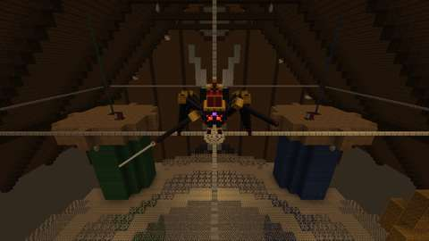
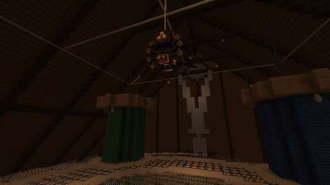
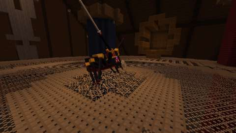
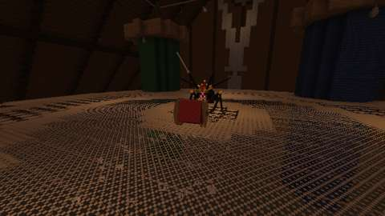
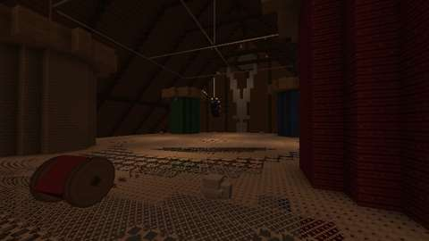
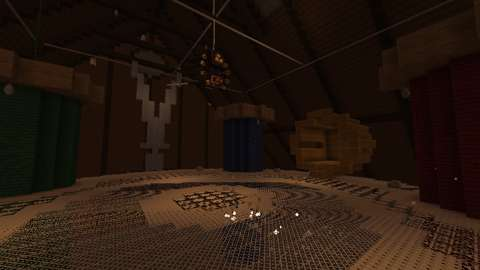
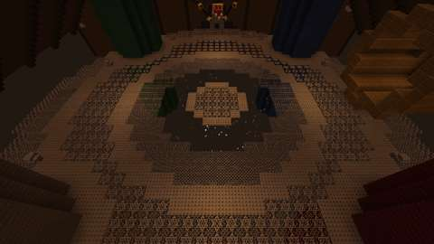
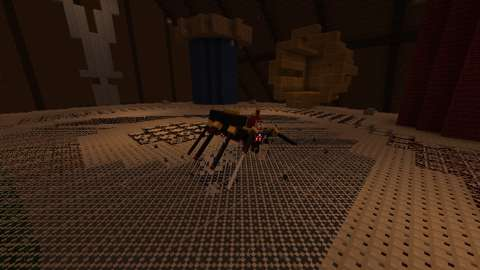
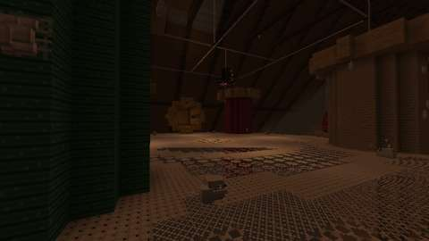
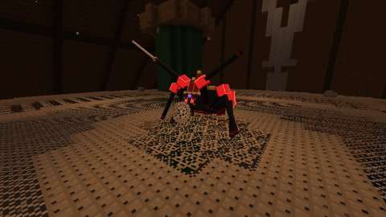
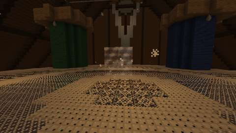

*The client game test's pictures (CI, commit `4e59bd5`): waiting; coming down; Needlepoint and the Spool Roll; Taking In the Seams; Pin Rain, Unravel and the Drop Strike; her Brood; Frenzied Stitching; and after her fall. Each attack is frozen as it lands. The test also takes the Thimble Toss and the Lace Snare, whose thimble and cobweb outline are too small to read at the test client's 480x270, so they are left out here.*

CI (10 October 2026, GitHub Actions, the pins in [PLATFORM.md](../PLATFORM.md)):

| Commit | What ran | Result |
| --- | --- | --- |
| `7551d9a` | Build, data audit, every server game test with and without the optional integrations, and the client tests chosen for it (`TatterlaceClientGameTests`, `VesperineClientGameTests`, `ArmsVIIClientGameTests`) | Compiled on the first try. **All pass:** all 1192 required game tests, her ten among them, and the three client tests: her whole fight in a real Spindle Loft. Her egg sacs and spiderlings were too far from the camera to show in its pictures |
| `3b10b79` | Four of the pictures from closer | **All pass**, as above. The sacs and a spiderling now show, but small, among the spools' barrels |
| `4e59bd5` | The egg sacs and her brood shot from past the doily's rim, over them | **All pass**, as above; the pictures above are from this commit |

Run locally (10 October 2026):

| Check | Result |
| --- | --- |
| `python3 scripts/check_repository.py` | Pass |
| `python3 tools/check_mod_data.py`: also checks her Java numbers, attacks, loot constants and the Stitch boon's against `tools/tatterlace.py`; that where her fight looks for the loft's parts (`SpindleLoft.java`: the lace layer, the doily's centre and rings, the spools, the white silk, the tape's foot and the egg sacs' ring) is where `tools/spindle_loft.py` builds them, and that its rule for the lace finds every lace cell of the template; her registrations, names and renderers; the GeckoLib models, clips, sheet sizes and controllers' bones; the loot table, recipes, costume tags, advancement and messages; and that nothing of hers loads chunks or changes dimension. Six deliberate changes to her Java and `SpindleLoft.java`, one at a time, each failed it | Pass, 1893 IDs |
| `python3 tools/generate_material_data.py`, then `git status` | Writes this part's data only |
| `./gradlew build`, game tests and client game tests | Not run locally (the Fabric Maven is out of reach here); run by CI |

The game tests (`TatterlaceGameTests`) show what a game-test server can, with a seamstress put down on her own (no lair) over a loft laid out from the test's origin:
1. waiting on her silk, she takes no harm; a player's blow wakes her at full health, and she comes down onto her lace;
2. her health scales 1, 1.5 and 2.5 times for one, two and four or more players; in a frenzy her cooldowns are a third shorter;
3. Needlepoint strikes a player in front of her and spares one behind her;
4. the doily's rule: no lace in a spool's barrel, the band round it safe, the tape's foot kept; a ring she unravels drops away and is knitted back as it was 12 seconds later;
5. Taking In the Seams spits six egg sacs and takes her up into the threads, her Brood brings four spiderlings out of them, and when she falls her sacs and brood go with her;
6. her loot is each participant's own: two who struck her each get Gossamer Silk and, on a first kill, their own Needle Rapier, and both earn Unravelled; a bystander who never struck her gets nothing;
7. the Needle Rapier's third hit on a foe stitches it;
8. the Golden Thimble turns aside one projectile, then cools down;
9. a snare lets go of a player half a second after it stops holding them;
10. a struck Binding Thread snaps.

The client game test (`TatterlaceClientGameTests`, CI job `client`) runs her fight in a real Spindle Loft, with its one player in survival under Resistance:
1. an instance opens with her waiting on her silk;
2. stepping onto the doily brings her down, and she comes down onto the lace;
3. Taking In the Seams spits six egg sacs and takes her up into the threads;
4. Unravel takes the lace from under the player, and the doily is knitted back;
5. after her Drop Strike she lies open on the lace, and her Brood brings spiderlings out of the sacs;
6. below a fifth of her health she is frenzied, on the lace;
7. when she falls (with a segment of her doily down), the player has Gossamer Silk and the Needle Rapier (a first kill) and Unravelled, the doily is whole, her sacs and brood are gone, and Grey Mist stands in the doily's middle;
8. a fresh instance opened in her slot has none of the old instance's Grey Mist.

Along the way it takes a picture of each part of the fight.

Not run: the two-client dedicated-server playtest the plan asks for, and play by hand. No test yet times her attacks against real players, measures how long a fight lasts, or tries the Binding Thread's pull, the Lace Snare, the Spool Roll or Pin Rain on a moving player.

## World and event applicability

She is confined to the Spindle Loft, her own dimension; nothing of hers reaches the Overworld, and the only blocks she changes are her doily's lace, which she puts back. Her loot rarity is set above, and her one boon is the Needle Rapier's. The spindle, and so the fight, works on any night by default. Ending the Halloween event only stops its extra roll: it never removes her, a lair or anything earned.

## Rollout and open questions

The plan's open questions keep their defaults: rituals all year at night with a Halloween bonus, Grave Goods on death, four players and eight instances.

Known limits:
- untested by hand and with two clients, so her numbers are the plan's and may need tuning once she is played;
- on Peaceful there is no fight;
- Gossamer Silk has two uses so far; finer yarn and lace decorations from it are left for later;
- the Stitch boon's count is lost on a restart.

With her, both Witching Season bosses are built.
