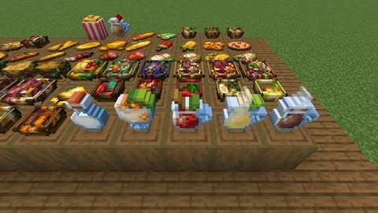
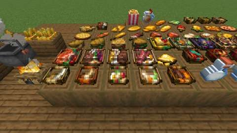
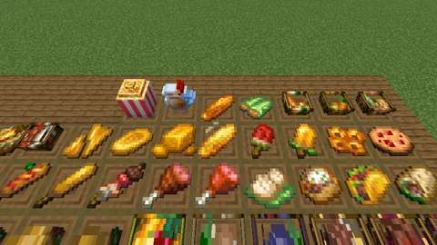
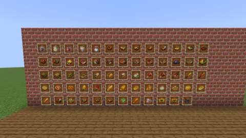

# The menu: dishes from the owner's food art, set down as 3D models

Status: implemented in source; **not yet played**. The Build workflow compiles it; see Verification for what has actually run.
Proposal issue: none; requested directly by the owner on 7 October 2026 ("lots more crops, plants, food, cooking devices, preparation systems ... lots and lots of the food to be very decorative and displayable"). This is slice 3 of the ten-slice plan in [branches/AGRICULTURE.md](../branches/AGRICULTURE.md#the-kitchen-and-cooking-expansion-planned); the owner asked for it next ("Lets begin the next part").
Owner: @jimbozoomer-byte
Target milestone and tier: Milestone 3 (first homestead); Discovery tier. Every recipe uses vanilla food and Jugcraft's crops (corn, tomato, onion, garlic, cabbage, pepper) and the Farmhouse Kitchen's cuts; the Cooking Pot, the Cutting Board and a furnace are the only stations.
Primary specialty and supported player role: cooking; supports farmers, ranchers (pet food) and builders (dining rooms, cafés and market stalls to dress)

## Player experience
Cook a menu and lay it out:

- **55 new items, 47 of them food,** each in the owner's own icon:
  - **Drinks** (drunk even when full, for a short effect, leaving the glass bottle): Hot Cocoa (Regeneration), Creamy Corn Drink (Absorption), Melon Juice (Speed) and Glow Berry Custard (Night Vision). A **Milk Bottle** clears every effect as a bucket of milk does; a bucket fills four.
  - **Soups and stews in a bowl:** Beef Stew, Chicken Soup, Baked Cod Stew, Fish Stew, Bone Broth, Corn Soup, Noodle Soup, Tomato Sauce, Fruit Salad, Nether Salad (a moment of Nausea) and Creamed Corn.
  - **Plated meals** (in a bowl, given back): Bacon and Eggs, Steak and Potatoes, Roasted Mutton Chops, Grilled Salmon, Ratatouille, Pasta with Meatballs, Pasta with Mutton Chop, Squid Ink Pasta, Vegetable Noodles and Cornbread Stuffing.
  - **In hand:** the Hamburger, Bacon, Chicken and Egg Sandwiches, the Mutton Wrap, the Taco, the Stuffed Potato, Dumplings, Ham and Smoked Ham.
  - **On a stick** (the stick given back): the Barbecue Stick, the Corn Dog and the Classic Corn Dog, and Corn and Melon Popsicles.
  - **Sweets:** Honey Cookies, Sweet Berry Cookies and Caramel Popcorn.
  - **Corn:** Boiled Corn on the cob, Cornbread, Tortillas and Tortilla Chips. Boiled Corn and Jugcraft's Roasted Corn now give their **Corncob** back when eaten.
  - **What they start from:** Wheat Dough, Raw Pasta, Cornbread Batter and Raw Tortillas.
  - **For pets:** Dog Food and Horse Feed (below).
- **Every dish sets down.** Sneak and use a dish on a block to set it down as a 3D model of the owner's icon, turned to face you: soups in the owner's small bowl, meals heaped on their wide plate, sandwiches and burgers stacked, drinks standing in their mugs and bottle, and the rest lying flat as a dropped item does. Use it with an empty hand to take it back. Holding anything else, using it does nothing to it. Broken, it drops the food. It never becomes anything else, so setting food down is never a gain or a loss.
- **The owner's art on food Jugcraft already had,** as the owner chose seeing both looks side by side: the Onion, Vegetable and Pumpkin Soups, the Cabbage Rolls, Roasted Corn (their grilled corn) and Mulled Cider (their cider mug) wear the owner's icons and set down like the menu. The IDs, recipes and food are unchanged. Popcorn keeps its Jugcraft icon in hand, but set down it is the owner's striped **popcorn box**. The other ciders stay bottled.
- **The Cooking Pot in the owner's pot,** as the owner chose: the same block, recipes, screen and saved contents, now the owner's iron pot with lugs and a bail handle (and Jugcraft's soup showing inside while it cooks).
- **Nachos, a sixth feast** ([feasts](feasts-and-food-displays.md)): a tray of tortilla chips under beef, tomato and pepper, served four times like the others (a bowl takes a Bowl of Nachos away) down to the last bitten chip.
- **Dog Food and Horse Feed.** Use Dog Food on your own tamed wolf to restore 20 health and give it Strength and Speed for 5 minutes, leaving the bowl. Use Horse Feed on a horse you tamed to restore 10 health and give it Speed and Jump Boost for 2 minutes. Someone else's pet, or a wild one, is left to vanilla (a wolf sits, a horse is mounted).

| **The table:** every dish set down, drinks and bowls in front, the popcorn box and mulled cider at the back | **The Cooking Pot** in the owner's pot, cooking on a campfire and empty, with the nachos whole, half eaten and down to the last chip |
| --- | --- |
|  |  |
| **Drinks and bowls:** the mugs and the milk bottle standing, soups and stews in the owner's bowl | **Plates:** meals and pastas heaped on the owner's wide plate |
|  |  |
| **Food in hand,** lying flat: sandwiches, the taco, ham, food on a stick, cookies and corn | **The wall:** every new item, the restyled foods, the nachos and the Cooking Pot |
|  |  |

*In-game screenshots from CI's client game test (`MenuClientGameTests`, software rendering, small previews).*

## Connections
- Existing input producer: vanilla food and farming (wheat, potatoes, carrots, beetroot, melons, apples, berries, cocoa, milk, eggs, honey, mushrooms, Nether fungi, ink sacs, ice); Jugcraft's corn (Fall Harvest), tomato, onion, garlic, cabbage and pepper (Kitchen Garden), and the Farmhouse Kitchen's cuts (minced beef, beef patties, bacon, chicken cuts, mutton chops, fish slices, fried eggs, cabbage leaves). Popcorn and caramel come from the Halloween harvest.
- Existing output consumer: food for every player; every food carries `c:foods`, so other mods' and Jugcraft's food tags see it. Dishes dress the Plate, Platter and Serving Tray (slice 2) or a table on their own. The Corncob is compostable.
- Technology connection: none in this slice. Every recipe is data (Cooking Pot JSON, shapeless crafting, smelting, cutting), so the engineered kitchen (slice 10) can make them by machine later.
- Magic connection: none.
- Reachable entry path: every dish comes from a crafting table, a furnace, a Cooking Pot (iron and a campfire) or a Cutting Board (slice 1), all reachable on the first days. Corn, tomatoes and the other crops drop from grass or grow wild. No circular unlock: no dish is needed to make its own station.
- Required vs optional: all optional, extra food, pet care and decoration.
- How this stays useful without other branches: better food from the same farm, and a way to show it.

## Balance and automation
- **A dish gives at most 3 hunger more than its ingredients** (`tools/menu.py` `COOK_BONUS`, checked by `tools/check_mod_data.py`). Each ingredient is counted as the most it would give: as itself, as what a furnace makes of it (raw meat cooked, an egg fried, corn as Roasted Corn, sugar as Caramel), as what a board cuts it into (a pumpkin as its slices), or, for an ingredient that is not food (a dough, a batter), as what went into it. Saturation is hunger × modifier × 2, as in Minecraft.

  | Dish | Made in | Ingredients (hunger counted) | Makes | Hunger / modifier each | Total hunger |
  | --- | --- | --- | --- | --- | --- |
  | Hot Cocoa | Cooking Pot | glass bottle, 2 cocoa beans, milk, sugar (2) | 1 | 3 / 0.4 | 3 |
  | Creamy Corn Drink | Cooking Pot | glass bottle, corn, milk, sugar (7) | 1 | 4 / 0.5 | 4 |
  | Glow Berry Custard | Cooking Pot | glass bottle, 2 glow berries, milk, egg, sugar (9) | 1 | 6 / 0.6 | 6 |
  | Beef Stew | Cooking Pot | bowl, 2 minced beef, potato, carrot, onion (12) | 1 | 11 / 0.8 | 11 |
  | Chicken Soup | Cooking Pot | bowl, 2 chicken cuts, carrot, onion, cabbage leaf (10) | 1 | 10 / 0.8 | 10 |
  | Baked Cod Stew | Cooking Pot | bowl, 2 cod slices, potato, tomato, egg (11) | 1 | 10 / 0.8 | 10 |
  | Fish Stew | Cooking Pot | bowl, 2 salmon slices, tomato, onion, garlic (9) | 1 | 10 / 0.8 | 10 |
  | Bone Broth | Cooking Pot | bowl, bone, carrot, onion, brown mushroom (3) | 1 | 6 / 0.6 | 6 |
  | Corn Soup | Cooking Pot | bowl, 2 corn, onion, potato (11) | 1 | 9 / 0.6 | 9 |
  | Creamed Corn | Cooking Pot | bowl, 2 corn, milk, sugar (12) | 1 | 8 / 0.6 | 8 |
  | Noodle Soup | Cooking Pot | bowl, raw pasta, chicken cuts, carrot, onion (6) | 1 | 9 / 0.8 | 9 |
  | Vegetable Noodles | Cooking Pot | bowl, raw pasta, cabbage leaf, carrot, pepper, onion (6) | 1 | 9 / 0.7 | 9 |
  | Tomato Sauce | Cooking Pot | bowl, 2 tomatoes, garlic (6) | 1 | 5 / 0.5 | 5 |
  | Pasta with Meatballs | Cooking Pot | bowl, raw pasta, 2 minced beef, tomato (11) | 1 | 12 / 0.8 | 12 |
  | Pasta with Mutton Chop | Cooking Pot | bowl, raw pasta, 2 mutton chops, tomato (9) | 1 | 12 / 0.8 | 12 |
  | Squid Ink Pasta | Cooking Pot | bowl, raw pasta, ink sac, cod slice, salmon slice, tomato (8) | 1 | 10 / 0.8 | 10 |
  | Ratatouille | Cooking Pot | bowl, tomato, pepper, onion, beetroot, garlic (6) | 1 | 8 / 0.6 | 8 |
  | Cornbread Stuffing | Cooking Pot | bowl, cornbread, onion, brown mushroom, carrot (9) | 1 | 9 / 0.7 | 9 |
  | Dumplings | Cooking Pot | wheat dough, minced beef, cabbage leaf, onion (5) | 2 | 4 / 0.6 | 8 |
  | Boiled Corn | Cooking Pot | corn (5) | 1 | 5 / 0.6 | 5 |
  | Melon Juice | crafting | glass bottle, 3 melon slices, sugar (8) | 1 | 4 / 0.4 | 4 |
  | Nether Salad | crafting | bowl, crimson fungus, warped fungus (0) | 1 | 3 / 0.6 | 3 |
  | Fruit Salad | crafting | bowl, apple, melon slice, sweet berries (8) | 1 | 8 / 0.6 | 8 |
  | Bacon and Eggs | crafting | bowl, cooked bacon, 2 fried eggs (10) | 1 | 10 / 0.8 | 10 |
  | Steak and Potatoes | crafting | bowl, cooked beef, baked potato (13) | 1 | 13 / 0.8 | 13 |
  | Roasted Mutton Chops | crafting | bowl, 2 cooked mutton chops, baked potato (11) | 1 | 11 / 0.8 | 11 |
  | Grilled Salmon | crafting | bowl, 2 cooked salmon slices, sweet berries, cabbage leaf (9) | 1 | 10 / 0.8 | 10 |
  | Hamburger | crafting | bread, beef patty, cabbage leaf, tomato, onion (13) | 1 | 11 / 0.8 | 11 |
  | Bacon Sandwich | crafting | bread, cooked bacon, cabbage leaf, tomato (13) | 1 | 10 / 0.8 | 10 |
  | Chicken Sandwich | crafting | bread, cooked chicken cuts, cabbage leaf, carrot (12) | 1 | 10 / 0.8 | 10 |
  | Egg Sandwich | crafting | bread, 2 fried eggs (11) | 1 | 8 / 0.8 | 8 |
  | Mutton Wrap | crafting | tortilla, cooked mutton chops, cabbage leaf, onion (6) | 1 | 8 / 0.8 | 8 |
  | Taco | crafting | tortilla, beef patty, cabbage leaf, tomato (10) | 1 | 9 / 0.8 | 9 |
  | Stuffed Potato | crafting | baked potato, cooked bacon, cabbage leaf (10) | 1 | 10 / 0.8 | 10 |
  | Ham | crafting | 2 porkchops (16) | 1 | 5 / 0.3 | 5 |
  | Smoked Ham | furnace, smoker or campfire | ham (14) | 1 | 14 / 0.8 | 14 |
  | Barbecue Stick | crafting | stick, cooked chicken cuts, pepper, onion (5) | 1 | 7 / 0.8 | 7 |
  | Corn Dog | crafting | stick, cornbread batter, cooked porkchop (14) | 1 | 8 / 0.8 | 8 |
  | Classic Corn Dog | crafting | corn dog, tomato (11) | 1 | 10 / 0.8 | 10 |
  | Honey Cookie | crafting | 2 wheat, honey bottle (6) | 4 | 2 / 0.2 | 8 |
  | Sweet Berry Cookie | crafting | 2 wheat, 3 sweet berries (6) | 4 | 2 / 0.2 | 8 |
  | Caramel Popcorn | crafting | 2 popcorn, caramel (6) | 1 | 6 / 0.5 | 6 |
  | Corn Popsicle | crafting | stick, corn, ice, sugar (7) | 1 | 3 / 0.4 | 3 |
  | Melon Popsicle | crafting | stick, 2 melon slices, ice (4) | 1 | 3 / 0.4 | 3 |
  | Cornbread | furnace, smoker or campfire | cornbread batter: 2 corn, egg, milk (13) | 1 | 6 / 0.6 | 6 |
  | Tortilla | furnace, smoker or campfire | raw tortilla: a third of 2 corn (3.3) | 1 | 2 / 0.4 | 2 |
  | Tortilla Chip | Cutting Board | tortilla (2) | 2 | 1 / 0.3 | 2 |
  | Nachos (feast) | crafting | 4 tortilla chips, beef patty, tomato, pepper (13) | 4 servings | 3 / 0.6 | 12 |

  Ingredients that are not food: Wheat Dough (3 wheat and a water bucket make 3; the bucket is given back), Raw Pasta (a dough cut in 2), Cornbread Batter (2 corn, an egg and milk), Raw Tortillas (2 corn make 3), and the Milk Bottle (a bucket of milk fills 4 bottles). The honey bottle, buckets and Cooking Pot vessels are handed back as crafting and the pot always do. Cookies come four to a batch, not vanilla's eight, so a batch is never a gain.
- **Pet food.** Dog Food: a bowl, rotten flesh, bone meal and cooked chicken cuts; Horse Feed: 2 wheat, an apple and a carrot. They give pets health and effects, never player food.
- **No loops.** `tools/check_mod_data.py` follows every agriculture recipe (crafting, pot, furnace, board) and fails if any leads back to where it started.
- **Automation.** None new. A set-down dish is a block with no inventory; the Cooking Pot keeps its hopper behaviour.

## Multiplayer and persistence
- All changes happen on the server; the client only predicts. Setting a dish down runs in the same use-block event phase as the pumpkin pie (after the default one, where the town's protection decides), checks `mayUseItemAt` and that the block can stand there, and uses one item. Taking it back needs an empty hand and is a normal block use, so vanilla's reach check and the town's protection apply. Pet food runs in the use-entity event before the animal's own handling, and the server checks the animal is the right kind, alive, tamed and owned by the player; anything else passes on to vanilla. Vanilla's interaction packet checks reach first.
- Persistence: a set-down dish keeps its facing in its block state; the food it is comes from its block, so nothing else is saved. Chunk unload and restart keep it. A dish needs a solid block below and drops its food if that goes.
- The new dish blocks share their food's ID (`jugcraft:beef_stew` is both an item and a block; Minecraft keeps the two registries apart) and have no item of their own. The restyled foods and the Cooking Pot keep their IDs, recipes and saved contents; only their look changed. Roasted Corn now gives a Corncob back. Nothing is renamed or migrated.
- Disabling `agriculture` removes the recipes (load conditions) but keeps the registrations, so saved blocks and items survive.

## Dependencies and assets
No new dependency; Fabric API's use-block and use-entity events, already used elsewhere, carry setting dishes down and feeding pets.

**The owner's own textures,** used as drawn (the owner, 7 October 2026: "I made all of the textures in there myself its all mine"). `tools/owner_art.py` copies each file byte-for-byte from `art/owner-library/originals/Blocks/farming and food textures/`, runs last in `tools/generate_textures.py`, and `tools/check_mod_data.py` fails if a runtime copy differs from its source. Imported here: 131 textures (124 for the menu, `tools/menu.py` `TEXTURES`, and 7 for the nachos, `tools/feasts.py`).

| Runtime texture (`assets/jugcraft/textures/`) | Library file (`farming and food textures/`) | Change |
| --- | --- | --- |
| `item/<dish>` for the 55 new items | the same names | none |
| `item/{onion_soup,vegetable_soup,pumpkin_soup,cabbage_rolls}` | the same names | none; replace Jugcraft's drawings |
| `item/roasted_corn`, `item/mulled_cider` | `grilled_corn`, `apple_cider` | renamed; replace Jugcraft's drawings |
| `block/menu/<dish>` for the 57 dishes that set down | the dish's icon (the popcorn box: `popcorn`, a 32 by 32 box texture) | none; the dish's model wears its own icon |
| `block/cooking_pot_{side,top,bottom,handle,parts}`, `item/cooking_pot` | the same names | none; `cooking_pot_side` replaces Jugcraft's drawing, and Jugcraft's old pot rim and inside are retired |
| `block/nacho_{top,side,inner,chip,chip_eaten}`, `item/nachos`, `item/bowl_of_nachos` | the same names, `nachos_block`, `nachos_bowl` | the icons renamed |

The library's [catalog](../../art/owner-library/catalog/files.csv) lists each source file's SHA-256. Jugcraft's own `block/cooking_pot_soup` still shows in the pot while it cooks.

**The models** (`tools/menu_data.py`) are fitted to the owner's icons, and each face's UVs are where that part is drawn on the icon: a bowl (a foot, the bowl's band, a rim and the soup inside, with a heap of what is in it), a wide plate, a stacked sandwich, the icon extruded a pixel thick lying flat, the icon extruded standing (the mugs and bottles), and the popcorn box. They pass the art check (`tools/art_check.py`: no holes, no faces left open). The Cooking Pot's model is the owner's pot: a body, lugs each side and a bail handle.

## Verification
CI (7 October 2026, GitHub Actions, the pins in [PLATFORM.md](../PLATFORM.md)):

| Commit | What ran | Result |
| --- | --- | --- |
| `f546e2b` | Build, data audit, game tests (920 required, `MenuGameTests` among them), optional integrations absent, client game tests (every one of the 100 classes, as the change touched 74 of them; `MenuClientGameTests` and `FeastsClientGameTests` among them), repository check | **All pass.** The screenshots above are from this run. |
| later | the same | Recorded by the pull request's checks. |

Run locally (7 October 2026):

| Check | Result |
| --- | --- |
| `python3 scripts/check_repository.py` | Pass |
| `python3 tools/check_mod_data.py`: also checks `MenuDishes` and `PlacedDishBlock`'s shapes against `tools/menu.py`, the pet food's animal, healing and effects, that the corn foods give their cob back, every dish's balance against its ingredients, every set-down dish's model (wearing its own icon), blockstate for each facing, loot and words, and the Cooking Pot's owner textures | Pass, 1660 IDs |
| `python3 tools/generate_material_data.py`, then `git status` | No drift |
| `python3 tools/generate_textures.py` | Writes this slice's textures; it also rewrites 24 unrelated Styx textures (its flowers and an entity) differently from what is committed; that drift predates this slice, and those files are left as committed |
| `./gradlew build`, game tests and client game tests | Not run locally (no Minecraft jar here); run by CI |

The 8 new game tests (`MenuGameTests`):
1. every dish in `MenuDishes` is a `PlacedDishBlock` of its own food and shape; not sneaking, a Beef Stew is not set down; sneaking, it is, facing the player, and used up; holding bread, using it leaves it; an empty hand takes it back; popcorn set down is the popcorn box (one used), which breaks into one popcorn;
2. the Cooking Pot finds Beef Stew, Hot Cocoa, Dumplings and Boiled Corn from their ingredients;
3. on a lit campfire the pot boils two ears of corn into two Boiled Corn;
4. on the Cutting Board a knife cuts a tortilla into two chips and wheat dough into two raw pasta;
5. the Hamburger, Milk Bottle, Wheat Dough, Raw Tortilla, Cornbread Batter, Dog Food, Horse Feed, Melon Juice and Nachos have their recipes;
6. Boiled Corn and Roasted Corn are eaten for their food and leave a Corncob; a Milk Bottle clears Poison and leaves the bottle, and stacks to 16;
7. a stranger cannot feed someone else's wolf, nor the owner a wild one; the owner's wolf eats Dog Food (10 to 30 health, Strength and Speed, the bowl given back); the owner's horse eats Horse Feed (Speed and Jump Boost, no bowl);
8. four bowls take the nachos down to the last chip, each a Bowl of Nachos of three food, and a use clears it.

The client game test (`MenuClientGameTests`, CI job `client`) lays a table with every dish set down, the Cooking Pot empty and cooking on a campfire beside the nachos whole, half eaten and down to the last chip, and a wall of the new items in item frames, and takes six screenshots; it passed on `f546e2b`.

Not done: play in a real client and a two-client dedicated-server session (two players setting dishes down and taking them back, feeding each other's pets).

## World and event applicability
Food, pet care and decoration only: no world generation, creatures, dimensions or loot tables beyond each block's own drop. Nothing is seasonal.

## Rollout and open questions
- The owner's other food art waits for its slice: the rice dishes and rolls (cooked, fried and mushroom rice, the cod, salmon, kelp and rice rolls) for rice (slice 4), and the pie crust for the bakery (slice 8). The owner's mixed salad and rotten tomato overlap Jugcraft's Garden Salad and tomato, and wait for the garden crops (slice 7), where the owner decides. Their corncob pipe and corn sword are not food.
- The models are fitted by eye to the owner's icons; the owner may want to adjust any dish's shape.
