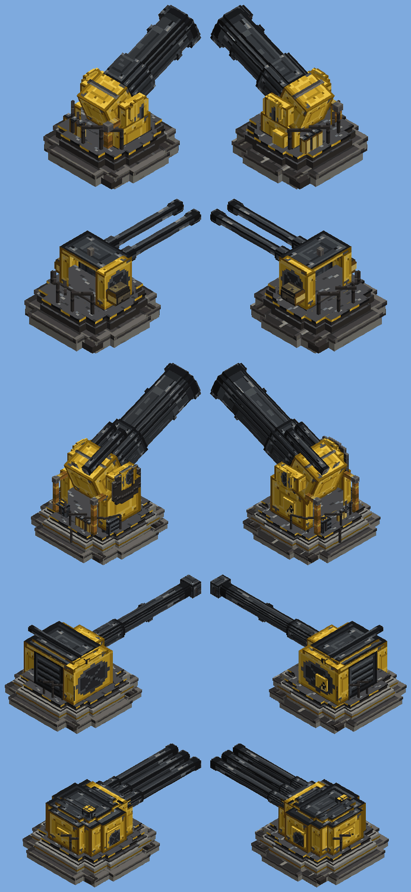

# Tower guns (batch 54)

Status: implemented (pending CI and review)
Proposal issue: none. On 4 October 2026 the owner asked for "more guns that look very similar to" a picture of a heavy mortar on a turntable mount, "in our style", in five variants of big guns that could go on towers: two at 3x3 and three at 5x5.
- The picture is third-party art and was used only as mood: a concrete ring plinth, a railed turntable deck, a yellow armoured cradle with round ports and pipework, and a fat black barrel.
- All models and textures are original, drawn by code in the clean style ([ART_DIRECTION.md](../ART_DIRECTION.md#texturing-keep-it-clean)).

Owner: jimbozoomer-byte
Target milestone and tier: petrochemical tier (steel blocks, steel gears, diesel engines; the 3x3 guns upgrade a Siege Mortar or Flak Gun)
Primary specialty and supported player role: combat (fixed artillery) and base defence

## Player experience
Five heavy emplacements made to stand on top of a tower. Each is placed from its item: use it on a block and it stands on the block above, centred there and facing the way you face. It needs a solid top under its whole footprint (a tower's, a wall's or the ground's); otherwise it says "Needs a solid NxN top to stand on". Players knock a gun down into its item, as with the big guns.

| Gun | Top | What it is | Shell | Reload | Turns | Reach | Crew |
| --- | --- | --- | --- | --- | --- | --- | --- |
| **Bastion Mortar** | 3x3 | A compact mortar on a railed turntable, with a yellow cradle, round ports and a shell rack | Heavy Shell, high arc (45° to 85°) | 3.5 s | 3° a tick | about 17 to 114 blocks | 2 |
| **Bastion Autocannon** | 3x3 | Twin quick-firing barrels in a yellow gunhouse with side ammunition drums. Hold attack to keep firing | Flak Shell, -10° to 85° | 0.3 s | 10° a tick | as the Flak Gun | 1 |
| **Grand Mortar** | 5x5 | The full emplacement: a stepped plinth with vent slots, a tall cradle with an elevation gear, looping pipework, a hazard sign, a control console and the biggest barrel, with twin recuperators | **Great Shell**, high arc (45° to 85°) | 10 s | 1° a tick | about 19 to 126 blocks | 3 |
| **Fortress Rifle** | 5x5 | A long gun with a muzzle brake in an armoured gunhouse, with a range-finder bar on the roof | Heavy Shell, fired fast (4.5 blocks a tick), -5° to 45°, flat or arcing | 6 s | 1.5° a tick | out to about 210 blocks | 2 |
| **Triple Battery** | 5x5 | A low round turret with three barrels | A salvo of three Heavy Shells, -5° to 60° | 7 s | 1.5° a tick | about 114 blocks | 2 |

Aiming works as for the big guns (batch 51):
- **With a Range Finder mark:** the gun turns to the gunner's mark, or the nearest mark within 256 blocks, and works out the elevation that lands the shell there.
- **Without a mark:** the mortars lob at the block the gunner looks at, and the other guns fire where the gunner looks.
- **Firing:** attack fires once the gun is on target and reloaded.

Each barrel of a salvo uses one shell. A gunner with fewer shells fires as many barrels as they have shells for.

### The Great Shell
- **Recipe:** 2 Heavy Shells and a block of TNT (makes 1).
- **Burst:** 48 damage at the centre, falling to none at 7 blocks (a Heavy Shell does 32, falling to none at 5).
- Like every shell, it bursts in a `Blast`: it hurts living things only, walls shield it, blast protection counts, and it **never breaks, moves or burns a block**. The TNT is only an ingredient; it is never set off.

## Connections
- Recipes (all crafting):
  - Bastion Mortar: `PGP / PMP / CCC`: steel plates, a steel gear, a **Siege Mortar** and smooth stone.
  - Bastion Autocannon: `PDP / GFG / CCC`: steel plates, a dispenser, steel gears, a **Flak Gun** and smooth stone.
  - Grand Mortar: `SBS / EGE / CCC`: steel blocks, a **Bastion Mortar**, 2 diesel engines, a steel gear and smooth stone.
  - Fortress Rifle: `SDS / EGE / CCC`: steel blocks, a dispenser, 2 diesel engines, a steel gear and smooth stone.
  - Triple Battery: `DDD / EGE / SCS`: 3 dispensers, 2 diesel engines, a steel gear, steel blocks and smooth stone.
  - Great Shell: `HTH`: 2 Heavy Shells and TNT (makes 1).
- Input producers: the metal press (plates), the steel tier (steel blocks and gears), diesel engines, and the batch 51 guns and shells.
- Output consumer: fighting mobs at range from a fixed position. The guns pair with the Range Finder, the Observation Balloon and the trench works.

## Balance and automation
- Shells are only used up, never made by a gun. A Great Shell costs two Heavy Shells.
- The bigger guns trade reach or burst for a slower reload and a slower turn, so a close or fast target is better left to a Bastion Autocannon or a Flak Gun.
- All damage goes to living things and counts as an explosion caused by the gunner, so PvP settings apply.
- A gun needs a gunner; nothing fires by itself.

## Multiplayer and persistence
- **Server authority:** the server aims and fires, exactly as for the big guns. The client only sends the gunner's keys (`ArtilleryInputPayload`).
- **Saving:** a gun saves its aim. Target marks stay server memory only.
- **Footprint check:** the placing item checks the footprint on the server before the gun appears.

## Dependencies and assets
- No dependencies. All art is original.
  - The new textures are drawn in `tools/tower_guns.py`: `tg_port` (a round port cover), `tg_warning` (a hazard sign) and `tg_slots` (the plinth's vent slots); since the 5 October 2026 art fixes also `tg_tube` (barrel steel), `tg_steel` (seamless plate), `tg_soot` and the `tg_bore` decal. The ports, signs and bores are drawn whole on their own plates. The item icons are drawn in `tools/gun_icons.py`. See [big-guns-art-fixes.md](big-guns-art-fixes.md).
  - The models reuse the big guns', the dieselpunk and the Kaiserworks textures.
- The models are exported to `assets/jugcraft/tower_gun_quads.json` (a plinth, a turntable, a cradle and a barrel for each gun) and drawn by `client/TowerGunRenderer`. The cradle (the breech or housing on the trunnions) elevates with the barrel but stays put when the gun fires; only the barrel recoils, back through it.
- Code:
  - `artillery/TowerGun` and `artillery/JugcraftTowerGuns` (each gun is a `Spec`).
  - `CrewedGun` gains a forward pivot (for trunnions ahead of the turntable) and several barrels.
  - `ArtilleryShell` gains the Great Shell.
  - `PlaceEntityItem` checks the footprint.

## Verification
- Planned in CI:
  - `towerGunsNeedAFullTop`: every gun's entity is narrower than its footprint, but by less than a block. A 5x5 top holds a 5x5 and a 3x3 gun, and with a corner missing it holds only the 3x3.
  - `grandMortarShellsTheMarkedTarget`: a crewed Grand Mortar with a mark about 33 blocks away fires a Great Shell, using it, and hurts the pig at the mark, and the floor stays unbroken.
  - `tripleBatteryFiresASalvo`: one press fires three Heavy Shells and no more before the reload.
  - The client screenshot `jugcraft_tower_guns`: the five guns on stone-brick towers.
- Done locally:
  - `check_mod_data.py` passes. It checks every gun's spec line and the renderer's pivots against the tool, and that every plinth fits inside its footprint.
  - `check_repository.py` passes.
  - I reviewed offline renders of all five models (the image above).
  - The ranges in the table come from the same flight model as `Ballistics`.
- Not done: a real client, a two-player server, and firing at a moving target.

## World and event applicability
Not applicable: the guns are crafted and placed by players only.

## Rollout and open questions
- The towers are any blocks the player builds. A ready-made gun tower block or structure could follow if the owner wants one.
- Automatic fire without a gunner (a sentry mode) is left out on purpose: the guns need a crew.
