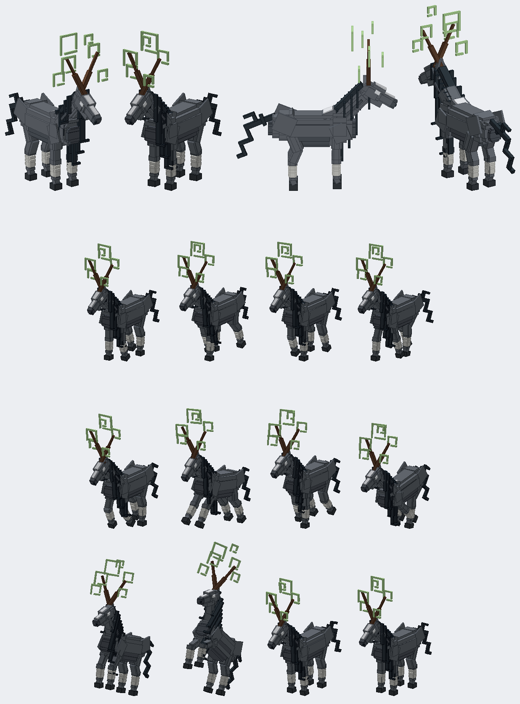

# The Twin-Horned Steed (model)

Status: a model and its animation clips, in the repository as a Blockbench project. Not in the game: by the owner's choice there is no entity, renderer, loot or data ("don't worry about implementation just model it and then after its modeled animate it", 10 October 2026).
Proposal issue: none. On 10 October 2026 the owner sent a picture of a dark two-horned boss steed and asked for it to be modelled in Blockbench for Jugcraft and animated for play.
Owner: @jimbozoomer-byte
Target milestone and tier: none yet; meant as a boss mount or boss creature.
Primary specialty and supported player role: combat, when it is made playable.

## What it is

The model follows the owner's picture in Jugcraft's blocky style: a grey horse with a darker belly and hooves, a white blaze down the face and a white patch on the withers; a mane of long straight slab strips hanging down the left side of the neck (shorter ones down the right) and a forelock over the face; a stiff branching tail of slab strips up and back; white bandages wrapped round every cannon; two long brown horns in a wide V from the brow; glowing white eyes; and five pale green rune glyphs (hollow squares with a hooked tail, like the picture's) floating about the head.

Joints: body > neck > head (horns, ears, eyes, forelock, runes); body > tail; and four legs, each an upper part at its shoulder or hip and a lower part at its knee or hock. All in `tools/twin_horn_steed.py`, which writes `art/twin_horn_steed/twin_horn_steed.bbmodel` with the textures embedded (`ds_*`, drawn flat and clean by the same file).

### The animation clips
Sampled from curves in the same file, so a renderer can draw exactly the same later:
- **idle** (2 s, loops): breathing, a slow nod and a look about, the tail and mane swaying, the runes drifting round the head.
- **walk** (1.2 s, loops): a trot, the diagonal legs moving together with the knees folding on the swing, the body bobbing and the head nodding against the step, the tail swinging.
- **gallop** (0.7 s, loops): the fronts reach together and the hinds drive together, the body rocks and leaves the ground, the mane and forelock stream.
- **charge** (2 s, once): it rears up on its hind legs with its horns thrust forward and the runes flaring bigger, hangs a moment, then slams down with a squash and settles with a bounce.

## Connections, balance, multiplayer
Not applicable: nothing is in the game. When the owner wants it playable, a mount or boss entity with a quad renderer drawing these curves is the next piece of work.

## Dependencies and assets
No dependencies. The model and textures are Jugcraft's own, made from the owner's picture (their own work, shared for this). `tools/blockbench_export.py` writes the project and `tools/box_preview.py` renders the previews.

## Verification
- Done locally (10 October 2026): the project opens in Blockbench 5.2.1 on the owner's PC with its textures, groups and four clips; offline renders of four views and twelve animation frames were reviewed against the picture.
- Not applicable: the Gradle build and game tests.

## Rollout and open questions
- The hooves are part of the lower legs; a separate pastern would let them stay flat in the gallop.
- The runes are solid boxes drawn at full brightness; a glow or transparency would need a renderer.
