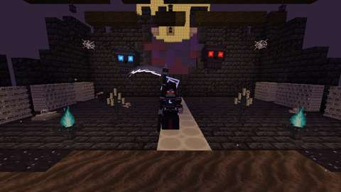
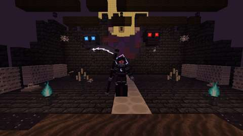
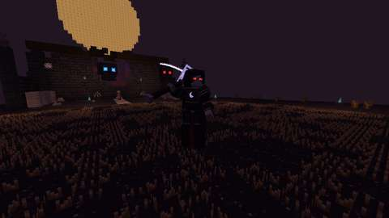
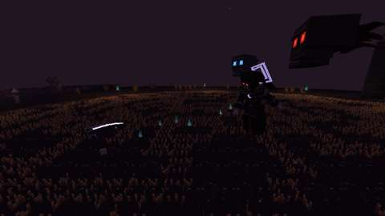
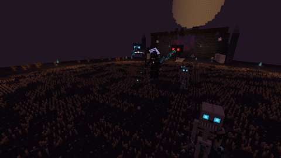
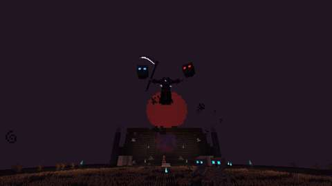
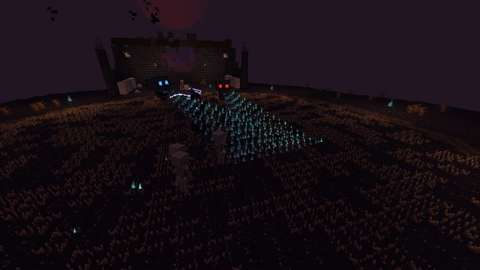
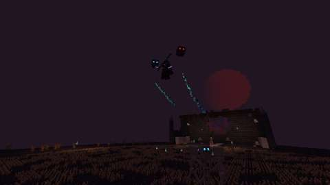
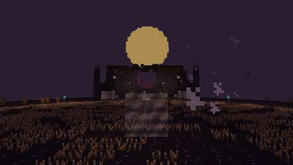

# Vesperine, the Last Reaper

Status: implemented in source. CI builds it; the game tests and the client game test are below. This is part 2 of boss 1 in the [Witching Season plan](witching-season.md#boss-1-vesperine-the-last-reaper-in-the-hollow-acre): the boss of the Hollow Acre, her skulls and servants, and her loot. It is built on part 1, the lairs and the Last Rites ([hollow-acre.md](hollow-acre.md)). It has not been played by hand, and the two-client dedicated-server playtest the plan asks for is still to do.
Proposal issue: none. The owner approved the Witching Season plan on 4 October 2026, and on 10 October 2026 asked: "Do the bosses".
Owner: @jimbozoomer-byte

Target milestone and tier: Specialization tier (dungeon expeditions), as the plan sets it. She is reached only through the Last Rites, which take Discovery-tier things. Nothing a tier needs comes only from her.
Primary specialty and supported player role: adventuring. Her loot also serves costume wearers (trick-or-treating and the costume contest) and the ritual's makers (the Shade Wreath).

## Player experience

### She waits

Vesperine sits on the Bone Throne of every Hollow Acre, placed with the island. She is a tall, pale reaper in layered black armour and a torn crimson-lined robe, with black hair drifting about her and a great scythe with a moon-pale blade. Her two great skulls float at her shoulders: **Dirge** at her left, glowing soul blue, and **Requiem** at her right, glowing red.

Seated, she takes no harm. She rises when a player who can fight her steps into the Mown Circle, or strikes her (anyone not in creative or spectator mode). Then:
- a bell sounds, "Vesperine rises from the Bone Throne", and her bar shows;
- she rises from the throne over 2 seconds, and nothing can hurt her meanwhile;
- her health is set for the party: 400, half as much again for each player after the first within 40 blocks of the circle's centre, at most two and a half times (1,000 for four or more); her skulls' health is scaled alike.

She has armour 10 and cannot be knocked back. She takes no fall damage, is immune to Wither and cannot drown. She glides a quarter-block over the ground rather than walking, and never goes more than 32 blocks from the circle's centre. She cannot ride, be leashed or be pushed.

### Her rule: the twin skulls

While both skulls live, she takes half damage; a double halo over her head shows it, its two rings turning against each other. Kill one skull and the halo cracks (the inner ring hangs askew and shudders), and she takes full damage. Kill both and the halo is gone. Each skull has 80 health, scaled for the party, and neither can be hurt while she sits or tolls. Whoever hurts a skull has taken part in her fight.

**Grief Bolts:** every 4 seconds a skull opens its jaw and its eyes flare (half a second). Then it looses a slow homing bolt of soul fire at her foe; the two skulls take turns. A bolt deals 6 damage and Slowness I for 3 seconds, bursts on anything solid and fizzles after 8 seconds. **Hit a bolt** and it turns, flying back at the skull that sent it, faster, for 12 damage as your own blow. If that skull is gone, it flies at her instead. A turned bolt cannot be turned again.

### Phase 1, the Reaping (full to half health)

Every attack has a wind-up you can read, a strike and a recovery. She waits at least a second between attacks.

| Attack | Read it by | What it does |
| --- | --- | --- |
| Reaping Arc | She draws the scythe back high (0.6 s) | Sweeps round her front, 270°, 4.5 blocks: 14 damage and Wither I for 3 s. Up close, it is her most frequent attack |
| Harvest Lunge | She crouches (0.5 s) | Dashes up to 8 blocks at her foe, 10 damage to each player she passes through |
| Scythe Throw | She hefts the scythe overhand (0.7 s) | It spins out up to 16 blocks (or until it meets something solid) and back to her hand, 10 damage to each player it passes, once each way. Until it is back she is **unarmed and takes 25% more damage** |
| Grave Call | She raises both arms and sweeps them down, and the soil smokes and heaves at three spots near her foe (1.5 s) | Three **Grave Thralls** climb out, skeletons with soul-flame eyes: 20 health and 4 damage a blow. At most four stand at once |

### The Last Toll (at half health)

She rises 6 blocks over the circle's centre and the bell tolls three times over 3 seconds: "The Last Toll sounds: the moon turns red". The harvest moon turns red, and every player near gets Darkness for 3 seconds. A slain skull re-forms at half its health. Nothing can hurt her while she tolls. Then the fight changes.

### Phase 2, the Reaping Moon (half health to none)

She keeps her Reaping Arc, Harvest Lunge and Scythe Throw. She calls no more thralls, but adds:

| Attack | Read it by | What it does |
| --- | --- | --- |
| Twin Beam | She points, and a thin red line traces across the ground through her foe, 16 blocks long (1.5 s) | Both skulls pour soul fire onto the line, sweeping it end to end over 1.5 s; the swept part burns until the beam ends, after 2 s. 4 damage every quarter second to anyone within a block of the burning part |
| Crop Circles | She raises her scythe high, and rings of pale light, 4 blocks across, open under up to three players in her arena (1.5 s) | Each ring erupts in soul flame: 12 damage to anyone still inside |
| Shadow Step | She crouches into her cloak: a puff of black smoke, and a whisper behind the player who last hurt her (0.5 s) | She appears 2 blocks behind that player and begins a Reaping Arc |

### Death's Harvest (once, at a quarter health)

She rises 10 blocks toward the moon. Everyone near gets Darkness for 6 seconds, and the four soul braziers that ward the circle on its diagonals go out: "Death's Harvest: the souls stream to her. Strike them down, or light the wards!"
- For 6 seconds a soul rises from the black wheat every 0.3 seconds and streams to her. Each that reaches her heals her 2% of her health.
- One blow strikes a soul down, and a soul burns up passing within 3 blocks of a lit ward.
- **Using a ward lights it.** When all four are lit, or the 6 seconds are up, the souls fade and she slams down. The slam deals 16 damage at the centre, less with distance, and none at 10 blocks or more.

From the numbers, a soul takes about four seconds to fly from the wheat to her, so if nothing is done about five reach her before the slam: about a tenth of her health. This is worked out from the numbers, not measured in play.

### Her fall

When she falls:
- her thralls crumble, her skulls crumble, her souls fade and her thrown scythe is gone;
- each participant gets their loot (below) and The Last Harvest;
- "Vesperine, the Last Reaper, has fallen", the moon pales, and a gate of **Grey Mist** two blocks wide and two high opens in the middle of the circle. It takes players home, as the lych gate's mist does;
- the instance is ended, and it closes once everyone has left. The mist stays until then; the next instance in that slot clears it as she takes her throne again.

### Left alone

If no player she can fight is within 40 blocks of the circle's centre for 10 seconds, she returns to her throne. "Vesperine returns to her throne": she heals fully, and her skulls come back whole. Her thralls crumble, her souls fade and her scythe returns to her hand. The moon pales and the wards are lit again. Who hurt her is forgotten, so a fresh fight starts from nothing.

### Her loot

Each participant rolls their own loot. A participant is a player who hurt her or her skulls and is within 64 blocks of the circle's centre when she falls. The loot goes straight into their inventory, and what does not fit lands at their feet.

| Loot | Chance |
| --- | --- |
| **Reaper's Shade**, a wisp of night-black cloth | 3 to 6, always |
| **Vesper Scythe**, a boss trophy of Arms VII | 15%; certain on a player's first kill (whoever has not yet earned The Last Harvest) |
| **Dirge Skull** | 50% |
| **Requiem Skull** | 50% |
| **Reaper's Hood** | 20% |
| 300 experience, shared out among the participants | always |
| The advancement **The Last Harvest** (a challenge in the Adventure tab) | always |

During the Halloween event, unless `lairs.event_loot` is off, each participant also gets a roll of seasonal candy and another 10% chance at the hood.

**What they are for:**
- **Reaper's Shade:**
  - **Shade Wreath:** two mourning flowers and a shade make a Mourning Wreath, shapeless, half the flowers and no vine. This is the plan's "drops part of what summons her again" link.
  - **Reaper's Hood:** five shades, laid as a helmet.
- **Reaper's Hood:** a costume worn on the head, a black cowl lined in crimson with a short mantle over the shoulders. It counts for trick-or-treating and the costume contest.
- **Dirge Skull and Requiem Skull:** trophy blocks, her skulls in small:
  - placed, one hovers a pixel off the ground facing whoever placed it, its sockets glowing in its colour (light 6);
  - it breaks quickest with a pickaxe, and always drops itself;
  - worn on the head, it is a costume too.
- **Vesper Scythe:** an Arms VII boss trophy of the scythe kind, so it fights as the steel scythe does:
  - its blow: 8.5 damage at one blow a second, its two-handed sweep striking up to five foes in a 150° arc within 4 blocks; it also reaps crops;
  - epic, and it lasts twice as long as steel (1,800);
  - "Trophy of Vesperine, the Last Reaper";
  - its boon, **Harvest:** a kill with it heals you two hearts (at most once every 5 seconds), and every fifth kill charges your next blow to loose a pale crescent. The crescent flies straight on 12 blocks along your look, stopping at anything solid, and strikes each foe it passes once for 8 damage as your own blow.

### Settings

In `config/jugcraft.properties`, beside the lairs' own:
- `lairs.boss_health` (1.0, from 0.25 to 4): multiplies her health and her skulls';
- `lairs.boss_damage` (1.0, from 0.25 to 4): multiplies her blows, her skulls' bolts and her thrown scythe (not her thralls');
- `lairs.event_loot` (`on` or `off`): the Halloween event's extra roll.

Her damage numbers are Normal difficulty's: Easy and Hard scale them as they scale every monster's blows.

## Changes from the plan

- **The Vesper Scythe fights as a scythe.** The plan gave it 9 damage, slow, and a 120° arc within 4.5 blocks. Jugcraft already has a scythe, and every Arms VII trophy fights as its kind does, so it has the steel scythe's 8.5 damage and 150° arc within 4 blocks, and up to five foes. New numbers would have made it a new kind of arm.
- **The boon is Harvest, not Reap.** "Reap" is already the scythe kind's trait (harvesting crops), so the boon took the other word. What it does is the plan's.
- **The Twin Beam's swept part burns until the beam ends.** The plan said the fire sweeps along the line. Here the fire stays where it has swept, so the line is safe only ahead of the sweep.
- **Who counts as a participant:** the plan said loot goes only to those who took part. Here that means a player who hurt her or her skulls and is within 64 blocks of the circle's centre when she falls.
- **A way out where she fell:** the plan did not say how players leave after the fight. Her death opens Grey Mist in the middle of the circle; the lych gate still works too.
- **The skull trophies are costumes too.** They glow (light 6) and can be worn, so they count for trick-or-treating and the costume contest, as the plan's "lair trophies and costumes count" asks.
- **Settings in `jugcraft.properties`,** as part 1 did, not a separate `jugcraft-lairs.json`.
- **She is a monster:** on Peaceful she is gone, as every monster is, and the Hollow Acre stands empty.
- **Animations by GeckoLib.** The plan's default was Minecraft's own keyframe animations. GeckoLib 5.5.7 is already a pinned framework, as part 1 found, and draws her, her skulls, her thrown scythe and her thralls from model and animation files.
- **The Shade Wreath** is a second recipe for the Mourning Wreath (`jugcraft:mourning_wreath_from_shade`), not a new item.

## Connections

- **Inputs:** the way in is part 1's Last Rites, so the graveyard's headstones, the Chandlery's candles, the graveyard flora and the Death Knell feed every fight.
- **Outputs:**
  - **Reaper's Shade** feeds back into the ritual (the Shade Wreath) and into the hood;
  - **the Reaper's Hood and both skulls** are costumes for trick-or-treating and the costume contest (`#jugcraft:trick_or_treat_costumes` and `#jugcraft:costume_hats`);
  - **the Vesper Scythe** joins Arms VII's boss trophies: the first of them with a boss to drop it.
- **Technology and magic:** none required. She is fought with whatever players bring, and nothing in a tier needs her loot.
- **Trade and solo routes:** a solo player can do everything. Her health is lowest for one player, and the first kill always brings the scythe. Her loot can be traded like any item.
- **Reachable entry path:** the ritual takes Discovery-tier things (part 1), and nothing she drops is needed to reach her.

## Balance and automation

- **Every fight costs a ritual:** a fresh Mourning Wreath, as part 1 set it.
- **No gain loop:** a shade makes one wreath, which still takes two flowers and a whole fight, and nothing she drops turns into more of itself. Nothing she drops sells to a Jugcraft shop for Jugs.
- **No leeching:** only participants get loot. A bystander who never struck her or a skull gets nothing, and loot is rolled per participant, so nobody takes another's.
- **First kill once:** the scythe's first-kill guarantee is stored with the advancement, so it comes once per player.
- **Abandoning resets her:** leaving her alone for 10 seconds heals her and forgets everyone's part. She cannot be worn down between visits.
- **No automation:** she rises only for a player, the souls and wards need a player's hand, and her loot goes only to players.
- **Units:** health and damage in half hearts, before `lairs.boss_health` and `lairs.boss_damage`. Times are in ticks, 20 a second; distances in blocks. Every number is in `tools/vesperine.py`, and `tools/check_mod_data.py` holds the Java to it.

## Multiplayer and persistence

- **Server authority:** the server decides everything: waking, targets, every attack's hits, the guard, the phases, the souls and wards, the loot and the advancement. Clients only draw what her synced state says (her action, her guard count, whether she holds her scythe) and play the matching animations.
- **What is saved:** she is saved with her instance's chunks. Her phase is saved, and a passing moment (rising, tolling, the harvest) resumes as the phase it leads to. Bolts, the thrown scythe, thralls, souls and crescents are never saved. Instances close on a restart (part 1), and she goes with hers.
- **Chunks:** nothing is force-loaded. Her arena stays loaded while players stand on the island.
- **The Harvest boon's count** (kills toward the crescent) lives only while the server runs.
- **No griefing:** she cannot leave her lair, her attacks strike only players who can fight her, and her thralls drop nothing.
- **Still to do:** the two-client dedicated-server playtest.

## Dependencies and assets

No new dependency. GeckoLib 5.5.7 for 26.3 is already pinned (`distribution/frameworks.lock.json`); it draws her, her skulls, her thrown scythe and her thralls. Everything is drawn by code:
- **Bodies and clips:** `tools/vesperine_models.py` builds the GeckoLib models and animations (22 of hers, the skulls' float and jaw, the scythe's spin, the thralls' emerge, idle, walk and attack). The halo and the scythe each have their own controller, and no bone is moved by two.
- **Textures:** `tools/vesperine_art.py` paints them at four times Minecraft's scale: 512 × 512 for her and her skulls, 256 × 256 for the scythe and the thralls. Its glowmasks light her eyes, halo, blade edge and crescent emblem, and the skulls' and thralls' eyes. It also paints the hood's cloth and lining, the skull trophies' block textures, and the shade and hood icons.
- **The Vesper Scythe's art:** `tools/arms_variants_art.py` (a new moon-steel line style), and its icon map is `tools/arms_icons/vesper_scythe.txt`.
- **Preview:** `tools/geo_preview.py` draws a GeckoLib model and clip outside the game, with GeckoLib's transforms, for checking poses before CI.

No Mojang texture is read, traced or copied.

## Verification

*The client game test's pictures (CI, commit `1e7955e`): seated; risen; the Reaping Arc, the Scythe Throw and the Grave Call; the Last Toll; the Twin Beam; Death's Harvest; and after her fall. Each attack is frozen as it lands. The test client renders at 480x270.*

CI (10 October 2026, GitHub Actions, the pins in [PLATFORM.md](../PLATFORM.md)):

| Commit | What ran | Result |
| --- | --- | --- |
| `56f283e` | Build, data audit, server tests without optional integrations, the chosen client tests | Compiled on the first try; the server tests without optional integrations passed; the client tests chosen for it passed (`LairClientGameTests` and `ArmsVIIClientGameTests`). The full `mod` job was cancelled by the next push |
| `ceb13bf` | Adds `VesperineGameTests` and `VesperineClientGameTests` | `VesperineClientGameTests` **passed**: her whole fight in a real Hollow Acre. **3 server game tests failed**, all from the shared test world: a woken reaper kept fighting after its test passed, and reapers took other tests' players as foes (her health rescaled for a party, the arc turned away from its target, never left alone) |
| `1e7955e` | Each test sends its reaper away and the self-acting ones stand high above the grid, each at its own height; the pictures aimed at her | `VesperineClientGameTests` **passed**; the pictures above are from this commit. **1 server game test failed**, the Reaping Arc's: a new player cannot be hurt until its client has loaded the world (at most 60 ticks), and a mock player has no client, so the arc at tick 42 struck nobody |
| `feb97f3` | The arc's players wait out their loading first (in creative, where she ignores them); every test sends its reaper away even when it fails; this record | **All pass:** all 1176 required game tests, with and without the optional integrations, and the client tests chosen for it (`ArmsVIIClientGameTests`, `LairClientGameTests`, `VesperineClientGameTests`) |

Run locally (10 October 2026):

| Check | Result |
| --- | --- |
| `python3 scripts/check_repository.py` | Pass |
| `python3 tools/check_mod_data.py`: also checks her Java numbers, attacks, loot constants and settings against `tools/vesperine.py`; that where her fight looks for the Hollow Acre's parts (`HollowAcre.java`: the circle, the throne, the wards, the field and the path) is where `tools/hollow_acre.py` builds them (five deliberate changes to `HollowAcre.java`, one at a time, each failed it); her registrations, names and renderers; the GeckoLib models, clips, UV regions, sheet sizes and controllers' bones; the loot table, recipes, costume tags, advancement and messages; and that nothing of hers loads chunks or changes dimension | Pass, 1876 IDs |
| `python3 tools/generate_material_data.py`, then `git status` | Writes this part's data only |
| `./gradlew build`, game tests and client game tests | Not run locally (the Fabric Maven is out of reach here); run by CI |

The game tests (`VesperineGameTests`) show what a game-test server can, with a reaper put down on her own (no lair):
1. seated, she takes no harm; a player's blow wakes her at full health, rising, with both skulls at her shoulders;
2. while both skulls live she takes half a blow, and with one the whole of it; her health scales 1, 1.5 and 2.5 times for one, two and four or more players; the slam falls from 16 to 8 at 5 blocks and to nothing at 10;
3. the Reaping Arc strikes a player in front of her (damage and Wither) and spares one behind her;
4. a struck Grief Bolt turns, and only once;
5. her Grave Call brings up three thralls, and when she falls her thralls and skulls go with her;
6. left alone, she returns to her seat, healed;
7. her loot is each participant's own: two who struck her each get Reaper's Shade and, on a first kill, their own Vesper Scythe, and both earn The Last Harvest; a bystander who never struck her gets nothing;
8. a kill with the Vesper Scythe heals two hearts.

The client game test (`VesperineClientGameTests`, CI job `client`) runs her fight in a real Hollow Acre, with its one player in survival under Resistance:
1. an instance opens with her seated on the throne, her skulls beside her;
2. stepping into the Mown Circle wakes her;
3. the Last Toll turns the moon red and re-forms the skulls;
4. Death's Harvest puts the four wards out, and lighting all four ends it;
5. when she falls, the player has Reaper's Shade and the Vesper Scythe (a first kill) and The Last Harvest, the moon is pale, Grey Mist stands in the circle, and she is gone;
6. a fresh instance opened in her slot has none of the old instance's Grey Mist.

Along the way it takes a picture of each part of the fight.

Not run: the two-client dedicated-server playtest the plan asks for, and play by hand. No test yet times her attacks against real players, measures how long a fight lasts, or tries the Twin Beam, Crop Circles, Shadow Step or the slam on a moving player.

## World and event applicability

She is confined to the Hollow Acre, her own dimension; nothing of hers reaches the Overworld. Her loot rarity is set above, and her one boon is the Vesper Scythe's. The rites, and so the fight, work on any night by default. Ending the Halloween event only stops its extra roll: it never removes her, a lair or anything earned.

## Rollout and open questions

The plan's open questions keep their defaults: rites all year at night with a Halloween bonus, Grave Goods on death, four players and eight instances.

Known limits:
- untested by hand and with two clients, so her numbers are the plan's and may need tuning once she is played;
- on Peaceful there is no fight;
- the Harvest boon's kill count is lost on a restart.

Boss 2, Madame Tatterlace in the Spindle Loft, comes next, on the same lair framework.
